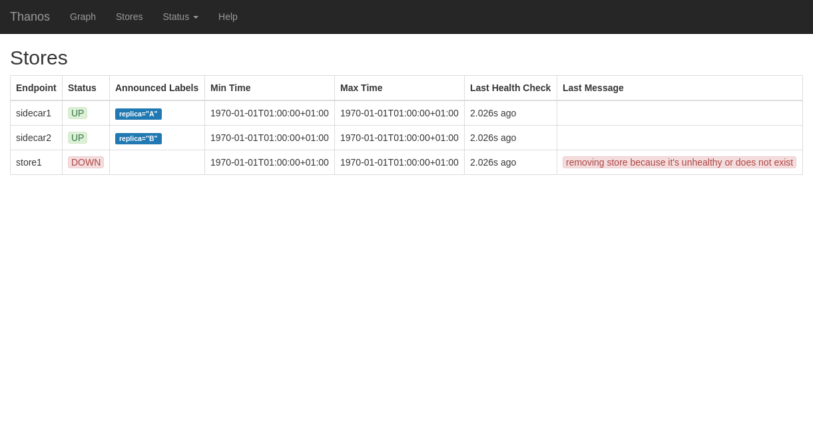

# Changelog

All notable changes to this project will be documented in this file.

The format is based on [Keep a Changelog](http://keepachangelog.com/en/1.0.0/) and this project adheres to [Semantic Versioning](http://semver.org/spec/v2.0.0.html).

NOTE: As semantic versioning states all 0.y.z releases can contain breaking changes in API (flags, grpc API, any backward compatibility)

We use *breaking :warning:* to mark changes that are not backward compatible (relates only to v0.y.z releases.)

## Unreleased

### Fixed

### Added

- [#6605](https://github.com/thanos-io/thanos/pull/6605) Query Frontend: Support vertical sharding binary expression with metric name when no matching labels specified.

### Changed

### Removed

## [v0.32.0](https://github.com/thanos-io/thanos/tree/release-0.32) - Release in progress

### Added

- [#6437](https://github.com/thanos-io/thanos/pull/6437) Receive: make tenant stats limit configurable
- [#6369](https://github.com/thanos-io/thanos/pull/6369) Receive: add az-aware replication support for Ketama algorithm
- [#6185](https://github.com/thanos-io/thanos/pull/6185) Tracing: tracing in OTLP support configuring service_name.
- [#6192](https://github.com/thanos-io/thanos/pull/6192) Store: add flag `bucket-web-label` to select the label to use as timeline title in web UI
- [#6195](https://github.com/thanos-io/thanos/pull/6195) Receive: add flag `tsdb.too-far-in-future.time-window` to prevent clock skewed samples to pollute TSDB head and block all valid incoming samples.
- [#6273](https://github.com/thanos-io/thanos/pull/6273) Mixin: Allow specifying an instance name filter in dashboards
- [#6163](https://github.com/thanos-io/thanos/pull/6163) Receiver: Add hidden flag `--receive-forward-max-backoff` to configure the max backoff for forwarding requests.
- [#5777](https://github.com/thanos-io/thanos/pull/5777) Receive: Allow specifying tenant-specific external labels in Router Ingestor.
- [#6352](https://github.com/thanos-io/thanos/pull/6352) Store: Expose store gateway query stats in series response hints.
- [#6420](https://github.com/thanos-io/thanos/pull/6420) Index Cache: Cache expanded postings.
- [#6441](https://github.com/thanos-io/thanos/pull/6441) Compact: Compactor will set `index_stats` in `meta.json` file with max series and chunk size information.
- [#6466](https://github.com/thanos-io/thanos/pull/6466) Mixin (Receive): add limits alerting for configuration reload and meta-monitoring.
- [#6467](https://github.com/thanos-io/thanos/pull/6467) Mixin (Receive): add alert for tenant reaching head series limit.
- [#6528](https://github.com/thanos-io/thanos/pull/6528) Index Cache: Add histogram metric `thanos_store_index_cache_stored_data_size_bytes` for item size.
- [#6560](https://github.com/thanos-io/thanos/pull/6560) Thanos ruler: add flag to optionally disable adding Thanos params when querying metrics
- [#6574](https://github.com/thanos-io/thanos/pull/6574) Tools: Add min and max compactions range flags to `bucket replicate` command.
- [#6593](https://github.com/thanos-io/thanos/pull/6574) Store: Add `thanos_bucket_store_chunk_refetches_total` metric to track number of chunk refetches.
- [#6264](https://github.com/thanos-io/thanos/pull/6264) Query: Add Thanos logo in navbar
- [#6234](https://github.com/thanos-io/thanos/pull/6234) Query: Add ability to switch between `thanos` and `prometheus` engines dynamically via UI and API.
- [#6346](https://github.com/thanos-io/thanos/pull/6346) Query: Add ability to generate SQL-like query explanations when `thanos` engine is used.

### Fixed
- [#6503](https://github.com/thanos-io/thanos/pull/6503) *: Change the engine behind `ContentPathReloader` to be completely independent of any filesystem concept. This effectively fixes this configuration reload when used with Kubernetes ConfigMaps, Secrets, or other volume mounts.
- [#6456](https://github.com/thanos-io/thanos/pull/6456) Store: fix crash when computing set matches from regex pattern
- [#6427](https://github.com/thanos-io/thanos/pull/6427) Receive: increased log level for failed uploads to `error`
- [#6172](https://github.com/thanos-io/thanos/pull/6172) query-frontend: return JSON formatted errors for invalid PromQL expression in the split by interval middleware.
- [#6171](https://github.com/thanos-io/thanos/pull/6171) Store: fix error handling on limits.
- [#6183](https://github.com/thanos-io/thanos/pull/6183) Receiver: fix off by one in multitsdb flush that will result in empty blocks if the head only contains one sample
- [#6197](https://github.com/thanos-io/thanos/pull/6197) Exemplar OTel: Fix exemplar for otel to use traceId instead of spanId and sample only if trace is sampled
- [#6207](https://github.com/thanos-io/thanos/pull/6207) Receive: Remove the shipper once a tenant has been pruned.
- [#6216](https://github.com/thanos-io/thanos/pull/6216) Receiver: removed hard-coded value of EnableExemplarStorage flag and set it according to max-exemplar value.
- [#6222](https://github.com/thanos-io/thanos/pull/6222) mixin(Receive): Fix tenant series received dashboard widget.
- [#6218](https://github.com/thanos-io/thanos/pull/6218) mixin(Store): handle ResourceExhausted as a non-server error. As a consequence, this error won't contribute to Store's grpc errors alerts.
- [#6271](https://github.com/thanos-io/thanos/pull/6271) Receive: Fix segfault in `LabelValues` during head compaction.
- [#6306](https://github.com/thanos-io/thanos/pull/6306) Tracing: tracing in OTLP utilize the OTEL_TRACES_SAMPLER env variable
- [#6330](https://github.com/thanos-io/thanos/pull/6330) Store: Fix inconsistent error for series limits.
- [#6342](https://github.com/thanos-io/thanos/pull/6342) Cache/Redis: Upgrade `rueidis` to v1.0.2 to to improve error handling while shrinking a redis cluster.
- [#6325](https://github.com/thanos-io/thanos/pull/6325) Store: return gRPC resource exhausted error for byte limiter.
- [#6399](https://github.com/thanos-io/thanos/pull/6399) *: Fix double-counting bug in http_request_duration metric
- [#6428](https://github.com/thanos-io/thanos/pull/6428) Report gRPC connnection errors in the logs.
- [#6519](https://github.com/thanos-io/thanos/pull/6519) Reloader: Use timeout for initial apply.
- [#6509](https://github.com/thanos-io/thanos/pull/6509) Store Gateway: Remove `memWriter` from `fileWriter` to reduce memory usage when sync index headers.
- [#6556](https://github.com/thanos-io/thanos/pull/6556) Thanos compact: respect block-files-concurrency setting when downsampling
- [#6592](https://github.com/thanos-io/thanos/pull/6592) Query Frontend: fix bugs in vertical sharding `without` and `union` function to allow more queries to be shardable.
- [#6317](https://github.com/thanos-io/thanos/pull/6317) *: Fix internal label deduplication bug, by resorting store response set.
- [#6189](https://github.com/thanos-io/thanos/pull/6189) Rule: Fix panic when calling API `/api/v1/rules?type=alert`.

### Changed
- [#6049](https://github.com/thanos-io/thanos/pull/6049) Compact: *breaking :warning:* Replace group with resolution in compact metrics to avoid cardinality explosion on compact metrics for large numbers of groups.
- [#6168](https://github.com/thanos-io/thanos/pull/6168) Receiver: Make ketama hashring fail early when configured with number of nodes lower than the replication factor.
- [#6201](https://github.com/thanos-io/thanos/pull/6201) Query-Frontend: Disable absent and absent_over_time for vertical sharding.
- [#6212](https://github.com/thanos-io/thanos/pull/6212) Query-Frontend: Disable scalar for vertical sharding.
- [#6107](https://github.com/thanos-io/thanos/pull/6107) *breaking :warning:* Change default user id in container image from 0(root) to 1001
- [#6228](https://github.com/thanos-io/thanos/pull/6228) Conditionally generate debug messages in ProxyStore to avoid memory bloat.
- [#6231](https://github.com/thanos-io/thanos/pull/6231) mixins: Add code/grpc-code dimension to error widgets.
- [#6244](https://github.com/thanos-io/thanos/pull/6244) mixin(Rule): Add rule evaluation failures to the Rule dashboard.
- [#6303](https://github.com/thanos-io/thanos/pull/6303) Store: added and start using streamed snappy encoding for postings list instead of block based one. This leads to constant memory usage during decompression. This approximately halves memory usage when decompressing a postings list in index cache.
- [#6071](https://github.com/thanos-io/thanos/pull/6071) Query Frontend: *breaking :warning:* Add experimental native histogram support for which we updated and aligned with the [Prometheus common](https://github.com/prometheus/common) model, which is used for caching so a cache reset required.
- [#6163](https://github.com/thanos-io/thanos/pull/6163) Receiver: changed default max backoff from 30s to 5s for forwarding requests. Can be configured with `--receive-forward-max-backoff`.
- [#6327](https://github.com/thanos-io/thanos/pull/6327) *: *breaking :warning:* Use histograms instead of summaries for instrumented handlers.
- [#6322](https://github.com/thanos-io/thanos/pull/6322) Logging: Avoid expensive log.Valuer evaluation for disallowed levels.
- [#6358](https://github.com/thanos-io/thanos/pull/6358) Query: Add +Inf bucket to query duration metrics
- [#6363](https://github.com/thanos-io/thanos/pull/6363) Store: Check context error when expanding postings.
- [#6405](https://github.com/thanos-io/thanos/pull/6405) Index Cache: Change postings cache key to include the encoding format used so that older Thanos versions would not try to decode it during the deployment of a new version.
- [#6479](https://github.com/thanos-io/thanos/pull/6479) Store: *breaking :warning:* Rename `thanos_bucket_store_cached_series_fetch_duration_seconds` to `thanos_bucket_store_series_fetch_duration_seconds` and `thanos_bucket_store_cached_postings_fetch_duration_seconds` to `thanos_bucket_store_postings_fetch_duration_seconds`.
- [#6474](https://github.com/thanos-io/thanos/pull/6474) Store/Compact: Reduce a large amount of `Exists` API calls against object storage when synchronizing meta files in favour of a recursive `Iter` call.
- [#6548](https://github.com/thanos-io/thanos/pull/6548) Objstore: Bump minio-go to v7.0.61.
- [#6187](https://github.com/thanos-io/thanos/pull/6187) *: Unify gRPC flags for all servers.
- [#6267](https://github.com/thanos-io/thanos/pull/6267) Query: Support unicode external label truncation.
- [#6371](https://github.com/thanos-io/thanos/pull/6371) Query: Only keep name in UI `store_matches` param.
- [#6609](https://github.com/thanos-io/thanos/pull/6609) *: Bump `go4.org/intern` to fix Go 1.21 builds.

### Removed
- [#6496](https://github.com/thanos-io/thanos/pull/6496) *: Remove unnecessary configuration reload from `ContentPathReloader` and improve its tests.
- [#6432](https://github.com/thanos-io/thanos/pull/6432) Receive: Remove duplicated `gopkg.in/fsnotify.v1` dependency.
- [#6332](https://github.com/thanos-io/thanos/pull/6332) *: Remove unmaintained `gzip` dependency.

## [v0.31.0](https://github.com/thanos-io/thanos/tree/release-0.31) - 22.03.2023

### Added

- [#5990](https://github.com/thanos-io/thanos/pull/5990) Cache/Redis: add support for Redis Sentinel via new option `master_name`.
- [#6008](https://github.com/thanos-io/thanos/pull/6008) *: Add counter metric `gate_queries_total` to gate.
- [#5926](https://github.com/thanos-io/thanos/pull/5926) Receiver: Add experimental string interning in writer. Can be enabled with a hidden flag `--writer.intern`.
- [#5773](https://github.com/thanos-io/thanos/pull/5773) Store: Support disabling cache index header file by setting `--no-cache-index-header`. When toggled, Stores can run without needing persistent disks.
- [#5653](https://github.com/thanos-io/thanos/pull/5653) Receive: Allow setting hashing algorithm per tenant in hashrings config.
- [#6074](https://github.com/thanos-io/thanos/pull/6074) *: Add histogram metrics `thanos_store_server_series_requested` and `thanos_store_server_chunks_requested` to all Stores.
- [#6074](https://github.com/thanos-io/thanos/pull/6074) *: Allow configuring series and sample limits per `Series` request for all Stores.
- [#6104](https://github.com/thanos-io/thanos/pull/6104) Objstore: Support S3 session token.
- [#5548](https://github.com/thanos-io/thanos/pull/5548) Query: Add experimental support for load balancing across multiple Store endpoints.
- [#6148](https://github.com/thanos-io/thanos/pull/6148) Query-frontend: Add `traceID` to slow query detected log line.
- [#6153](https://github.com/thanos-io/thanos/pull/6153) Query-frontend: Add `remote_user` (from http basic auth) and `remote_addr` to slow query detected log line.
- [#6406](https://github.com/thanos-io/thanos/pull/6406) Receive: Allow tenants to be configured with unlimited active series by setting head_series_limit to 0.

### Fixed

- [#5995](https://github.com/thanos-io/thanos/pull/5995) Sidecar: Loads TLS certificate during startup.
- [#6044](https://github.com/thanos-io/thanos/pull/6044) Receive: Mark out-of-window errors as conflict when out-of-window samples ingestion is used.
- [#6050](https://github.com/thanos-io/thanos/pull/6050) Store: Re-try bucket store initial sync upon failure.
- [#6067](https://github.com/thanos-io/thanos/pull/6067) Receive: Fix panic when querying uninitialized TSDBs.
- [#6082](https://github.com/thanos-io/thanos/pull/6082) Query: Don't error when no stores are matched.
- [#6098](https://github.com/thanos-io/thanos/pull/6098) Cache/Redis: Upgrade `rueidis` to v0.0.93 to fix potential panic when the client-side caching is disabled.
- [#6103](https://github.com/thanos-io/thanos/pull/6103) Mixins(Rule): Fix expression for long rule evaluations.
- [#6121](https://github.com/thanos-io/thanos/pull/6121) Receive: Deduplicate meta-monitoring queries for [Active Series Limiting](https://thanos.io/tip/components/receive.md/#active-series-limiting-experimental).
- [#6137](https://github.com/thanos-io/thanos/pull/6137) Downsample: Repair of non-empty XOR chunks during 1h downsampling.
- [#6125](https://github.com/thanos-io/thanos/pull/6125) Query Frontend: Fix vertical shardable instant queries do not produce sorted results for `sort`, `sort_desc`, `topk` and `bottomk` functions.
- [#6203](https://github.com/thanos-io/thanos/pull/6203) Receive: Fix panic in head compaction under high query load.

### Changed

- [#6010](https://github.com/thanos-io/thanos/pull/6010) *: Upgrade Prometheus to v0.42.0.
- [#5999](https://github.com/thanos-io/thanos/pull/5999) *: Upgrade Alertmanager dependency to v0.25.0.
- [#6520](https://github.com/thanos-io/thanos/pull/6520): Switch query-frontend to use [Rueidis](https://github.com/redis/rueidis) client. Deleted `idle_timeout`, `max_conn_age`, `pool_size`, `min_idle_conns` fields as they are not used anymore.
- [#5887](https://github.com/thanos-io/thanos/pull/5887) Tracing: Make sure rate limiting sampler is the default, as was the case in version pre-0.29.0.
- [#5997](https://github.com/thanos-io/thanos/pull/5997) Rule: switch to miekgdns DNS resolver as the default one.
- [#6126](https://github.com/thanos-io/thanos/pull/6126) Build with Go 1.20
- [#6035](https://github.com/thanos-io/thanos/pull/6035) Tools (replicate): Support all types of matchers to match blocks for replication. Change matcher parameter from string slice to a single string.
- [#6131](https://github.com/thanos-io/thanos/pull/6131) Store: *breaking :warning:* Use Histograms instead of Summaries for bucket metrics.

## [v0.30.2](https://github.com/thanos-io/thanos/tree/release-0.30) - 28.01.2023

### Fixed

- [#6066](https://github.com/thanos-io/thanos/pull/6066) Tracing: fixed panic because of nil sampler
- [#6086](https://github.com/thanos-io/thanos/pull/6086) Store Gateway: Fix store-gateway deadlock due to not close BlockSeriesClient

## [v0.30.1](https://github.com/thanos-io/thanos/tree/release-0.30) - 4.01.2023

### Fixed

- [#6009](https://github.com/thanos-io/thanos/pull/6009) Query Frontend/Store: fix duplicate metrics registration in Redis client

## [v0.30.0](https://github.com/thanos-io/thanos/tree/release-0.30) - 2.01.2023

NOTE: Querier's `query.promql-engine` flag enabling new PromQL engine is now unhidden. We encourage users to use new experimental PromQL engine for efficiency reasons.

### Fixed

- [#5716](https://github.com/thanos-io/thanos/pull/5716) DNS: Fix miekgdns resolver LookupSRV to work with CNAME records.
- [#5844](https://github.com/thanos-io/thanos/pull/5844) Query Frontend: Fixes @ modifier time range when splitting queries by interval.
- [#5854](https://github.com/thanos-io/thanos/pull/5854) Query Frontend: `lookback_delta` param is now handled in query frontend.
- [#5860](https://github.com/thanos-io/thanos/pull/5860) Query: Fixed bug of not showing query warnings in Thanos UI.
- [#5856](https://github.com/thanos-io/thanos/pull/5856) Store: Fixed handling of debug logging flag.
- [#5230](https://github.com/thanos-io/thanos/pull/5230) Rule: Stateless ruler support restoring `for` state from query API servers. The query API servers should be able to access the remote write storage.
- [#5880](https://github.com/thanos-io/thanos/pull/5880) Query Frontend: Fixes some edge cases of query sharding analysis.
- [#5893](https://github.com/thanos-io/thanos/pull/5893) Cache: Fixed redis client not respecting `SetMultiBatchSize` config value.
- [#5966](https://github.com/thanos-io/thanos/pull/5966) Query: Fixed mint and maxt when selecting series for the `api/v1/series` HTTP endpoint.
- [#5948](https://github.com/thanos-io/thanos/pull/5948) Store: `chunks_fetched_duration` wrong calculation.
- [#5910](https://github.com/thanos-io/thanos/pull/5910) Receive: Fixed ketama quorum bug that was could cause success response for failed replication. This also optimize heavily receiver CPU use.

### Added

- [#5814](https://github.com/thanos-io/thanos/pull/5814) Store: Added metric `thanos_bucket_store_postings_size_bytes` that shows the distribution of how many postings (in bytes) were needed for each Series() call in Thanos Store. Useful for determining limits.
- [#5703](https://github.com/thanos-io/thanos/pull/5703) StoreAPI: Added `hash` field to series' chunks. Store gateway and receive implements that field and proxy leverage that for quicker deduplication.
- [#5801](https://github.com/thanos-io/thanos/pull/5801) Store: Added a new flag `--store.grpc.downloaded-bytes-limit` that limits the number of bytes downloaded in each Series/LabelNames/LabelValues call. Use `thanos_bucket_store_postings_size_bytes` for determining the limits.
- [#5836](https://github.com/thanos-io/thanos/pull/5836) Receive: Added hidden flag `tsdb.memory-snapshot-on-shutdown` to enable experimental TSDB feature to snapshot on shutdown. This is intended to speed up receiver restart.
- [#5839](https://github.com/thanos-io/thanos/pull/5839) Receive: Added parameter `--tsdb.out-of-order.time-window` to set time window for experimental out-of-order samples ingestion. Disabled by default (set to 0s). Please note if you enable this option and you use compactor, make sure you set the `--enable-vertical-compaction` flag, otherwise you might risk compactor halt.
- [#5889](https://github.com/thanos-io/thanos/pull/5889) Query Frontend: Added support for vertical sharding `label_replace` and `label_join` functions.
- [#5865](https://github.com/thanos-io/thanos/pull/5865) Compact: Retry on sync metas error.
- [#5819](https://github.com/thanos-io/thanos/pull/5819) Store: Added a few objectives for Store's data summaries (touched/fetched amount and sizes). They are: 50, 95, and 99 quantiles.
- [#5837](https://github.com/thanos-io/thanos/pull/5837) Store: Added streaming retrival of series from object storage.
- [#5940](https://github.com/thanos-io/thanos/pull/5940) Objstore: Support for authenticating to Swift using application credentials.
- [#5945](https://github.com/thanos-io/thanos/pull/5945) Tools: Added new `no-downsample` marker to skip blocks when downsampling via `thanos tools bucket mark --marker=no-downsample-mark.json`. This will skip downsampling for blocks with the new marker.
- [#5977](https://github.com/thanos-io/thanos/pull/5977) Tools: Added remove flag on bucket mark command to remove deletion, no-downsample or no-compact markers on the block

### Changed

- [#5785](https://github.com/thanos-io/thanos/pull/5785) Query: `thanos_store_nodes_grpc_connections` now trimms `external_labels` label name longer than 1000 character. It also allows customizations in what labels to preserve using `query.conn-metric.label` flag.
- [#5542](https://github.com/thanos-io/thanos/pull/5542) Mixin: Added query concurrency panel to Querier dashboard.
- [#5846](https://github.com/thanos-io/thanos/pull/5846) Query Frontend: vertical query sharding supports subqueries.
- [#5593](https://github.com/thanos-io/thanos/pull/5593) Cache: switch Redis client to [Rueidis](https://github.com/rueian/rueidis). Rueidis is [faster](https://github.com/rueian/rueidis#benchmark-comparison-with-go-redis-v9) and provides [client-side caching](https://redis.io/docs/manual/client-side-caching/). It is highly recommended to use it so that repeated requests for the same key would not be needed.
- [#5896](https://github.com/thanos-io/thanos/pull/5896) *: Upgrade Prometheus to v0.40.7 without implementing native histogram support. *Querying native histograms will fail with `Error executing query: invalid chunk encoding "<unknown>"` and native histograms in write requests are ignored.*
- [#5909](https://github.com/thanos-io/thanos/pull/5909) Receive: Compact tenant head after no appends have happened for 1.5 `tsdb.max-block-size`.
- [#5838](https://github.com/thanos-io/thanos/pull/5838) Mixin: Added data touched type to Store dashboard.
- [#5922](https://github.com/thanos-io/thanos/pull/5922) Compact: Retry on clean, partial marked errors when possible.

### Removed

- [#5824](https://github.com/thanos-io/thanos/pull/5824) Mixin: Remove noisy `ThanosReceiveTrafficBelowThreshold` alert.

## [v0.29.0](https://github.com/thanos-io/thanos/tree/release-0.29) - 2022.11.03

### Fixed

- [#5642](https://github.com/thanos-io/thanos/pull/5642) Receive: Log labels correctly in writer debug messages.
- [#5655](https://github.com/thanos-io/thanos/pull/5655) Receive: Fix recreating already pruned tenants.
- [#5702](https://github.com/thanos-io/thanos/pull/5702) Store: Upgrade minio-go/v7 to fix panic caused by leaked goroutines.
- [#5736](https://github.com/thanos-io/thanos/pull/5736) Compact: Fix crash in GatherNoCompactionMarkFilter.NoCompactMarkedBlocks.
- [#5763](https://github.com/thanos-io/thanos/pull/5763) Compact: Enable metadata cache.
- [#5759](https://github.com/thanos-io/thanos/pull/5759) Compact: Fix missing duration log key.
- [#5799](https://github.com/thanos-io/thanos/pull/5799) Query Frontend: Fixed sharding behaviour for vector matches. Now queries with sharding should work properly where the query looks like: `foo and without (lbl) bar`.

### Added

- [#5565](https://github.com/thanos-io/thanos/pull/5565) Receive: Allow remote write request limits to be defined per file and tenant (experimental).
* [#5654](https://github.com/thanos-io/thanos/pull/5654) Query: add `--grpc-compression` flag that controls the compression used in gRPC client. With the flag it is now possible to compress the traffic between Query and StoreAPI nodes - you get lower network usage in exchange for a bit higher CPU/RAM usage.
- [#5650](https://github.com/thanos-io/thanos/pull/5650) Query Frontend: Add sharded queries metrics. `thanos_frontend_sharding_middleware_queries_total` shows how many queries were sharded or not sharded.
- [#5658](https://github.com/thanos-io/thanos/pull/5658) Query Frontend: Introduce new optional parameters (`query-range.min-split-interval`, `query-range.max-split-interval`, `query-range.horizontal-shards`) to implement more dynamic horizontal query splitting.
- [#5721](https://github.com/thanos-io/thanos/pull/5721) Store: Add metric `thanos_bucket_store_empty_postings_total` for number of empty postings when fetching series.
- [#5723](https://github.com/thanos-io/thanos/pull/5723) Compactor: Support disable block viewer UI.
- [#5674](https://github.com/thanos-io/thanos/pull/5674) Query Frontend/Store: Add support connecting to redis using TLS.
- [#5734](https://github.com/thanos-io/thanos/pull/5734) Store: Support disable block viewer UI.
- [#5411](https://github.com/thanos-io/thanos/pull/5411) Tracing: Add OpenTelemetry Protocol exporter.
- [#5779](https://github.com/thanos-io/thanos/pull/5779) Objstore: Support specifying S3 storage class.
- [#5741](https://github.com/thanos-io/thanos/pull/5741) Query: add metrics on how much data is being selected by downstream Store APIs.
- [#5673](https://github.com/thanos-io/thanos/pull/5673) Receive: Reload tenant limit configuration on file change.
- [#5749](https://github.com/thanos-io/thanos/pull/5749) Query Frontend: Added small LRU cache to cache query analysis results.

### Changed

- [#5738](https://github.com/thanos-io/thanos/pull/5738) Global: replace `crypto/sha256` with `minio/sha256-simd` to make hash calculation faster in metadata and reloader packages.
- [#5648](https://github.com/thanos-io/thanos/pull/5648) Query Frontend: cache vertical shards in query-frontend.
- [#5753](https://github.com/thanos-io/thanos/pull/5753) Build with Go 1.19.
- [#5255](https://github.com/thanos-io/thanos/pull/5296) Query: Use k-way merging for the proxying logic. The proxying sub-system now uses much less resources (~25-80% less CPU usage, ~30-50% less RAM usage according to our benchmarks). Reduces query duration by a few percent on queries with lots of series.
- [#5690](https://github.com/thanos-io/thanos/pull/5690) Compact: update `--debug.accept-malformed-index` flag to apply to downsampling. Previously the flag only applied to compaction, and fatal errors would still occur when downsampling was attempted.
- [#5707](https://github.com/thanos-io/thanos/pull/5707) Objstore: Update objstore to latest version which includes a refactored Azure Storage Account implementation with a new SDK.
- [#5641](https://github.com/thanos-io/thanos/pull/5641) Store: Remove hardcoded labels in shard matcher.
- [#5641](https://github.com/thanos-io/thanos/pull/5641) Query: Inject unshardable le label in query analyzer.
- [#5685](https://github.com/thanos-io/thanos/pull/5685) Receive: Make active/head series limiting configuration per tenant by adding it to new limiting config.
- [#5411](https://github.com/thanos-io/thanos/pull/5411) Tracing: Change Jaeger exporter from OpenTracing to OpenTelemetry. *Options `RPC Metrics`, `Gen128Bit` and `Disabled` are now deprecated and won't have any effect when set :warning:.*
- [#5767](https://github.com/thanos-io/thanos/pull/5767) *: Upgrade Prometheus to v2.39.0.
- [#5771](https://github.com/thanos-io/thanos/pull/5771) *: Upgrade Prometheus to v2.39.1.

### Removed

## [v0.28.1](https://github.com/thanos-io/thanos/tree/release-0.28) - 2022.10.06

### Fixed

- [#5702](https://github.com/thanos-io/thanos/pull/5702) Store: Upgrade minio-go/v7 to fix panic caused by leaked goroutines.

## [v0.28.0](https://github.com/thanos-io/thanos/tree/release-0.28) - 2022.08.26

### Fixed
- [#5502](https://github.com/thanos-io/thanos/pull/5502) Receive: Handle exemplar storage errors as conflict error.
- [#5534](https://github.com/thanos-io/thanos/pull/5534) Query: Set struct return by query API alerts same as prometheus API.
- [#5554](https://github.com/thanos-io/thanos/pull/5554) Query/Receiver: Fix querying exemplars from multi-tenant receivers.
- [#5583](https://github.com/thanos-io/thanos/pull/5583) Query: Fix data race between Respond() and query/queryRange functions. Fixes [#5410](https://github.com/thanos-io/thanos/pull/5410).

### Added

- [#5573](https://github.com/thanos-io/thanos/pull/5573) Sidecar: Added `--prometheus.get_config_interval` and `--prometheus.get_config_timeout` allowing to configure parameters for getting Prometheus config.
- [#5440](https://github.com/thanos-io/thanos/pull/5440) HTTP metrics: export number of in-flight HTTP requests.
- [#5424](https://github.com/thanos-io/thanos/pull/5424) Receive: Export metrics regarding size of remote write requests.
- [#5420](https://github.com/thanos-io/thanos/pull/5420) Receive: Automatically remove stale tenants.
- [#5472](https://github.com/thanos-io/thanos/pull/5472) Receive: Add new tenant metrics to example dashboard.
- [#5475](https://github.com/thanos-io/thanos/pull/5475) Compact/Store: Added `--block-files-concurrency` allowing to configure number of go routines for downloading and uploading block files during compaction.
- [#5470](https://github.com/thanos-io/thanos/pull/5470) Receive: Expose TSDB stats as metrics for all tenants.
- [#5493](https://github.com/thanos-io/thanos/pull/5493) Compact: Added `--compact.blocks-fetch-concurrency` allowing to configure number of goroutines for downloading blocks during compactions.
- [#5480](https://github.com/thanos-io/thanos/pull/5480) Query: Expose endpoint info timeout as a hidden flag `--endpoint.info-timeout`.
- [#5527](https://github.com/thanos-io/thanos/pull/5527) Receive: Add per request limits for remote write. Added four new hidden flags `--receive.write-request-limits.max-size-bytes`, `--receive.write-request-limits.max-series`, `--receive.write-request-limits.max-samples` and `--receive.write-request-limits.max-concurrency` for limiting requests max body size, max amount of series, max amount of samples and max amount of concurrent requests.
- [#5520](https://github.com/thanos-io/thanos/pull/5520) Receive: Meta-monitoring based active series limiting (experimental). This mode is only available if Receiver is in Router or RouterIngestor mode, and config is provided. Added four new hidden flags `receive.tenant-limits.max-head-series` for the max active series for the tenant, `receive.tenant-limits.meta-monitoring-url` for the Meta-monitoring URL, `receive.tenant-limits.meta-monitoring-query` for specifying the PromQL query to execute and `receive.tenant-limits.meta-monitoring-client` for specifying HTTP client configs.
- [#5555](https://github.com/thanos-io/thanos/pull/5555) Query: Added `--query.active-query-path` flag, allowing the user to configure the directory to create an active query tracking file, `queries.active`, for different resolution.
- [#5566](https://github.com/thanos-io/thanos/pull/5566) Receive: Added experimental support to enable chunk write queue via `--tsdb.write-queue-size` flag.
- [#5575](https://github.com/thanos-io/thanos/pull/5575) Receive: Add support for gRPC compression with snappy.
- [#5508](https://github.com/thanos-io/thanos/pull/5508) Receive: Validate labels in write requests.
- [#5439](https://github.com/thanos-io/thanos/pull/5439) Mixin: Add Alert ThanosQueryOverload to Mixin.
- [#5342](https://github.com/thanos-io/thanos/pull/5342) Query/Query Frontend: Implement vertical sharding at query frontend for range queries.
- [#5561](https://github.com/thanos-io/thanos/pull/5561) Query Frontend: Support instant query vertical sharding.
- [#5453](https://github.com/thanos-io/thanos/pull/5453) Compact: Skip erroneous empty non `*AggrChunk` chunks during 1h downsampling of 5m resolution blocks.
- [#5607](https://github.com/thanos-io/thanos/pull/5607) Query: Support custom lookback delta from request in query api.

### Changed

- [#5447](https://github.com/thanos-io/thanos/pull/5447) Promclient: Ignore 405 status codes for Prometheus buildVersion requests.
- [#5451](https://github.com/thanos-io/thanos/pull/5451) Azure: Reduce memory usage by not buffering file downloads entirely in memory.
- [#5484](https://github.com/thanos-io/thanos/pull/5484) Update Prometheus deps to v2.36.2.
- [#5511](https://github.com/thanos-io/thanos/pull/5511) Update Prometheus deps to v2.37.0.
- [#5588](https://github.com/thanos-io/thanos/pull/5588) Store: Improve index header reading performance by sorting values first.
- [#5596](https://github.com/thanos-io/thanos/pull/5596) Store: Filter external labels from matchers on LabelValues/LabelNames to improve performance.

## [v0.27.0](https://github.com/thanos-io/thanos/tree/release-0.27) - 2022.07.05

### Fixed
- [#5339](https://github.com/thanos-io/thanos/pull/5339) Receive: Fix deadlock on interrupt in routerOnly mode.
- [#5357](https://github.com/thanos-io/thanos/pull/5357) Store: fix groupcache handling of slashes.
- [#5427](https://github.com/thanos-io/thanos/pull/5427) Receive: Fix Ketama hashring replication consistency.

### Added

- [#5337](https://github.com/thanos-io/thanos/pull/5337) Thanos Object Store: Add the `prefix` option to buckets.
- [#5409](https://github.com/thanos-io/thanos/pull/5409) S3: Add option to force DNS style lookup.
- [#5352](https://github.com/thanos-io/thanos/pull/5352) Cache: Add cache metrics to groupcache.
- [#5391](https://github.com/thanos-io/thanos/pull/5391) Receive: Add relabeling support.
- [#5408](https://github.com/thanos-io/thanos/pull/5408) Receive: Add support for consistent hashrings.
- [#5391](https://github.com/thanos-io/thanos/pull/5391) Receive: Implement api/v1/status/tsdb.

### Changed

- [#5410](https://github.com/thanos-io/thanos/pull/5410) Query: Close() after using query. This should reduce bumps in memory allocations.
- [#5417](https://github.com/thanos-io/thanos/pull/5417) Ruler: *Breaking if you have not set this value (`--eval-interval`) yourself and rely on that value. :warning:*. Change the default evaluation interval from 30s to 1 minute in order to be compliant with Prometheus alerting compliance specification: https://github.com/prometheus/compliance/blob/main/alert_generator/specification.md#executing-an-alerting-rule.

### Removed

- [#5426](https://github.com/thanos-io/thanos/pull/5426) Compactor: Remove an unused flag `--block-sync-concurrency`.

## [v0.26.0](https://github.com/thanos-io/thanos/tree/release-0.26) - 2022.05.05

### Fixed
- [#5281](https://github.com/thanos-io/thanos/pull/5281) Blocks: Use correct separators for filesystem paths and object storage paths respectively.
- [#5300](https://github.com/thanos-io/thanos/pull/5300) Query: Ignore cache on queries with deduplication off.
- [#5324](https://github.com/thanos-io/thanos/pull/5324) Reloader: Force trigger reload when config rollbacked.

### Added

- [#5220](https://github.com/thanos-io/thanos/pull/5220) Query Frontend: Add `--query-frontend.forward-header` flag, forward headers to downstream querier.
- [#5250](https://github.com/thanos-io/thanos/pull/5250/files) Querier: Expose Query and QueryRange APIs through GRPC.
- [#5290](https://github.com/thanos-io/thanos/pull/5290) Add support for [ppc64le](https://en.wikipedia.org/wiki/Ppc64).

### Changed

- [#4838](https://github.com/thanos-io/thanos/pull/4838) Tracing: Chanced client for Stackdriver which deprecated "type: STACKDRIVER" in tracing YAML configuration. Use `type: GOOGLE_CLOUD` instead (`STACKDRIVER` type remains for backward compatibility).
- [#5170](https://github.com/thanos-io/thanos/pull/5170) All: Upgraded the TLS version from TLS1.2 to TLS1.3.
- [#5205](https://github.com/thanos-io/thanos/pull/5205) Rule: Add ruler labels as external labels in stateless ruler mode.
- [#5206](https://github.com/thanos-io/thanos/pull/5206) Cache: Add timeout for groupcache's fetch operation.
- [#5218](https://github.com/thanos-io/thanos/pull/5218) Tools: Thanos tools bucket downsample is now running continously.
- [#5231](https://github.com/thanos-io/thanos/pull/5231) Tools: Bucket verify tool ignores blocks with deletion markers.
- [#5244](https://github.com/thanos-io/thanos/pull/5244) Query: Promote negative offset and `@` modifier to stable features as per Prometheus [#10121](https://github.com/prometheus/prometheus/pull/10121).
- [#5255](https://github.com/thanos-io/thanos/pull/5255) InfoAPI: Set store API unavailable when stores are not ready.
- [#5256](https://github.com/thanos-io/thanos/pull/5256) Update Prometheus deps v2.33.5.
- [#5271](https://github.com/thanos-io/thanos/pull/5271) DNS: Fix miekgdns resolver to work with CNAME records too.

### Removed

- [#5145](https://github.com/thanos-io/thanos/pull/5145) UI: Remove old Prometheus UI.

## [v0.25.2](https://github.com/thanos-io/thanos/releases/tag/v0.25.2) - 2022.03.24

### Fixed

- [#5202](https://github.com/thanos-io/thanos/pull/5202) Exemplars: Return empty data instead of `nil` if no data available.
- [#5204](https://github.com/thanos-io/thanos/pull/5204) Store: Fix data race in advertised label set in bucket store.
- [#5242](https://github.com/thanos-io/thanos/pull/5242) Ruler: Make ruler use the correct WAL directory.

## [v0.25.1](https://github.com/thanos-io/thanos/tree/release-0.25) - 2022.03.09

The binaries published with this release are built with Go1.17.8 to avoid [CVE-2022-24921](https://cve.mitre.org/cgi-bin/cvename.cgi?name=CVE-2022-24921).

### Fixed

- [#5226](https://github.com/thanos-io/thanos/pull/5226) Rebuild Thanos for v0.25.1 with Go 1.17.8

## [v0.25.0](https://github.com/thanos-io/thanos/tree/release-0.25) - 2022.02.23

### Added

- [#5153](https://github.com/thanos-io/thanos/pull/5153) Receive: option to extract tenant from client certificate
- [#5110](https://github.com/thanos-io/thanos/pull/5110) Block: Do not upload DebugMeta files to obj store.
- [#4963](https://github.com/thanos-io/thanos/pull/4963) Compactor, Store, Tools: Loading block metadata now only filters out duplicates within a source (or compaction group if replica labels are configured), and does so in parallel over sources.
- [#5089](https://github.com/thanos-io/thanos/pull/5089) S3: Create an empty map in the case SSE-KMS is used and no KMSEncryptionContext is passed.
- [#4970](https://github.com/thanos-io/thanos/pull/4970) Tools `tools bucket ls`: Added a new flag `exclude-delete` to exclude blocks marked for deletion.
- [#4903](https://github.com/thanos-io/thanos/pull/4903) Compactor: Added tracing support for compaction.
- [#4909](https://github.com/thanos-io/thanos/pull/4909) Compactor: Add flag --max-time / --min-time to filter blocks that are ready to be compacted.
- [#4942](https://github.com/thanos-io/thanos/pull/4942) Tracing: add `traceid_128bit` support for jaeger.
- [#4917](https://github.com/thanos-io/thanos/pull/4917) Query: add initial query pushdown for a subset of aggregations. Can be enabled with `--enable-feature=query-pushdown` on Thanos Query.
- [#4888](https://github.com/thanos-io/thanos/pull/4888) Cache: Support redis cache backend.
- [#4946](https://github.com/thanos-io/thanos/pull/4946) Store: Support tls_config configuration for the s3 minio client.
- [#4974](https://github.com/thanos-io/thanos/pull/4974) Store: Support tls_config configuration for connecting with Azure storage.
- [#4999](https://github.com/thanos-io/thanos/pull/4999) COS: Support `endpoint` configuration for vpc internal endpoint.
- [#5059](https://github.com/thanos-io/thanos/pull/5059) Compactor: Adding minimum retention flag validation for downsampling retention.
- [#4667](https://github.com/thanos-io/thanos/pull/4667) S3: Add a pure AWS-SDK auth for S3 storage.
- [#5111](https://github.com/thanos-io/thanos/pull/5111) Query: Add matcher support to Rules endpoint.
- [#5117](https://github.com/thanos-io/thanos/pull/5117) Bucket replicate: Added flag `--ignore-marked-for-deletion` to avoid replication of blocks with the deletion mark.
- [#5148](https://github.com/thanos-io/thanos/pull/5148) Receive: Add tenant tag for tracing spans.
- [#4927](https://github.com/thanos-io/thanos/pull/4927) Rule: Added ability to specify multiple remote write targets.
- [#4818](https://github.com/thanos-io/thanos/pull/4818) Store: Add Groupcache as a cache backend.

### Changed

- [#5144](https://github.com/thanos-io/thanos/pull/5144) UI: Improve graph color.
- [#5119](https://github.com/thanos-io/thanos/pull/5119) UI: Optimize Target, Alert and Service Discovery page and on each of them add a search bar.
- [#4885](https://github.com/thanos-io/thanos/pull/4885) Store: Make `queryStats` log with human-readable format.

### Fixed

- [#5102](https://github.com/thanos-io/thanos/pull/5102) UI: Filter block rows in bucket UI according to searched block ID.
- [#5051](https://github.com/thanos-io/thanos/pull/5051) Prober: Decrease 'changing probe status' log spamming.
- [#4918](https://github.com/thanos-io/thanos/pull/4918) Tracing: Fixing force tracing with Jaeger.
- [#4879](https://github.com/thanos-io/thanos/pull/4879) Bucket verify: Fixed bug causing wrong number of blocks to be checked.
- [#4908](https://github.com/thanos-io/thanos/pull/4908) UI: Show 'minus' icon and add tooltip when store min / max time is not available.
- [#4883](https://github.com/thanos-io/thanos/pull/4883) Mixin: adhere to RFC 1123 compatible component naming.
- [#5114](https://github.com/thanos-io/thanos/pull/5114) Tools `thanos bucket inspect`: Fix time formatting.
- [#5139](https://github.com/thanos-io/thanos/pull/5139) COS: Support multi-part upload, fix upload issue when index size is larger than 5GB.
- [#5014](https://github.com/thanos-io/thanos/pull/5014) Query: Set default times for `query_exemplars` API.
- [#5103](https://github.com/thanos-io/thanos/pull/5013) Store: Fix race condition in filesystem client's `Delete()`.

## [v0.24.0](https://github.com/thanos-io/thanos/tree/release-0.24) - 2021.12.22

### Added

- [#4977](https://github.com/thanos-io/thanos/pull/4977) Build: Upgrade to `bingo v0.5.2` and implements `gotesplit` to allow for parallelism in our GitHub e2e tests.
- [#4228](https://github.com/thanos-io/thanos/pull/4228) Tools `thanos bucket inspect`: Add flag `--output` to provide output method (table,csv,tsv).
- [#4282](https://github.com/thanos-io/thanos/pull/4282) Query: *breaking :warning:* Add `--endpoint` flag to the querier. The `--store` flag will eventually be replaced.
- [#4636](https://github.com/thanos-io/thanos/pull/4636) Azure: Support authentication using user-assigned managed identity
- [#4680](https://github.com/thanos-io/thanos/pull/4680) Query: Add `exemplar.partial-response` flag to control partial response.
- [#4679](https://github.com/thanos-io/thanos/pull/4679) Query: Add `enable-feature` flag to enable negative offsets and `@` modifier, similar to Prometheus.
- [#4696](https://github.com/thanos-io/thanos/pull/4696) Query: Add cache name to tracing spans.
- [#4710](https://github.com/thanos-io/thanos/pull/4710) Store: Add metric to capture timestamp of the last loaded block.
- [#4736](https://github.com/thanos-io/thanos/pull/4736) S3: Add capability to use custom AWS STS Endpoint.
- [#4764](https://github.com/thanos-io/thanos/pull/4764) Compactor: add `block-viewer.global.sync-block-timeout` flag to set the timeout of synchronization block metas.
- [#4801](https://github.com/thanos-io/thanos/pull/4801) Compactor: added Prometheus metrics for tracking the progress of compaction and downsampling.
- [#4444](https://github.com/thanos-io/thanos/pull/4444) UI: add mark deletion and no compaction to the Block UI.
- [#4576](https://github.com/thanos-io/thanos/pull/4576) UI: add filter compaction level to the Block UI.
- [#4731](https://github.com/thanos-io/thanos/pull/4731) Rule: add stateless mode to ruler according to https://thanos.io/tip/proposals-done/202005-scalable-rule-storage.md/. Continue https://github.com/thanos-io/thanos/pull/4250.
- [#4612](https://github.com/thanos-io/thanos/pull/4612) Sidecar: add `--prometheus.http-client` and `--prometheus.http-client-file` flag for sidecar to connect Prometheus with basic auth or TLS.
- [#4847](https://github.com/thanos-io/thanos/pull/4847) Query: add `--alert.query-url` which is used in the user interface for rules/alerts pages. By default the HTTP listen address is used for this URL.
- [#4856](https://github.com/thanos-io/thanos/pull/4856) Mixin: Add Query Frontend Grafana dashboard.
- [#4848](https://github.com/thanos-io/thanos/pull/4848) Compactor: added Prometheus metric for tracking the progress of retention.
- [#4874](https://github.com/thanos-io/thanos/pull/4874) Query: Add `--endpoint-strict` flag to statically configure Thanos API server endpoints. It is similar to `--store-strict` but supports passing any Thanos gRPC APIs: StoreAPI, MetadataAPI, RulesAPI, TargetsAPI and ExemplarsAPI.
- [#4868](https://github.com/thanos-io/thanos/pull/4868) Rule: Support ruleGroup limit introduced by Prometheus v2.31.0.
- [#4897](https://github.com/thanos-io/thanos/pull/4897) Query: Add validation for querier address flags.

### Fixed

- [#4508](https://github.com/thanos-io/thanos/pull/4508) Sidecar, Mixin: Rename `ThanosSidecarUnhealthy` to `ThanosSidecarNoConnectionToStartedPrometheus`; Remove `ThanosSidecarPrometheusDown` alert; Remove unused `thanos_sidecar_last_heartbeat_success_time_seconds` metrics.
- [#4663](https://github.com/thanos-io/thanos/pull/4663) Fetcher: Fix discovered data races.
- [#4754](https://github.com/thanos-io/thanos/pull/4754) Query: Fix possible panic on stores endpoint.
- [#4753](https://github.com/thanos-io/thanos/pull/4753) Store: validate block sync concurrency parameter.
- [#4779](https://github.com/thanos-io/thanos/pull/4779) Examples: Fix the interactive test for MacOS users.
- [#4792](https://github.com/thanos-io/thanos/pull/4792) Store: Fix data race in BucketedBytes pool.
- [#4769](https://github.com/thanos-io/thanos/pull/4769) Query Frontend: Add "X-Request-ID" field and other fields to start call log.
- [#4709](https://github.com/thanos-io/thanos/pull/4709) Store: Fix panic when the application is stopped.
- [#4777](https://github.com/thanos-io/thanos/pull/4777) Query: Fix data race in exemplars server.
- [#4811](https://github.com/thanos-io/thanos/pull/4811) Query: Fix data race in metadata, rules, and targets servers.
- [#4795](https://github.com/thanos-io/thanos/pull/4795) Query: Fix deadlock in endpointset.
- [#4928](https://github.com/thanos-io/thanos/pull/4928) Azure: Only create an http client once, to conserve memory.
- [#4962](https://github.com/thanos-io/thanos/pull/4962) Compact/downsample: fix deadlock if error occurs with some backlog of blocks; fixes [this pull request](https://github.com/thanos-io/thanos/pull/4430). Affected versions are 0.22.0 - 0.23.1.

### Changed

- [#4864](https://github.com/thanos-io/thanos/pull/4864) UI: Remove the old PromQL editor.
- [#4708](https://github.com/thanos-io/thanos/pull/4708) Receive: Remove gRPC message size limit, which fixes errors commonly seen when receivers forward messages within a hashring.

## [v0.23.2](https://github.com/thanos-io/thanos/tree/release-0.23) - 2021.12.22

### Fixed

- [#4795](https://github.com/thanos-io/thanos/pull/4795) Query: Fix deadlock in endpointset.
- [#4962](https://github.com/thanos-io/thanos/pull/4962) Compact/downsample: fix deadlock if error occurs with some backlog of blocks; fixes [this pull request](https://github.com/thanos-io/thanos/pull/4430). Affected versions are 0.22.0 - 0.23.1.
- [#4939](https://github.com/thanos-io/thanos/pull/4939) Sidecar: set Sidecar to NOT READY when it cannot establish a connection with Prometheus
- [#4864](https://github.com/thanos-io/thanos/pull/4864) UI: Remove the old PromQL editor

## [v0.23.1](https://github.com/thanos-io/thanos/tree/release-0.23) - 2021.10.1

- [#4714](https://github.com/thanos-io/thanos/pull/4714) EndpointSet: Do not use unimplemented yet new InfoAPI to obtain metadata (avoids unnecessary HTTP roundtrip, instrumentation/alerts spam and logs).

## [v0.23.2](https://github.com/thanos-io/thanos/tree/release-0.23) - 2021.12.22

### Fixed

- [#4795](https://github.com/thanos-io/thanos/pull/4795) Query: Fix deadlock in endpointset.
- [#4962](https://github.com/thanos-io/thanos/pull/4962) Compact/downsample: fix deadlock if error occurs with some backlog of blocks; fixes [this pull request](https://github.com/thanos-io/thanos/pull/4430). Affected versions are 0.22.0 - 0.23.1.

## [v0.23.1](https://github.com/thanos-io/thanos/tree/release-0.23) - 2021.10.1

### Fixed

- [#4714](https://github.com/thanos-io/thanos/pull/4714) Endpointset: Do not use info client to obtain metadata.

## [v0.23.0](https://github.com/thanos-io/thanos/tree/release-0.23) - 2021.09.23

### Added

- [#4453](https://github.com/thanos-io/thanos/pull/4453) Tools `thanos bucket web`: Add flag `--selector.relabel-config-file` / `--selector.relabel-config` / `--max-time` / `--min-time` to filter served blocks.
- [#4482](https://github.com/thanos-io/thanos/pull/4482) Store: Add `http_config` option for COS object store client.
- [#4487](https://github.com/thanos-io/thanos/pull/4487) Query/Store: Add memcached auto discovery support for all caching clients.
- [#4444](https://github.com/thanos-io/thanos/pull/4444) UI: Add search to the Block UI.
- [#4509](https://github.com/thanos-io/thanos/pull/4509) Logging: Add `duration_ms` in int64 to the logs for easier log filtering.
- [#4462](https://github.com/thanos-io/thanos/pull/4462) UI: Highlighting blocks overlap in the Block UI.
- [#4469](https://github.com/thanos-io/thanos/pull/4469) Compact: Add flag `compact.skip-block-with-out-of-order-chunks` to skip blocks with out-of-order chunks during compaction instead of halting.
- [#4506](https://github.com/thanos-io/thanos/pull/4506) Store: Add `Baidu BOS` object storage, see [documents](docs/storage.md#baidu-bos) for further information.
- [#4552](https://github.com/thanos-io/thanos/pull/4552) Compact: Add `thanos_compact_downsample_duration_seconds` histogram metric.
- [#4594](https://github.com/thanos-io/thanos/pull/4594) Reloader: Expose metrics in config reloader to give info on the last operation.
- [#4619](https://github.com/thanos-io/thanos/pull/4619) Tracing: Added consistent tags to Series call from Querier about number important series statistics: `processed.series`, `processed.samples`, `processed.samples` and `processed.bytes`. This will give admin idea of how much data each component processes per query.
- [#4623](https://github.com/thanos-io/thanos/pull/4623) Query-frontend: Make HTTP downstream tripper (client) configurable via parameters `--query-range.downstream-tripper-config` and `--query-range.downstream-tripper-config-file`. If your downstream URL is localhost or 127.0.0.1 then it is strongly recommended to bump `max_idle_conns_per_host` to at least 100 so that `query-frontend` could properly use HTTP keep-alive connections and thus reduce the latency of `query-frontend` by about 20%.

### Fixed

- [#4468](https://github.com/thanos-io/thanos/pull/4468) Rule: Fix temporary rule filename composition issue.
- [#4476](https://github.com/thanos-io/thanos/pull/4476) UI: Fix incorrect html escape sequence used for '>' symbol.
- [#4532](https://github.com/thanos-io/thanos/pull/4532) Mixin: Fix "all jobs" selector in thanos mixin dashboards.
- [#4607](https://github.com/thanos-io/thanos/pull/4607) Azure: Fix Azure MSI Rate Limit.

### Changed

- [#4519](https://github.com/thanos-io/thanos/pull/4519) Query: Switch to miekgdns DNS resolver as the default one.
- [#4586](https://github.com/thanos-io/thanos/pull/4586) Update Prometheus/Cortex dependencies and implement LabelNames() pushdown as a result; provides massive speed-up for the labels API in Thanos Query.
- [#4421](https://github.com/thanos-io/thanos/pull/4421) *breaking :warning:*: `--store` (in the future, to be renamed to `--endpoints`) now supports passing any APIs from Thanos gRPC APIs: StoreAPI, MetadataAPI, RulesAPI, TargetsAPI and ExemplarsAPI (in oppose in the past you have to put it in hidden `--targets`, `--rules` etc flags). `--store` will now automatically detect what APIs server exposes.
- [#4669](https://github.com/thanos-io/thanos/pull/4669) Moved Prometheus dependency to v2.30.

## [v0.22.0](https://github.com/thanos-io/thanos/tree/release-0.22) - 2021.07.22

### Added

- [#4394](https://github.com/thanos-io/thanos/pull/4394) Add error logs to receiver when write request rejected with invalid replica
- [#4403](https://github.com/thanos-io/thanos/pull/4403) UI: Add sorting and filtering to flags page
- [#4299](https://github.com/thanos-io/thanos/pull/4299) Tracing: Add tracing to exemplar APIs.
- [#4327](https://github.com/thanos-io/thanos/pull/4327) Add environment variable substitution to all YAML configuration flags.
- [#4239](https://github.com/thanos-io/thanos/pull/4239) Add penalty based deduplication mode for compactor.
- [#4292](https://github.com/thanos-io/thanos/pull/4292) Receive: Enable exemplars ingestion and querying.
- [#4392](https://github.com/thanos-io/thanos/pull/4392) Tools: Added `--delete-blocks` to bucket rewrite tool to mark the original blocks for deletion after rewriting is done.
- [#3970](https://github.com/thanos-io/thanos/pull/3970) Azure: Adds more configuration options for Azure blob storage. This allows for pipeline and reader specific configuration. Implements HTTP transport configuration options. These options allows for more fine-grained control on timeouts and retries. Implements MSI authentication as second method of authentication via a service principal token.
- [#4406](https://github.com/thanos-io/thanos/pull/4406) Tools: Add retention command for applying retention policy on the bucket.
- [#4430](https://github.com/thanos-io/thanos/pull/4430) Compact: Add flag `downsample.concurrency` to specify the concurrency of downsampling blocks.

### Fixed

- [#4384](https://github.com/thanos-io/thanos/pull/4384) Fix the experimental PromQL editor when used on multiple line.
- [#4342](https://github.com/thanos-io/thanos/pull/4342) ThanosSidecarUnhealthy doesn't fire if the sidecar is never healthy
- [#4388](https://github.com/thanos-io/thanos/pull/4388) Receive: fix bug in forwarding remote-write requests within the hashring via gRPC when TLS is enabled on the HTTP server but not on the gRPC server.
- [#4442](https://github.com/thanos-io/thanos/pull/4442) Ruler: fix SIGHUP reload signal not working.

### Changed

- [#4354](https://github.com/thanos-io/thanos/pull/4354) Receive: use the S2 library for decoding Snappy data; saves about 5-7% of CPU time in the Receive component when handling incoming remote write requests
- [#4369](https://github.com/thanos-io/thanos/pull/4354) Build: do not upgrade apline version

## [v0.21.1](https://github.com/thanos-io/thanos/releases/tag/v0.21.1) - 2021.06.04

### Fixed

- [#4308](https://github.com/thanos-io/thanos/pull/4308) Sidecar: reloader: fix output config file permission

## [v0.21.0](https://github.com/thanos-io/thanos/releases/tag/v0.21.0) - 2021.06.03

### Added

- [#4117](https://github.com/thanos-io/thanos/pull/4117) Mixin: new alert ThanosReceiveTrafficBelowThreshold to flag if the ingestion average of the last hour dips below 50% of the ingestion average for the last 12 hours.
- [#4107](https://github.com/thanos-io/thanos/pull/4107) Store: `LabelNames` and `LabelValues` now support label matchers.
- [#3940](https://github.com/thanos-io/thanos/pull/3940) Sidecar: Added matchers support to `LabelValues`
- [#4171](https://github.com/thanos-io/thanos/pull/4171) Docker: Busybox image updated to latest (1.33.1)
- [#4175](https://github.com/thanos-io/thanos/pull/4175) Added Tag Configuration Support Lightstep Tracing
- [#4176](https://github.com/thanos-io/thanos/pull/4176) Query API: Adds optional `Stats param` to return stats for query APIs
- [#4125](https://github.com/thanos-io/thanos/pull/4125) Rule: Add `--alert.relabel-config` / `--alert.relabel-config-file` allowing to specify alert relabel configurations like [Prometheus](https://prometheus.io/docs/prometheus/latest/configuration/configuration/#relabel_config)
- [#4211](https://github.com/thanos-io/thanos/pull/4211) Add TLS and basic authentication to Thanos APIs
- [#4249](https://github.com/thanos-io/thanos/pull/4249) UI: add dark theme
- [#3707](https://github.com/thanos-io/thanos/pull/3707) Tools: Added `--rewrite.to-relabel-config` to bucket rewrite tool to support series relabel from given blocks.

### Fixed

- [#4105](https://github.com/thanos-io/thanos/pull/4105) Tools: Add glob support for filepath in tools command

### Changed

- [#4223](https://github.com/thanos-io/thanos/pull/4223) Query: federated exemplars API only add replica labels to series labels, not to exemplar labels.

## [v0.20.2](https://github.com/thanos-io/thanos/releases/tag/v0.20.2) - 2021.05.20

### Fixed

- [#4208](https://github.com/thanos-io/thanos/pull/4208) UI: Fix infinite redirection loop on root (/).

## [v0.20.1](https://github.com/thanos-io/thanos/releases/tag/v0.20.1) - 2021.04.30

### Fixed

- [#4123](https://github.com/thanos-io/thanos/pull/4123) Query: match external labels for exemplars API.

### Changed

-

### Removed

-

## [v0.20.0](https://github.com/thanos-io/thanos/releases/tag/v0.20.0) - 2021.04.28

### Added

- [#4029](https://github.com/thanos-io/thanos/pull/4029) Mixin: Remove dependency on the rule dashboard when generating the compact dashboard
- [#4019](https://github.com/thanos-io/thanos/pull/4019) Query: Adds query range histogram.
- [#3846](https://github.com/thanos-io/thanos/pull/3846) Query: Added federated exemplars API support.
- [#3350](https://github.com/thanos-io/thanos/pull/3350) Query/Sidecar: Added targets API support. You can now configure you Querier to fetch Prometheus targets from leaf Prometheus-es!
- [#3977](https://github.com/thanos-io/thanos/pull/3977) Expose exemplars for `http_request_duration_seconds` histogram if tracing is enabled.
- [#3903](https://github.com/thanos-io/thanos/pull/3903) Store: Returning custom grpc code when reaching series/chunk limits.
- [#3919](https://github.com/thanos-io/thanos/pull/3919) Allow to disable automatically setting CORS headers using `--web.disable-cors` flag in each component that exposes an API.
- [#3840](https://github.com/thanos-io/thanos/pull/3840) Tools: Added a flag to support rewrite Prometheus TSDB blocks.
- [#3920](https://github.com/thanos-io/thanos/pull/3920) Query Frontend: Support `max_item_size` in Query frontend Memcached cache.
- [#4078](https://github.com/thanos-io/thanos/pull/4078) receive: Improved efficiency of multitsdb appends, upgraded Prometheus deps.

### Fixed

- [#3204](https://github.com/thanos-io/thanos/pull/3204) Mixin: Use sidecar's metric timestamp for healthcheck.
- [#3922](https://github.com/thanos-io/thanos/pull/3922) \*: Fix panic in http logging middleware.
- [#3960](https://github.com/thanos-io/thanos/pull/3960) Ruler: Fix deduplication of equal alerts with different labels.
- [#3937](https://github.com/thanos-io/thanos/pull/3937) Store: Fix race condition in chunk pool.
- [#4017](https://github.com/thanos-io/thanos/pull/4017) Query Frontend: fix downsampling iterator returning duplicate samples.
- [#4041](https://github.com/thanos-io/thanos/pull/4041) Logging: fix the HTTP logger.

### Changed

- [#3929](https://github.com/thanos-io/thanos/pull/3929) Store: Adds the name of the instantiated memcached client to log info.
- [#3827](https://github.com/thanos-io/thanos/pull/3827) Upgrade Go version to 1.16
- [#3948](https://github.com/thanos-io/thanos/pull/3948) Receiver: Adjust `http_request_duration_seconds` buckets for low latency requests.
- [#3856](https://github.com/thanos-io/thanos/pull/3856) Mixin: *breaking :warning:* Introduce flexible multi-cluster/namespace mode for alerts and dashboards. Removes jobPrefix config option. Removes `namespace` by default.
- [#3937](https://github.com/thanos-io/thanos/pull/3937) Store: Reduce memory usage for range queries.
- [#4045](https://github.com/thanos-io/thanos/pull/4045) UI: Enable Targets page in Querier UI.
- [#4062](https://github.com/thanos-io/thanos/pull/4062) Flags: Sort flags alphabetically.
- [#4081](https://github.com/thanos-io/thanos/pull/4081) UI: Make the ReactUI the default one.
- [#4085](https://github.com/thanos-io/thanos/pull/4085) Receive: Improved Performance for err path.
- [#4094](https://github.com/thanos-io/thanos/pull/4094) \*: Upgrade Prometheus & Alertmanager.

## [v0.19.0](https://github.com/thanos-io/thanos/releases/tag/v0.19.0) - 2021.03.31

- [#3700](https://github.com/thanos-io/thanos/pull/3700) Compact/Web: Make old bucket viewer UI work with vanilla Prometheus blocks.
- [#3657](https://github.com/thanos-io/thanos/pull/3657) \*: It's now possible to configure HTTP transport options for S3 client.
- [#3752](https://github.com/thanos-io/thanos/pull/3752) Compact/Store: Added `--block-meta-fetch-concurrency` allowing to configure number of go routines for block metadata synchronization.
- [#3723](https://github.com/thanos-io/thanos/pull/3723) Query Frontend: Added `--query-range.request-downsampled` flag enabling additional queries for downsampled data in case of empty or incomplete response to range request.
- [#3579](https://github.com/thanos-io/thanos/pull/3579) Cache: Added inmemory cache for caching bucket.
- [#3792](https://github.com/thanos-io/thanos/pull/3792) Receiver: Added `--tsdb.allow-overlapping-blocks` flag to allow overlapping tsdb blocks and enable vertical compaction.
- [#3740](https://github.com/thanos-io/thanos/pull/3740) Query: Added `--query.default-step` flag to set default step. Useful when your tenant scrape interval is stable and far from default UI's 1s.
- [#3686](https://github.com/thanos-io/thanos/pull/3686) Query/Sidecar: Added metric metadata API support. You can now configure you Querier to fetch Prometheus metrics metadata from leaf Prometheus-es!
- [#3031](https://github.com/thanos-io/thanos/pull/3031) Compact/Sidecar/Receive/Rule: Added `--hash-func`. If some function has been specified, writers calculate hashes using that function of each file in a block before uploading them. If those hashes exist in the `meta.json` file then Compact does not download the files if they already exist on disk and with the same hash. This also means that the data directory passed to Thanos Compact is only *cleared once at boot* or *if everything succeeds*. So, if you, for example, use persistent volumes on k8s and your Thanos Compact crashes or fails to make an iteration properly then the last downloaded files are not wiped from the disk. The directories that were created the last time are only wiped again after a successful iteration or if the previously picked up blocks have disappeared.

### Fixed

- [#3705](https://github.com/thanos-io/thanos/pull/3705) Store: Fix race condition leading to failing queries or possibly incorrect query results.
- [#3661](https://github.com/thanos-io/thanos/pull/3661) Compact: Deletion-mark.json is deleted as the last one, which could in theory lead to potential store gateway load or query error for such in-deletion block.
- [#3760](https://github.com/thanos-io/thanos/pull/3760) Store: Fix panic caused by a race condition happening on concurrent index-header reader usage and unload, when `--store.enable-index-header-lazy-reader` is enabled.
- [#3759](https://github.com/thanos-io/thanos/pull/3759) Store: Fix panic caused by a race condition happening on concurrent index-header lazy load and unload, when `--store.enable-index-header-lazy-reader` is enabled.
- [#3773](https://github.com/thanos-io/thanos/pull/3773) Compact: Fixed compaction planner size check, making sure we don't create too large blocks.
- [#3814](https://github.com/thanos-io/thanos/pull/3814) Store: Decreased memory utilisation while fetching block's chunks.
- [#3815](https://github.com/thanos-io/thanos/pull/3815) Receive: Improve handling of empty time series from clients
- [#3795](https://github.com/thanos-io/thanos/pull/3795) s3: A truncated "get object" response is reported as error.
- [#3899](https://github.com/thanos-io/thanos/pull/3899) Receive: Correct the inference of client gRPC configuration.
- [#3943](https://github.com/thanos-io/thanos/pull/3943) Receive: Fixed memory regression introduced in v0.17.0.
- [#3960](https://github.com/thanos-io/thanos/pull/3960) Query: Fixed deduplication of equal alerts with different labels.

### Changed

- [#3804](https://github.com/thanos-io/thanos/pull/3804) Ruler, Receive, Querier: Updated Prometheus dependency. TSDB characteristics might have changed.

## [v0.18.0](https://github.com/thanos-io/thanos/releases/tag/v0.18.0) - 2021.01.27

### Added

- [#3380](https://github.com/thanos-io/thanos/pull/3380) Mixin: Add block deletion panels for compactor dashboards.
- [#3568](https://github.com/thanos-io/thanos/pull/3568) Store: Optimized inject label stage of index lookup.
- [#3566](https://github.com/thanos-io/thanos/pull/3566) StoreAPI: Support label matchers in labels API.
- [#3531](https://github.com/thanos-io/thanos/pull/3531) Store: Optimized common cases for time selecting smaller amount of series by avoiding looking up symbols.
- [#3469](https://github.com/thanos-io/thanos/pull/3469) StoreAPI: Added `hints` field to `LabelNamesRequest` and `LabelValuesRequest`. Hints are an opaque data structure that can be used to carry additional information from the store and its content is implementation-specific.
- [#3421](https://github.com/thanos-io/thanos/pull/3421) Tools: Added `thanos tools bucket rewrite` command allowing to delete series from given block.
- [#3509](https://github.com/thanos-io/thanos/pull/3509) Store: Added a CLI flag to limit the number of series that are touched.
- [#3444](https://github.com/thanos-io/thanos/pull/3444) Query Frontend: Make POST request to downstream URL for labels and series API endpoints.
- [#3388](https://github.com/thanos-io/thanos/pull/3388) Tools: Bucket replicator now can specify block IDs to copy.
- [#3385](https://github.com/thanos-io/thanos/pull/3385) Tools: Bucket prints extra statistics for block index with debug log-level.
- [#3121](https://github.com/thanos-io/thanos/pull/3121) Receive: Added `--receive.hashrings` alternative to `receive.hashrings-file` flag (lower priority). The flag expects the literal hashring configuration in JSON format.

### Fixed

- [#3567](https://github.com/thanos-io/thanos/pull/3567) Mixin: Reintroduce `thanos_objstore_bucket_operation_failures_total` alert.
- [#3527](https://github.com/thanos-io/thanos/pull/3527) Query Frontend: Fix query_range behavior when start/end times are the same
- [#3560](https://github.com/thanos-io/thanos/pull/3560) Query Frontend: Allow separate label cache
- [#3672](https://github.com/thanos-io/thanos/pull/3672) Rule: Prevent crashing due to `no such host error` when using `dnssrv+` or `dnssrvnoa+`.
- [#3461](https://github.com/thanos-io/thanos/pull/3461) Compact, Shipper, Store: Fixed panic when no external labels are set in block metadata.

### Changed

- [#3496](https://github.com/thanos-io/thanos/pull/3496) S3: Respect SignatureV2 flag for all credential providers.
- [#2732](https://github.com/thanos-io/thanos/pull/2732) Swift: Switched to a new library [ncw/swift](https://github.com/ncw/swift) providing large objects support. By default, segments will be uploaded to the same container directory `segments/` if the file is bigger than `1GB`. To change the defaults see [the docs](docs/storage.md#openstack-swift).
- [#3626](https://github.com/thanos-io/thanos/pull/3626) Shipper: Failed upload of `meta.json` file doesn't cause block cleanup anymore. This has a potential to generate corrupted blocks under specific conditions. Partial block is left in bucket for later cleanup.

## [v0.17.2](https://github.com/thanos-io/thanos/releases/tag/v0.17.2) - 2020.12.07

### Fixed

- [#3532](https://github.com/thanos-io/thanos/pull/3532) compact: do not cleanup blocks on boot. Reverts the behavior change introduced in [#3115](https://github.com/thanos-io/thanos/pull/3115) as in some very bad cases the boot of Thanos Compact took a very long time since there were a lot of blocks-to-be-cleaned.
- [#3520](https://github.com/thanos-io/thanos/pull/3520) Fix index out of bound bug when comparing ZLabelSets.

## [v0.17.1](https://github.com/thanos-io/thanos/releases/tag/v0.17.1) - 2020.11.24

### Fixed

- [#3480](https://github.com/thanos-io/thanos/pull/3480) Query Frontend: Fixed regression.
- [#3734](https://github.com/thanos-io/thanos/pull/3734) pkg/rules/proxy: fix hotlooping when receiving client errors

### Changed

- [#3498](https://github.com/thanos-io/thanos/pull/3498) Enabled debug.SetPanicOnFault(true) which allow us to recover on queries causing SEG FAULTs (e.g unmmaped memory access).

## [v0.17.0](https://github.com/thanos-io/thanos/releases/tag/v0.17.0) - 2020.11.18

### Added

- [#3259](https://github.com/thanos-io/thanos/pull/3259) Thanos BlockViewer: Added a button in the blockviewer that allows users to download the metadata of a block.
- [#3261](https://github.com/thanos-io/thanos/pull/3261) Thanos Store: Use segment files specified in meta.json file, if present. If not present, Store does the LIST operation as before.
- [#3276](https://github.com/thanos-io/thanos/pull/3276) Query Frontend: Support query splitting and retry for label names, label values and series requests.
- [#3315](https://github.com/thanos-io/thanos/pull/3315) Query Frontend: Support results caching for label names, label values and series requests.
- [#3346](https://github.com/thanos-io/thanos/pull/3346) Ruler UI: Fix a bug preventing the /rules endpoint from loading.
- [#3115](https://github.com/thanos-io/thanos/pull/3115) compact: now deletes partially uploaded and blocks with deletion marks concurrently. It does that at the beginning and then every `--compact.cleanup-interval` time period. By default it is 5 minutes.
- [#3312](https://github.com/thanos-io/thanos/pull/3312) s3: add list_objects_version config option for compatibility.
- [#3356](https://github.com/thanos-io/thanos/pull/3356) Query Frontend: Add a flag to disable step alignment middleware for query range.
- [#3378](https://github.com/thanos-io/thanos/pull/3378) Ruler: added the ability to send queries via the HTTP method POST. Helps when alerting/recording rules are extra long because it encodes the actual parameters inside of the body instead of the URI. Thanos Ruler now uses POST by default unless `--query.http-method` is set `GET`.
- [#3381](https://github.com/thanos-io/thanos/pull/3381) Querier UI: Add ability to enable or disable metric autocomplete functionality.
- [#2979](https://github.com/thanos-io/thanos/pull/2979) Replicator: Add the ability to replicate blocks within a time frame by passing --min-time and --max-time
- [#3398](https://github.com/thanos-io/thanos/pull/3398) Query Frontend: Add default config for query frontend memcached config.
- [#3277](https://github.com/thanos-io/thanos/pull/3277) Thanos Query: Introduce dynamic lookback interval. This allows queries with large step to make use of downsampled data.
- [#3409](https://github.com/thanos-io/thanos/pull/3409) Compactor: Added support for no-compact-mark.json which excludes the block from compaction.
- [#3245](https://github.com/thanos-io/thanos/pull/3245) Query Frontend: Add `query-frontend.org-id-header` flag to specify HTTP header(s) to populate slow query log (e.g. X-Grafana-User).
- [#3431](https://github.com/thanos-io/thanos/pull/3431) Store: Added experimental support to lazy load index-headers at query time. When enabled via `--store.enable-index-header-lazy-reader` flag, the store-gateway will load into memory an index-header only once it's required at query time. Index-header will be automatically released after `--store.index-header-lazy-reader-idle-timeout` of inactivity.
  - This, generally, reduces baseline memory usage of store when inactive, as well as a total number of mapped files (which is limited to 64k in some systems.
- [#3437](https://github.com/thanos-io/thanos/pull/3437) StoreAPI: Added `hints` field to `LabelNamesResponse` and `LabelValuesResponse`. Hints in an opaque data structure that can be used to carry additional information from the store and its content is implementation specific.
  - This, generally, reduces baseline memory usage of store when inactive, as well as a total number of mapped files (which is limited to 64k in some systems.
- [#3415](https://github.com/thanos-io/thanos/pull/3415) Tools: Added `thanos tools bucket mark` command that allows to mark given block for deletion or for no-compact

### Fixed

- [#3257](https://github.com/thanos-io/thanos/pull/3257) Ruler: Prevent Ruler from crashing when using default DNS to lookup hosts that results in "No such hosts" errors.
- [#3331](https://github.com/thanos-io/thanos/pull/3331) Disable Azure blob exception logging
- [#3341](https://github.com/thanos-io/thanos/pull/3341) Disable Azure blob syslog exception logging
- [#3414](https://github.com/thanos-io/thanos/pull/3414) Set CORS for Query Frontend
- [#3437](https://github.com/thanos-io/thanos/pull/3437) Add external labels to Labels APIs.

### Changed

- [#3452](https://github.com/thanos-io/thanos/pull/3452) Store: Index cache posting compression is now enabled by default. Removed `experimental.enable-index-cache-postings-compression` flag.
- [#3410](https://github.com/thanos-io/thanos/pull/3410) Compactor: Changed metric `thanos_compactor_blocks_marked_for_deletion_total` to `thanos_compactor_blocks_marked_total` with `marker` label. Compactor will now automatically disable compaction for blocks with large index that would output blocks after compaction larger than specified value (by default: 64GB). This automatically handles the Promethus [format limit](https://github.com/thanos-io/thanos/issues/1424).
- [#2906](https://github.com/thanos-io/thanos/pull/2906) Tools: Refactor Bucket replicate execution. Removed all `thanos_replicate_origin_.*` metrics.
  - `thanos_replicate_origin_meta_loads_total` can be replaced by `blocks_meta_synced{state="loaded"}`.
  - `thanos_replicate_origin_partial_meta_reads_total` can be replaced by `blocks_meta_synced{state="failed"}`.
- [#3309](https://github.com/thanos-io/thanos/pull/3309) Compact: *breaking :warning:* Rename metrics to match naming convention. This includes metrics starting with `thanos_compactor` to `thanos_compact`, `thanos_querier` to `thanos_query` and `thanos_ruler` to `thanos_rule`.

## [v0.16.0](https://github.com/thanos-io/thanos/releases/tag/v0.16.0) - 2020.10.26

Highlights:

- New Thanos component, [Query Frontend](docs/components/query-frontend.md) has more options and supports shared cache (currently: Memcached).
- Added debug mode in Thanos UI that allows to filter Stores to query from by their IPs from Store page (!). This helps enormously in e.g debugging the slowest store etc. All raw Thanos API allows passing `storeMatch[]` arguments with `__address__` matchers.
- Improved debuggability on all Thanos components by exposing [off-CPU profiles thanks to fgprof endpoint](https://github.com/felixge/fgprof).
- Significantly improved sidecar latency and CPU usage for metrics fetches.

### Fixed

- [#3234](https://github.com/thanos-io/thanos/pull/3234) UI: Fix assets not loading when `--web.prefix-header` is used.
- [#3184](https://github.com/thanos-io/thanos/pull/3184) Compactor: Fixed support for `web.external-prefix` for Compactor UI.

### Added

- [#3114](https://github.com/thanos-io/thanos/pull/3114) Query Frontend: Added support for Memcached cache.
  - **breaking** Renamed flag `log_queries_longer_than` to `log-queries-longer-than`.
- [#3166](https://github.com/thanos-io/thanos/pull/3166) UIs: Added UI for passing a `storeMatch[]` parameter to queries.
- [#3181](https://github.com/thanos-io/thanos/pull/3181) Logging: Added debug level logging for responses between 300-399
- [#3133](https://github.com/thanos-io/thanos/pull/3133) Query: Allowed passing a `storeMatch[]` to Labels APIs; Time range metadata based store filtering is supported on Labels APIs.
- [#3146](https://github.com/thanos-io/thanos/pull/3146) Sidecar: Significantly improved sidecar latency (reduced ~2x). Added `thanos_sidecar_prometheus_store_received_frames` histogram metric.
- [#3147](https://github.com/thanos-io/thanos/pull/3147) Querier: Added `query.metadata.default-time-range` flag to specify the default metadata time range duration for retrieving labels through Labels and Series API when the range parameters are not specified. The zero value means range covers the time since the beginning.
- [#3207](https://github.com/thanos-io/thanos/pull/3207) Query Frontend: Added `cache-compression-type` flag to use compression in the query frontend cache.
- [#3122](https://github.com/thanos-io/thanos/pull/3122) \*: All Thanos components have now `/debug/fgprof` endpoint on HTTP port allowing to get [off-CPU profiles as well](https://github.com/felixge/fgprof).
- [#3109](https://github.com/thanos-io/thanos/pull/3109) Query Frontend: Added support for `Cache-Control` HTTP response header which controls caching behaviour. So far `no-store` value is supported and it makes the response skip cache.
- [#3092](https://github.com/thanos-io/thanos/pull/3092) Tools: Added `tools bucket cleanup` CLI tool that deletes all blocks marked to be deleted.

### Changed

- [#3136](https://github.com/thanos-io/thanos/pull/3136) Sidecar: **breaking** Added metric `thanos_sidecar_reloader_config_apply_operations_total` and rename metric `thanos_sidecar_reloader_config_apply_errors_total` to `thanos_sidecar_reloader_config_apply_operations_failed_total`.
- [#3154](https://github.com/thanos-io/thanos/pull/3154) Querier: **breaking** Added metric `thanos_query_gate_queries_max`. Remove metric `thanos_query_concurrent_selects_gate_queries_in_flight`.
- [#3154](https://github.com/thanos-io/thanos/pull/3154) Store: **breaking** Renamed metric `thanos_bucket_store_queries_concurrent_max` to `thanos_bucket_store_series_gate_queries_max`.
- [#3179](https://github.com/thanos-io/thanos/pull/3179) Store: context.Canceled will not increase `thanos_objstore_bucket_operation_failures_total`.
- [#3136](https://github.com/thanos-io/thanos/pull/3136) Sidecar: Improved detection of directory changes for Prometheus config.
  - **breaking** Added metric `thanos_sidecar_reloader_config_apply_operations_total` and rename metric `thanos_sidecar_reloader_config_apply_errors_total` to `thanos_sidecar_reloader_config_apply_operations_failed_total`.
- [#3022](https://github.com/thanos-io/thanos/pull/3022) \*: Thanos images are now build with Go 1.15.
- [#3205](https://github.com/thanos-io/thanos/pull/3205) \*: Updated TSDB to ~2.21

## [v0.15.0](https://github.com/thanos-io/thanos/releases/v0.15.0) - 2020.09.07

Highlights:

- Added new Thanos component: [Query Frontend](https://thanos.io/v0.15/components/query-frontend.md/) responsible for response caching, query scheduling and parallelization (based on Cortex Query Frontend).
- Added various new, improved UIs to Thanos based on React: Querier BuildInfo & Flags, Ruler UI, BlockViewer.
- Optimized Sidecar, Store, Receive, Ruler data retrieval with new TSDB ChunkIterator (capping chunks to 120 samples), which fixed various leaks.
- Fixed sample limit on Store Gateway.
- Added S3 Server Side Encryption options.
- Tons of other important fixes!

### Fixed

- [#2665](https://github.com/thanos-io/thanos/pull/2665) Swift: Fix issue with missing Content-Type HTTP headers.
- [#2800](https://github.com/thanos-io/thanos/pull/2800) Query: Fix handling of `--web.external-prefix` and `--web.route-prefix`.
- [#2834](https://github.com/thanos-io/thanos/pull/2834) Query: Fix rendered JSON state value for rules and alerts should be in lowercase.
- [#2866](https://github.com/thanos-io/thanos/pull/2866) Receive, Querier: Fixed leaks on receive and querier Store API Series, which were leaking on errors.
- [#2937](https://github.com/thanos-io/thanos/pull/2937) Receive: Fixing auto-configuration of `--receive.local-endpoint`.
- [#2895](https://github.com/thanos-io/thanos/pull/2895) Compact: Fix increment of `thanos_compact_downsample_total` metric for downsample of 5m resolution blocks.
- [#2858](https://github.com/thanos-io/thanos/pull/2858) Store: Fix `--store.grpc.series-sample-limit` implementation. The limit is now applied to the sum of all samples fetched across all queried blocks via a single Series call, instead of applying it individually to each block.
- [#2936](https://github.com/thanos-io/thanos/pull/2936) Compact: Fix ReplicaLabelRemover panic when replicaLabels are not specified.
- [#2956](https://github.com/thanos-io/thanos/pull/2956) Store: Fix fetching of chunks bigger than 16000 bytes.
- [#2970](https://github.com/thanos-io/thanos/pull/2970) Store: Upgrade minio-go/v7 to fix slowness when running on EKS.
- [#2957](https://github.com/thanos-io/thanos/pull/2957) Rule: *breaking :warning:* Now sets all of the relevant fields properly; avoids a panic when `/api/v1/rules` is called and the time zone is *not* UTC; `rules` field is an empty array now if no rules have been defined in a rule group. Thanos Rule's `/api/v1/rules` endpoint no longer returns the old, deprecated `partial_response_strategy`. The old, deprecated value has been fixed to `WARN` for quite some time. *Please* use `partialResponseStrategy`.
- [#2976](https://github.com/thanos-io/thanos/pull/2976) Query: Better rounding for incoming query timestamps.
- [#2929](https://github.com/thanos-io/thanos/pull/2929) Mixin: Fix expression for 'unhealthy sidecar' alert and increase the timeout for 10 minutes.
- [#3024](https://github.com/thanos-io/thanos/pull/3024) Query: Consider group name and file for deduplication.
- [#3012](https://github.com/thanos-io/thanos/pull/3012) Ruler,Receiver: Fix TSDB to delete blocks in atomic way.
- [#3046](https://github.com/thanos-io/thanos/pull/3046) Ruler,Receiver: Fixed framing of StoreAPI response, it was one chunk by one.
- [#3095](https://github.com/thanos-io/thanos/pull/3095) Ruler: Update the manager when all rule files are removed.
- [#3105](https://github.com/thanos-io/thanos/pull/3105) Querier: Fix overwriting `maxSourceResolution` when auto downsampling is enabled.
- [#3010](https://github.com/thanos-io/thanos/pull/3010) Querier: Added `--query.lookback-delta` flag to override the default lookback delta in PromQL. The flag should be lookback delta should be set to at least 2 times of the slowest scrape interval. If unset it will use the PromQL default of 5m.

### Added

- [#2305](https://github.com/thanos-io/thanos/pull/2305) Receive,Sidecar,Ruler: Propagate correct (stricter) MinTime for TSDBs that have no block.
- [#2849](https://github.com/thanos-io/thanos/pull/2849) Query, Ruler: Added request logging for HTTP server side.
- [#2832](https://github.com/thanos-io/thanos/pull/2832) ui React: Add runtime and build info page
- [#2926](https://github.com/thanos-io/thanos/pull/2926) API: Add new blocks HTTP API to serve blocks metadata. The status endpoints (`/api/v1/status/flags`, `/api/v1/status/runtimeinfo` and `/api/v1/status/buildinfo`) are now available on all components with a HTTP API.
- [#2892](https://github.com/thanos-io/thanos/pull/2892) Receive: Receiver fails when the initial upload fails.
- [#2865](https://github.com/thanos-io/thanos/pull/2865) ui: Migrate Thanos Ruler UI to React
- [#2964](https://github.com/thanos-io/thanos/pull/2964) Query: Add time range parameters to label APIs. Add `start` and `end` fields to Store API `LabelNamesRequest` and `LabelValuesRequest`.
- [#2996](https://github.com/thanos-io/thanos/pull/2996) Sidecar: Add `reloader_config_apply_errors_total` metric. Add new flags `--reloader.watch-interval`, and `--reloader.retry-interval`.
- [#2973](https://github.com/thanos-io/thanos/pull/2973) Add Thanos Query Frontend component.
- [#2980](https://github.com/thanos-io/thanos/pull/2980) Bucket Viewer: Migrate block viewer to React.
- [#2725](https://github.com/thanos-io/thanos/pull/2725) Add bucket index operation durations: `thanos_bucket_store_cached_series_fetch_duration_seconds` and `thanos_bucket_store_cached_postings_fetch_duration_seconds`.
- [#2931](https://github.com/thanos-io/thanos/pull/2931) Query: Allow passing a `storeMatch[]` to select matching stores when debugging the querier. See [documentation](docs/components/query.md#store-filtering)

### Changed

- [#2893](https://github.com/thanos-io/thanos/pull/2893) Store: Rename metric `thanos_bucket_store_cached_postings_compression_time_seconds` to `thanos_bucket_store_cached_postings_compression_time_seconds_total`.
- [#2915](https://github.com/thanos-io/thanos/pull/2915) Receive,Ruler: Enable TSDB directory locking by default. Add a new flag (`--tsdb.no-lockfile`) to override behavior.
- [#2902](https://github.com/thanos-io/thanos/pull/2902) Querier UI:Separate dedupe and partial response checkboxes per panel in new UI.
- [#2991](https://github.com/thanos-io/thanos/pull/2991) Store: *breaking :warning:* `operation` label value `getrange` changed to `get_range` for `thanos_store_bucket_cache_operation_requests_total` and `thanos_store_bucket_cache_operation_hits_total` to be consistent with bucket operation metrics.
- [#2876](https://github.com/thanos-io/thanos/pull/2876) Receive,Ruler: Updated TSDB and switched to ChunkIterators instead of sample one, which avoids unnecessary decoding / encoding.
- [#3064](https://github.com/thanos-io/thanos/pull/3064) s3: *breaking :warning:* Add SSE/SSE-KMS/SSE-C configuration. The S3 `encrypt_sse: true` option is now deprecated in favour of `sse_config`. If you used `encrypt_sse`, the migration strategy is to set up the following block:

```yaml
sse_config:
  type: SSE-S3
```

## [v0.14.0](https://github.com/thanos-io/thanos/releases/tag/v0.14.0) - 2020.07.10

### Fixed

- [#2637](https://github.com/thanos-io/thanos/pull/2637) Compact: Detect retryable errors that are inside of a wrapped `tsdb.MultiError`.
- [#2648](https://github.com/thanos-io/thanos/pull/2648) Store: Allow index cache and caching bucket to be configured at the same time.
- [#2728](https://github.com/thanos-io/thanos/pull/2728) Query: Fixed panics when using larger number of replica labels with short series label sets.
- [#2787](https://github.com/thanos-io/thanos/pull/2787) Update Prometheus mod to pull in prometheus/prometheus#7414.
- [#2807](https://github.com/thanos-io/thanos/pull/2807) Store: Decreased memory allocations while querying block's index.
- [#2809](https://github.com/thanos-io/thanos/pull/2809) Query: `/api/v1/stores` now guarantees to return a string in the `lastError` field.

### Changed

- [#2658](https://github.com/thanos-io/thanos/pull/2658) [#2703](https://github.com/thanos-io/thanos/pull/2703) Upgrade to Prometheus [@3268eac2ddda](https://github.com/prometheus/prometheus/commit/3268eac2ddda) which is after v2.18.1.
  - TSDB now does memory-mapping of Head chunks and reduces memory usage.
- [#2667](https://github.com/thanos-io/thanos/pull/2667) Store: Removed support to the legacy `index.cache.json`. The hidden flag `--store.disable-index-header` was removed.
- [#2613](https://github.com/thanos-io/thanos/pull/2613) Store: Renamed the caching bucket config option `chunk_object_size_ttl` to `chunk_object_attrs_ttl`.
- [#2667](https://github.com/thanos-io/thanos/pull/2667) Compact: The deprecated flag `--index.generate-missing-cache-file` and the metric `thanos_compact_generated_index_total` were removed.
- [#2671](https://github.com/thanos-io/thanos/pull/2671) *breaking* Tools: Bucket replicate flag `--resolution` is now in Go duration format.
- [#2671](https://github.com/thanos-io/thanos/pull/2671) Tools: Bucket replicate now replicates by default all blocks.
- [#2739](https://github.com/thanos-io/thanos/pull/2739) Changed `bucket tool bucket verify` `--id-whitelist` flag to `--id`.
- [#2748](https://github.com/thanos-io/thanos/pull/2748) Upgrade Prometheus to [@66dfb951c4ca](https://github.com/prometheus/prometheus/commit/66dfb951c4ca2c1dd3f266172a48a925403b13a5) which is after v2.19.0.
  - PromQL now allow us to executed concurrent selects.

### Added

- [#2671](https://github.com/thanos-io/thanos/pull/2671) Tools: Bucket replicate now allows passing repeated `--compaction` and `--resolution` flags.
- [#2657](https://github.com/thanos-io/thanos/pull/2657) Querier: Add the ability to perform concurrent select request per query.
- [#2754](https://github.com/thanos-io/thanos/pull/2754) UI: Add stores page in the React UI.
- [#2752](https://github.com/thanos-io/thanos/pull/2752) Compact: Add flag `--block-viewer.global.sync-block-interval` to configure metadata sync interval for the bucket UI.

## [v0.13.0](https://github.com/thanos-io/thanos/releases/tag/v0.13.0) - 2020.06.22

### Fixed

- [#2548](https://github.com/thanos-io/thanos/pull/2548) Query: Fixed rare cases of double counter reset accounting when querying `rate` with deduplication enabled.
- [#2536](https://github.com/thanos-io/thanos/pull/2536) S3: Fixed AWS STS endpoint url to https for Web Identity providers on AWS EKS.
- [#2501](https://github.com/thanos-io/thanos/pull/2501) Query: Gracefully handle additional fields in `SeriesResponse` protobuf message that may be added in the future.
- [#2568](https://github.com/thanos-io/thanos/pull/2568) Query: Don't close the connection of strict, static nodes if establishing a connection had succeeded but Info() call failed.
- [#2615](https://github.com/thanos-io/thanos/pull/2615) Rule: Fix bugs where rules were out of sync.
- [#2614](https://github.com/thanos-io/thanos/pull/2614) Tracing: Disabled Elastic APM Go Agent default tracer on initialization to disable the default metric gatherer.
- [#2525](https://github.com/thanos-io/thanos/pull/2525) Query: Fixed logging for dns resolution error in the `Query` component.
- [#2484](https://github.com/thanos-io/thanos/pull/2484) Query/Ruler: Fixed issue #2483, when web.route-prefix is set, it is added twice in HTTP router prefix.
- [#2416](https://github.com/thanos-io/thanos/pull/2416) Bucket: Fixed issue #2416 bug in `inspect --sort-by` doesn't work correctly in all cases.
- [#2719](https://github.com/thanos-io/thanos/pull/2719) Query: `irate` and `resets` use now counter downsampling aggregations.
- [#2705](https://github.com/thanos-io/thanos/pull/2705) minio-go: Added support for `af-south-1` and `eu-south-1` regions.
- [#2753](https://github.com/thanos-io/thanos/issues/2753) Sidecar, Receive, Rule: Fixed possibility of out of order uploads in error cases. This could potentially cause Compactor to create overlapping blocks.

### Added

- [#2012](https://github.com/thanos-io/thanos/pull/2012) Receive: Added multi-tenancy support (based on header)
- [#2502](https://github.com/thanos-io/thanos/pull/2502) StoreAPI: Added `hints` field to `SeriesResponse`. Hints in an opaque data structure that can be used to carry additional information from the store and its content is implementation specific.
- [#2521](https://github.com/thanos-io/thanos/pull/2521) Sidecar: Added `thanos_sidecar_reloader_reloads_failed_total`, `thanos_sidecar_reloader_reloads_total`, `thanos_sidecar_reloader_watch_errors_total`, `thanos_sidecar_reloader_watch_events_total` and `thanos_sidecar_reloader_watches` metrics.
- [#2412](https://github.com/thanos-io/thanos/pull/2412) UI: Added React UI from Prometheus upstream. Currently only accessible from Query component as only `/graph` endpoint is migrated.
- [#2532](https://github.com/thanos-io/thanos/pull/2532) Store: Added hidden option `--store.caching-bucket.config=<yaml content>` (or `--store.caching-bucket.config-file=<file.yaml>`) for experimental caching bucket, that can cache chunks into shared memcached. This can speed up querying and reduce number of requests to object storage.
- [#2579](https://github.com/thanos-io/thanos/pull/2579) Store: Experimental caching bucket can now cache metadata as well. Config has changed from #2532.
- [#2526](https://github.com/thanos-io/thanos/pull/2526) Compact: In case there are no labels left after deduplication via `--deduplication.replica-label`, assign first `replica-label` with value `deduped`.
- [#2621](https://github.com/thanos-io/thanos/pull/2621) Receive: Added flag to configure forward request timeout. Receive write will complete request as soon as quorum of writes succeeds.

### Changed

- [#2194](https://github.com/thanos-io/thanos/pull/2194) Updated to golang v1.14.2.
- [#2505](https://github.com/thanos-io/thanos/pull/2505) Store: Removed obsolete `thanos_store_node_info` metric.
- [#2513](https://github.com/thanos-io/thanos/pull/2513) Tools: Moved `thanos bucket` commands to `thanos tools bucket`, also moved `thanos check rules` to `thanos tools rules-check`. `thanos tools rules-check` also takes rules by `--rules` repeated flag not argument anymore.
- [#2548](https://github.com/thanos-io/thanos/pull/2548/commits/53e69bd89b2b08c18df298eed7d90cb7179cc0ec) Store, Querier: remove duplicated chunks on StoreAPI.
- [#2596](https://github.com/thanos-io/thanos/pull/2596) Updated Prometheus dependency to [@cd73b3d33e064bbd846fc7a26dc8c313d46af382](https://github.com/prometheus/prometheus/commit/cd73b3d33e064bbd846fc7a26dc8c313d46af382) which falls in between v2.17.0 and v2.18.0.
  - Receive,Rule: TSDB now supports isolation of append and queries.
  - Receive,Rule: TSDB now holds less WAL files after Head Truncation.
- [#2450](https://github.com/thanos-io/thanos/pull/2450) Store: Added Regex-set optimization for `label=~"a|b|c"` matchers.
- [#2526](https://github.com/thanos-io/thanos/pull/2526) Compact: In case there are no labels left after deduplication via `--deduplication.replica-label`, assign first `replica-label` with value `deduped`.
- [#2603](https://github.com/thanos-io/thanos/pull/2603) Store/Querier: Significantly optimize cases where StoreAPIs or blocks returns exact overlapping chunks (e.g Store GW and sidecar or brute force Store Gateway HA).

## [v0.12.2](https://github.com/thanos-io/thanos/releases/tag/v0.12.2) - 2020.04.30

### Fixed

- [#2459](https://github.com/thanos-io/thanos/issues/2459) Compact: Fixed issue with old blocks being marked and deleted in a (slow) loop.
- [#2533](https://github.com/thanos-io/thanos/pull/2515) Rule: do not wrap reload endpoint with `/`. Makes `/-/reload` accessible again when no prefix has been specified.

## [v0.12.1](https://github.com/thanos-io/thanos/releases/tag/v0.12.1) - 2020.04.20

### Fixed

- [#2411](https://github.com/thanos-io/thanos/pull/2411) Query: fix a bug where queries might not time out sometimes due to issues with one or more StoreAPIs.
- [#2475](https://github.com/thanos-io/thanos/pull/2475) Store: remove incorrect optimizations for queries with `=~".*"` and `!=~".*"` matchers.
- [#2472](https://github.com/thanos-io/thanos/pull/2472) Compact: fix a bug where partial blocks were never deleted, causing spam of warnings.
- [#2474](https://github.com/thanos-io/thanos/pull/2474) Store: fix a panic caused by concurrent memory access during block filtering.

## [v0.12.0](https://github.com/thanos-io/thanos/releases/tag/v0.12.0) - 2020.04.15

### Fixed

- [#2288](https://github.com/thanos-io/thanos/pull/2288) Ruler: fixes issue #2281, a bug causing incorrect parsing of query address with path prefix.
- [#2238](https://github.com/thanos-io/thanos/pull/2238) Ruler: fixed issue #2204, where a bug in alert queue signaling filled up the queue and alerts were dropped.
- [#2231](https://github.com/thanos-io/thanos/pull/2231) Bucket Web: sort chunks by thanos.downsample.resolution for better grouping.
- [#2254](https://github.com/thanos-io/thanos/pull/2254) Bucket: fix issue where metrics were registered multiple times in bucket replicate.
- [#2271](https://github.com/thanos-io/thanos/pull/2271) Bucket Web: fixed issue #2260, where the bucket passes null when storage is empty.
- [#2339](https://github.com/thanos-io/thanos/pull/2339) Query: fix a bug where `--store.unhealthy-timeout` was never respected.
- [#2208](https://github.com/thanos-io/thanos/pull/2208) Query and Rule: fix handling of `web.route-prefix` to correctly handle `/` and prefixes that do not begin with a `/`.
- [#2311](https://github.com/thanos-io/thanos/pull/2311) Receive: ensure receive component serves TLS when TLS configuration is provided.
- [#2319](https://github.com/thanos-io/thanos/pull/2319) Query: fixed inconsistent naming of metrics.
- [#2390](https://github.com/thanos-io/thanos/pull/2390) Store: fixed bug that was causing all posting offsets to be used instead of only 1/32 as intended; added hidden flag to control this behavior.
- [#2393](https://github.com/thanos-io/thanos/pull/2393) Store: fixed bug causing certain not-existing label values queried to fail with "invalid-size" error from binary header.
- [#2382](https://github.com/thanos-io/thanos/pull/2382) Store: fixed bug causing partial writes of index-header.
- [#2383](https://github.com/thanos-io/thanos/pull/2383) Store: handle expected errors correctly, e.g. do not increment failure counters.

### Added

- [#2252](https://github.com/thanos-io/thanos/pull/2252) Query: add new `--store-strict` flag. More information available [here](docs/proposals-done/202001-thanos-query-health-handling.md).
- [#2265](https://github.com/thanos-io/thanos/pull/2265) Compact: add `--wait-interval` to specify compaction wait interval between consecutive compact runs when `--wait` is enabled.
- [#2250](https://github.com/thanos-io/thanos/pull/2250) Compact: enable vertical compaction for offline deduplication (experimental). Uses `--deduplication.replica-label` flag to specify the replica label on which to deduplicate (hidden). Please note that this uses a NAIVE algorithm for merging (no smart replica deduplication, just chaining samples together). This works well for deduplication of blocks with **precisely the same samples** like those produced by Receiver replication. We plan to add a smarter algorithm in the following weeks.
- [#1714](https://github.com/thanos-io/thanos/pull/1714) Compact: the compact component now exposes the bucket web UI when it is run as a long-lived process.
- [#2304](https://github.com/thanos-io/thanos/pull/2304) Store: added `max_item_size` configuration option to memcached-based index cache. This should be set to the max item size configured in memcached (`-I` flag) in order to not waste network round-trips to cache items larger than the limit configured in memcached.
- [#2297](https://github.com/thanos-io/thanos/pull/2297) Store: add `--experimental.enable-index-cache-postings-compression` flag to enable re-encoding and compressing postings before storing them into the cache. Compressed postings take about 10% of the original size.
- [#2357](https://github.com/thanos-io/thanos/pull/2357) Compact and Store: the compact and store components now serve the bucket UI on `:<http-port>/loaded`, which shows exactly the blocks that are currently seen by compactor and the store gateway. The compactor also serves a different bucket UI on `:<http-port>/global`, which shows the status of object storage without any filters.
- [#2172](https://github.com/thanos-io/thanos/pull/2172) Store: add support for sharding the store component based on the label hash.
- [#2113](https://github.com/thanos-io/thanos/pull/2113) Bucket: added `thanos bucket replicate` command to replicate blocks from one bucket to another.
- [#1922](https://github.com/thanos-io/thanos/pull/1922) Docs: create a new document to explain sharding in Thanos.
- [#2230](https://github.com/thanos-io/thanos/pull/2230) Store: optimize conversion of labels.

### Changed

- [#2136](https://github.com/thanos-io/thanos/pull/2136) *breaking* Store, Compact, Bucket: schedule block deletion by adding deletion-mark.json. This adds a consistent way for multiple readers and writers to access object storage. Since there are no consistency guarantees provided by some Object Storage providers, this PR adds a consistent lock-free way of dealing with Object Storage irrespective of the choice of object storage. In order to achieve this co-ordination, blocks are not deleted directly. Instead, blocks are marked for deletion by uploading the `deletion-mark.json` file for the block that was chosen to be deleted. This file contains Unix time of when the block was marked for deletion. If you want to keep existing behavior, you should add `--delete-delay=0s` as a flag.
- [#2090](https://github.com/thanos-io/thanos/issues/2090) *breaking* Downsample command: the `downsample` command has moved and is now a sub-command of the `thanos bucket` sub-command; it cannot be called via `thanos downsample` any more.
- [#2294](https://github.com/thanos-io/thanos/pull/2294) Store: optimizations for fetching postings. Queries using `=~".*"` matchers or negation matchers (`!=...` or `!~...`) benefit the most.
- [#2301](https://github.com/thanos-io/thanos/pull/2301) Ruler: exit with an error when initialization fails.
- [#2310](https://github.com/thanos-io/thanos/pull/2310) Query: report timespan 0 to 0 when discovering no stores.
- [#2330](https://github.com/thanos-io/thanos/pull/2330) Store: index-header is no longer experimental. It is enabled by default for store Gateway. You can disable it with new hidden flag: `--store.disable-index-header`. The `--experimental.enable-index-header` flag was removed.
- [#1848](https://github.com/thanos-io/thanos/pull/1848) Ruler: allow returning error messages when a reload is triggered via HTTP.
- [#2270](https://github.com/thanos-io/thanos/pull/2277) All: Thanos components will now print stack traces when they error out.

## [v0.11.0](https://github.com/thanos-io/thanos/releases/tag/v0.11.0) - 2020.03.02

### Fixed

- [#2033](https://github.com/thanos-io/thanos/pull/2033) Minio-go: Fixed Issue #1494 support Web Identity providers for IAM credentials for AWS EKS.
- [#1985](https://github.com/thanos-io/thanos/pull/1985) Store Gateway: Fixed case where series entry is larger than 64KB in index.
- [#2051](https://github.com/thanos-io/thanos/pull/2051) Ruler: Fixed issue where ruler does not expose shipper metrics.
- [#2101](https://github.com/thanos-io/thanos/pull/2101) Ruler: Fixed bug where thanos_alert_sender_errors_total was not registered.
- [#1789](https://github.com/thanos-io/thanos/pull/1789) Store Gateway: Improve timeouts.
- [#2139](https://github.com/thanos-io/thanos/pull/2139) Properly handle SIGHUP for reloading.
- [#2040](https://github.com/thanos-io/thanos/pull/2040) UI: Fix URL of alerts in Ruler
- [#2033](https://github.com/thanos-io/thanos/pull/1978) Ruler: Fix tracing in Thanos Ruler

### Added

- [#2003](https://github.com/thanos-io/thanos/pull/2003) Query: Support downsampling for /series.
- [#1952](https://github.com/thanos-io/thanos/pull/1952) Store Gateway: Implemented [binary index header](docs/proposals-done/201912-thanos-binary-index-header.md). This significantly reduces resource consumption (memory, CPU, net bandwidth) for startup and data loading processes as well as baseline memory. This means that adding more blocks into object storage, without querying them will use almost no resources. This, however, **still means that querying large amounts of data** will result in high spikes of memory and CPU use as before, due to simply fetching large amounts of metrics data. Since we fixed baseline, we are now focusing on query performance optimizations in separate initiatives. To enable experimental `index-header` mode run store with hidden `experimental.enable-index-header` flag.
- [#2009](https://github.com/thanos-io/thanos/pull/2009) Store Gateway: Minimum age of all blocks before they are being read. Set it to a safe value (e.g 30m) if your object storage is eventually consistent. GCS and S3 are (roughly) strongly consistent.
- [#1963](https://github.com/thanos-io/thanos/pull/1963) Mixin: Add Thanos Ruler alerts.
- [#1984](https://github.com/thanos-io/thanos/pull/1984) Query: Add cache-control header to not cache on error.
- [#1870](https://github.com/thanos-io/thanos/pull/1870) UI: Persist settings in query.
- [#1969](https://github.com/thanos-io/thanos/pull/1969) Sidecar: allow setting http connection pool size via flags.
- [#1967](https://github.com/thanos-io/thanos/issues/1967) Receive: Allow local TSDB compaction.
- [#1939](https://github.com/thanos-io/thanos/pull/1939) Ruler: Add TLS and authentication support for query endpoints with the `--query.config` and `--query.config-file` CLI flags. See [documentation](docs/components/rule.md#configuration) for further information.
- [#1982](https://github.com/thanos-io/thanos/pull/1982) Ruler: Add support for Alertmanager v2 API endpoints.
- [#2030](https://github.com/thanos-io/thanos/pull/2030) Query: Add `thanos_proxy_store_empty_stream_responses_total` metric for number of empty responses from stores.
- [#2049](https://github.com/thanos-io/thanos/pull/2049) Tracing: Support sampling on Elastic APM with new sample_rate setting.
- [#2008](https://github.com/thanos-io/thanos/pull/2008) Querier, Receiver, Sidecar, Store: Add gRPC [health check](https://github.com/grpc/grpc/blob/master/doc/health-checking.md) endpoints.
- [#2145](https://github.com/thanos-io/thanos/pull/2145) Tracing: track query sent to prometheus via remote read api.

### Changed

- [#1970](https://github.com/thanos-io/thanos/issues/1970) *breaking* Receive: Use gRPC for forwarding requests between peers. Note that existing values for the `--receive.local-endpoint` flag and the endpoints in the hashring configuration file must now specify the receive gRPC port and must be updated to be a simple `host:port` combination, e.g. `127.0.0.1:10901`, rather than a full HTTP URL, e.g. `http://127.0.0.1:10902/api/v1/receive`.
- [#1933](https://github.com/thanos-io/thanos/pull/1933) Add a flag `--tsdb.wal-compression` to configure whether to enable tsdb wal compression in ruler and receiver.
- [#2021](https://github.com/thanos-io/thanos/pull/2021) Rename metric `thanos_query_duplicated_store_address` to `thanos_query_duplicated_store_addresses_total` and `thanos_rule_duplicated_query_address` to `thanos_rule_duplicated_query_addresses_total`.
- [#2166](https://github.com/thanos-io/thanos/pull/2166) Bucket Web: improve the tooltip for the bucket UI; it was reconstructed and now exposes much more information about blocks.

## [v0.10.1](https://github.com/thanos-io/thanos/releases/tag/v0.10.1) - 2020.01.24

### Fixed

- [#2015](https://github.com/thanos-io/thanos/pull/2015) Sidecar: Querier /api/v1/series bug fixed when time range was ignored inside sidecar. The bug was noticeable for example when using Grafana template variables.
- [#2120](https://github.com/thanos-io/thanos/pull/2120) Bucket Web: Set state of status prober properly.

## [v0.10.0](https://github.com/thanos-io/thanos/releases/tag/v0.10.0) - 2020.01.13

### Fixed

- [#1919](https://github.com/thanos-io/thanos/issues/1919) Compactor: Fixed potential data loss when uploading older blocks, or upload taking long time while compactor is running.
- [#1937](https://github.com/thanos-io/thanos/pull/1937) Compactor: Improved synchronization of meta JSON files. Compactor now properly handles partial block uploads for all operation like retention apply, downsampling and compaction. Additionally:

  - Removed `thanos_compact_sync_meta_*` metrics. Use `thanos_blocks_meta_*` metrics instead.
  - Added `thanos_consistency_delay_seconds` and `thanos_compactor_aborted_partial_uploads_deletion_attempts_total` metrics.

- [#1936](https://github.com/thanos-io/thanos/pull/1936) Store: Improved synchronization of meta JSON files. Store now properly handles corrupted disk cache. Added meta.json sync metrics.
- [#1856](https://github.com/thanos-io/thanos/pull/1856) Receive: close DBReadOnly after flushing to fix a memory leak.
- [#1882](https://github.com/thanos-io/thanos/pull/1882) Receive: upload to object storage as 'receive' rather than 'sidecar'.
- [#1907](https://github.com/thanos-io/thanos/pull/1907) Store: Fixed the duration unit for the metric `thanos_bucket_store_series_gate_duration_seconds`.
- [#1931](https://github.com/thanos-io/thanos/pull/1931) Compact: Fixed the compactor successfully exiting when actually an error occurred while compacting a blocks group.
- [#1872](https://github.com/thanos-io/thanos/pull/1872) Ruler: `/api/v1/rules` now shows a properly formatted value
- [#1945](https://github.com/thanos-io/thanos/pull/1945) `master` container images are now built with Go 1.13
- [#1956](https://github.com/thanos-io/thanos/pull/1956) Ruler: now properly ignores duplicated query addresses
- [#1975](https://github.com/thanos-io/thanos/pull/1975) Store Gateway: fixed panic caused by memcached servers selector when there's 1 memcached node

### Added

- [#1852](https://github.com/thanos-io/thanos/pull/1852) Add support for `AWS_CONTAINER_CREDENTIALS_FULL_URI` by upgrading to minio-go v6.0.44
- [#1854](https://github.com/thanos-io/thanos/pull/1854) Update Rule UI to support alerts count displaying and filtering.
- [#1838](https://github.com/thanos-io/thanos/pull/1838) Ruler: Add TLS and authentication support for Alertmanager with the `--alertmanagers.config` and `--alertmanagers.config-file` CLI flags. See [documentation](docs/components/rule.md#configuration) for further information.
- [#1838](https://github.com/thanos-io/thanos/pull/1838) Ruler: Add a new `--alertmanagers.sd-dns-interval` CLI option to specify the interval between DNS resolutions of Alertmanager hosts.
- [#1881](https://github.com/thanos-io/thanos/pull/1881) Store Gateway: memcached support for index cache. See [documentation](docs/components/store.md#index-cache) for further information.
- [#1904](https://github.com/thanos-io/thanos/pull/1904) Add a skip-chunks option in Store Series API to improve the response time of `/api/v1/series` endpoint.
- [#1910](https://github.com/thanos-io/thanos/pull/1910) Query: `/api/v1/labels` now understands `POST` - useful for sending bigger requests

### Changed

- [#1947](https://github.com/thanos-io/thanos/pull/1947) Upgraded Prometheus dependencies to v2.15.2. This includes:

  - Compactor: Significant reduction of memory footprint for compaction and downsampling process.
  - Querier: Accepting spaces between time range and square bracket. e.g `[ 5m]`
  - Querier: Improved PromQL parser performance.

- [#1833](https://github.com/thanos-io/thanos/pull/1833) `--shipper.upload-compacted` flag has been promoted to non hidden, non experimental state. More info available [here](docs/quick-tutorial.md#uploading-old-metrics).
- [#1867](https://github.com/thanos-io/thanos/pull/1867) Ruler: now sets a `Thanos/$version` `User-Agent` in requests
- [#1887](https://github.com/thanos-io/thanos/pull/1887) Service discovery now deduplicates targets between different target groups

## [v0.9.0](https://github.com/thanos-io/thanos/releases/tag/v0.9.0) - 2019.12.03

### Added

- [#1678](https://github.com/thanos-io/thanos/pull/1678) Add Lightstep as a tracing provider.
- [#1687](https://github.com/thanos-io/thanos/pull/1687) Add a new `--grpc-grace-period` CLI option to components which serve gRPC to set how long to wait until gRPC Server shuts down.
- [#1660](https://github.com/thanos-io/thanos/pull/1660) Sidecar: Add a new `--prometheus.ready_timeout` CLI option to the sidecar to set how long to wait until Prometheus starts up.
- [#1573](https://github.com/thanos-io/thanos/pull/1573) `AliYun OSS` object storage, see [documents](docs/storage.md#aliyun-oss) for further information.
- [#1680](https://github.com/thanos-io/thanos/pull/1680) Add a new `--http-grace-period` CLI option to components which serve HTTP to set how long to wait until HTTP Server shuts down.
- [#1712](https://github.com/thanos-io/thanos/pull/1712) Bucket: Rename flag on bucket web component from `--listen` to `--http-address` to match other components.
- [#1733](https://github.com/thanos-io/thanos/pull/1733) Compactor: New metric `thanos_compactor_iterations_total` on Thanos Compactor which shows the number of successful iterations.
- [#1758](https://github.com/thanos-io/thanos/pull/1758) Bucket: `thanos bucket web` now supports `--web.external-prefix` for proxying on a subpath.
- [#1770](https://github.com/thanos-io/thanos/pull/1770) Bucket: Add `--web.prefix-header` flags to allow for bucket UI to be accessible behind a reverse proxy.
- [#1668](https://github.com/thanos-io/thanos/pull/1668) Receiver: Added TLS options for both server and client remote write.

### Fixed

- [#1656](https://github.com/thanos-io/thanos/pull/1656) Store Gateway: Store now starts metric and status probe HTTP server earlier in its start-up sequence. `/-/healthy` endpoint now starts to respond with success earlier. `/metrics` endpoint starts serving metrics earlier as well. Make sure to point your readiness probes to the `/-/ready` endpoint rather than `/metrics`.
- [#1669](https://github.com/thanos-io/thanos/pull/1669) Store Gateway: Fixed store sharding. Now it does not load excluded meta.jsons and load/fetch index-cache.json files.
- [#1670](https://github.com/thanos-io/thanos/pull/1670) Sidecar: Fixed un-ordered blocks upload. Sidecar now uploads the oldest blocks first.
- [#1568](https://github.com/thanos-io/thanos/pull/1709) Store Gateway: Store now retains the first raw value of a chunk during downsampling to avoid losing some counter resets that occur on an aggregation boundary.
- [#1751](https://github.com/thanos-io/thanos/pull/1751) Querier: Fixed labels for StoreUI
- [#1773](https://github.com/thanos-io/thanos/pull/1773) Ruler: Fixed the /api/v1/rules endpoint that returned 500 status code with `failed to assert type of rule ...` message.
- [#1770](https://github.com/thanos-io/thanos/pull/1770) Querier: Fixed `--web.external-prefix` 404s for static resources.
- [#1785](https://github.com/thanos-io/thanos/pull/1785) Ruler: The /api/v1/rules endpoints now returns the original rule filenames.
- [#1791](https://github.com/thanos-io/thanos/pull/1791) Ruler: Ruler now supports identical rule filenames in different directories.
- [#1562](https://github.com/thanos-io/thanos/pull/1562) Querier: Downsampling option now carries through URL.
- [#1675](https://github.com/thanos-io/thanos/pull/1675) Querier: Reduced resource usage while using certain queries like `offset`.
- [#1725](https://github.com/thanos-io/thanos/pull/1725) & [#1718](https://github.com/thanos-io/thanos/pull/1718) Store Gateway: Per request memory improvements.

### Changed

- [#1666](https://github.com/thanos-io/thanos/pull/1666) Compact: `thanos_compact_group_compactions_total` now counts block compactions, so operations that resulted in a compacted block. The old behaviour is now exposed by new metric: `thanos_compact_group_compaction_runs_started_total` and `thanos_compact_group_compaction_runs_completed_total` which counts compaction runs overall.
- [#1748](https://github.com/thanos-io/thanos/pull/1748) Updated all dependencies.
- [#1694](https://github.com/thanos-io/thanos/pull/1694) `prober_ready` and `prober_healthy` metrics are removed, for sake of `status`. Now `status` exposes same metric with a label, `check`. `check` can have "healty" or "ready" depending on status of the probe.
- [#1790](https://github.com/thanos-io/thanos/pull/1790) Ruler: Fixes subqueries support for ruler.
- [#1769](https://github.com/thanos-io/thanos/pull/1769) & [#1545](https://github.com/thanos-io/thanos/pull/1545) Adjusted most of the metrics histogram buckets.

## [v0.8.1](https://github.com/thanos-io/thanos/releases/tag/v0.8.1) - 2019.10.14

### Fixed

- [#1632](https://github.com/thanos-io/thanos/issues/1632) Removes the duplicated external labels detection on Thanos Querier; warning only; Made Store Gateway compatible with older Querier versions.
  - NOTE: `thanos_store_nodes_grpc_connections` metric is now per `external_labels` and `store_type`. It is a recommended metric for Querier storeAPIs. `thanos_store_node_info` is marked as obsolete and will be removed in next release.
  - NOTE2: Store Gateway is now advertising artificial: `"@thanos_compatibility_store_type=store"` label. This is to have the current Store Gateway compatible with Querier pre v0.8.0. This label can be disabled by hidden `debug.advertise-compatibility-label=false` flag on Store Gateway.

## [v0.8.0](https://github.com/thanos-io/thanos/releases/tag/v0.8.0) - 2019.10.10

Lot's of improvements this release! Noteworthy items:

- First Katacoda tutorial! 🐱
- Fixed Deletion order causing Compactor to produce not needed 👻 blocks with missing random files.
- Store GW memory improvements (more to come!).
- Querier allows multiple deduplication labels.
- Both Compactor and Store Gateway can be **sharded** within the same bucket using relabelling!
- Sidecar exposed data from Prometheus can be now limited to given `min-time` (e.g 3h only).
- Numerous Thanos Receive improvements.

Make sure you check out Prometheus 2.13.0 as well. New release drastically improves usage and resource consumption of both Prometheus and sidecar with Thanos: https://prometheus.io/blog/2019/10/10/remote-read-meets-streaming/

### Added

- [#1619](https://github.com/thanos-io/thanos/pull/1619) Thanos sidecar allows to limit min time range for data it exposes from Prometheus.
- [#1583](https://github.com/thanos-io/thanos/pull/1583) Thanos sharding:
  - Add relabel config (`--selector.relabel-config-file` and `selector.relabel-config`) into Thanos Store and Compact components. Selecting blocks to serve depends on the result of block labels relabeling.
  - For store gateway, advertise labels from "approved" blocks.
- [#1540](https://github.com/thanos-io/thanos/pull/1540) Thanos Downsample added `/-/ready` and `/-/healthy` endpoints.
- [#1538](https://github.com/thanos-io/thanos/pull/1538) Thanos Rule added `/-/ready` and `/-/healthy` endpoints.
- [#1537](https://github.com/thanos-io/thanos/pull/1537) Thanos Receive added `/-/ready` and `/-/healthy` endpoints.
- [#1460](https://github.com/thanos-io/thanos/pull/1460) Thanos Store Added `/-/ready` and `/-/healthy` endpoints.
- [#1534](https://github.com/thanos-io/thanos/pull/1534) Thanos Query Added `/-/ready` and `/-/healthy` endpoints.
- [#1533](https://github.com/thanos-io/thanos/pull/1533) Thanos inspect now supports the timeout flag.
- [#1496](https://github.com/thanos-io/thanos/pull/1496) Thanos Receive now supports setting block duration.
- [#1362](https://github.com/thanos-io/thanos/pull/1362) Optional `replicaLabels` param for `/query` and `/query_range` querier endpoints. When provided overwrite the `query.replica-label` cli flags.
- [#1482](https://github.com/thanos-io/thanos/pull/1482) Thanos now supports Elastic APM as tracing provider.
- [#1612](https://github.com/thanos-io/thanos/pull/1612) Thanos Rule added `resendDelay` flag.
- [#1480](https://github.com/thanos-io/thanos/pull/1480) Thanos Receive flushes storage on hashring change.
- [#1613](https://github.com/thanos-io/thanos/pull/1613) Thanos Receive now traces forwarded requests.

### Changed

- [#1362](https://github.com/thanos-io/thanos/pull/1362) `query.replica-label` configuration can be provided more than once for multiple deduplication labels like: `--query.replica-label=prometheus_replica --query.replica-label=service`.
- [#1581](https://github.com/thanos-io/thanos/pull/1581) Thanos Store now can use smaller buffer sizes for Bytes pool; reducing memory for some requests.
- [#1622](https://github.com/thanos-io/thanos/pull/1622) & [#1590](https://github.com/thanos-io/thanos/pull/1590) Upgraded to Go 1.13.1
- [#1498](https://github.com/thanos-io/thanos/pull/1498) Thanos Receive change flag `labels` to `label` to be consistent with other commands.

### Fixed

- [#1525](https://github.com/thanos-io/thanos/pull/1525) Thanos now deletes block's file in correct order allowing to detect partial blocks without problems.
- [#1505](https://github.com/thanos-io/thanos/pull/1505) Thanos Store now removes invalid local cache blocks.
- [#1587](https://github.com/thanos-io/thanos/pull/1587) Thanos Sidecar cleanups all cache dirs after each compaction run.
- [#1582](https://github.com/thanos-io/thanos/pull/1582) Thanos Rule correctly parses Alertmanager URL if there is more `+` in it.
- [#1544](https://github.com/thanos-io/thanos/pull/1544) Iterating over object store is resilient to the edge case for some providers.
- [#1469](https://github.com/thanos-io/thanos/pull/1469) Fixed Azure potential failures (EOF) when requesting more data then blob has.
- [#1512](https://github.com/thanos-io/thanos/pull/1512) Thanos Store fixed memory leak for chunk pool.
- [#1488](https://github.com/thanos-io/thanos/pull/1488) Thanos Rule now now correctly links to query URL from rules and alerts.

## [v0.7.0](https://github.com/thanos-io/thanos/releases/tag/v0.7.0) - 2019.09.02

Accepted into CNCF:

- Thanos moved to new repository https://github.com/thanos-io/thanos
- Docker images moved to https://quay.io/thanos/thanos and mirrored at https://hub.docker.com/r/thanosio/thanos
- Slack moved to https://slack.cncf.io `#thanos`/`#thanos-dev`/`#thanos-prs`

### Added

- [#1478](https://github.com/thanos-io/thanos/pull/1478) Thanos components now exposes gRPC server metrics as soon as server starts, to provide more reliable data for instrumentation.
- [#1378](https://github.com/thanos-io/thanos/pull/1378) Thanos Receive now exposes `thanos_receive_config_hash`, `thanos_receive_config_last_reload_successful` and `thanos_receive_config_last_reload_success_timestamp_seconds` metrics to track latest configuration change
- [#1268](https://github.com/thanos-io/thanos/pull/1268) Thanos Sidecar added support for newest Prometheus streaming remote read added [here](https://github.com/prometheus/prometheus/pull/5703). This massively improves memory required by single request for both Prometheus and sidecar. Single requests now should take constant amount of memory on sidecar, so resource consumption prediction is now straightforward. This will be used if you have Prometheus `2.13` or `2.12-master`.
- [#1358](https://github.com/thanos-io/thanos/pull/1358) Added `part_size` configuration option for HTTP multipart requests minimum part size for S3 storage type
- [#1363](https://github.com/thanos-io/thanos/pull/1363) Thanos Receive now exposes `thanos_receive_hashring_nodes` and `thanos_receive_hashring_tenants` metrics to monitor status of hash-rings
- [#1395](https://github.com/thanos-io/thanos/pull/1395) Thanos Sidecar added `/-/ready` and `/-/healthy` endpoints to Thanos sidecar.
- [#1297](https://github.com/thanos-io/thanos/pull/1297) Thanos Compact added `/-/ready` and `/-/healthy` endpoints to Thanos compact.
- [#1431](https://github.com/thanos-io/thanos/pull/1431) Thanos Query added hidden flag to allow the use of downsampled resolution data for instant queries.
- [#1408](https://github.com/thanos-io/thanos/pull/1408) Thanos Store Gateway can now allow the specifying of supported time ranges it will serve (time sharding). Flags: `min-time` & `max-time`

### Changed

- [#1414](https://github.com/thanos-io/thanos/pull/1413) Upgraded important dependencies: Prometheus to 2.12-rc.0. TSDB is now part of Prometheus.
- [#1380](https://github.com/thanos-io/thanos/pull/1380) Upgraded important dependencies: Prometheus to 2.11.1 and TSDB to 0.9.1. Some changes affecting Querier:
  - [ENHANCEMENT] Query performance improvement: Efficient iteration and search in HashForLabels and HashWithoutLabels. #5707
  - [ENHANCEMENT] Optimize queries using regexp for set lookups. tsdb#602
  - [BUGFIX] prometheus_tsdb_compactions_failed_total is now incremented on any compaction failure. tsdb#613
  - [BUGFIX] PromQL: Correctly display {**name**="a"}.
- [#1338](https://github.com/thanos-io/thanos/pull/1338) Thanos Query still warns on store API duplicate, but allows a single one from duplicated set. This is gracefully warn about the problematic logic and not disrupt immediately.
- [#1385](https://github.com/thanos-io/thanos/pull/1385) Thanos Compact exposes flag to disable downsampling `downsampling.disable`.

### Fixed

- [#1327](https://github.com/thanos-io/thanos/pull/1327) Thanos Query `/series` API end-point now properly returns an empty array just like Prometheus if there are no results
- [#1302](https://github.com/thanos-io/thanos/pull/1302) Thanos now efficiently reuses HTTP keep-alive connections
- [#1371](https://github.com/thanos-io/thanos/pull/1371) Thanos Receive fixed race condition in hashring
- [#1430](https://github.com/thanos-io/thanos/pull/1430) Thanos fixed value of GOMAXPROCS inside container.
- [#1410](https://github.com/thanos-io/thanos/pull/1410) Fix for CVE-2019-10215

### Deprecated

- [#1458](https://github.com/thanos-io/thanos/pull/1458) Thanos Query and Receive now use common instrumentation middleware. As as result, for sake of `http_requests_total` and `http_request_duration_seconds_bucket`; Thanos Query no longer exposes `thanos_query_api_instant_query_duration_seconds`, `thanos_query_api_range_query_duration_second` metrics and Thanos Receive no longer exposes `thanos_http_request_duration_seconds`, `thanos_http_requests_total`, `thanos_http_response_size_bytes`.
- [#1423](https://github.com/thanos-io/thanos/pull/1423) Thanos Bench deprecated.

## [v0.6.0](https://github.com/thanos-io/thanos/releases/tag/v0.6.0) - 2019.07.18

### Added

- [#1097](https://github.com/thanos-io/thanos/pull/1097) Added `thanos check rules` linter for Thanos rule rules files.

- [#1253](https://github.com/thanos-io/thanos/pull/1253) Add support for specifying a maximum amount of retries when using Azure Blob storage (default: no retries).

- [#1244](https://github.com/thanos-io/thanos/pull/1244) Thanos Compact now exposes new metrics `thanos_compact_downsample_total` and `thanos_compact_downsample_failures_total` which are useful to catch when errors happen

- [#1260](https://github.com/thanos-io/thanos/pull/1260) Thanos Query/Rule now exposes metrics `thanos_querier_store_apis_dns_provider_results` and `thanos_ruler_query_apis_dns_provider_results` which tell how many addresses were configured and how many were actually discovered respectively

- [#1248](https://github.com/thanos-io/thanos/pull/1248) Add a web UI to show the state of remote storage.

- [#1217](https://github.com/thanos-io/thanos/pull/1217) Thanos Receive gained basic hashring support

- [#1262](https://github.com/thanos-io/thanos/pull/1262) Thanos Receive got a new metric `thanos_http_requests_total` which shows how many requests were handled by it

- [#1243](https://github.com/thanos-io/thanos/pull/1243) Thanos Receive got an ability to forward time series data between nodes. Now you can pass the hashring configuration via `--receive.hashrings-file`; the refresh interval `--receive.hashrings-file-refresh-interval`; the name of the local node's name `--receive.local-endpoint`; and finally the header's name which is used to determine the tenant `--receive.tenant-header`.

- [#1147](https://github.com/thanos-io/thanos/pull/1147) Support for the Jaeger tracer has been added!

*breaking* New common flags were added for configuring tracing: `--tracing.config-file` and `--tracing.config`. You can either pass a file to Thanos with the tracing configuration or pass it in the command line itself. Old `--gcloudtrace.*` flags were removed :warning:

To migrate over the old `--gcloudtrace.*` configuration, your tracing configuration should look like this:

```yaml
---
type: STACKDRIVER
config:
  - service_name: "foo"
    project_id: "123"
    sample_factor: 123
```

The other `type` you can use is `JAEGER` now. The `config` keys and values are Jaeger specific and you can find all of the information [here](https://github.com/jaegertracing/jaeger-client-go#environment-variables).

### Changed

- [#1284](https://github.com/thanos-io/thanos/pull/1284) Add support for multiple label-sets in Info gRPC service. This deprecates the single `Labels` slice of the `InfoResponse`, in a future release backward compatible handling for the single set of Labels will be removed. Upgrading to v0.6.0 or higher is advised. *breaking* If you run have duplicate queries in your Querier configuration with hierarchical federation of multiple Queries this PR makes Thanos Querier to detect this case and block all duplicates. Refer to 0.6.1 which at least allows for single replica to work.

- [#1314](https://github.com/thanos-io/thanos/pull/1314) Removes `http_request_duration_microseconds` (Summary) and adds `http_request_duration_seconds` (Histogram) from http server instrumentation used in Thanos APIs and UIs.

- [#1287](https://github.com/thanos-io/thanos/pull/1287) Sidecar now waits on Prometheus' external labels before starting the uploading process

- [#1261](https://github.com/thanos-io/thanos/pull/1261) Thanos Receive now exposes metrics `thanos_http_request_duration_seconds` and `thanos_http_response_size_bytes` properly of each handler

- [#1274](https://github.com/thanos-io/thanos/pull/1274) Iteration limit has been lifted from the LRU cache so there should be no more spam of error messages as they were harmless

- [#1321](https://github.com/thanos-io/thanos/pull/1321) Thanos Query now fails early on a query which only uses external labels - this improves clarity in certain situations

### Fixed

- [#1227](https://github.com/thanos-io/thanos/pull/1227) Some context handling issues were fixed in Thanos Compact; some unnecessary memory allocations were removed in the hot path of Thanos Store.

- [#1183](https://github.com/thanos-io/thanos/pull/1183) Compactor now correctly propagates retriable/haltable errors which means that it will not unnecessarily restart if such an error occurs

- [#1231](https://github.com/thanos-io/thanos/pull/1231) Receive now correctly handles SIGINT and closes without deadlocking

- [#1278](https://github.com/thanos-io/thanos/pull/1278) Fixed inflated values problem with `sum()` on Thanos Query

- [#1280](https://github.com/thanos-io/thanos/pull/1280) Fixed a problem with concurrent writes to a `map` in Thanos Query while rendering the UI

- [#1311](https://github.com/thanos-io/thanos/pull/1311) Fixed occasional panics in Compact and Store when using Azure Blob cloud storage caused by lack of error checking in client library.

- [#1322](https://github.com/thanos-io/thanos/pull/1322) Removed duplicated closing of the gRPC listener - this gets rid of harmless messages like `store gRPC listener: close tcp 0.0.0.0:10901: use of closed network connection` when those programs are being closed

### Deprecated

- [#1216](https://github.com/thanos-io/thanos/pull/1216) the old "Command-line flags" has been removed from Thanos Query UI since it was not populated and because we are striving for consistency

## [v0.5.0](https://github.com/thanos-io/thanos/releases/tag/v0.5.0) - 2019.06.05

TL;DR: Store LRU cache is no longer leaking, Upgraded Thanos UI to Prometheus 2.9, Fixed auto-downsampling, Moved to Go 1.12.5 and more.

This version moved tarballs to Golang 1.12.5 from 1.11 as well, so same warning applies if you use `container_memory_usage_bytes` from cadvisor. Use `container_memory_working_set_bytes` instead.

*breaking* As announced couple of times this release also removes gossip with all configuration flags (`--cluster.*`).

### Fixed

- [#1142](https://github.com/thanos-io/thanos/pull/1142) fixed major leak on store LRU cache for index items (postings and series).
- [#1163](https://github.com/thanos-io/thanos/pull/1163) sidecar is no longer blocking for custom Prometheus versions/builds. It only checks if flags return non 404, then it performs optional checks.
- [#1146](https://github.com/thanos-io/thanos/pull/1146) store/bucket: make getFor() work with interleaved resolutions.
- [#1157](https://github.com/thanos-io/thanos/pull/1157) querier correctly handles duplicated stores when some store changes external labels in place.

### Added

- [#1094](https://github.com/thanos-io/thanos/pull/1094) Allow configuring the response header timeout for the S3 client.

### Changed

- [#1118](https://github.com/thanos-io/thanos/pull/1118) *breaking* swift: Added support for cross-domain authentication by introducing `userDomainID`, `userDomainName`, `projectDomainID`, `projectDomainName`. The outdated terms `tenantID`, `tenantName` are deprecated and have been replaced by `projectID`, `projectName`.

- [#1066](https://github.com/thanos-io/thanos/pull/1066) Upgrade Thanos ui to Prometheus v2.9.1.

  Changes from the upstream:

  - query:
    - [ENHANCEMENT] Update moment.js and moment-timezone.js [PR #4679](https://github.com/prometheus/prometheus/pull/4679)
    - [ENHANCEMENT] Support to query elements by a specific time [PR #4764](https://github.com/prometheus/prometheus/pull/4764)
    - [ENHANCEMENT] Update to Bootstrap 4.1.3 [PR #5192](https://github.com/prometheus/prometheus/pull/5192)
    - [BUGFIX] Limit number of merics in prometheus UI [PR #5139](https://github.com/prometheus/prometheus/pull/5139)
    - [BUGFIX] Web interface Quality of Life improvements [PR #5201](https://github.com/prometheus/prometheus/pull/5201)
  - rule:
    - [ENHANCEMENT] Improve rule views by wrapping lines [PR #4702](https://github.com/prometheus/prometheus/pull/4702)
    - [ENHANCEMENT] Show rule evaluation errors on rules page [PR #4457](https://github.com/prometheus/prometheus/pull/4457)

- [#1156](https://github.com/thanos-io/thanos/pull/1156) Moved CI and docker multistage to Golang 1.12.5 for latest mem alloc improvements.
- [#1103](https://github.com/thanos-io/thanos/pull/1103) Updated go-cos deps. (COS bucket client).
- [#1149](https://github.com/thanos-io/thanos/pull/1149) Updated google Golang API deps (GCS bucket client).
- [#1190](https://github.com/thanos-io/thanos/pull/1190) Updated minio deps (S3 bucket client). This fixes minio retries.

- [#1133](https://github.com/thanos-io/thanos/pull/1133) Use prometheus v2.9.2, common v0.4.0 & tsdb v0.8.0.

  Changes from the upstreams:

  - store gateway:
    - [ENHANCEMENT] Fast path for EmptyPostings cases in Merge, Intersect and Without.
  - store gateway & compactor:
    - [BUGFIX] Fix fd and vm_area leak on error path in chunks.NewDirReader.
    - [BUGFIX] Fix fd and vm_area leak on error path in index.NewFileReader.
  - query:
    - [BUGFIX] Make sure subquery range is taken into account for selection #5467
    - [ENHANCEMENT] Check for cancellation on every step of a range evaluation. #5131
    - [BUGFIX] Exponentation operator to drop metric name in result of operation. #5329
    - [BUGFIX] Fix output sample values for scalar-to-vector comparison operations. #5454
  - rule:
    - [BUGFIX] Reload rules: copy state on both name and labels. #5368

## Deprecated

- [#1008](https://github.com/thanos-io/thanos/pull/1008) *breaking* Removed Gossip implementation. All `--cluster.*` flags removed and Thanos will error out if any is provided.

## [v0.4.0](https://github.com/thanos-io/thanos/releases/tag/v0.4.0) - 2019.05.3

:warning: **IMPORTANT** :warning: This is the last release that supports gossip. From Thanos v0.5.0, gossip will be completely removed.

This release also disables gossip mode by default for all components. See [this](docs/proposals-done/201809-gossip-removal.md) for more details.

:warning: This release moves Thanos docker images (NOT artifacts by accident) to Golang 1.12. This release includes change in GC's memory release which gives following effect:

> On Linux, the runtime now uses MADV_FREE to release unused memory. This is more efficient but may result in higher reported RSS. The kernel will reclaim the unused data when it is needed. To revert to the Go 1.11 behavior (MADV_DONTNEED), set the environment variable GODEBUG=madvdontneed=1.

If you want to see exact memory allocation of Thanos process:

- Use `go_memstats_heap_alloc_bytes` metric exposed by Golang or `container_memory_working_set_bytes` exposed by cadvisor.
- Add `GODEBUG=madvdontneed=1` before running Thanos binary to revert to memory releasing to pre 1.12 logic.

Using cadvisor `container_memory_usage_bytes` metric could be misleading e.g: https://github.com/google/cadvisor/issues/2242

### Added

- [thanos.io](https://thanos.io) website & automation :tada:
- [#1053](https://github.com/thanos-io/thanos/pull/1053) compactor: Compactor & store gateway now handles incomplete uploads gracefully. Added hard limit on how long block upload can take (30m).
- [#811](https://github.com/thanos-io/thanos/pull/811) Remote write receiver component :heart: :heart: thanks to RedHat (@brancz) contribution.
- [#910](https://github.com/thanos-io/thanos/pull/910) Query's stores UI page is now sorted by type and old DNS or File SD stores are removed after 5 minutes (configurable via the new `--store.unhealthy-timeout=5m` flag).
- [#905](https://github.com/thanos-io/thanos/pull/905) Thanos support for Query API: /api/v1/labels. Notice that the API was added in Prometheus v2.6.
- [#798](https://github.com/thanos-io/thanos/pull/798) Ability to limit the maximum number of concurrent request to Series() calls in Thanos Store and the maximum amount of samples we handle.
- [#1060](https://github.com/thanos-io/thanos/pull/1060) Allow specifying region attribute in S3 storage configuration

:warning: **WARNING** :warning: #798 adds a new default limit to Thanos Store: `--store.grpc.series-max-concurrency`. Most likely you will want to make it the same as `--query.max-concurrent` on Thanos Query.

New options:

New Store flags:

```
* `--store.grpc.series-sample-limit` limits the amount of samples that might be retrieved on a single Series() call. By default it is 0. Consider enabling it by setting it to more than 0 if you are running on limited resources.
* `--store.grpc.series-max-concurrency` limits the number of concurrent Series() calls in Thanos Store. By default it is 20. Considering making it lower or bigger depending on the scale of your deployment.
```

New Store metrics:

```
* `thanos_bucket_store_queries_dropped_total` shows how many queries were dropped due to the samples limit;
* `thanos_bucket_store_queries_concurrent_max` is a constant metric which shows how many Series() calls can concurrently be executed by Thanos Store;
* `thanos_bucket_store_queries_in_flight` shows how many queries are currently "in flight" i.e. they are being executed;
* `thanos_bucket_store_gate_duration_seconds` shows how many seconds it took for queries to pass through the gate in both cases - when that fails and when it does not.
```

New Store tracing span: \* `store_query_gate_ismyturn` shows how long it took for a query to pass (or not) through the gate.

- [#1016](https://github.com/thanos-io/thanos/pull/1016) Added option for another DNS resolver (miekg/dns client). Note that this is required to have SRV resolution working on [Golang 1.11+ with KubeDNS below v1.14](https://github.com/golang/go/issues/27546)

  New Querier and Ruler flag: `-- store.sd-dns-resolver` which allows to specify resolver to use. Either `golang` or `miekgdns`

- [#986](https://github.com/thanos-io/thanos/pull/986) Allow to save some startup & sync time in store gateway as it is no longer needed to compute index-cache from block index on its own for larger blocks. The store Gateway still can do it, but it first checks bucket if there is index-cached uploaded already. In the same time, compactor precomputes the index cache file on every compaction.

  New Compactor flag: `--index.generate-missing-cache-file` was added to allow quicker addition of index cache files. If enabled it precomputes missing files on compactor startup. Note that it will take time and it's only one-off step per bucket.

- [#887](https://github.com/thanos-io/thanos/pull/887) Compact: Added new `--block-sync-concurrency` flag, which allows you to configure number of goroutines to use when syncing block metadata from object storage.
- [#928](https://github.com/thanos-io/thanos/pull/928) Query: Added `--store.response-timeout` flag. If a Store doesn't send any data in this specified duration then a Store will be ignored and partial data will be returned if it's enabled. 0 disables timeout.
- [#893](https://github.com/thanos-io/thanos/pull/893) S3 storage backend has graduated to `stable` maturity level.
- [#936](https://github.com/thanos-io/thanos/pull/936) Azure storage backend has graduated to `stable` maturity level.
- [#937](https://github.com/thanos-io/thanos/pull/937) S3: added trace functionality. You can add `trace.enable: true` to enable the minio client's verbose logging.
- [#953](https://github.com/thanos-io/thanos/pull/953) Compact: now has a hidden flag `--debug.accept-malformed-index`. Compaction index verification will ignore out of order label names.
- [#963](https://github.com/thanos-io/thanos/pull/963) GCS: added possibility to inline ServiceAccount into GCS config.
- [#1010](https://github.com/thanos-io/thanos/pull/1010) Compact: added new flag `--compact.concurrency`. Number of goroutines to use when compacting groups.
- [#1028](https://github.com/thanos-io/thanos/pull/1028) Query: added `--query.default-evaluation-interval`, which sets default evaluation interval for sub queries.
- [#980](https://github.com/thanos-io/thanos/pull/980) Ability to override Azure storage endpoint for other regions (China)
- [#1021](https://github.com/thanos-io/thanos/pull/1021) Query API `series` now supports POST method.
- [#939](https://github.com/thanos-io/thanos/pull/939) Query API `query_range` now supports POST method.

### Changed

- [#970](https://github.com/thanos-io/thanos/pull/970) Deprecated `partial_response_disabled` proto field. Added `partial_response_strategy` instead. Both in gRPC and Query API. No `PartialResponseStrategy` field for `RuleGroups` by default means `abort` strategy (old PartialResponse disabled) as this is recommended option for Rules and alerts.

  Metrics:

  - Added `thanos_rule_evaluation_with_warnings_total` to Ruler.
  - DNS `thanos_ruler_query_apis*` are now `thanos_ruler_query_apis_*` for consistency.
  - DNS `thanos_querier_store_apis*` are now `thanos_querier_store_apis__*` for consistency.
  - Query Gate `thanos_bucket_store_series*` are now `thanos_bucket_store_series_*` for consistency.
  - Most of thanos ruler metris related to rule manager has `strategy` label.

  Ruler tracing spans:

  - `/rule_instant_query HTTP[client]` is now `/rule_instant_query_part_resp_abort HTTP[client]"` if request is for abort strategy.

- [#1009](https://github.com/thanos-io/thanos/pull/1009): Upgraded Prometheus (~v2.7.0-rc.0 to v2.8.1) and TSDB (`v0.4.0` to `v0.6.1`) deps.

  Changes that affects Thanos:

  - query:
    - [ENHANCEMENT] In histogram_quantile merge buckets with equivalent le values. #5158.
    - [ENHANCEMENT] Show list of offending labels in the error message in many-to-many scenarios. #5189
    - [BUGFIX] Fix panic when aggregator param is not a literal. #5290
  - ruler:
    - [ENHANCEMENT] Reduce time that Alertmanagers are in flux when reloaded. #5126
    - [BUGFIX] prometheus_rule_group_last_evaluation_timestamp_seconds is now a unix timestamp. #5186
    - [BUGFIX] prometheus_rule_group_last_duration_seconds now reports seconds instead of nanoseconds. Fixes our [issue #1027](https://github.com/thanos-io/thanos/issues/1027)
    - [BUGFIX] Fix sorting of rule groups. #5260
  - store: [ENHANCEMENT] Fast path for EmptyPostings cases in Merge, Intersect and Without.
  - tooling: [FEATURE] New dump command to tsdb tool to dump all samples.
  - compactor:
    - [ENHANCEMENT] When closing the db any running compaction will be cancelled so it doesn't block.
    - [CHANGE] *breaking* Renamed flag `--sync-delay` to `--consistency-delay` [#1053](https://github.com/thanos-io/thanos/pull/1053)

  For ruler essentially whole TSDB CHANGELOG applies between v0.4.0-v0.6.1: https://github.com/prometheus/tsdb/blob/master/CHANGELOG.md

  Note that this was added on TSDB and Prometheus: [FEATURE] Time-ovelapping blocks are now allowed. #370 Whoever due to nature of Thanos compaction (distributed systems), for safety reason this is disabled for Thanos compactor for now.

- [#868](https://github.com/thanos-io/thanos/pull/868) Go has been updated to 1.12.
- [#1055](https://github.com/thanos-io/thanos/pull/1055) Gossip flags are now disabled by default and deprecated.
- [#964](https://github.com/thanos-io/thanos/pull/964) repair: Repair process now sorts the series and labels within block.
- [#1073](https://github.com/thanos-io/thanos/pull/1073) Store: index cache for requests. It now calculates the size properly (includes slice header), has anti-deadlock safeguard and reports more metrics.

### Fixed

- [#921](https://github.com/thanos-io/thanos/pull/921) `thanos_objstore_bucket_last_successful_upload_time` now does not appear when no blocks have been uploaded so far.
- [#966](https://github.com/thanos-io/thanos/pull/966) Bucket: verify no longer warns about overlapping blocks, that overlap `0s`
- [#848](https://github.com/thanos-io/thanos/pull/848) Compact: now correctly works with time series with duplicate labels.
- [#894](https://github.com/thanos-io/thanos/pull/894) Thanos Rule: UI now correctly shows evaluation time.
- [#865](https://github.com/thanos-io/thanos/pull/865) Query: now properly parses DNS SRV Service Discovery.
- [#889](https://github.com/thanos-io/thanos/pull/889) Store: added safeguard against merging posting groups segfault
- [#941](https://github.com/thanos-io/thanos/pull/941) Sidecar: added better handling of intermediate restarts.
- [#933](https://github.com/thanos-io/thanos/pull/933) Query: Fixed 30 seconds lag of adding new store to query.
- [#962](https://github.com/thanos-io/thanos/pull/962) Sidecar: Make config reloader file writes atomic.
- [#982](https://github.com/thanos-io/thanos/pull/982) Query: now advertises Min & Max Time accordingly to the nodes.
- [#1041](https://github.com/thanos-io/thanos/issues/1038) Ruler is now able to return long time range queries.
- [#904](https://github.com/thanos-io/thanos/pull/904) Compact: Skip compaction for blocks with no samples.
- [#1070](https://github.com/thanos-io/thanos/pull/1070) Downsampling works back again. Deferred closer errors are now properly captured.

## [v0.3.2](https://github.com/thanos-io/thanos/releases/tag/v0.3.2) - 2019.03.04

### Added

- [#851](https://github.com/thanos-io/thanos/pull/851) New read API endpoint for api/v1/rules and api/v1/alerts.
- [#873](https://github.com/thanos-io/thanos/pull/873) Store: fix set index cache LRU

:warning: **WARNING** :warning: #873 fix fixes actual handling of `index-cache-size`. Handling of limit for this cache was broken so it was unbounded all the time. From this release actual value matters and is extremely low by default. To "revert" the old behaviour (no boundary), use a large enough value.

### Fixed

- [#833](https://github.com/thanos-io/thanos/issues/833) Store Gateway matcher regression for intersecting with empty posting.
- [#867](https://github.com/thanos-io/thanos/pull/867) Fixed race condition in sidecare between reloader and shipper.

## [v0.3.1](https://github.com/thanos-io/thanos/releases/tag/v0.3.1) - 2019.02.18

### Fixed

- [#829](https://github.com/thanos-io/thanos/issues/829) Store Gateway crashing due to `slice bounds out of range`.
- [#834](https://github.com/thanos-io/thanos/issues/834) Store Gateway matcher regression for `<>` `!=`.

## [v0.3.0](https://github.com/thanos-io/thanos/releases/tag/v0.3.0) - 2019.02.08

### Added

- Support for gzip compressed configuration files before envvar substitution for reloader package.
- `bucket inspect` command for better insights on blocks in object storage.
- Support for [Tencent COS](docs/storage.md#tencent-cos) object storage.
- Partial Response disable option for StoreAPI and QueryAPI.
- Partial Response disable button on Thanos UI
- We have initial docs for goDoc documentation!
- Flags for Querier and Ruler UIs: `--web.route-prefix`, `--web.external-prefix`, `--web.prefix-header`. Details [here](docs/components/query.md#expose-ui-on-a-sub-path)

### Fixed

- [#649](https://github.com/thanos-io/thanos/issues/649) - Fixed store label values api to add also external label values.
- [#396](https://github.com/thanos-io/thanos/issues/396) - Fixed sidecar logic for proxying series that has more than 2^16 samples from Prometheus.
- [#732](https://github.com/thanos-io/thanos/pull/732) - Fixed S3 authentication sequence. You can see new sequence enumerated [here](https://github.com/thanos-io/thanos/blob/master/docs/storage.md#aws-s3-configuration)
- [#745](https://github.com/thanos-io/thanos/pull/745) - Fixed race conditions and edge cases for Thanos Querier fanout logic.
- [#651](https://github.com/thanos-io/thanos/issues/651) - Fixed index cache when asked buffer size is bigger than cache max size.

### Changed

- [#529](https://github.com/thanos-io/thanos/pull/529) Massive improvement for compactor. Downsampling memory consumption was reduce to only store labels and single chunks per each series.
- Qurerier UI: Store page now shows the store APIs per component type.
- Prometheus and TSDB deps are now up to date with ~2.7.0 Prometheus version. Lot's of things has changed. See details [here #704](https://github.com/thanos-io/thanos/pull/704) Known changes that affects us:
  - prometheus/prometheus/discovery/file
    - [ENHANCEMENT] Discovery: Improve performance of previously slow updates of changes of targets. #4526
    - [BUGFIX] Wait for service discovery to stop before exiting #4508 ??
  - prometheus/prometheus/promql:
    - **[ENHANCEMENT] Subqueries support. #4831**
    - [BUGFIX] PromQL: Fix a goroutine leak in the lexer/parser. #4858
    - [BUGFIX] Change max/min over_time to handle NaNs properly. #438
    - [BUGFIX] Check label name for `count_values` PromQL function. #4585
    - [BUGFIX] Ensure that vectors and matrices do not contain identical label-sets. #4589
    - [ENHANCEMENT] Optimize PromQL aggregations #4248
    - [BUGFIX] Only add LookbackDelta to vector selectors #4399
    - [BUGFIX] Reduce floating point errors in stddev and related functions #4533
  - prometheus/prometheus/rules:
    - New metrics exposed! (prometheus evaluation!)
    - [ENHANCEMENT] Rules: Error out at load time for invalid templates, rather than at evaluation time. #4537
  - prometheus/tsdb/index: Index reader optimizations.
- Thanos store gateway flag for sync concurrency (`block-sync-concurrency` with `20` default, so no change by default)
- S3 provider:
  - Added `put_user_metadata` option to config.
  - Added `insecure_skip_verify` option to config.

### Deprecated

- Tests against Prometheus below v2.2.1. This does not mean *lack* of support for those. Only that we don't tests the compatibility anymore. See [#758](https://github.com/thanos-io/thanos/issues/758) for details.

## [v0.2.1](https://github.com/thanos-io/thanos/releases/tag/v0.2.1) - 2018.12.27

### Added

- Relabel drop for Thanos Ruler to enable replica label drop and alert deduplication on AM side.
- Query: Stores UI page available at `/stores`.



### Fixed

- Thanos Rule Alertmanager DNS SD bug.
- DNS SD bug when having SRV results with different ports.
- Move handling of HA alertmanagers to be the same as Prometheus.
- Azure iteration implementation flaw.

## [v0.2.0](https://github.com/thanos-io/thanos/releases/tag/v0.2.0) - 2018.12.10

Next Thanos release adding support to new discovery method, gRPC mTLS and two new object store providers (Swift and Azure).

Note lots of necessary breaking changes in flags that relates to bucket configuration.

### Deprecated

- *breaking*: Removed all bucket specific flags as we moved to config files:
  - --gcs-bucket=\<bucket\>
  - --s3.bucket=\<bucket\>
  - --s3.endpoint=\<api-url\>
  - --s3.access-key=\<key\>
  - --s3.insecure
  - --s3.signature-version2
  - --s3.encrypt-sse
  - --gcs-backup-bucket=\<bucket\>
  - --s3-backup-bucket=\<bucket\>
- *breaking*: Removed support of those environment variables for bucket:
  - S3_BUCKET
  - S3_ENDPOINT
  - S3_ACCESS_KEY
  - S3_INSECURE
  - S3_SIGNATURE_VERSION2
- *breaking*: Removed provider specific bucket metrics e.g `thanos_objstore_gcs_bucket_operations_total` in favor of of generic bucket operation metrics.

### Changed

- *breaking*: Added `thanos_` prefix to memberlist (gossip) metrics. Make sure to update your dashboards and rules.
- S3 provider:
  - Set `"X-Amz-Acl": "bucket-owner-full-control"` metadata for s3 upload operation.

### Added

- Support for heterogeneous secure gRPC on StoreAPI.
- Handling of scalar result in rule node evaluating rules.
- Flag `--objstore.config-file` to reference to the bucket configuration file in yaml format. Detailed information can be found in document [storage](docs/storage.md).
- File service discovery for StoreAPIs:
- In `thanos rule`, static configuration of query nodes via `--query`
- In `thanos rule`, file based discovery of query nodes using `--query.file-sd-config.files`
- In `thanos query`, file based discovery of store nodes using `--store.file-sd-config.files`
- `/-/healthy` endpoint to Querier.
- DNS service discovery to static and file based configurations using the `dns+` and `dnssrv+` prefixes for the respective lookup. Details [here](docs/service-discovery.md)
- `--cluster.disable` flag to disable gossip functionality completely.
- Hidden flag to configure max compaction level.
- Azure Storage.
- OpenStack Swift support.
- Thanos Ruler `thanos_rule_loaded_rules` metric.
- Option for JSON logger format.

### Fixed

- Issue whereby the Proxy Store could end up in a deadlock if there were more than 9 stores being queried and all returned an error.
- Ruler tracing causing panics.
- GatherIndexStats panics on duplicated chunks check.
- Clean up of old compact blocks on compact restart.
- Sidecar too frequent Prometheus reload.
- `thanos_compactor_retries_total` metric not being registered.

## [v0.1.0](https://github.com/thanos-io/thanos/releases/tag/v0.1.0) - 2018.09.14

Initial version to have a stable reference before [gossip protocol removal](docs/proposals-done/201809-gossip-removal.md).

### Added

- Gossip layer for all components.
- StoreAPI gRPC proto.
- TSDB block upload logic for Sidecar.
- StoreAPI logic for Sidecar.
- Config and rule reloader logic for Sidecar.
- On-the fly result merge and deduplication logic for Querier.
- Custom Thanos UI (based mainly on Prometheus UI) for Querier.
- Optimized object storage fetch logic for Store.
- Index cache and chunk pool for Store for better memory usage.
- Stable support for Google Cloud Storage object storage.
- StoreAPI logic for Querier to support Thanos federation (experimental).
- Support for S3 minio-based AWS object storage (experimental).
- Compaction logic of blocks from multiple sources for Compactor.
- Optional Compaction fixed retention.
- Optional downsampling logic for Compactor (experimental).
- Rule (including alerts) evaluation logic for Ruler.
- Rule UI with hot rules reload.
- StoreAPI logic for Ruler.
- Basic metric orchestration for all components.
- Verify commands with potential fixes (experimental).
- Compact / Downsample offline commands.
- Bucket commands.
- Downsampling support for UI.
- Grafana dashboards for Thanos components.
