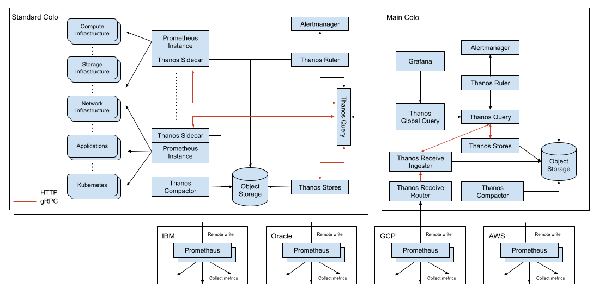
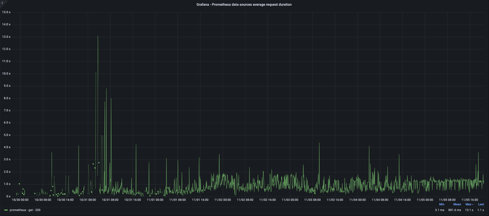
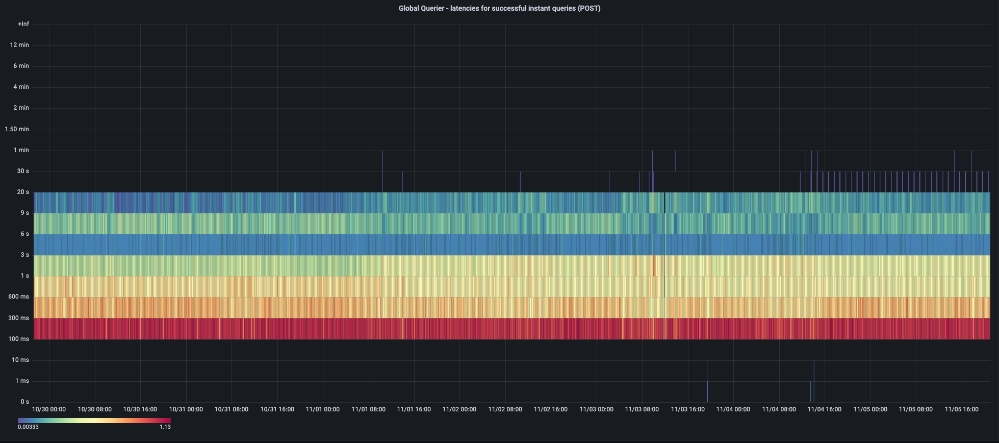
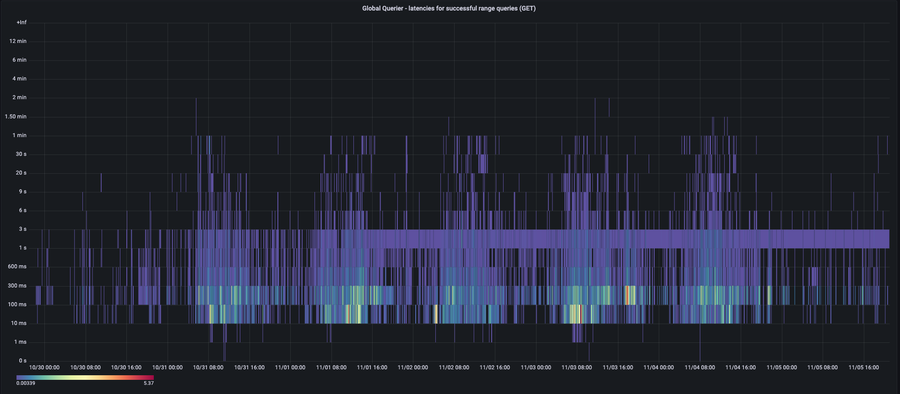
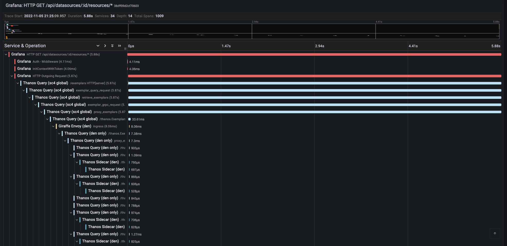

## Disclaimers

Anugrah and Vic are Medallia employees. However, the opinions expressed here are their own, and not necessarily endorsed by Medallia or their co-workers. References to “we” in this article pertain either to Anugrah and Vic specifically or to generalized experiences of the observability engineering team at Medallia.

## Introduction

At Medallia, we successfully operate a hybrid Thanos architecture that allows our users to experience high-performance queries of software and infrastructure metrics generated across 10 large colocation data centers and 30+ small virtual data centers via a single pane of glass.

By “hybrid”, we mean that we have a single, global Thanos Query deployment. This global Thanos Query makes federated queries to the large colocation data centers via chained Thanos Query components. Additionally, the global Thanos Query also talks to a Thanos Receive ring that receives samples via remote write from the smaller virtual data centers, which are public cloud (AWS, OCI, etc.) Kubernetes clusters.

## Scale

The number of active series that our metrics platforms ingests at any given time varies between 900 Million - 1.1 Billion, depending on the workloads that are running across our global compute infrastructure. We define active series as the sum of the series in the prometheus head blocks.

With a scrape frequency of once per minute, that puts or ingestion throughput between 13-17 Million samples per seconds across all our ingest components (Prometheus/Thanos Receive).

## Historical and current business context

Founded in 2001, Medallia is a pioneer and leader in the field of experience management as a SaaS solution. The initial focus for the company was on collecting and analyzing solicited feedback (i.e., web-based surveys). But, the focus has evolved over the years to include a variety of interactions, including voice, video, digital, IoT, social media, and corporate-messaging tools.

Observability is largely a practice of capturing a variety of health and performance signals from software and hardware, ingesting those signals into appropriate data storage systems, and providing tools for analysis and alerting on that data. Analogously, Medallia captures feedback signals from its customers’ customers and employees, ingests those signals into its data storage systems, and provides analysis and alerting tools for use by its customers.

Just as a goal in observability is to catch problems early and to facilitate fast mitigation, Medallia helps its customers to detect customer and employee dissatisfaction and to take proactive action while the relationship can still be salvaged .

## Problem Statement

With such a strong analogy from our own business to lean on, the value of investing in observability has not been a difficult concept to justify. However, until the middle of the previous decade, observability within Medallia was limited to reachability monitoring and log aggregation. At that point, however, the company’s broad-focused SRE organization brought forth the use of metrics, which was both a revelation to and a revolution within the engineering organization with respect to awareness of the quality and performance of our software.

However, there have been challenges along the way. Our metrics journey is a story with many chapters.

### Chapter 1: Cloud-based vendor solution

Circa 2015, the SRE organization initiated a contract with a vendor for metrics dashboards and alerts. For the first time, in real-time, engineers could observe behavioral characteristics of applications and infrastructure. Engineers rejoiced!

However, the initiative's wild success soon revealed that costs would become prohibitive. For a private company looking to go public, there can be pressures to scale costs logarithmically with respect to revenues. So, another solution was needed.

### Chapter 2: Self-hosted, limited scale, open source solution

By 2018, a small task force within the SRE organization had deployed a proof of concept for an open source, self-hosted solution for metrics storage and alerting with the TICK stack (Telegraf, InfluxDB, Chronograf, Kapacitor). Leveraging Grafana for visualizations, the solution was immediately appealing. The query language, influxQL, was SQL inspired, which opened the possibility of reducing the learning curve for engineers onboarding to the solution.

However, SQL-derived languages can be subpar for time series analysis, burdening the query writer with the task of aggregating both horizontally (i.e., temporally, into time buckets) and vertically (i.e., over various label dimensions). Further, the query language for this solution did not allow “join” queries across multiple metrics. And the alerting language (TICK Scripts) was a very different beast altogether. The final nail in the coffin was that the open-source version of the product had limited ability to scale. This left us with two very unpalatable choices – either manage a large number of deployments of mutually exclusive and collectively exhaustive metrics data sets or pay big money for the enterprise product.

### Chapter 3: Self-hosted, unlimited scale, open source solution - Prometheus and Thanos for the win!

By late 2019 it was clear to the SRE organization that another solution would be necessary very soon. Again, a small task force deployed a proof of concept of Prometheus. Immediately it was obvious that the query language, PromQL, was sufficiently more powerful and elegant. Moreover we could use PromQL both for dashboards and for alert definitions. Additionally, the pull-based ingest pipeline provided benefits that could be the subject of an article of its own.

The only problem was that, like the incumbent solution, it was clear that routing all samples from all data centers into a single, massively vertically-scaled Prometheus was not going to be a sustainable solution. A failure in such a configuration would take down the entire metrics system. WAL file replay would take forever. How would we route metrics from all data centers into that Prometheus?

#### Why we chose Thanos

At this point, the task force discovered the Thanos project. Thanos components would solve several major problems:

- How can we horizontally scale our Prometheuses?
- How can we retain one year of metrics samples without vertically scaling our Prometheuses as we horizontally scale them?
- How can we simplify the management of our solution by deploying identical architecture in each data center?
- How can we have a global view of all metrics?
- How can we do all this very quickly?

### Chapter 4: Time for a dedicated observability team

In early 2020, the SRE task force handed off their proof of concept to the newly-formed Performance and Observability (POE) team for hardening, widespread launch, and ongoing support. Within a few months, the POE team made a few tweaks and tunings, deployed the solution to all of the engineering, and deprecated the previous solution.

One of the key principles of the architectural design was to construct the Thanos and Prometheus stack in an identical manner in each colocation data center. This would allow us to think of each data center in a plug-and-play kind of manner. Each data center would have a data center-scoped Thanos Query. In a primary data center, we would operate Grafana and a globally-scoped Thanos Query that in turn talks to each of the data center-scoped Thanos Query components.

This solution was elegant and relatively easy to support. The colocation data centers are sufficiently large to easily accommodate all the Thanos and Prometheus components.

However, by late 2020 Medallia had expanded its strategy to make more use of public cloud providers such as Amazon Web Services (AWS) and Oracle Cloud Infrastructure (OCI). So, the POE team faced a new mandate – incorporate metrics generated within these virtual data centers into the global view.

In general, these virtual data centers are small Kubernetes clusters, with compute nodes that are much smaller in terms of CPU and memory capacity than what we enjoy in the colocation data centers. Deploying the full complement of Thanos and Prometheus components in such an environment would require an unacceptably high percentage of capacity within those environments.

Further, we could anticipate that the number of virtual data centers would grow very fast. Fanning out distributed queries to 8 or 10 colocation data centers is one thing. But, fanning out distributed queries to an additional tens or even hundreds of virtual data centers gave us worries – not that Thanos Query couldn’t handle the job, but that the probability of one or more network glitches across so many remote destinations at any given point in time would not be acceptably small.

To solve these two issues, we decided to experiment with deploying Prometheus in the virtual data centers as essentially a collection agent. These Prometheus would remote write their samples to a new Thanos Receive ring within our primary colocation data center. The global Thanos Query could then talk to Thanos Receive in addition to talking to the data center-scoped Thanos Query components, thereby giving us the global view of metrics that we require.

For the past two years, this hybrid solution – both federated queries and remote-write – has met our needs very well. We are fully committed to Prometheus-based dashboards and alerting. Strategically, at this point, our ongoing focus will be to minimize total cost of ownership both in terms of labor and compute resources.

## Our Setup

### Architecture

Note that the architecture diagram is representative, intended so show how it can, by design, easily be extended to all the major public clouds.

### Traffic and Data Size

As mentioned earlier, at any given moment in time, the current number of active series is in the ballpark of 1 Billion, with our ingestion throughput at approximately 15 million samples per second due to our once-per-minute scrape frequency. We retain samples for 366 days – long enough to accommodate a full leap year.

Our current inventory, across all data centers, includes:

- 3 global-scoped Thanos Query instances
- 57 data center-scoped Thanos Query instances
- 6 Thanos Receive-scoped Thanos Query instances
- 88 Thanos Store instances
- 33 Thanos Ruler instances
- 11 Thanos Compactor instances
- 42 Thanos Receive router instances
- 91 Thanos Receive ingester instances
- 286 Thanos Sidecar instances
- 402 Prometheus instances
- 39 Alertmanager instances

### Compute Cost

Over the course of a week, total resource utilization for all of our Thanos and Prometheus components across all data centers is within these ranges:

- CPU: 450-650 cores
- Working set size: 7-13 TiB (Mostly used by Prometheus-es, then Thanos receives)
- Network receive: 3.2-4.8 GiB/s
- Network transmit: 2.2-3.2 GiB/s

### Query Performance

The following screenshots from our dashboards about the query pipeline show how query performance varies in a typical week.

#### As perceived by Grafana:

#### Instant queries, as perceived by the global-scoped Thanos Query (includes Thanos Ruler queries):

#### Range queries, as perceived by the global-scoped Thanos Query:

#### A trace showing the large number of components involved in serving a query across multiple data centers:

## Future Steps - the next chapter

### Current issues

The hybrid architecture has given us the flexibility that we needed to scale our solution organically and to meet our needs as we encountered them. But, the solution requires understanding, maintaining, and integrating two different architectures, with all their nuances. From both a technical and a human perspective, we recognize that simplicity is a key to our ability to scale our observability solutions cost-effectively as the business continues to grow rapidly.

### A possible solution

The fact that we must support small, virtual data centers means that the remote write architecture will not be going away. So, to reduce the overall complexity of our operations and to help new team members to be onboarded quickly, we are strongly considering a move toward a 100% remote write architecture with centralized storage.

Additional reasons that such an architectural change is appealing include:

- **Faster query performance** -- today, queries that need to fan out to multiple data centers are bottlenecked by the slowest network performance from our primary data center to the other colocation data centers. This delay can range from minimal to very noticeable, given that our primary data center is in North America and we have colocation data centers in Europe, Asia, and Australia.
- **Reduction or elimination of Prometheus sharding woes** -- although we use a hashmod algorithm to automatically shard metrics across a set of Prometheuses within a data center, we spend a considerable amount of time ensuring that the number of shards for each data center is sufficient. With a stateless, agent-based, remote-write approach, we may be able to focus on the storage capacity of one ring rather than needing to do a juggling act, making sure that each data center’s set of Prometheuses is scaled appropriately.
- **Elimination of the risk of silent, temporary invisibility of metrics** -- today, if a Store API component goes down, it is as if the metrics housed by that component do not exist. We minimize this risk by running Prometheuses and Thanos Stores in an HA/mirrored mode and depend upon Thanos Query to deduplicate at query time. But, if the HA pair is down, then users may unknowingly obtain inaccurate results from their queries. The idea of having all metrics data in a single ring that manages its integrity is an appealing one.

### Tradeoffs

Of course, with any solution there are tradeoffs. If we move toward centralized storage it also includes some disadvantages:
- **Alerts and recording rules** – today, a large percentage of our alerts and recording rules are evaluated by the Thanos Rulers in each data center. In a centralized storage architecture, these alerts and rules would be evaluated after the transfer of metric samples via remote write. Network failures could cause rules not to be evaluated in a timely manner.
- **Disaster recovery** – concerns and costs could be increased in a centralized storage architecture because the entire storage and querying pipeline would need to be replicated to a different data center if the primary data center goes down. We would lose some agility that we have today, in which we can quickly deploy Grafana and the global Thanos Query component to another data center and run the full stack minus the data from the downed data center.

### Our dream

If we move in the centralized storage direction, Thanos Receive will certainly get consideration. But, for the sake of due diligence, we will need to explore other solutions too, such as Cortex, Mimir, and others. However, whichever solution turns out to be the best fit for us, we do expect Thanos components to remain a major piece of our solution. Here is why:

- **Safe migration path** – any solution we choose must ultimately implement the Prometheus HTTP API. Running Thanos Sidecar in a mode in which it proxies Store API calls from Thanos Query to the front end of the new solution without attempting to upload blocks to object storage would allow us to run both the old and the new solution, until the old solution’s data ages out – thereby avoiding data migration or long downtime.
- **Different retention policies for different requirements** – we already generate several business metrics using recording rules applied to operational metrics. These business metrics are evaluated by a dedicated Thanos Ruler, for which blocks are stored in a different object storage bucket than the bucket storing the operational metrics. This allows the use of a dedicated Thanos Compactor, which applies a different retention policy than what is applied for operational metrics. We anticipate keeping this subsystem intact.

## Parting thoughts

The ability of Thanos components to play various roles within our architecture to support our ever-increasing scale of Prometheus-based metrics has been extremely valuable. It dramatically shortened the period of time from proof of concept to general availability. And, what has been amazing is that as our needs have shifted, Thanos has been able to facilitate those shifts without a radical reimplementation.

We certainly recommend Thanos to anyone facing a need to operate Prometheus metrics at any scale who need to maintain flexibility in their architecture to accommodate changes – both anticipated and unanticipated. Thanks for reading!
