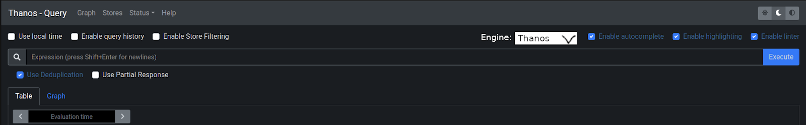
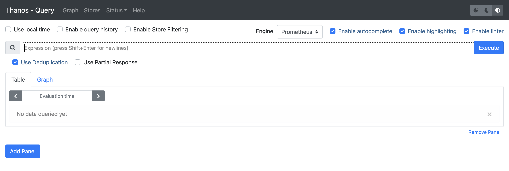
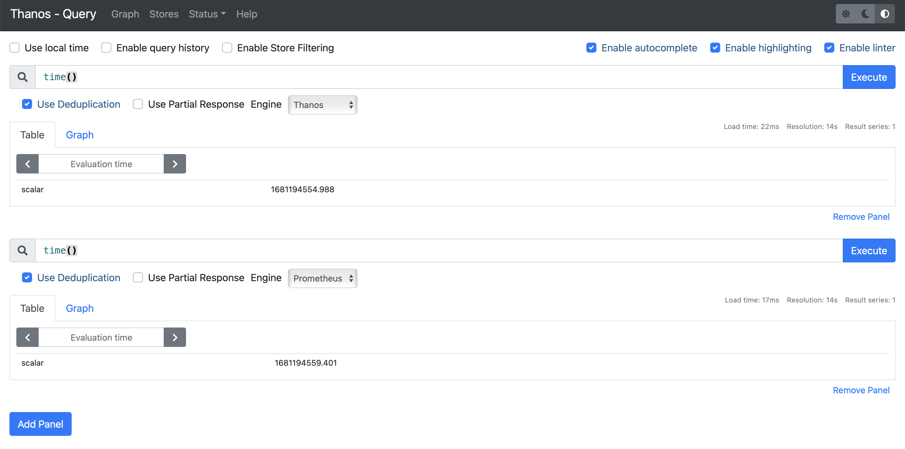
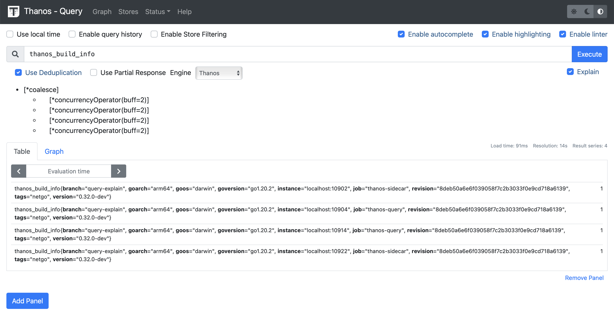
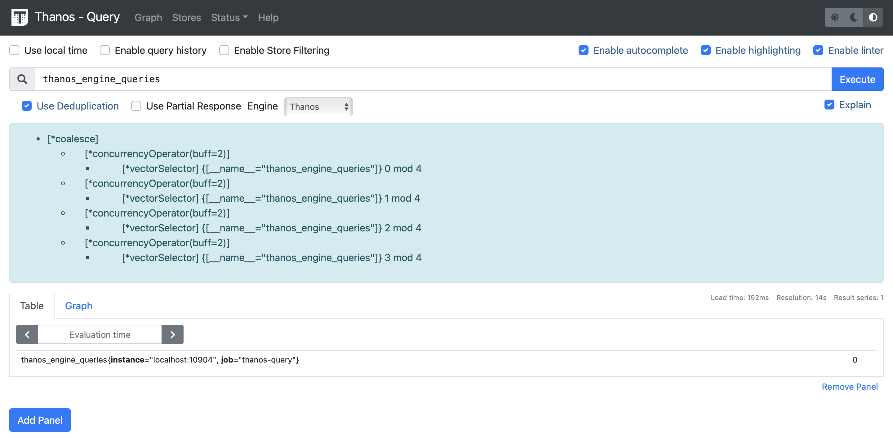
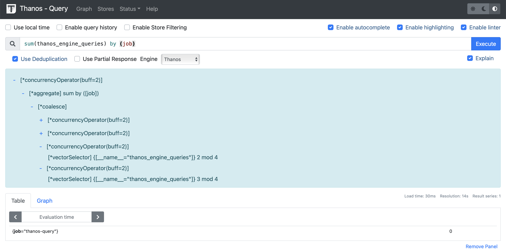

Hello everyone, my name is Pradyumna Krishna and I was contributing to Thanos as a part of the LFX mentorship programme. I was working on adding Query Execution Observability to the Thanos PromQL engine and Thanos project itself. I am going to share my experience and provide insights into the project.

## The Project

### What's PromQL?

Prometheus provides a functional query language called PromQL (Prometheus Query Language) that lets the user select and aggregate time series data in real-time.

### What's the Thanos PromQL Engine?

Thanos PromQL engine is another engine that's currently under development and aims to be fully compatible with the original PromQL engine. It is a multi-threaded implementation of a PromQL Query Engine based on the [Volcano/Iterator model](https://paperhub.s3.amazonaws.com/dace52a42c07f7f8348b08dc2b186061.pdf). Thanos PromQL engine focuses on adding more performance and features like query observability that is missing from the original promql-engine.

PromQL engine supports many binary and aggregation [operators](https://prometheus.io/docs/prometheus/latest/querying/operators/). These include basic logical and arithmetic operators and also built-in aggregation operators that can be used to aggregate the elements of a single instant vector, resulting in a new vector of fewer elements with aggregated values. The result of the query formed using these operators gets visualized as a graph or viewed as tabular data.

### Query Observability

Query observability provides the ability to see internal metadata such as the duration, query plan, and detailed stats about each query (and different parts of it) in the Thanos PromQL engine. By exploring query stats and plans, one can try to optimize the query executed by the engine.

## Contributions

Over this period I worked on two major features which are switching engines in the Thanos via the UI to expose it to more users and facilitate exploration, and adding query explanation functionality to the UI.

Giedrius always came up with sketches showing me how the feature should work and look.

### Engine Switch

Thanos needs to specify which engine to utilize to execute the promql queries. A query can only be executed by one engine. Originally, switching between different engines was implemented through a command line flag. My first feature to implement was to add this engine switching to Thanos, switching the engine from Prometheus to Thanos using UI without any interruptions. Now the engine specified through the command line specifies the default engine to use if no promql engine parameter has been set through the API.

Here is the sketch of how the engine switch should look (made by Giedrius):

I looked into Thanos and made changes in Thanos components from the API to the UI to implement this engine switch. I tried to make the UI as close as possible to the sketch.

After initial review, I move this switch to each panel. As this helps to run the same query over the different engines and compare the results.

**Pull Requests**
- Add engine param to Thanos engine constructor ([thanos-io/promql-engine#228](https://github.com/thanos-io/promql-engine/pull/228))
- Query: Switch Multiple Engines ([thanos-io/thanos#6234](https://github.com/thanos-io/thanos/pull/6234))

### Query Explanation

Query explanation is a dry run of the query planning and returns the query execution plans. Query explanation can be enabled through a flag on the Thanos PromQL engine. After that query explanation is visualized through the Thanos query UI. That is a feature of Query Observability. For the convenience of the user, the Explain checkbox is locked unless the Thanos PromQL engine is used

I started with generating query explanations through the Thanos promql-engine and then worked on the Thanos UI to represent the query explanation in a tree-like structure.

Thanos UI got updated with time, resulting in the development of the explanation tree that can be seen through the screenshots provided.

**Pull Requests**
- Add method to explain query vector ([thanos-io/promql-engine#252](https://github.com/thanos-io/promql-engine/pull/252))
- Query Explanation ([thanos-io/thanos#6346](https://github.com/thanos-io/thanos/pull/6346))

### What next

We have laid the foundation of Query Observability by implementing the Query Explanation feature. The next steps forward can be:
* Showing memory allocations, CPU usage
* Showing "hottest" operators
* Showing metadata about leaf nodes (how many postings/series were fetched/touched, etc.)

## Overall Experience

I love the LFX mentorship program. I learned a lot while contributing, and gained new skills in Golang and typescript. My mentors Giedrius and Saswata guided me throughout the program, they never let me get stuck at any point and always provided me with technical as well as career guidance.
