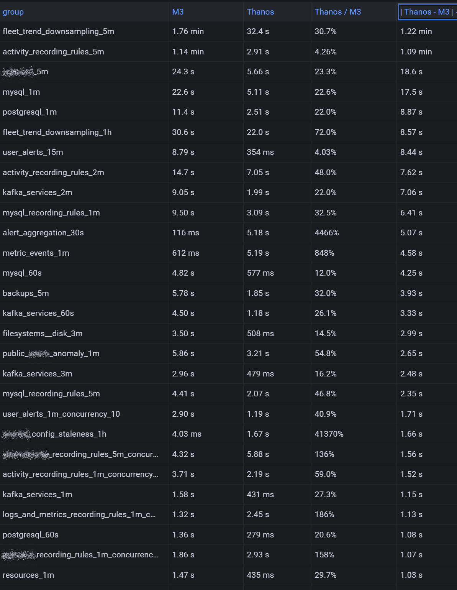

## About Aiven

Aiven is a cloud-native data infrastructure platform that provides fully managed open source database, streaming, and analytics services on 11 clouds and over 150 regions. Aiven offers open source products including PostgreSQL, MySQL, ClickHouse, Cassandra, M3, InfluxDB, along with streaming platforms such as Kafka and Flink. Aiven has a major investment in upstream contributions not altering the true open source solutions which are offered making Aiven the open source data platform for everyone. 

* **Ease of use**: Aiven is a fully managed platform, so you don't have to worry about the underlying infrastructure. You can focus on using your data to power your applications.
 * **Reliability**: Aiven is built on top of open source technologies, which are known for their reliability. Aiven also has a team of experts who are dedicated to keeping your data infrastructure up and running.
* **Scalability**: Aiven is designed to scale with your needs. You can easily add or remove resources as your data requirements change.
* **Security**: Aiven takes security seriously. Your data is protected by a variety of security measures, including encryption, authentication, and authorization.
* **Cost-effectiveness**: Aiven offers a simple, pay-as-you-go pricing model. You only pay for the resources that you use.

## Introduction

Going back to 2019, Aiven was using the open source InfluxDB, which was unable to handle the scale at the time. We needed a scalable time series database, both for internal purposes. Fast-forward to today and the scale of our fleet, consisting of 100,000+ machines across 11 clouds and 160+ regions. There is no provider with our scale, and variability of cloud infrastructure. Additionally, Aiven’s customers using database and streaming technologies required an easy observability platform to collect metric data for both our services and for their internal needs. After looking at the ecosystem, the options were limited. Aiven was very comfortable scaling out database architectures, versus scale-up as we had with InfluxDB. M3 fit the bill, architecturally, at the time. The community at the time was vibrant with Uber, Chronosphere (at the time a new startup), and others contributing. Aiven was ready to devote engineers to the project internally and upstream to help build the next generation database for time series and Prometheus use cases. We even contributed the support for the Influx line protocol to M3DB, which helps Aiven customers migrate to Prometheus. 

Fast-forward to 2022 with the changes at Uber, as they worked on profitability, and Chronosphere focused on their SaaS platform, there are virtually no contributions occurring to M3DB. M3DB is missing a lot of new functionality which was introduced, as Prometheus evolved. This includes a lack of support for exemplars, alertmanager, along with not having the ability to move older data to object store, making the operating expenses extremely high versus other database options available today. M3DB also has challenges at high scale with memory management, which has bitten us and our clients many times. It’s very picky on the types of queries and the data itself.

## Our path forward

Aiven was beginning to seek a path forward. Our requirements were that we would like a vibrant ecosystem we can contribute to, Aiven has over 20 dedicated engineers in our open source program office (OSPO) who only work upstream. Our OSPO is a major area of investment, and we believe in free and open software and are willing to put our engineering resources behind it. Additionally, the project ideally should be Apache 2.0 licensed to allow us to use it for anything from internal use cases to building products or integrating it inside product offerings. We want all the flexibility and little risk.

With these options, we had to discount Mimir even though it’s great technology, it’s controlled by a single company and restrictively licensed. Similar to Elasticsearch, we would rather not have to go down that path in the future. This meant the main options we had were Cortex and Thanos. Cortex has similar problems to M3DB. There are only a couple of companies using Cortex, since Mimir is an improved fork, and those that aren't concerned about the fact that the license could change next week have already switched over. The Mimir community is controlled by a single company, which is not ideal. Aligning with software foundations is the right way to protect a project and ensure a vibrant and diverse community. Thanos was our target. We would start by seeing if we can use it internally and then determine if we could build a product.

We began the process with creating a plan on how we would test the solution to see how it met our needs. This would be a Proof of Concept (POC) to see if it were feasible. Here was our basic setup today

As you can see in our architecture, we are using Telegraf since it supports monitoring the many technologies which Aiven provides in a smaller footprint. Although we support Prometheus scraping for our users, internally we push metrics to M3DB via influx line protocol. We use additional technologies together, as you can also see. We had several options where we could introduce Thanos into the mix. Furthermore, we decided to continue using Telegraf, but sending directly via remote write, versus using the Influx protocol. This created one of our first challenges, which is that some of our metrics are delayed due to the number of clouds we support. When a metric is written in the future, the ingesters would crash. Our engineer Michael fixed this upstream (https://github.com/thanos-io/thanos/pull/6195). 

The first step was setting up a single standalone system for Thanos and testing to see how it handled a small percentage of our metric traffic. We ended up writing a script in starlark to do this sampling and configured a subset of our fleet (automated). We build a lot of test automation when we have a system in production, including running chaos testing. Our automation testing included a writing one sample, making cluster changes, and then verifying the sample was persisted. This failed due to an off-by-one in ingestion issues, which was fixed in https://github.com/thanos-io/thanos/pull/6183.

## Testing at scale

After we tackled these challenges, we decided to begin building a scale out implementation to see how it handled higher amounts of metric traffic. As part of this, we implemented more components and scaled out the components. We ran into an issue with the Ketama hash ring, which caused a deadlock in the routing ingester if we had too few endpoints for the replication factor, Michael fixed this upstream in https://github.com/thanos-io/thanos/pull/6168. Similarly, once we started to handle scale we saw some timeouts on the writes from the ingesters. We learned systemd StopTimeoutSec defaulted to 90s, in our case, this was not enough for ingesting receivers to upload blocks, and needed to be increased. The last issue we saw pretty immediately was because we run a fleet of over 100k systems today, sometimes we get old metrics being reported by some hosts. Thanos will throw an error when we try to write the stale metrics. Telegraf started blocking due to retries and eventually the internal buffers were filling up and then metrics were being discarded. The fix for this one was for us to not retry posting when there were 500 status codes being thrown by the remote write endpoint. 

The community has been critical for us. One example we ran into around this portion of the implementation which we received some help from the other users and maintainers on the CNCF Slack. We also ran into some other issues which would create replication loops causing a crash as well. We addressed this issue by moving to a routing-ingesting receiver topology as suggested by the community. 

    flowchart TD
        subgraph ThanosQueryCluster
            Query1
            Query2
            Query3
        end
        ThanosCompactor --> ObjectStorage
        A["Kafkapump"]

        subgraph ObjectStorage [Cloud ObjectStorage]
        end
        subgraph ThanosReceiverCluster
            router1 --> hashring
            router2 --> hashring
            router3 --> hashring
            hashring --> ingestor1
            hashring --> ingestor2
            hashring --> ingestor3
            direction TB
            subgraph ReceiverNode1 [ ]
                direction LR
                router1
                ingestor1
            end
            subgraph ReceiverNode2 [ ]
                direction LR
                router2
                hashring
                ingestor2
            end
            subgraph ReceiverNode3 [ ]
                direction LR
                router3
                ingestor3
            end

        end
        A --> |writes to router endpoint| ThanosReceiverCluster
        ingestor1 --> ObjectStorage
        ingestor2 --> ObjectStorage
        ingestor3 --> ObjectStorage
        ObjectStorage --> ThanosStoreCluster
        ThanosQueryCluster --> ThanosReceiverCluster
        ThanosQueryCluster --> ThanosStoreCluster
        subgraph ThanosStoreCluster
            Store1
            Store2
            Store3
        end

## Cost Savings

After concluding the POC we determined that it was feasible and we also found that the cost savings were pretty significant:

Service | Instance type | Price | Count | Total price (monthly)
------- | ------------- | ----- | ----- | ---------------------
m3db    | n2d-highmem-32 | 1172.61 | 18 | 21106.98 
m3coordinator | n2d-standard-48 | 1303.73 | 9 | 11733.57 
M3 TOTAL | | 32840.55

thanosreceiver | n2d-highcpu-96 | 1924 | 6 | 11544
thanosquery | n2d-highcpu-16 | 321.57 | 6 | 1929
thanosstore | n2d-highmem-8 | 293.90 | 3 | 881.7
thanoscompactor | n2d-highmem-8 | 293.90 | 1 | 293.90
redis | n2d-highmem-4 | 147.45 | 2 | 294.9

THANOS TOTAL | | 14942.68

We are also paying roughly 25% for the storage costs. M3DB has a total of 54TB of storage provisioned today, at a cost of $4320 per month. We could house 216TB of storage for the same cost with Thanos. We are currently generating about 750GB per day, which means we can keep almost a year of metrics for the same cost as M3DB. Additionally, we are backing up M3DB which is using 33TB of object storage at a cost of $1320 per month. With object storage, we have the added cost for the networking, this is around $1800 per month in additional costs. Here are our estimated costs:

* M3: $38480

* Thanos without any historical data in storage: $16939
* Thanos with one month retention in object storage: $17368
* Thanos with six months retention: $19703
* Thanos with a years retention: $22447
* Thanos with 2 years retention: $27955
* Thanos with 3 years retention: $33423

As you can see, the cost savings are significant here. Alexander Rickardsson implemented AZ awareness in Thanos upstream now, which reduced our replication factor from 3 to 2 on Google Cloud Platform. https://github.com/thanos-io/thanos/pull/6369#event-9357572391 

## Performance Gains

The performance normally was much better in our ongoing reporting and alerting needs as well. Today we are using vmalert to drive our alerting pipeline, since M3DB is limited, there is no such thing as an alertmanager integration. This brings me to another issue we found with vmalert it would sometimes execute rules twice within the same group evaluation period. This, by default, would realign the result timestamp with the group evaluation start time, which would lead to failed and rejected writes. The timestamp issue was caused by samples with same timestamp but different value ), this was fixed by disabling this query time alignment ( datasource.queryTimeAlignment ). 

With vmalert you are running queries actively at intervals. We could compare as is to see the performance differences and found out that most of the queries which were not doing regex were way faster

Additionally, we allowed unlimited retention of metrics since the cost of object store is so low. There is really no point in even deleting them. 

## Wrapping up and next steps

Michael Hoffmann is working on other optimizations in the query engine that we will be contributing upstream as well.

With such remarkable results, we are excited about the next steps, which is to be the first Thanos service. We will also continue to contribute to Thanos, and hope to have dedicated members of our OSPO in the future working in the Thanos community. A very vibrant and helpful community, we have already made contributions to. We will start on the productization work later this year, so stay tuned for our public beta next year. Furthermore, we are also seeking private beta testers who are interested in a cost-effective, truly open source Prometheus service which can run across 11 clouds and over 160+ regions, please reach out to me. 
