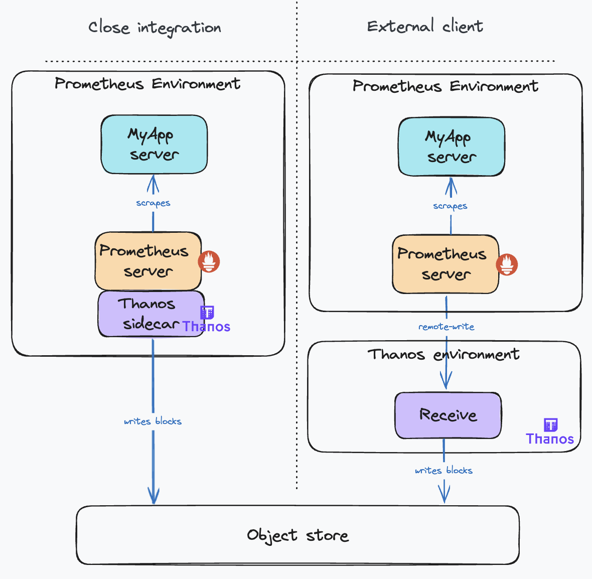
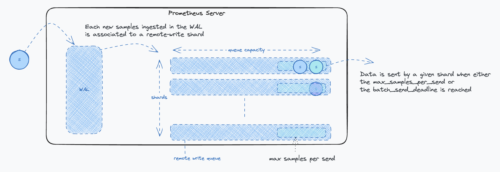
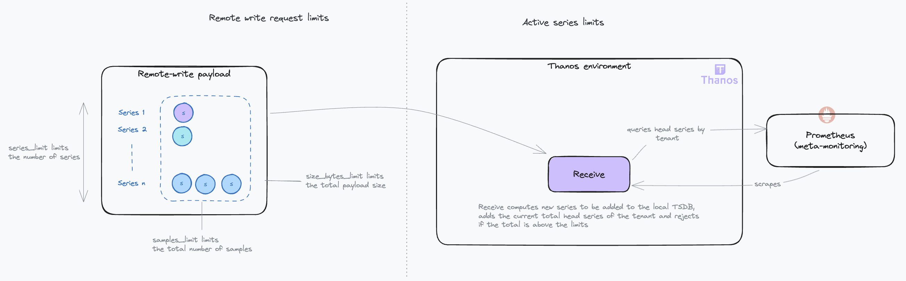
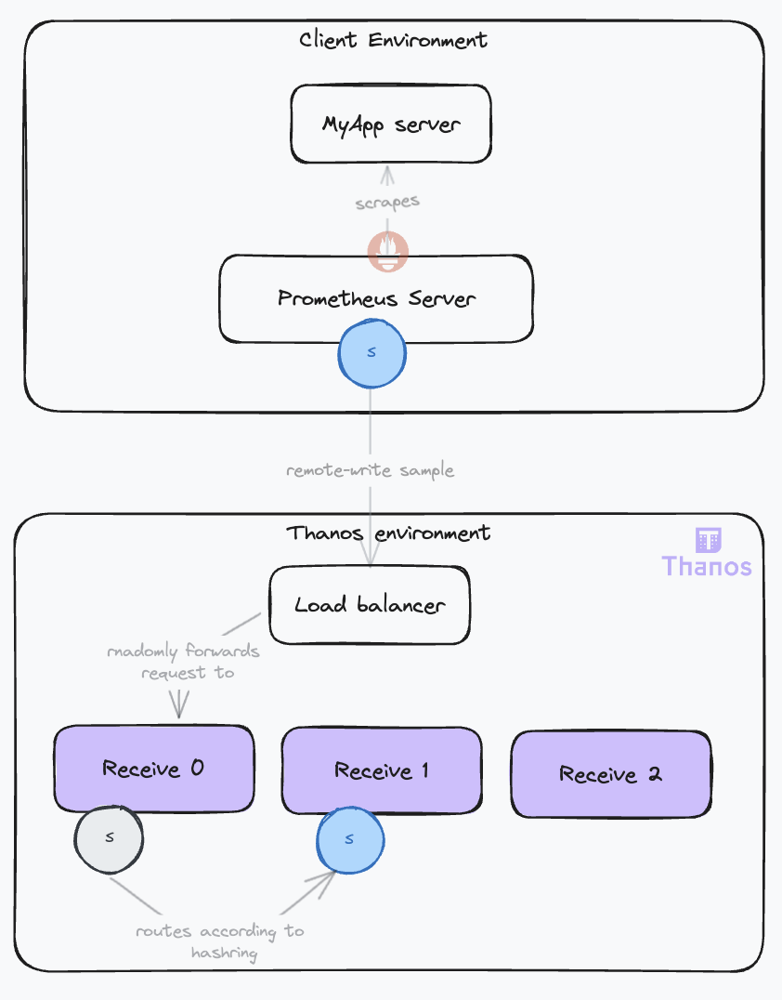
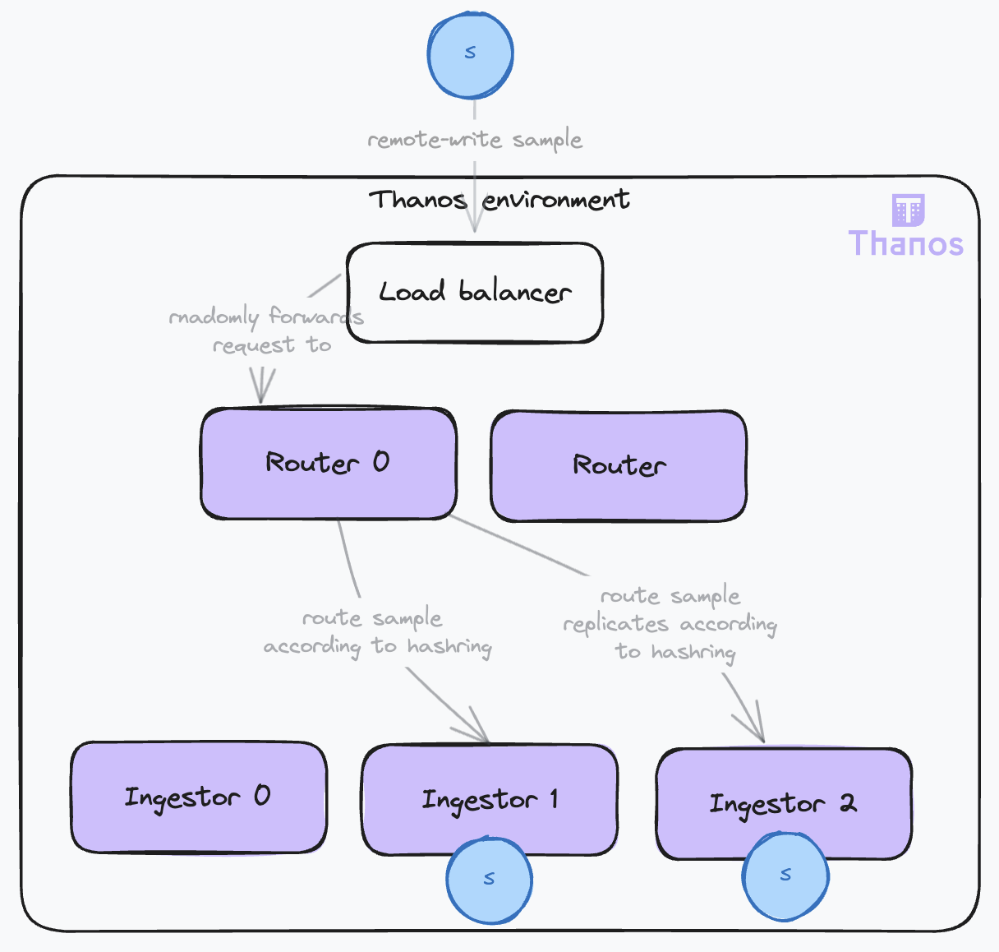
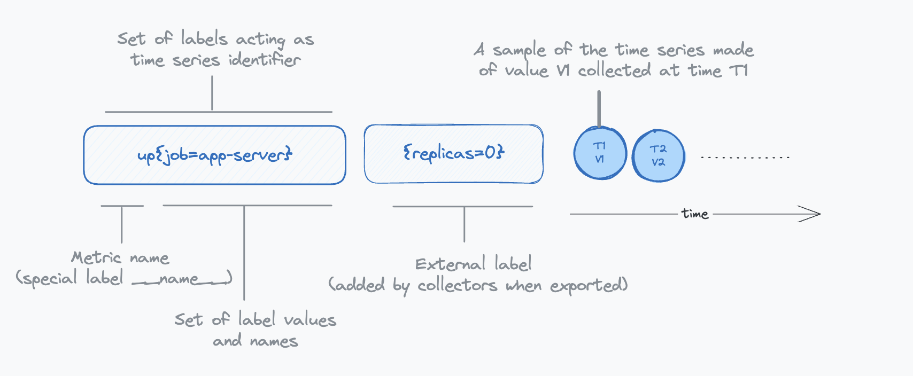
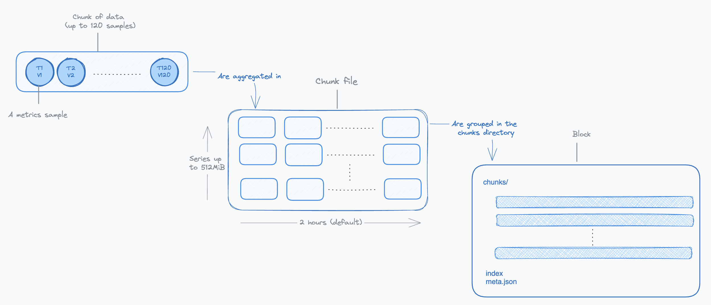

## Life of a Sample in Thanos, and How to Configure it – Ingestion – Part I

### Introduction

Thanos is a sophisticated distributed system with a broad range of capabilities, and with that comes a certain level of configuration complexity. In this series of articles, we will take a deep dive into the lifecycle of a sample within Thanos, tracking its journey from initial ingestion to final retrieval. Our focus will be to explain Thanos's critical internal mechanisms and highlight the essential configurations for each component, guiding you toward achieving your desired operational results. We will be covering the following Thanos components:

* **Receive**: Ingests samples from remote Prometheus instances and uploads blocks to object storage.
* **Sidecar**: Attaches to Prometheus pods as a sidecar container, ingests its data and uploads blocks to object storage.
* **Compactor**: Merges and deduplicates blocks in object storage.
* **Store**: Exposes blocks in object storage for querying.
* **Query**: Retrieves data from stores and processes queries.
* **Query Frontend**: Distributes incoming queries to Querier instances.

The objective of this series of articles is to make Thanos more accessible to new users, helping alleviate any initial apprehensions. We will also assume that the working environment is Kubernetes. Given the extensive ground to cover, our goal is to remain concise throughout this exploration.

Before diving deeper, please check the [annexes](#annexes) to clarify some essential terminology. If you are already familiar with these concepts, feel free to skip ahead.

### The Sample Origin: Do You Have Close Integration Capabilities?

The sample usually originates from a Prometheus instance that is scraping targets in a cluster. There are two possible scenarios:

* The **Prometheus instances are under your control and you can access it from your Thanos deployment**. In this case, you can use the Thanos sidecar, which you will attach to the pod running the Prometheus server. The Thanos sidecar will directly read the raw samples from the Prometheus server using the [remote read API](https://prometheus.io/docs/prometheus/latest/querying/remote_read_api/). Then, the sidecar will behave similarly to the other scenario. It will expose its local data via the Store API as a **Receiver**, without the routing and ingestion parts. Thus, we will not delve further into this use case.
* The **Prometheus servers are running in clusters that you do not control**. In this case, you cannot attach a sidecar to the Prometheus server and you cannot fetch its data. The samples will travel to your Thanos system using the remote write protocol. This is the scenario we will focus on.

Also, bear in mind that if adding Thanos for collecting your cluster’s metrics removes the need for a full fledged local Prometheus (with querying and alerting), you can save some resources by using the [Prometheus Agent mode](https://prometheus.io/docs/prometheus/latest/feature_flags/#prometheus-agent). In this configuration, it will only scrape the targets and forward the data to the Thanos system.

The following diagram illustrates the two scenarios:



Comparing the two deployment modes, the Sidecar Mode is generally preferable due to its simpler configuration and fewer moving parts. However, if this isn't possible, opt for the **Receive Mode**. Bear in mind, this mode requires careful configuration to ensure high availability, scalability, and durability. It adds another layer of indirection and comes with the overhead of operating the additional component.

### Sending Samples to Thanos

#### The Remote Write Protocol

Let's start with our first Thanos component, the **Receive** or **Receiver**, the entry point to the system. It was introduced with this [proposal](https://thanos.io/tip/proposals-done/201812-thanos-remote-receive.md/). This component facilitates the ingestion of metrics from multiple clients, eliminating the need for close integration with the clients' Prometheus deployments.

Thanos Receive exposes a remote-write endpoint (see [Prometheus remote-write](https://prometheus.io/docs/prometheus/latest/configuration/configuration/#remote_write)) that Prometheus servers can use to transmit metrics. The only prerequisite on the client side is to configure the remote write endpoint on each Prometheus server, a feature natively supported by Prometheus.

On the Receive component, the remote write endpoint is configured with the `--remote-write.address` flag. You can also configure TLS options using other `--remote-write.*` flags. You can see the full list of the Receiver flags [here](https://thanos.io/tip/components/receive.md/#flags).

The remote-write protocol is based on HTTP POST requests. The payload consists of a protobuf message containing a list of time-series samples and labels. Generally, a payload contains at most one sample per time series and spans numerous time series. Metrics are typically scraped every 15 seconds, with a maximum remote write delay of 5 seconds to minimize latency, from scraping to query availability on the receiver.

#### Tuning the Remote Write Protocol

The Prometheus remote write configuration offers various parameters to tailor the connection specifications, parallelism, and payload properties (compression, batch size, etc.). While these may seem like implementation details for Prometheus, understanding them is essential for optimizing ingestion, as they form a sensitive part of the system.

From an implementation standpoint, the key idea is to read directly from the TSDB WAL (Write Ahead Log), a simple mechanism commonly used by databases to ensure data durability. If you wish to delve deeper into the TSDB WAL, check out this [great article](https://ganeshvernekar.com/blog/prometheus-tsdb-wal-and-checkpoint). Once samples are extracted from the WAL, they are aggregated into parallel queues (shards) as remote-write payloads. When a queue reaches its limit or a maximum timeout is reached, the remote-write client stops reading the WAL and dispatches the data. The cycle continues. The parallelism is defined by the number of shards, their number is dynamically optimized. More insights on Prometheus's remote write can be found in the [documentation](https://prometheus.io/docs/practices/remote_write/). You can also find troubleshooting tips on [Grafana's blog](https://grafana.com/blog/2021/04/12/how-to-troubleshoot-remote-write-issues-in-prometheus/#troubleshooting-and-metrics).

The following diagram illustrates the impacts of each parameter on the remote write protocol:



Key Points to Consider:

* **The send deadline setting**: `batch_send_deadline` should be set to around 5s to minimize latency. This timeframe strikes a balance between minimizing latency and avoiding excessive request frequency that could burden the Receiver. While a 5-second delay might seem substantial in critical alert scenarios, it is generally acceptable considering the typical resolution time for most issues.
* **The backoff settings**: The `min_backoff` should ideally be no less than 250 milliseconds, and the `max_backoff` should be at least 10 seconds. These settings help prevent Receiver overload, particularly in situations like system restarts, by controlling the rate of data sending.

#### Protecting the Receiver from Overuse

In scenarios where you have limited control over client configurations, it becomes essential to shield the Receive component from potential misuse or overload. The Receive component includes several configuration options designed for this purpose, comprehensively detailed in the [official documentation](https://thanos.io/tip/components/receive.md/#limits--gates-experimental). Below is a diagram illustrating the impact of these configuration settings:



When implementing a topology with separate router and ingestor roles (as we will see later), these limits should be enforced at the router level.

Key points to consider:

* **Series and samples limits**: Typically, with a standard target scrape interval of 15 seconds and a maximum remote write delay of 5 seconds, the `series_limit` and `samples_limit` tend to be functionally equivalent. However, in scenarios where the remote writer is recovering from downtime, the `samples_limit` may become more restrictive, as the payload might include multiple samples for the same series.
* **Handling request limits**: If a request exceeds these limits, the system responds with a 413 (Entity Too Large) HTTP error. Currently, Prometheus does not support splitting requests in response to this error, leading to data loss.
* **Active series limiting**: The limitation on active series persists as long as the count remains above the set threshold in the Receivers' TSDBs. Active series represent the number of time series currently stored in the TSDB's (Time Series Database) head block. The head block is the in-memory portion of the TSDB where incoming samples are temporarily stored before being compacted into persistent on-disk blocks. The head block is typically compacted every two hours. This is when stale series are removed, and the active series count decreases. Requests reaching this limit are rejected with a 429 (Too Many Requests) HTTP code, triggering retries.

Considering these aspects, it is important to carefully monitor and adjust these limits. While they serve as necessary safeguards, overly restrictive settings can inadvertently lead to data loss.

### Receiving Samples with High Availability and Durability

#### The Need for Multiple Receive Instances

Relying on a single instance of Thanos Receive is not sufficient for two main reasons:

* Scalability: As your metrics grow, so does the need to scale your infrastructure.
* Reliability: If a single Receive instance falls, it disrupts metric collection, affecting rule evaluation and alerting. Furthermore, during downtime, Prometheus servers will buffer data in their Write-Ahead Log (WAL). If the outage exceeds the WAL's retention duration (default is 2 hours), this can lead to data loss.

#### The Hashring Mechanism

To achieve high availability, it is necessary to deploy multiple Receive replicas. However, it is not just about having more instances; it is crucial to maintain consistency in sample ingestion. In other words, samples from a given time series should always be ingested by the same Receive instance. This is necessary for optimized operations. When this is not achieved, it imposes a higher load on other operations such as compacting the data or querying the data.

To that effect, you guessed it, the Receive component uses a hashring! With the hashring, every Receive participant knows and agrees on who must ingest which sample. When clients send data, they connect to any Receive instance, which then routes the data to the correct instances based on the hashring. This is why the Receive component is also known as the **IngestorRouter**.



Receive instances use a gossip protocol to maintain a consistent view of the hashring, requiring inter-instance communication via a configured HTTP server (`--http-address` flag).

There are two possible hashrings:

* **hashmod**: This algorithm distributes time series by hashing labels modulo the number of instances. It is effective in evenly distributing the load. The downside is that scaling operations on the hashring cause a high churn of time series on the nodes, requiring each node to flush its TSDB head and upload its recent blocks on the object storage. During this operation that can last a few minutes, the receivers cannot ingest data, causing a downtime. This is especially critical if you are running big Receive nodes. The more data they have, the longer the downtime.
* **ketama**: A more recent addition, an implementation of a consistent hashing algorithm. It means that during scaling operations, most of the time series will remain attached to the same nodes. No TSDB operation or data upload is needed before operating into the new configuration. As a result, the downtime is minimal, just the time for the nodes to agree on the new hashring. As a downside, it can be less efficient in evenly distributing the load compared to hashmod.

The hashring algorithm is configured with the `--receive.hashrings-algorithm` flag. You can use the [Thanos Receive Controller](https://github.com/observatorium/thanos-receive-controller) to automate the management of the hashring.

Key points to consider:

* The case for hashmod: If your load is stable for the foreseeable future, the `hashmod` algorithm is a good choice. It is more efficient in evenly distributing the load. Otherwise, `ketama` is recommended for its operational benefits.
* The case for small Receive nodes: If you have smaller Receive nodes, the downtime during scaling operation with the `hashmod` algorithm will be shorter as the amount of data to upload to the object storage is smaller. Also, when using the `ketama` algorithm, if a node falls, its requests are directly redistributed to the remaining nodes. This could cause them to be overwhelmed if there are too few of them and result in a downtime. With more nodes, the added load represents a smaller fraction of the total load.
* Protecting the nodes after recovery: During a downtime, the Receive replies with 503 to the clients, which is interpreted as a temporary failure and remote-writes are retried. At that moment, your Receive will have to catch up and ingest a lot of data. This is why we recommend using the `--receive.limits-config` flag to limit the amount of data that can be received. This will prevent the Receive from being overwhelmed by the catch up.

#### Ensuring Samples Durability

For clients requiring high data durability, the `--receive.replication-factor` flag ensures data duplication across multiple receivers. When set to n, it will only reply with a successful processing response to the client once it has duplicated the data to `n-1` other receivers. Additionally, an external replicas label can be added to each Receive instance (`--label` flag) to mark replicated data. This setup increases data resilience but also expands the data footprint.

For even greater durability, replication can take into account the [availability zones](https://thanos.io/tip/components/receive.md/#az-aware-ketama-hashring-experimental) of the Receive instances. It will ensure that data is replicated to instances in different availability zones, reducing the risk of data loss in case of a zone failure. This is however only supported with the `ketama` algorithm.

Beyond the increased storage cost of replication, another downside is the increased load on the Receive instances that must now forward a given request to multiple nodes, according to the time series labels. Nodes receiving the first replica then must forward the series to the next Receive node until the replication factor is satisfied. This multiplies the internodes communication, especially with big hashrings.

#### Improving Scalability and Reliability

A new deployment topology was [proposed](https://thanos.io/tip/proposals-accepted/202012-receive-split.md/), separating the **router** and **ingestor** roles. The hashring configuration is read by the routers, which will direct each time series to the appropriate ingestor and its replicas. This role separation provides some important benefits:

* **Scalability**: The routers and ingestors have different constraints and can be scaled independently. The router requires a performant network and CPU to route the samples, while the ingestor needs significant memory and storage. The router is stateless, while the ingestor is stateful. This separation of concerns also enables the setup of more complex topologies, such as chaining routers and having multiple hashrings. For example, you can have different hashrings attached to the routers, grouping distinct tenants with different service levels supported by isolated groups of ingestors.
* **Reliability**: During hashring reconfigurations, especially with the hashmod algorithm, some nodes may become ready before others, leading to a partially operational hashring that results in many request failures because replicas cannot be forwarded. This triggers retries, increasing the load and causing instabilities. Relieving the ingestors from the routing responsibilities makes them more stable and less prone to overload. This is especially important as they are stateful components. Routers, on the other hand, are stateless and can be easily scaled up and down.



The Receive instance behaves in the following way:

* When both a hashring and `receive.local-endpoint` are set, it acts as a **RouterIngestor**. This last flag enables the router to identify itself in the hashring as an ingestor and ingest the data when appropriate.
* When no hashring is set, it simply ingests the data and acts as an **Ingestor**.
* When only the hashring is set, it acts as a **Router** and forwards the data to the correct ingestor.

#### Handling Out-of-Order Timestamps

To enhance reliability in data ingestion, Thanos Receive supports out-of-order samples.

Samples are ingested into the Receiver's TSDB, which has strict requirements for the order of timestamps:

* Samples are expected to have increasing timestamps for a given time series.
* A new sample cannot be more than 1 hour older than the most recent sample of any time series in the TSDB.

When these requirements are not met, the samples are dropped, and an out-of-order warning is logged. However, there are scenarios where out-of-order samples may occur, often because of [clients' misconfigurations](https://thanos.io/tip/operating/troubleshooting.md/#possible-cause-1) or delayed remote write requests, which can cause samples to arrive out of order depending on the remote write implementation. Additional examples at the Prometheus level can be found in [this article](https://promlabs.com/blog/2022/12/15/understanding-duplicate-samples-and-out-of-order-timestamp-errors-in-prometheus/).

As you are not necessarily in control of your clients' setups, you may want to increase resilience against these issues. Support for out-of-order samples has been implemented for the TSDB. This feature can be enabled with the `tsdb.out-of-order.time-window` flag on the Receiver. The downsides are:

* An increase in the TSDB's memory usage, proportional to the number of out-of-order samples.
* The TSDB will produce blocks with overlapping time periods, which the compactor must handle. Ensure the `--compact.enable-vertical-compaction` [flag](https://thanos.io/tip/components/compact.md/#enabling-vertical-compaction) is enabled on the compactor to manage these overlapping blocks. We will cover this in more detail in the next article.

Additionally, consider setting the `tsdb.too-far-in-future.time-window` flag to a value higher than the default 0s to account for possible clock drifts between clients and the Receiver.

### Conclusion

In this first part, we have covered the initial steps of the sample lifecycle in Thanos, focusing on the ingestion process. We have explored the remote write protocol, the Receive component, and the critical configurations needed to ensure high availability and durability. Now, our sample is safely ingested and stored in the system. In the next part, we will continue following our sample's journey, delving into the data management and querying processes.

See the full list of articles in this series:

* Life of a sample in thanos, and how to configure it – Ingestion – Part I
* Life of a sample in thanos, and how to configure it – Data Management – Part II
* Life of a sample in thanos, and how to configure it – Querying – Part III

### Annexes

#### Metrics Terminology: Samples, Labels and Series

* **Sample**: A sample in Prometheus represents a single data point, capturing a measurement of a specific system aspect or property at a given moment. It is the fundamental unit of data in Prometheus, reflecting real-time system states.
* **Labels**: very sample in Prometheus is tagged with labels, which are key-value pairs that add context and metadata. These labels typically include:

  * The nature of the metric being measured.
  * The source or origin of the metric.
  * Other relevant contextual details.

* **External labels**: External labels are appended by the scraping or receiving component (like a Prometheus server or Thanos Receive). They enable:

  * **Sharding**: Included in the `meta.json` file of the block created by Thanos, these labels are used by the compactor and the store to shard blocks processing effectively.
  * **Deduplication**: In high-availability setups where Prometheus servers scrape the same targets, external labels help identify and deduplicate similar samples.
  * **Tenancy isolation**: In multi-tenant systems, external labels are used to segregate data per tenant, ensuring logical data isolation.

* **Series** or **Time Series**: In the context of monitoring, a Series, which is a more generic term is necessarily a time series. A series is defined by a unique set of label-value combinations. For instance:

```
http_requests_total{method="GET", handler="/users", status="200"}
^                                        ^
Series name (label `__name__`)           Labels (key=value format)
```

In this example, http_requests_total is a specific label (`__name__`). The unique combination of labels creates a distinct series. Prometheus scrapes these series, attaching timestamps to each sample, thereby forming a dynamic time series.

For our discussion, samples can be of various types, but we will treat them as simple integers for simplicity.

The following diagram illustrates the relationship between samples, labels and series:



#### TSDB Terminology: Chunks, Chunk Files and Blocks

Thanos adopts its [storage architecture](https://thanos.io/tip/thanos/storage.md/#data-in-object-storage) from [Prometheus](https://prometheus.io/docs/prometheus/latest/storage/), utilizing the TSDB (Time Series Database) [file format](https://github.com/prometheus/prometheus/blob/release-2.48/tsdb/docs/format/README.md) as its foundation. Let's review some key terminology that is needed to understand some of the configuration options.

**Samples** from a given time series are first aggregated into small **chunks**. The storage format of a chunk is highly compressed ([see documentation](https://github.com/prometheus/prometheus/blob/release-2.48/tsdb/docs/format/chunks.md#xor-chunk-data)). Accessing a given sample of the chunk requires decoding all preceding values stored in this chunk. This is why chunks hold up to 120 samples, a number chosen to strike a balance between compression benefits and the performance of reading data.

Chunks are created over time for each time series. As time progresses, these chunks are assembled into **chunk files**. Each chunk file, encapsulating chunks from various time series, is limited to 512MiB to manage memory usage effectively during read operations. Initially, these files cover a span of two hours and are subsequently organized into a larger entity known as a **block**.

A **block** is a directory containing the chunk files in a specific time range, an index and some metadata. The two-hour duration for initial blocks is chosen for optimizing factors like storage efficiency and read performance. Over time, these two-hour blocks undergo horizontal compaction by the compactor, merging them into larger blocks. This process is designed to optimize long-term storage by extending the time period each block covers.

The following diagram illustrates the relationship between chunks, chunk files and blocks:


