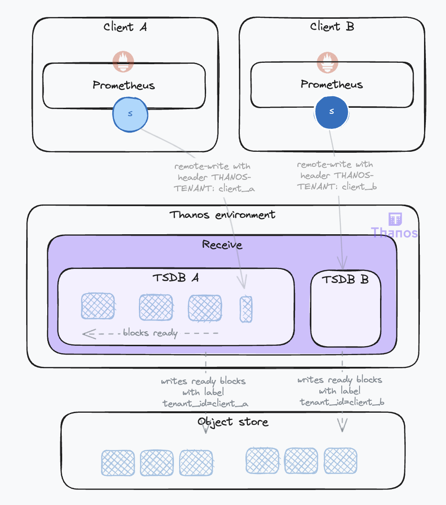
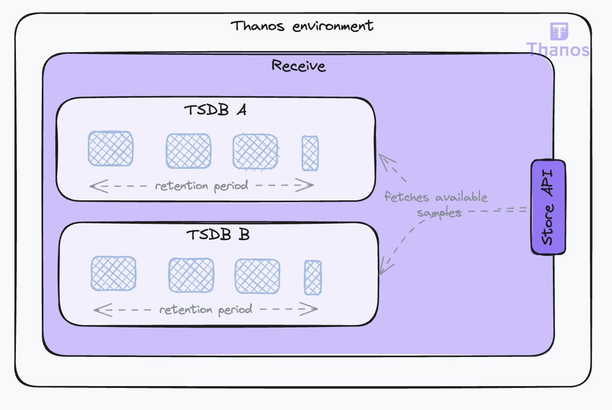
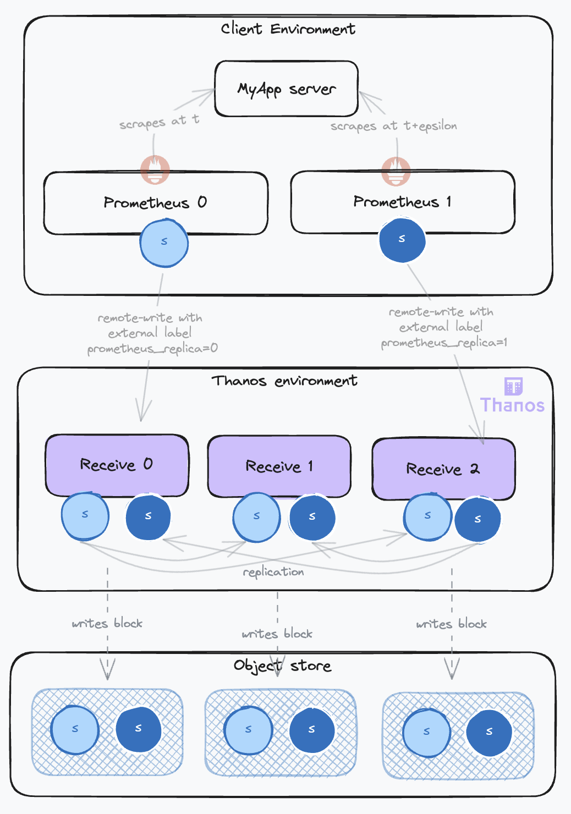
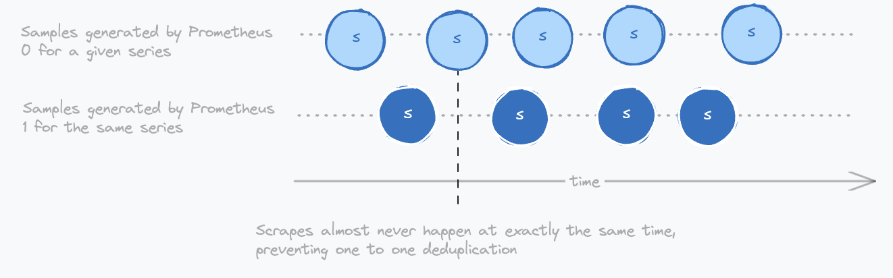
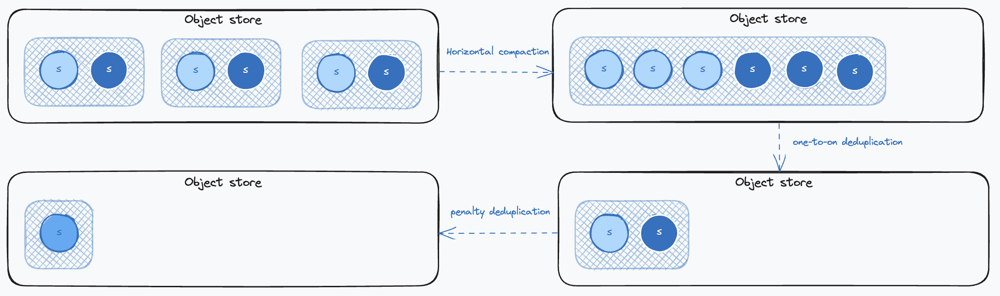
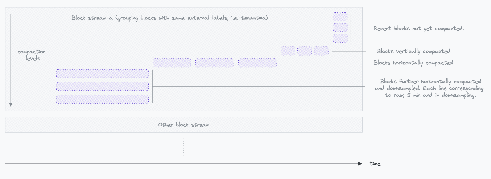

## Life of a Sample in Thanos and How to Configure It – Data Management – Part II

### Introduction

In the [first part](2023-11-20-life-of-a-sample-part-1.md) of this series, we followed the life of a sample from its inception in a Prometheus server to our Thanos Receivers. We will now explore how Thanos manages the data ingested by the Receivers and optimizes it in the object store for reduced cost and fast retrieval.

Let's delve into these topics and more in the second part of the series.

### Preparing Samples for Object Storage: Building Chunks and Blocks

#### Using Object Storage

A key feature of Thanos is its ability to leverage economical object storage solutions like AWS S3 for long-term data retention. This contrasts with Prometheus's typical approach of storing data locally for shorter periods.

The Receive component is responsible for preparing data for object storage. Thanos adopts the TSDB (Time Series Database) data model, with some adaptations, for its object storage. This involves aggregating samples over time to construct TSDB Blocks. Please refer to the annexes of the [first part](2023-11-20-life-of-a-sample-part-1.md) if this vocabulary is not clear to you.

These blocks are built by aggregating data over two-hour periods. Once a block is ready, it is sent to the object storage, which is configured using the `--objstore.config` flag. This configuration is uniform across all components requiring object storage access.

On restarts, the Receive component ensures data preservation by immediately flushing existing data to object storage, even if it does not constitute a full two-hour block. These partial blocks are less efficient but are then optimized by the compactor, as we will see later.

The Receive is also able to [isolate data](https://thanos.io/tip/components/receive.md/#tenant-lifecycle-management) coming from different tenants. The tenant can be identified in the request by different means: a header (`--receive.tenant-header`), a label (`--receive.split-tenant-label-name`) or a certificate (`--receive.tenant-certificate-field`). Their data is ingested into different TSDBs instances (you might hear this referred to as the multiTSDB). The benefits are twofold:

* It allows for parallelization of the block-building process, especially on the compactor side as we will see later.
* It allows for smaller indexes. Indeed, labels tend to be similar for samples coming from the same source, leading to more effective compression.



When a block is ready, it is uploaded to the object store with the block external label defined by the flag `--receive.tenant-label-name`. This corresponds to the `thanos.labels` field of the [block metadata](https://thanos.io/tip/thanos/storage.md/#metadata-file-metajson). This will be used by the compactor to group blocks together, as we will see later.

#### Exposing Local Data for Queries

During the block-building phase, the data is not accessible to the Store Gateway as it has not been uploaded to the object store yet. To counter that, the Receive component also serves as a data store, making the local data available for query through the `Store API`. This is a common gRPC API used across all Thanos components for time series data access, set with the `--grpc-address` flag. The Receive will serve all data is has. The more data it serves, the more resources it will use for this duty in addition to ingesting client data. 



The amount of data the Receive component serves can be managed through two parameters:

* `--tsdb.retention`: Sets the local storage retention duration. The minimum is 2 hours, aligning with block construction periods.
* `--store.limits.request-samples` and `--store.limits.request-series`: These parameters limit the volume of data that can be queried by setting a maximum on the number of samples and/or the number of series. If these limits are exceeded, the query will be denied to ensure system stability.

Key points to consider:

* The primary objective of the Receive component is to ensure **reliable data ingestion**. However, the more data it serves through the Store API, the more resources it will use for this duty in addition to ingesting client data. You should set the retention duration to the minimum required for your use case to optimize resource allocation. The minimum value for 2-hour blocks would be a 4-hour retention to account for availability in the Store Gateway after the block is uploaded to object storage. Bear in mind that the shorter the retention duration, the more risk of data loss in case of failures lasting longer than the retention duration, such as a network partition with the object storage.
* Even when the retention duration is short, your Receive instance could be overwhelmed by a query selecting too much data. You should set limits in place to ensure the stability of the Receive instances. These limits must be carefully set to enable Store API clients to retrieve the data they need while preventing resource exhaustion. The longer the retention, the higher the limits should be as the number of samples and series will increase.

### Maintaining Data: Compaction, Downsampling, and Retention

#### The Need for Compaction

The Receive component implements many strategies to ingest samples reliably. However, this can result in unoptimized data in object storage. This is due to:

* Inefficient partial blocks sent to object storage on shutdowns.
* Duplicated data when replication is set.  Several Receive instances will send the same data to object storage.
* Incomplete blocks (invalid blocks) sent to object storage when the Receive fails in the middle of an upload.

The following diagram illustrates the impact on data expansion in object storage when samples from a given target are ingested from a high-availability Prometheus setup (with 2 instances) and replication is set on the Receive (factor 3):



This leads to a threefold increase in label volume (one for each block) and a sixfold increase in sample volume! This is where the Compactor comes into play.

The Compactor component is responsible for maintaining and optimizing data in object storage. It is a long-running process when configured to wait for new blocks with the `--wait` flag. It also needs access to the object storage using the `--objstore.config` flag.

Under normal operating conditions, the Compactor will check for new blocks every 5 minutes. By default, it will only consider blocks that are older than 30 minutes (configured with the `--consistency-delay` flag) to avoid reading partially uploaded blocks. It will then process these blocks in a structured manner, compacting them according to defined settings that we will discuss in the next sections.

#### Compaction Modes

Compaction consists of merging blocks that have overlapping or adjacent time ranges. This is called **horizontal compaction**. Using the [Metadata file](https://thanos.io/tip/thanos/storage.md/#metadata-file-metajson) which contains the minimum and maximum timestamps of samples in the block, the Compactor can determine if two blocks overlap. If they do, they are merged into a new block. This new block will have its compaction level index increased by one. So from two adjacent blocks of 2 hours each, we will get a new block of 4 hours.

During this compaction, the Compactor will also deduplicate samples. This is called [**vertical compaction**](https://thanos.io/tip/components/compact.md/#vertical-compactions). The Compactor provides two deduplication modes:

* `one-to-one`: This is the default mode. It will deduplicate samples that have the same timestamp and the same value but different replica label values. The replica label is configured by the `--deduplication.replica-label` flag. This flag can be repeated to account for several replication labels. Usually set to `replica`, make sure it is set up as external label on the Receivers with the flag `--label=replica=xxx`. The benefit of this mode is that it is straightforward and will remove replicated data from the Receive. However, it is not able to remove data replicated by high-availability Prometheus setups because these samples will rarely be scraped at exactly the same timestamps, as demonstrated by the diagram below.
* `penalty`: This a more complex deduplication algorithm that is able to deduplicate data coming from high availability prometheus setups. It can be set with the `--deduplication.func` flag and requires also setting the `--deduplication.replica-label` flag that identifies the label that contains the replica label. Usually `prometheus_replica`. 

Here is a diagram illustrating how Prometheus replicas generate samples with different timestamps that cannot be deduplicated with the `one-to-one` mode:



Getting back to our example illustrating the data duplication happening in the object storage, here is how each compaction process will impact the data:



First, horizontal compaction will merge blocks together. This will mostly have an effect on the labels data that are stored in a compressed format in a single index binary file attached to a single block. Then, one-to-one deduplication will remove identical samples and delete the related replica label. Finally, penalty deduplication will remove duplicated samples resulting from concurrent scrapes in high-availability Prometheus setups and remove the related replica label.

You want to deduplicate data as much as possible because it will lower your object storage cost and improve query performance. However, using the penalty mode presents some limitations. For more details, see [the documentation](https://thanos.io/tip/components/compact.md/#vertical-compaction-risks).

Key points to consider:

* You want blocks that are not too big because they will be slow to query. However, you also want to limit the number of blocks because having too many will increase the number of requests to the object storage. Also, the more blocks there are, the less compaction occurs, and the more data there is to store and load into memory.
* You do not need to worry about too small blocks, as the Compactor will merge them together. However, you could have too big blocks. This can happen if you have very high cardinality workloads or churn-heavy workloads like CI runs, build pipelines, serverless functions, or batch jobs, which often lead to huge cardinality explosions as the metrics labels will be changing often.
* The main solution to this is splitting the data into several block streams, as we will see later. This is Thanos's sharding strategy.
* There are also cases where you might want to limit the size of the blocks. To that effect, you can use the following parameters:
  * You can limit the compaction levels with `--debug.max-compaction-level` to prevent the Compactor from creating blocks that are too big. This is especially useful when you have a high metrics churn rate. Level 1 is the default and will create blocks of 2 hours. Level 2 will create blocks of 8 hours, level 3 of 2 days, and up to level 4 of 14 days. Without this limit, the Compactor will create blocks of up to 2 weeks. This is not a magic bullet; it does not limit the data size of the blocks. It just limits the number of blocks that can be merged together. The downside of using this setting is that it will increase the number of blocks in the object storage. They will use more space, and the query performance might be impacted.
  * The flag `compact.block-max-index-size` can be used more effectively to specify the maximum index size beyond which the Compactor will stop block compaction, independently of its compaction level. It has a default value of 64 GB. At this stage, the block is marked for no further compaction.

#### Scaling the Compactor: Block Streams

Not all blocks covering the same time range are compacted together. Instead, the Compactor organizes them into distinct [compaction groups or block streams](https://thanos.io/tip/components/compact.md/#compaction-groups--block-streams). The key here is to leverage external labels to group data originating from the same source. This strategic grouping is particularly effective for compacting indexes, as blocks from the same source tend to have nearly identical labels.

You can improve the performance of the Compactor by:

* Increasing the number of concurrent compactions using the `--max-concurrent` flag. Bear in mind that you must scale storage, memory and CPU resources accordingly (linearly).
* Sharding the data. In this mode, each Compactor will process a disjoint set of block streams. This is done by setting up the `--selector.relabel-config` flag on the external labels. For example:
  
```yaml 
- action: hashmod
  source_labels:
    - tenant_id # An external label that identifies some block streams
  target_label: shard
  modulus: 2 # The number of Compactor replicas
- action: keep
  source_labels:
    - shard
  regex: 0 # The shard number assigned to this Compactor
```

In this configuration, the `hashmod` action is used to distribute blocks across multiple Compactor instances based on the `tenant_id` label. The `modulus` should match the number of Compactor replicas you have. Each replica will then only process the blocks that match its shard number, as defined by the `regex` in the `keep` action. 

#### Downsampling and Retention

The Compactor also optimizes data reads for long-range queries. If you are querying data for several months, you do not need the typical 15-second raw resolution. Processing such a query will be very inefficient, as it will retrieve a lot of unnecessary data that you will not be able to visualize with such detail in your UI. In worst-case scenarios, it may even cause some components of your Thanos setup to fail due to memory exhaustion.

To enable performant long range queries, the Compactor can downsample data using `--retention.resolution-*` flags. It supports two downsampling levels: 5 minutes and 1 hour. These are the resolutions of the downsampled series. They will typically come on top of the raw data, so that you can have both raw and downsampled data. This will enable you to spot abnormal patterns over long-range queries and then zoom into specific parts using the raw data. We will discuss how to configure the query to use the downsampled data in the next article.

When the Compactor performs downsampling, it does more than simply reduce the number of data points by removing intermediate samples. While reducing the volume of data is a primary goal, especially to improve performance for long-range queries, the Compactor ensures that essential statistical properties of the original data are preserved. This is crucial for maintaining the accuracy and integrity of any aggregations or analyses performed on the downsampled data. In addition to the downsampled data, it stores the count, minimum, maximum, and sum of the downsampled window. Functions like sum(), min(), max(), and avg() can then be computed correctly over the downsampled data because the necessary statistical information is preserved. 

This downsampled data is then stored in its own block, one per downsampling level for each corresponding raw block.

Key points to consider:

* Downsampling is not for reducing the volume of data in object storage. It is for improving long-range query performance, making your system more versatile and stable.
* Thanos recommends having the same retention duration for raw and downsampled data. This will enable you to have a consistent view of your data over time.
* As a rule of thumb, you can consider that each downsampled data level increases the storage need by onefold compared to the raw data, although it is often a bit less than that.

#### The Compactor UI and the Block Streams

The Compactor's functionality and the progress of its operations can be monitored through the 
**Block Viewer UI**. This web-based interface is accessible if the Compactor is configured with the `--http-address` flag. Additional UI settings are controlled via `--web.*` and `--block-viewer.*` flags. The Compactor UI provides a visual representation of the compaction process, showing how blocks are grouped and compacted over time. Here is a glimpse of what the UI looks like:



Occasionally, some blocks may display an artificially high compaction level in the UI, appearing lower in the stream compared to adjacent blocks. This scenario often occurs in situations like rolling Receiver upgrades, where Receivers restart sequentially, leading to the creation and upload of partial blocks to the object store. The Compactor then vertically compacts these blocks as they arrive, resulting in a temporary increase in compaction levels. When these blocks are horizontally compacted with adjacent blocks, they will be displayed higher up in the stream.

As explained earlier with compaction levels, by default, the Compactor’s strategy involves compacting 2-hour blocks into 8-hour blocks once they are available, then progressing to 2-day blocks, and up to 14 days, following a structured compaction timeline.

### Exposing Bucket Data for Queries: The Store Gateway and the Store API

#### Exposing Data for Queries

The Store Gateway acts as a facade for the object storage, making bucket data accessible via the Thanos Store API, a feature first introduced with the Receive component. The Store Gateway exposes the Store API with the `--grpc-address` flag.

The Store Gateway requires access to the object storage bucket to retrieve data, which is configured with  the `--objstore.config` flag. You can use the `--max-time` flag to specify which blocks should be considered by the Store Gateway. For example, if your Receive instances are serving data up to 10 hours, you may configure `--max-time=-8h` so that it does not consider blocks more recent than 8 hours. This avoids returning the same data as the Receivers while ensuring some overlap between the two.

To function optimally, the Store Gateway relies on caches. To understand their usefulness, let's first explore how the Store Gateway retrieves data from the blocks in the object storage.

#### Retrieving Samples from the Object Store

Consider the simple following query done on the Querier:

```promql
# Between now and 2 days ago, compute the rate of http requests per second, filtered by method and status
rate(http_requests_total{method="GET", status="200"}[5m])
```

This PromQL query will be parsed by the Querier, which will emit a Thanos [Store API](https://github.com/thanos-io/thanos/blob/main/pkg/store/storepb/rpc.proto) request to the Store Gateway with the following parameters:

```proto
SeriesRequest request = {
  min_time: [Timestamp 2 days ago],
  max_time: [Current Timestamp],
  max_resolution_window: 1h,  // the minimum time range between two samples, relates to the downsampling levels
  matchers: [
    { name: "__name__", value: "http_requests_total", type: EQUAL },
    { name: "method", value: "GET", type: EQUAL },
    { name: "status", value: "200", type: EQUAL }
  ]
}
```

The Store Gateway processes this request in several steps:

* **Metadata processing**: The Store Gateway first examines the block [metadata](https://thanos.io/tip/thanos/storage.md/#metadata-file-metajson) to determine the relevance of each block to the query. It evaluates the time range (`minTime` and `maxTime`) and external labels (`thanos.labels`). Blocks are deemed relevant if their timestamps overlap with the query's time range and if their resolution (`thanos.downsample.resolution`) matches the query's maximum allowed resolution.
* **Index processing**: Next, the Store Gateway retrieves the [indexes](https://thanos.io/tip/thanos/storage.md/#index-format-index) of candidate blocks. This involves:
  * Fetching postings lists for each label specified in the query. These are inverted indexes where each label and value has an associated sorted list of all the corresponding time series IDs. Example:
    * `"__name__=http_requests_total": [1, 2, 3]`,
    * `"method=GET": [1, 2, 6]`,
    * `"status=200": [1, 2, 5]`
  * Intersecting these postings lists to select series matching all query labels. In our example these are series 1 and 2.
  * Retrieving the series section from the index for these series, which includes the chunk files, the time ranges and offset position in the file. Example:
    * Series 1: [Chunk 1: mint=t0, maxt=t1, fileRef=0001, offset=0], ...
  * Determining the relevant chunks based on their time range intersection with the query.
* **Chunks retrieval**: The Store Gateway then fetches the appropriate chunks, either from the object storage directly or from a chunk cache. When retrieving from the object store, the Gateway leverages its API to read only the needed bytes (i.e., using S3 range requests), bypassing the need to download entire chunk files. 

Then, the Gateway streams the selected chunks to the requesting Querier.

#### Optimizing the Store Gateway

Understanding the retrieval algorithm highlights the critical role of an external [index cache](https://thanos.io/tip/components/store.md/#index-cache) in the Store Gateway's operation. This is configured using the `--index-cache.config` flag. Indexes contain all labels and values of the block, which can result in large sizes. When the cache is full, Least Recently Used (LRU) eviction is applied. In scenarios where no external cache is configured, a portion of the memory will be utilized as a cache, managed via the `--index-cache.size` flag.

Moreover, the direct retrieval of chunks from object storage can be suboptimal, and result in excessive costs, especially with a high volume of queries. To mitigate this, employing a [caching bucket](https://thanos.io/tip/components/store.md/#caching-bucket) can significantly reduce the number of queries to the object storage. This is configured using the `--store.caching-bucket.config` flag. This chunk caching strategy is particularly effective when data access patterns are predominantly focused on recent data. By caching these frequently accessed chunks, query performance is enhanced, and the load on object storage is reduced.

Finally, you can implement the same safeguards as the Receive component by setting limits on the number of samples and series that can be queried. This is accomplished using the same `--store.limits.request-samples` and `--store.limits.request-series` flags.

#### Scaling the Store Gateway

The performance of Thanos Store components can be notably improved by managing concurrency and implementing sharding strategies.

Adjusting the level of concurrency can have a significant impact on performance. This is managed through the `--store.grpc.series-max-concurrency` flag, which sets the number of allowed concurrent series requests on the Store API. Other lower-level concurrency settings are also available.

After optimizing the store processing, you can distribute the query load using sharding strategies similar to what was done with the Compactor. Using a relabel configuration, you can assign a disjoint set of blocks to each Store Gateway replica. Here’s an example of how to set up sharding using the `--selector.relabel-config` flag:

```yaml
- action: hashmod
  source_labels:
    - __block_id # A special label that will be mapped to the block ID
  target_label: shard
  modulus: 2 # The number of Store Gateways replicas
- action: keep
  source_labels:
    - shard
  regex: 0 # The shard number assigned to this Store Gateway
```

While being very effective in distributing the load, one potential issue arises from the fact that series are grouped within a block based on their external labels, typically originating from the same data source. In such cases, if the load is predominantly from one source, sharding may be less effective than expected. This is especially true for blocks that have undergone horizontal compaction and cover extensive time ranges, potentially resulting in an uneven query load on a single Store Gateway instance. If you are experiencing such issues, you can adopt more advanced sharding strategies using more complex relabel configurations, such as dedicating scaled-up Store Gateway instances for specific tenants or data sources.

### Conclusion

In this second part, we explored how Thanos manages data for efficient storage and retrieval. We examined how the Receive component prepares samples and exposes local data for queries, and how the Compactor optimizes data through compaction and downsampling. We also discussed how the Store Gateway retrieves data and can be optimized by leveraging indexes and implementing sharding strategies.

Now that our samples are efficiently stored and prepared for queries, we can move on to the final part of this series, where we will explore how this distributed data is retrieved by query components like the Querier.

See the full list of articles in this series (links will be updated as they are published):

* [Life of a sample in thanos, and how to configure it – Ingestion – Part I](2023-11-20-life-of-a-sample-part-1.md)
* [Life of a sample in thanos, and how to configure it – Data Management – Part II](2024-09-16-life-of-a-sample-part-2.md)
* Life of a sample in thanos, and how to configure it – Querying – Part III