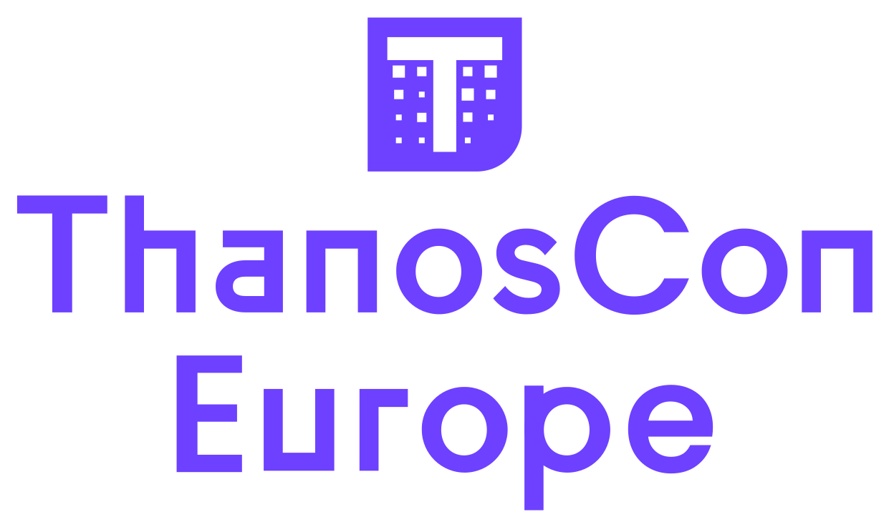

Hello Thanos Community! 👋

Through recent years, the Thanos project has grown tremendously as an open-source scalable monitoring project based on Prometheus. Not only technically as a project, where we are continuously innovating on how to store and query metrics more efficiently, but also as a community with an ever-growing base of users, evident in our Slack channels, Docker pulls and (obviously!) GitHub stars.

On behalf of the maintainers team behind Thanos, we are grateful to see this energy and passion towards building and improving Thanos, solving non-trivial challenges with truly open-source governance. We are regularly excited by the contributions and ideas brought by the community.

To continue and celebrate this energy, we are extremely happy to announce the very first iteration of [ThanosCon](https://events.linuxfoundation.org/kubecon-cloudnativecon-europe/co-located-events/thanoscon/#about), as a KubeCon EU 2024 co-located event (Paris, 19th March)!

ThanosCon will be an event entirely focussed on the Thanos project, where people can learn from experts, network with maintainers and other users/community members and get into the world of open-source, scalable monitoring.

The intention is to curate talks for an enjoyable, high-quality event by and for Thanos users and contributors! We want the audience and community to connect and experience the excitement, love and friendliness of open-source, the values that led us from the beginning of the Thanos journey.

Finally, we want you to learn from people running Thanos in production or building on top of it. We want you to walk away from this event, feeling excited about the future of Thanos and knowing how you can get involved!

You might have heard about the Thanos project in various talks at popular conferences like KubeCon, FOSDEM, PromCon, Prometheus Day or Observability Day. It's finally time for a one-off, dedicated and Thanos-focused event to celebrate, connect and learn!

We are planning a lot of surprises for you. Will there be a SWAG? Will we celebrate a potential Thanos 1.0 release? Will there be initial authors like Fabian Reinartz and Bartłomiej Płotka to learn from? Join us to learn; it will be fun for sure!

## Would you like to speak at ThanosCon? (Deadline: 3rd December)

Do you use Thanos at work? Are you using Thanos to build amazing platforms or products? Did you contribute to or integrate with Thanos? Have you been mentored by Thanos' team and it had a positive impact on your career? Did you encounter any interesting incidents and pitfalls with Thanos?

If at least one of those questions would be answered positively you are a great candidate to speak at ThanosCon. Feel free to fill our [Call for Proposals (CFP) form](https://events.linuxfoundation.org/kubecon-cloudnativecon-europe/co-located-events/thanoscon/#call-for-proposals). **Hurry up, the CFP closes on December 3, 2023. Accepted talks will be announced around January 8th.**

We are looking for awesome talks around:
* How you deploy, run, and scale Thanos on production.
* Benchmarks, resource usage and optimizations to your Thanos setup.
* Thanos' pitfalls you might have encountered.
* Interesting Thanos cases e.g. cost-control, serverless, multi-region, auto-scaling setups.
* Innovative integrations with Thanos e.g. operators, tailored collectors, proxies, storages.
* Thanos contributor experience and tips.

If you can’t decide on the topic or need help in preparing the CFP or talk (title, abstract, notes), contact `thanos-io@googlegroup.io` or reach out to us via the [`#thanos-dev` Slack channel](https://cloud-native.slack.com/archives/CL25937SP), so we can help you brainstorm and prepare the topic!

## Would you like to co-sponsor ThanosCon? (Deadline: 17th January)

Sponsoring ThanosCon is an amazing opportunity to engage with Thanos developers and users, show support and associate your brand with cloud-native, fully open-source scalable observability.

If you are interested take a look at [the sponsor prospectus](https://events.linuxfoundation.org/kubecon-cloudnativecon-europe/co-located-events/thanoscon/#sponsor), **limited slots are available**!

## Summary

We are super excited to connect with the Thanos community on our first ThanosCon. The initial idea came during the recent PromCon in Berlin. Many Thanos developers and users attended that event. After experiencing an unforgettable vibe and love of the PromCon, and an amazing time together, we decided to build a similar experience for the Thanos audience, which might or might not use Prometheus to ingest the data to Thanos.

We cannot wait to hear about all the cool stuff you are doing with Thanos and to celebrate what we achieved together so far. Thanks to CNCF for helping us organize such a co-located event!

**See you at KubeCon!**

**Thanos Team**
