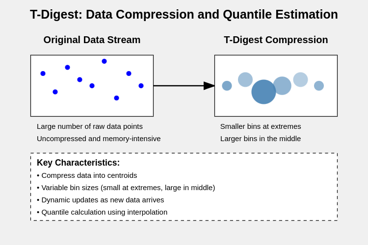
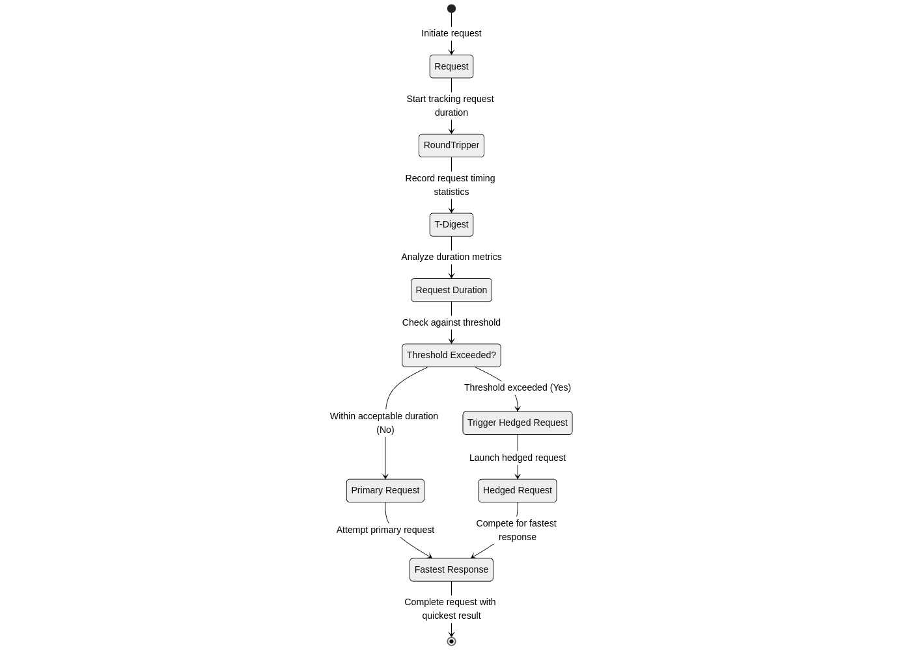

In distributed systems, while most requests are processed swiftly, a few can take unexpectedly long, leading to **long tail latency**. This latency can significantly impact system performance and user experience by causing delays. Factors such as network lag, server overload, or random disruptions contribute to this issue. While maintaining a low average response time is crucial, addressing these slow requests is equally important.

One effective solution is **hedged requests**, which involve sending duplicate requests if the initial one is delayed. This approach increases the likelihood of receiving a prompt response and minimizes the wait caused by slow requests.

In this post, I'll explore how we implemented hedged requests in Thanos, utilizing **T-Digest** to dynamically calculate the hedging threshold, and the positive impact it had on reducing long tail latency.

---

## The Problem: Long Tail Latency in Distributed Systems

In distributed systems like Thanos Store, long tail latency is a common issue. While most queries to object storage or external cache services are completed within an expected timeframe, some requests take significantly longer. These outliers, caused by factors such as:

- **Network jitter**: Random fluctuations in network latency.
- **Server congestion**: Temporary overload of servers.
- **Disk IO delays**: Slower access to data on storage disks.

...can skew the overall performance, pushing latency metrics beyond acceptable limits.

A simple solution like reducing timeouts between the Store Gateway and an external cache isn't effective. Lowering timeouts risks prematurely canceling valid requests, while longer timeouts still leave slow requests unresolved in time.

This is especially problematic between the **Thanos Store Gateway** and an **external cache service**, where long tail requests are often inevitable. To address this, a more proactive approach is needed—one that doesn't rely solely on tweaking timeout settings.

---

## The Solution: Hedged Requests with T-Digest

**Hedged requests** involve sending a duplicate request if the original one takes longer than a specific threshold. While this helps reduce tail latency, setting a static threshold (like 300ms) is not ideal. A fixed value may be too aggressive for some workloads, leading to unnecessary duplicate requests, or too lenient for others, failing to resolve delays effectively. This is where **T-Digest**, a smart and efficient data structure, comes into play.

---

### How T-Digest Works

T-Digest is a data structure specifically designed to estimate quantiles (like the median or 90th percentile) in streaming data. It compresses the dataset into **centroids**—small groups of data points—that approximate the overall distribution. Here’s how it works:

1. **Data Compression with Unequal Bin Sizes**: T-Digest organizes data into bins, but the bins are not of equal size.
    - **Smaller bins** are allocated at the extremes (tails) to improve accuracy for critical outliers.
    - **Larger bins** are placed in the middle, where precision matters less.
2. **Dynamic Updates**: As new data arrives, T-Digest integrates it into the existing centroids. This allows the structure to stay up-to-date with the current distribution of response times.
3. **Quantile Calculation**: To calculate a specific quantile (e.g., the 90th percentile), T-Digest uses interpolation between centroids. This process is quick and effective, even for very large datasets.



For more detailed explaination, check out [Approximate percentiles with t-digests](https://www.gresearch.com/news/approximate-percentiles-with-t-digests/).

---

### Static vs Dynamic Thresholds

* **Static Threshold**:
    A fixed value, such as 300ms, is used to trigger hedged requests. However:
    - It doesn’t adapt to workload changes.
    - It can lead to either premature hedging or delayed recovery.

* **Dynamic Threshold with T-Digest**:
    With T-Digest, thresholds are derived from real-time data. For example:
    - Real-Time Computation: If the 90th percentile of recent latencies is 450ms, T-Digest sets this as the hedging threshold.
    - Adapts to Changes: As workloads evolve, the threshold updates automatically, ensuring relevance and accuracy.

---

## Implementation in Thanos

For implementing the hedged HTTP client, we used the [cristalhq/hedgedhttp](https://github.com/cristalhq/hedgedhttp) library. To manage and compute latency percentiles dynamically, we integrated the [caio/go-tdigest](https://github.com/caio/go-tdigest) library for the T-Digest data structure.

Integrating hedged requests in Thanos involved several steps:

1. **Setting up T-Digest for Latency Tracking**:

    The T-Digest structure was added to record and manage the distribution of request latencies. As each request completes, its duration is added to the T-Digest, ensuring our percentile-based estimations remain accurate and up-to-date.
    
    The logic for determining when to hedge a request was implemented as a `nextFn()` function. This function calculates the delay threshold based on the specified quantile (e.g., 90th percentile) from the T-Digest.

    ```go
    func (hrt *hedgingRoundTripper) nextFn() (int, time.Duration) {
	    hrt.mu.RLock()
        defer hrt.mu.RUnlock()
        delayMs := hrt.TDigest.Quantile(hrt.config.Quantile)
        delay := time.Duration(delayMs) * time.Millisecond
        upto := int(hrt.config.UpTo)
        return upto, delay
    }
    ```
    This allows the client to determine when a hedged request should be triggered if a response is taking longer than expected.
    
2. **Configuring the Hedging RoundTripper**:

    The Thanos store's `http.RoundTripper` was extended to include hedging logic which enabled to issue hedged request if the current one exceeds the computed threshold delay based on the configured percentile.

    Key points in the configuration:
    * The maximum number of hedged requests (UpTo) is configurable to prevent overloading the system.
    * The delay threshold is dynamically derived from the T-Digest, ensuring it adapts to changes in latency patterns.
    * The hedging logic ensures that duplicate requests are sent only when the potential benefit outweighs the additional cost.
    

3. **Dynamic Updates to T-Digest**:

    After each request completes successfully, its duration is fed back into the T-Digest structure. This ensures the quantile calculations are continually refined based on the most recent latency data.

    This dynamic update mechanism helps account for changes in request latency patterns due to varying workloads, network conditions, or backend performance. Over time, it optimizes the hedging behavior, improving overall performance without adding unnecessary overhead.
    



The following pull requests were merged for this implementation:
* [Added roundtripper wrapper as param #150](https://github.com/thanos-io/objstore/pull/150)
* [store: support hedged requests #7860](https://github.com/thanos-io/thanos/pull/7860)

**Cost-Benefit Balance**

Hedging improves response times but adds overhead through extra object storage load and increased bandwidth usage. To manage this, configurable options allow users to:

1. **Set Percentile Thresholds**: Adjust quantiles (e.g., 90th or 99th percentile) to control hedging frequency.
2. **Limit Concurrent Requests**: Use the `UpTo` parameter to cap the number of hedged requests.
3. **Leverage Dynamic Updates**: T-Digest adapts to latency patterns, balancing performance and overhead.
These controls ensure users can fine-tune hedging to suit their performance needs and resource constraints.

---

## Results and Insights

?

---

## Closing Thoughts

Tackling long-tail latency is essential for delivering a consistent and reliable user experience in distributed systems. By combining hedged requests with the adaptability of T-Digest, we developed an efficient solution to mitigate latency spikes. Implementing this in Thanos was a rewarding experience, seamlessly merging theoretical concepts with practical application.