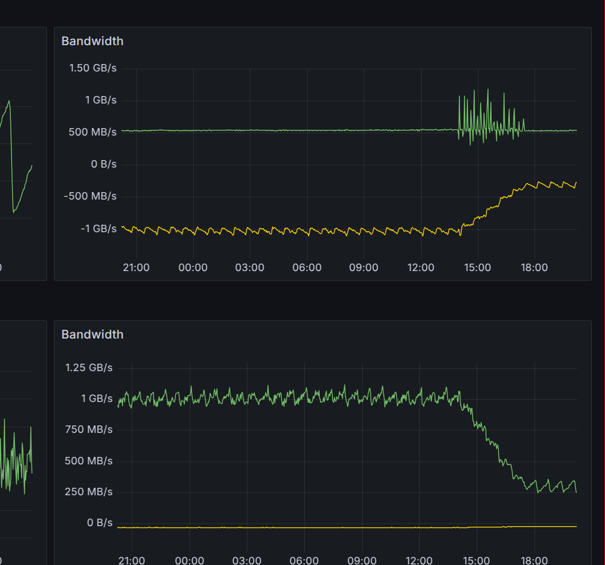

I figured that I would start a series of blog posts that show what everyone has been working recently and share my opinion on where we are headed next.

0.41.0 recently came out and it's not a small release.

The change that stands out the most is batching at the gRPC level. This was implemented for a few reasons:

- Compression happens at the message level and typically labels repeat a lot from one series to another. So, we were losing out a lot on compression. The labels can now be compressed much better. In a lot of cases, Thanos now uses fewer than 50% network throughput compared to previously when using snappy.
- Another thing is that we were allocating a lot of objects when sending series over gRPC. It is not rare to fetch millions of series in response to a user request. The batch size is a constant 64 so we are allocating 64 times fewer series response objects.

Now, this is still not 100% done because Prometheus remote read interface still does a flush after each write. We could implementing batching there too - flush after every 64 series. This would mean higher memory usage for http writes because we would need to buffer more but overall it should increase throughput and reduce query duration just like in our case.

Here is an example deployment showing the effect. The network usage dropped by more than 70%.

Another very exciting thing is that we fixed one very old issue - now it is possible to have compaction enabled with Sidecar and Receiver. The TSDB now exposes a hook that allows delaying compaction until the shipper does its job.

Finally, the last exciting update is stability of shuffle sharding. We now reuse the same algorithm that Cortex has where we step through the ring. This improves the stability of the ring when changes happen. See [8661](https://github.com/thanos-io/thanos/pull/8661) for info.

Sorry for if I missed some other things that are important to you but I am trying to present this from my own point of view.

There's also a lot of interesting work happening on Parquet format support. The work is happening on [thanos-parquet-gateway](https://github.com/thanos-io/thanos-parquet-gateway). It is still in rapid development but a few companies have already adopted it. We are working on ironing out various kinks before introducing it to the main repository. Check out the link to find more information.

Another exciting development is a Go implementation of ALP by our own Filip [tscodec-go](https://github.com/fpetkovski/tscodec-go). Perhaps we should try to implement a new, Thanos specific chunk type that has superior compression ratio and speeds using that library in the Parquet project.

All of these developments are very exciting. Let's see what the next month brings!
