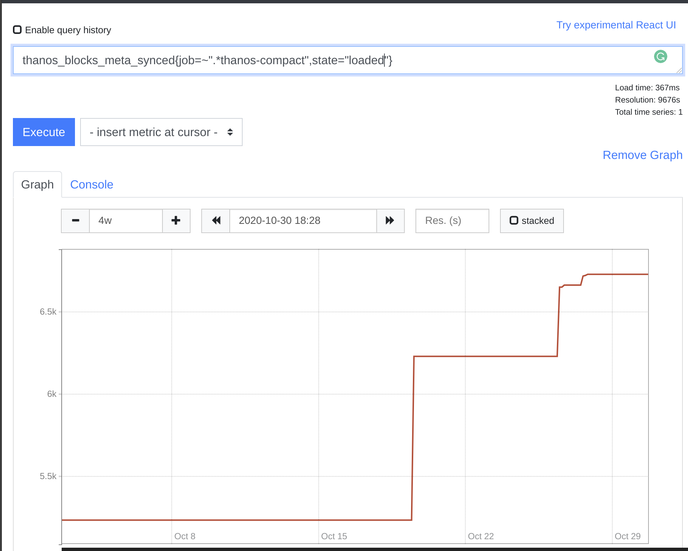

# Compactor

The `thanos compact` command applies the compaction procedure of the Prometheus 2.0 storage engine to block data stored in object storage.
It is generally not semantically concurrency safe and must be deployed as a singleton against a bucket.

Compactor is also responsible for downsampling of data:

* Creating 5m downsampling for blocks larger than **40 hours** (2d, 2w)
* Creating 1h downsampling for blocks larger than **10 days** (2w)

Example:

```bash
thanos compact --data-dir /tmp/thanos-compact --objstore.config-file=bucket.yml
```

Example content of `bucket.yml`:

```yaml
type: GCS
config:
  bucket: example-bucket
```

By default `thanos compact` will run to completion which makes it possible to execute in a cronjob. Using the arguments `--wait` and `--wait-interval=5m` it's possible to keep it running.

**Compactor, Sidecar, Receive and Ruler are the only Thanos component which should have a write access to object storage,
with only Compactor being able to delete data.**

> **NOTE:** High availability for Compactor is generally not required. See [Availability](#availability) section.

## Compaction

The Compactor, among other things, is responsible for compacting multiple blocks into one.

Why even compacting? This is a process, also done in Prometheus, to reduce number of blocks and compact index indices. We can compact
index quite well in most cases, because series usually live longer than the duration of the smallest block, so 2 hours.

### Compaction Groups / Block Streams

Usually those blocks come through the same source. We call blocks from a single source, a "stream" of blocks or compaction group. We distinguish streams by
`external labels`. Blocks with the same labels are considered as produced by a single source.

This is because `external_labels` are added by the Prometheus which produced the block.

⚠ This is why those labels on block must be both _unique_ and _persistent_ across different Prometheus instances. ⚠

* By _unique_, we mean that the set of labels in a Prometheus instance must be different from all other sets of labels of
your Prometheus instances, so that the compactor will be able to group blocks by Prometheus instance.
* By _persistent_, we mean that one Prometheus instance must keep the same labels if it restarts, so that the compactor will keep
compacting blocks from an instance even when a Prometheus instance goes down for some time.

Natively Prometheus does not store external labels anywhere. This is why external labels are added only on upload time to the `ThanosMeta` section
of `meta.json` in each block.

> **NOTE:** In default mode the state of two or more blocks having same external labels and overlapping in time is assumed as an unhealthy situation.
Refer to [Overlap Issue Troubleshooting](../operating/troubleshooting.md#overlaps) for more info. This results in compactor [halting](#halting).

#### Warning: Only one Instance has to run against single stream of blocks in single Object Storage.

:warning: :warning: :warning:

Because there is no safe locking mechanism for all object storage provides, currently, you need to ensure on your own that only
single Compactor is running against single stream of blocks on single bucket. Running more can result with [Overlap Issues](../operating/troubleshooting.md#overlaps)
that has to be resolved manually.

This rule, means also that there could be a problem when both compacted and non compacted blocks are being uploaded by sidecar.
This is why "upload compacted" flag is still under a separate `--shipper.upload-compacted` flag that helps to ensure that compacted blocks
are uploaded before anything else. The singleton rule is also why local Prometheus compaction has to be disabled in order to use sidecar with upload option.
Use hidden `--shipper.ignore-unequal-block-size` to override this check (on your own risk).

> **NOTE:** In further Thanos version it's possible that both restrictions will be removed with production status of [vertical compaction](#vertical-compactions) which is worked on.

You can though run multiple Compactors against single Bucket as long as for separate streams of blocks. You can do it in order to [scale compaction process](#scalability).

### Vertical Compactions

Thanos and Prometheus supports vertical compaction, so process of compacting multiple streams of blocks into one.

In Prometheus, this can be triggered by setting hidden flag in Prometheus and putting additional TSDB blocks within Prometheus
local directory. Extra blocks can overlap with existing ones. When Prometheus detects that situation it performs `vertical compaction`
which compacts overlapping blocks into single one. This is mainly used for **backfilling** purposes.

In Thanos, it works similarly, but on bigger scale and using external labels for grouping as explained in [Compaction section](#compaction).

In both systems, series with the same labels are merged together. Merging samples is **naive**. It works by deduplicating samples within
exactly the same timestamps. Otherwise samples are added in sorted by time order.

> **NOTE:** Both Prometheus and Thanos default behaviour is to fail compaction if any overlapping blocks are spotted. (For Thanos, within the same external labels).

#### Vertical Compaction Use Cases

There can be few valid use cases for vertical compaction:

* Races between multiple compactions, for example multiple compactors or between compactor and Prometheus compactions. While this will have extra
computation overhead for Compactor it's safe to enable vertical compaction for this case.
* Backfilling. If you want to add blocks of data to any stream where there is existing data already there for the time range, you will need enabled vertical compaction.
* Offline deduplication of series. It's very common to have the same data replicated into multiple streams. We can distinguish two common series duplications, `one-to-one` and `realistic`:
  * `one-to-one` duplication is when same series (series with the same labels from different blocks) for the same range have **exactly** the same samples: Same values and timestamps.
This is very common while using [Receivers](../components/receive.md) with replication greater than 1 as receiver replication copies exactly the same timestamps and values to different receive instances.
  * `realistic` duplication is when same series data is **logically duplicated**. For example, it comes from the same application, but scraped by two different Prometheus-es. Ideally
this requires more complex deduplication algorithms. For example one that is used to [deduplicate on the fly on the Querier](query.md#run-time-deduplication-of-ha-groups). This is common
case when Prometheus HA replicas are used. [Offline deduplication for this is in progress](https://github.com/thanos-io/thanos/issues/1014).

#### Vertical Compaction Risks

The main risk is the **irreversible** implications of potential configuration errors:

* If you accidentally upload block with the same external labels but produced by totally different Prometheus for totally different applications, some metrics can overlap
and potentially can merge together making such series useless.
* If you merge disjoint series in multiple of blocks together, there is currently no easy way to split them back.

#### Enabling Vertical Compaction

NOTE: See [risks](#vertical-compaction-risks) section to understand the implications and experimental nature of this feature.

You can enable vertical compaction using a hidden flag `--compact.enable-vertical-compaction`

If you want to "virtually" group blocks differently for deduplication use case, use hidden flag `deduplication.replica-label` to set one or many flags to be ignored during block loading.

For example if you have following set of block streams:

```
external_labels: {cluster="eu1", replica="1", receive="true", environment="production"}
external_labels: {cluster="eu1", replica="2", receive="true", environment="production"}
external_labels: {cluster="us1", replica="1", receive="true", environment="production"}
external_labels: {cluster="us1", replica="1", receive="true", environment="staging"}
```

and set `--deduplication.replica-label="replica"`, compactor will assume those as:

```
external_labels: {cluster="eu1", receive="true", environment="production"} (2 streams, resulted in one)
external_labels: {cluster="us1", receive="true", environment="production"}
external_labels: {cluster="us1", receive="true", environment="staging"}
```

On next compaction multiple streams' blocks will be compacted into one.

## Enforcing Retention of Data

By default, there is NO retention set for object storage data. This means that you store data for unlimited time, which is a valid and recommended way of running Thanos.

You can set retention by different resolutions using `--retention.resolution-raw` `--retention.resolution-5m` and `--retention.resolution-1h` flag. Not setting
them or setting to `0s` means no retention.

**NOTE:** ⚠ ️Retention is applied right after Compaction and Downsampling loops. If those are failing, data will be never deleted.

## Downsampling

Downsampling is a process of rewriting series' to reduce overall resolution of the samples without loosing accuracy over longer time ranges.

To learn more see [video from KubeCon 2019](https://youtu.be/qQN0N14HXPM?t=714)

### TL;DR on how thanos downsampling works

Thanos Compactor takes "raw" resolution block and creates a new one with "downsampled" chunks. Downsampled chunk takes
on storage level form of "AggrChunk":

```proto
message AggrChunk {
    int64 min_time = 1;
    int64 max_time = 2;

    Chunk raw     = 3;
    Chunk count   = 4;
    Chunk sum     = 5;
    Chunk min     = 6;
    Chunk max     = 7;
    Chunk counter = 8;
}
```

This means that for each series we collect various aggregations with given interval: 5m or 1h (depending on resolution)
This allows us to keep precision on large duration queries, without fetching too many samples.

### ⚠ ️Downsampling: Note About Resolution and Retention ⚠️

Resolution is a distance between data points on your graphs. E.g.

* `raw` - the same as scrape interval at the moment of data ingestion
* `5 minutes` - data point is every 5 minutes
* `1 hour` - data point is every 1h

Keep in mind, that the initial goal of downsampling is not saving disk or object storage space. In fact, downsampling doesn't save you __any__ space but instead,
it adds 2 more blocks for each raw block which are only slightly smaller or relatively similar size to raw block. This is done by internal downsampling implementation
which to be mathematically correct holds various aggregations. This means that downsampling can increase the size of your storage a bit (~3x), if you choose to store all resolutions (recommended and by default).

The goal of downsampling is to provide an opportunity to get fast results for range queries of big time intervals like months or years. In other words, if you set `--retention.resolution-raw` less than `--retention.resolution-5m` and `--retention.resolution-1h` - you might run into a problem of not being able to "zoom in" to your historical data.

To avoid confusion - you might want to think about `raw` data as about "zoom in" opportunity. Considering the values for mentioned options - always think "Will I need to zoom in to the day 1 year ago?" if the answer "yes" - you most likely want to keep raw data for as long as 1h and 5m resolution, otherwise you'll be able to see only downsampled representation of how your raw data looked like.

There's also a case when you might want to disable downsampling at all with `--downsampling.disable`. You might want to do it when you know for sure that you are not going to request long ranges of data (obviously, because without downsampling those requests are going to be much much more expensive than with it). A valid example of that case is when you only care about the last couple weeks of your data or use it only for alerting, but if that's your case - you also need to ask yourself if you want to introduce Thanos at all instead of just vanilla Prometheus?

Ideally, you will have equal retention set (or no retention at all) to all resolutions which allow both "zoom in" capabilities as well as performant long ranges queries. Since object storages are usually quite cheap, storage size might not matter that much, unless your goal with thanos is somewhat very specific and you know exactly what you're doing.

Not setting this flag, or setting it to `0d`, i.e. `--retention.resolution-X=0d`, will mean that samples at the `X` resolution level will be kept forever.

Please note that blocks are only deleted after they completely "fall off" of the specified retention policy. In other words, the "max time" of a block needs to be older than the amount of time you had specified.

## Deleting Aborted Partial Uploads

It can happen that any producer started uploading some block, but never finished and never will. Sidecars will retry in case of failures during upload or process (unless there was no persistent storage),
but very common case is with Compactor. If Compactor process crashes during upload of compacted block, whole compaction starts from scratch and new block ID is created. This means that
partial upload will be never retried.

To handle this case there is `--delete-delay=48h` flag that starts deletion of directories inside object storage without `meta.json` only after given time.

This value has to be smaller than upload duration and [consistency delay](#consistency-delay).

## Halting

Because of the very specific nature of Compactor which is writing to object storage, potentially deleting sensitive data, and downloading GBs of data, by default we halt Compactor on certain data failures.
This means that that Compactor does not crash on halt errors, but instead is kept running and does nothing with metric `thanos_compactor_halted` set to 1.

Reason is that we don't want to retry compaction and all the computations if we know that, for example, there is already overlapped state in the object storage for some reason.

Hidden flag `--no-debug.halt-on-error` controls this behavior. If set, on halt error Compactor exits.

## Resources

### CPU

It's recommended to give `--compact.concurrency` amount of CPU cores.

### Memory

Memory usage depends on block sizes in the object storage and compaction concurrency.

Generally, the maximum memory utilization is exactly the same as for Prometheus for compaction process:

* For each source block considered for compaction:
  * 1/32 of all block's symbols
  * 1/32 of all block's posting offsets
* Single series with all labels and all chunks.

You need to multiply this with X where X is `--compaction.concurrency` (by default 1).

**NOTE:** Don't check heap memory only. Prometheus and Thanos compaction leverages `mmap` heavily which is outside of `Go` `runtime` stats.
Refer to process / OS memory used rather. On Linux/MacOS Go will also use as much as available, so utilization will be always near limit.

Generally, for medium-sized bucket limit of 10GB of memory should be enough to keep it working.

### Network

Overall Compactor is the component that might have the heaviest use of network against object storage, so place it near the bucket's zone/location.

It has to download each block needed for compaction / downsampling and it does that on every compaction / downsampling. It then uploads
computed blocks. It also refreshes the state of bucket often.

### Disk

The compactor needs local disk space to store intermediate data for its processing as well as bucket state cache. Generally,
for medium sized bucket about 100GB should be enough to keep working as the compacted time ranges grow over time. However, this highly depends on
size of the blocks. In worst case scenario compactor has to have space adequate to 2 times 2 weeks (if your maximum compaction level is 2 weeks) worth of smaller blocks to
perform compaction. First, to download all of those source blocks, second to build on disk output of 2 week block composed of those smaller ones.

You need to multiply this with X where X is `--compaction.concurrency` (by default 1).

On-disk data is safe to delete between restarts and should be the first attempt to get crash-looping compactors unstuck.
However, it's recommended to give the Compactor persistent disk in order to effectively use bucket state cache between restarts.

## Availability

Compactor, generally, does not need to be highly available. Compactions are needed from time to time, only when new blocks appear.

The only risk is that without compactor running for longer time (weeks) you might see reduced performance of your read path due to amount of small blocks,
lack of downsampled data and retention not enforced

## Scalability

The main and only `Service Level Indicator` for Compactor is how fast it can cope with uploaded TSDB blocks to the bucket.

To understand that you can use mix `thanos_objstore_bucket_last_successful_upload_time` being quite fresh, `thanos_compactor_halted` being non 1
and `thanos_blocks_meta_synced{state="loaded"}` constantly increasing over days.



Generally there two scalability directions:

1. Too many producers/sources (e.g Prometheus-es) are uploading to same object storage. Too many "streams" of work for Compactor.
Compactor has to scale with the number of producers in the bucket.

You should horizontally scale Compactor to cope with this using [label sharding](../sharding.md#compactor). This allows to assign
multiple streams to each instance of compactor.

2. TSDB blocks from single stream is too big, it takes too much time or resources.

This is rare as first you would need to ingest that amount of data into Prometheus and it's usually not recommended to have bigger than 10 millions series
in the 2 hours blocks. However, with 2 weeks blocks, potential [Vertical Compaction](#vertical-compactions) enabled and other producers than Prometheus (e.g backfilling)
this scalability concern can appear as well. See [Limit size of blocks](https://github.com/thanos-io/thanos/issues/3068) ticket to track progress of solution if you are hitting this.

## Eventual Consistency

Depending on the Object Storage provider like S3, GCS, Ceph etc; we can divide the storages into strongly consistent or eventually consistent.
Since there are no consistency guarantees provided by some Object Storage providers, we have to make sure that we have a consistent lock-free way of dealing with Object Storage irrespective of the choice of object storage.

### Consistency Delay

In order to make sure we don't read partially uploaded block (or eventually visible fully in system) we established `--consistency-delay=30m` delay for all components
reading blocks.

This means that blocks are visible / loadable for compactor (and used for retention, compaction planning, etc), only after 30m from block upload start in object storage.

### Block Deletions

In order to achieve co-ordination between compactor and all object storage readers without any race, blocks are not deleted directly. Instead, blocks are marked for deletion by uploading
`deletion-mark.json` file for the block that was chosen to be deleted. This file contains unix time of when the block was marked for deletion.

## Flags

[embedmd]:# (flags/compact.txt $)
```$
usage: thanos compact [<flags>]

Continuously compacts blocks in an object store bucket.

Flags:
      --block-meta-fetch-concurrency=32
                                Number of goroutines to use when fetching block
                                metadata from object storage.
      --block-sync-concurrency=20
                                Number of goroutines to use when syncing block
                                metadata from object storage.
      --block-viewer.global.sync-block-interval=1m
                                Repeat interval for syncing the blocks between
                                local and remote view for /global Block Viewer
                                UI.
      --bucket-web-label=BUCKET-WEB-LABEL
                                Prometheus label to use as timeline title in the
                                bucket web UI
      --compact.cleanup-interval=5m
                                How often we should clean up partially uploaded
                                blocks and blocks with deletion mark in the
                                background when --wait has been enabled. Setting
                                it to "0s" disables it - the cleaning will only
                                happen at the end of an iteration.
      --compact.concurrency=1   Number of goroutines to use when compacting
                                groups.
      --compact.dedup-func=     Experimental. Deduplication algorithm for
                                merging overlapping blocks. Possible values are:
                                "", "penalty". If no value is specified, the
                                default compact deduplication merger is used,
                                which performs 1:1 deduplication for samples.
                                When set to penalty, penalty based deduplication
                                algorithm will be used. At least one replica
                                label has to be set via
                                --deduplication.replica-label flag.
      --consistency-delay=30m   Minimum age of fresh (non-compacted) blocks
                                before they are being processed. Malformed
                                blocks older than the maximum of
                                consistency-delay and 48h0m0s will be removed.
      --data-dir="./data"       Data directory in which to cache blocks and
                                process compactions.
      --delete-delay=48h        Time before a block marked for deletion is
                                deleted from bucket. If delete-delay is non
                                zero, blocks will be marked for deletion and
                                compactor component will delete blocks marked
                                for deletion from the bucket. If delete-delay is
                                0, blocks will be deleted straight away. Note
                                that deleting blocks immediately can cause query
                                failures, if store gateway still has the block
                                loaded, or compactor is ignoring the deletion
                                because it's compacting the block at the same
                                time.
      --downsampling.disable    Disables downsampling. This is not recommended
                                as querying long time ranges without
                                non-downsampled data is not efficient and useful
                                e.g it is not possible to render all samples for
                                a human eye anyway
      --hash-func=              Specify which hash function to use when
                                calculating the hashes of produced files. If no
                                function has been specified, it does not happen.
                                This permits avoiding downloading some files
                                twice albeit at some performance cost. Possible
                                values are: "", "SHA256".
  -h, --help                    Show context-sensitive help (also try
                                --help-long and --help-man).
      --http-address="0.0.0.0:10902"
                                Listen host:port for HTTP endpoints.
      --http-grace-period=2m    Time to wait after an interrupt received for
                                HTTP Server.
      --http.config=""          [EXPERIMENTAL] Path to the configuration file
                                that can enable TLS or authentication for all
                                HTTP endpoints.
      --log.format=logfmt       Log format to use. Possible options: logfmt or
                                json.
      --log.level=info          Log filtering level.
      --objstore.config=<content>
                                Alternative to 'objstore.config-file' flag
                                (mutually exclusive). Content of YAML file that
                                contains object store configuration. See format
                                details:
                                https://thanos.io/tip/thanos/storage.md/#configuration
      --objstore.config-file=<file-path>
                                Path to YAML file that contains object store
                                configuration. See format details:
                                https://thanos.io/tip/thanos/storage.md/#configuration
      --retention.resolution-1h=0d
                                How long to retain samples of resolution 2 (1
                                hour) in bucket. Setting this to 0d will retain
                                samples of this resolution forever
      --retention.resolution-5m=0d
                                How long to retain samples of resolution 1 (5
                                minutes) in bucket. Setting this to 0d will
                                retain samples of this resolution forever
      --retention.resolution-raw=0d
                                How long to retain raw samples in bucket.
                                Setting this to 0d will retain samples of this
                                resolution forever
      --selector.relabel-config=<content>
                                Alternative to 'selector.relabel-config-file'
                                flag (mutually exclusive). Content of YAML file
                                that contains relabeling configuration that
                                allows selecting blocks. It follows native
                                Prometheus relabel-config syntax. See format
                                details:
                                https://prometheus.io/docs/prometheus/latest/configuration/configuration/#relabel_config
      --selector.relabel-config-file=<file-path>
                                Path to YAML file that contains relabeling
                                configuration that allows selecting blocks. It
                                follows native Prometheus relabel-config syntax.
                                See format details:
                                https://prometheus.io/docs/prometheus/latest/configuration/configuration/#relabel_config
      --tracing.config=<content>
                                Alternative to 'tracing.config-file' flag
                                (mutually exclusive). Content of YAML file with
                                tracing configuration. See format details:
                                https://thanos.io/tip/thanos/tracing.md/#configuration
      --tracing.config-file=<file-path>
                                Path to YAML file with tracing configuration.
                                See format details:
                                https://thanos.io/tip/thanos/tracing.md/#configuration
      --version                 Show application version.
  -w, --wait                    Do not exit after all compactions have been
                                processed and wait for new work.
      --wait-interval=5m        Wait interval between consecutive compaction
                                runs and bucket refreshes. Only works when
                                --wait flag specified.
      --web.disable-cors        Whether to disable CORS headers to be set by
                                Thanos. By default Thanos sets CORS headers to
                                be allowed by all.
      --web.external-prefix=""  Static prefix for all HTML links and redirect
                                URLs in the bucket web UI interface. Actual
                                endpoints are still served on / or the
                                web.route-prefix. This allows thanos bucket web
                                UI to be served behind a reverse proxy that
                                strips a URL sub-path.
      --web.prefix-header=""    Name of HTTP request header used for dynamic
                                prefixing of UI links and redirects. This option
                                is ignored if web.external-prefix argument is
                                set. Security risk: enable this option only if a
                                reverse proxy in front of thanos is resetting
                                the header. The
                                --web.prefix-header=X-Forwarded-Prefix option
                                can be useful, for example, if Thanos UI is
                                served via Traefik reverse proxy with
                                PathPrefixStrip option enabled, which sends the
                                stripped prefix value in X-Forwarded-Prefix
                                header. This allows thanos UI to be served on a
                                sub-path.
      --web.route-prefix=""     Prefix for API and UI endpoints. This allows
                                thanos UI to be served on a sub-path. This
                                option is analogous to --web.route-prefix of
                                Prometheus.

```
