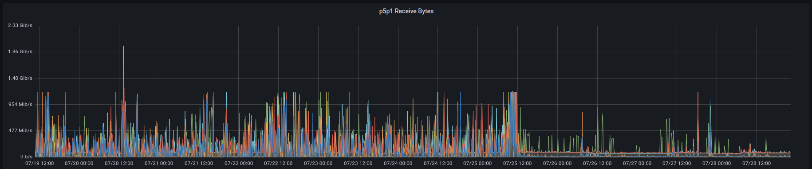
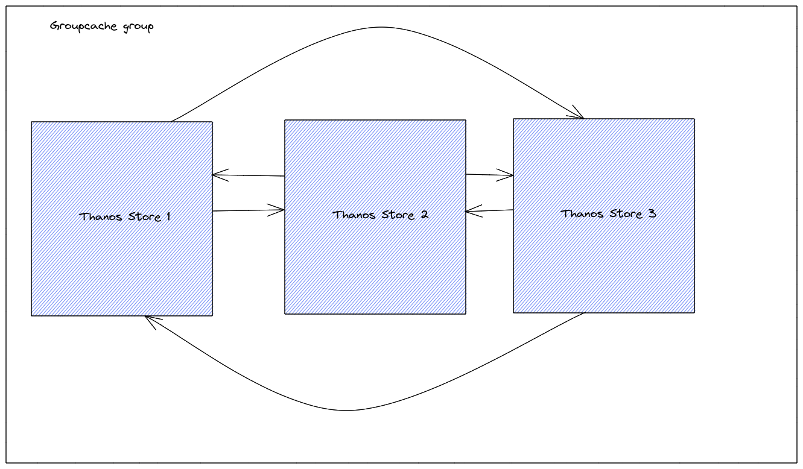

# Store

The `thanos store` command (also known as Store Gateway) implements the Store API on top of historical data in an object storage bucket. It acts primarily as an API gateway and therefore does not need significant amounts of local disk space. It joins a Thanos cluster on startup and advertises the data it can access. It keeps a small amount of information about all remote blocks on local disk and keeps it in sync with the bucket. This data is generally safe to delete across restarts at the cost of increased startup times.

```bash
thanos store \
    --data-dir        "/local/state/data/dir" \
    --objstore.config-file "bucket.yml"
```

The content of `bucket.yml`:

```yaml mdox-exec="go run scripts/cfggen/main.go --name=gcs.Config"
type: GCS
config:
  bucket: ""
  service_account: ""
  use_grpc: false
  grpc_conn_pool_size: 0
  http_config:
    idle_conn_timeout: 1m30s
    response_header_timeout: 2m
    insecure_skip_verify: false
    tls_handshake_timeout: 10s
    expect_continue_timeout: 1s
    max_idle_conns: 100
    max_idle_conns_per_host: 100
    max_conns_per_host: 0
    tls_config:
      ca_file: ""
      cert_file: ""
      key_file: ""
      server_name: ""
      insecure_skip_verify: false
    disable_compression: false
  chunk_size_bytes: 0
  max_retries: 0
prefix: ""
```

In general, an average of 6 MB of local disk space is required per TSDB block stored in the object storage bucket, but for high cardinality blocks with large label set it can even go up to 30MB and more. It is for the pre-computed index, which includes symbols and postings offsets as well as metadata JSON.

## Flags

```$ mdox-exec="thanos store --help"
usage: thanos store [<flags>]

Store node giving access to blocks in a bucket provider. Now supported GCS, S3,
Azure, Swift, Tencent COS and Aliyun OSS.


Flags:
  -h, --[no-]help                Show context-sensitive help (also try
                                 --help-long and --help-man).
      --[no-]version             Show application version.
      --log.level=info           Log filtering level.
      --log.format=logfmt        Log format to use. Possible options: logfmt,
                                 json or journald.
      --tracing.config-file=<file-path>
                                 Path to YAML file with tracing
                                 configuration. See format details:
                                 https://thanos.io/tip/thanos/tracing.md/#configuration
      --tracing.config=<content>
                                 Alternative to 'tracing.config-file' flag
                                 (mutually exclusive). Content of YAML file
                                 with tracing configuration. See format details:
                                 https://thanos.io/tip/thanos/tracing.md/#configuration
      --[no-]enable-auto-gomemlimit
                                 Enable go runtime to automatically limit memory
                                 consumption.
      --auto-gomemlimit.ratio=0.9
                                 The ratio of reserved GOMEMLIMIT memory to the
                                 detected maximum container or system memory.
      --http-address="0.0.0.0:10902"
                                 Listen host:port for HTTP endpoints.
      --http-grace-period=2m     Time to wait after an interrupt received for
                                 HTTP Server.
      --http.config=""           [EXPERIMENTAL] Path to the configuration file
                                 that can enable TLS or authentication for all
                                 HTTP endpoints.
      --grpc-address="0.0.0.0:10901"
                                 Listen ip:port address for gRPC endpoints
                                 (StoreAPI). Make sure this address is routable
                                 from other components.
      --grpc-server-tls-cert=""  TLS Certificate for gRPC server, leave blank to
                                 disable TLS
      --grpc-server-tls-key=""   TLS Key for the gRPC server, leave blank to
                                 disable TLS
      --grpc-server-tls-client-ca=""
                                 TLS CA to verify clients against. If no
                                 client CA is specified, there is no client
                                 verification on server side. (tls.NoClientCert)
      --grpc-server-tls-min-version="1.3"
                                 TLS supported minimum version for gRPC server.
                                 If no version is specified, it'll default to
                                 1.3. Allowed values: ["1.0", "1.1", "1.2",
                                 "1.3"]
      --grpc-server-max-connection-age=60m
                                 The grpc server max connection age. This
                                 controls how often to re-establish connections
                                 and redo TLS handshakes.
      --grpc-grace-period=2m     Time to wait after an interrupt received for
                                 GRPC Server.
      --store.limits.request-series=0
                                 The maximum series allowed for a single Series
                                 request. The Series call fails if this limit is
                                 exceeded. 0 means no limit.
      --store.limits.request-samples=0
                                 The maximum samples allowed for a single
                                 Series request, The Series call fails if
                                 this limit is exceeded. 0 means no limit.
                                 NOTE: For efficiency the limit is internally
                                 implemented as 'chunks limit' considering each
                                 chunk contains a maximum of 120 samples.
      --data-dir="./data"        Local data directory used for caching
                                 purposes (index-header, in-mem cache items and
                                 meta.jsons). If removed, no data will be lost,
                                 just store will have to rebuild the cache.
                                 NOTE: Putting raw blocks here will not
                                 cause the store to read them. For such use
                                 cases use Prometheus + sidecar. Ignored if
                                 --no-cache-index-header option is specified.
      --[no-]cache-index-header  Cache TSDB index-headers on disk to reduce
                                 startup time. When set to true, Thanos Store
                                 will download index headers from remote object
                                 storage on startup and create a header file on
                                 disk. Use --data-dir to set the directory in
                                 which index headers will be downloaded.
      --index-cache-size=250MB   Maximum size of items held in the in-memory
                                 index cache. Ignored if --index-cache.config or
                                 --index-cache.config-file option is specified.
      --index-cache.config-file=<file-path>
                                 Path to YAML file that contains index
                                 cache configuration. See format details:
                                 https://thanos.io/tip/components/store.md/#index-cache
      --index-cache.config=<content>
                                 Alternative to 'index-cache.config-file'
                                 flag (mutually exclusive). Content of
                                 YAML file that contains index cache
                                 configuration. See format details:
                                 https://thanos.io/tip/components/store.md/#index-cache
      --chunk-pool-size=2GB      Maximum size of concurrently allocatable
                                 bytes reserved strictly to reuse for chunks in
                                 memory.
      --store.grpc.touched-series-limit=0
                                 DEPRECATED: use store.limits.request-series.
      --store.grpc.series-sample-limit=0
                                 DEPRECATED: use store.limits.request-samples.
      --store.grpc.downloaded-bytes-limit=0
                                 Maximum amount of downloaded (either
                                 fetched or touched) bytes in a single
                                 Series/LabelNames/LabelValues call. The Series
                                 call fails if this limit is exceeded. 0 means
                                 no limit.
      --store.grpc.series-max-concurrency=20
                                 Maximum number of concurrent Series calls.
      --objstore.config-file=<file-path>
                                 Path to YAML file that contains object
                                 store configuration. See format details:
                                 https://thanos.io/tip/thanos/storage.md/#configuration
      --objstore.config=<content>
                                 Alternative to 'objstore.config-file'
                                 flag (mutually exclusive). Content of
                                 YAML file that contains object store
                                 configuration. See format details:
                                 https://thanos.io/tip/thanos/storage.md/#configuration
      --objstore-parquet.config-file=<file-path>
                                 Path to YAML file that
                                 contains object store-parquet
                                 configuration. See format details:
                                 https://thanos.io/tip/thanos/storage.md/#configuration
      --objstore-parquet.config=<content>
                                 Alternative to 'objstore-parquet.config-file'
                                 flag (mutually exclusive). Content of YAML
                                 file that contains object store-parquet
                                 configuration. See format details:
                                 https://thanos.io/tip/thanos/storage.md/#configuration
      --sync-block-duration=15m  Repeat interval for syncing the blocks between
                                 local and remote view.
      --block-discovery-strategy="concurrent"
                                 One of concurrent, recursive. When set to
                                 concurrent, stores will concurrently issue
                                 one call per directory to discover active
                                 blocks in the bucket. The recursive strategy
                                 iterates through all objects in the bucket,
                                 recursively traversing into each directory.
                                 This avoids N+1 calls at the expense of having
                                 slower bucket iterations.
      --block-sync-concurrency=20
                                 Number of goroutines to use when constructing
                                 index-cache.json blocks from object storage.
                                 Must be equal or greater than 1.
      --block-meta-fetch-concurrency=32
                                 Number of goroutines to use when fetching block
                                 metadata from object storage.
      --min-time=0000-01-01T00:00:00Z
                                 Start of time range limit to serve. Thanos
                                 Store will serve only metrics, which happened
                                 later than this value. Option can be a constant
                                 time in RFC3339 format or time duration
                                 relative to current time, such as -1d or 2h45m.
                                 Valid duration units are ms, s, m, h, d, w, y.
      --max-time=9999-12-31T23:59:59Z
                                 End of time range limit to serve. Thanos Store
                                 will serve only blocks, which happened earlier
                                 than this value. Option can be a constant time
                                 in RFC3339 format or time duration relative
                                 to current time, such as -1d or 2h45m. Valid
                                 duration units are ms, s, m, h, d, w, y.
      --selector.relabel-config-file=<file-path>
                                 Path to YAML file with relabeling
                                 configuration that allows selecting blocks
                                 to act on based on their external labels.
                                 It follows thanos sharding relabel-config
                                 syntax. For format details see:
                                 https://thanos.io/tip/thanos/sharding.md/#relabelling
      --selector.relabel-config=<content>
                                 Alternative to 'selector.relabel-config-file'
                                 flag (mutually exclusive). Content of YAML
                                 file with relabeling configuration that allows
                                 selecting blocks to act on based on their
                                 external labels. It follows thanos sharding
                                 relabel-config syntax. For format details see:
                                 https://thanos.io/tip/thanos/sharding.md/#relabelling
      --consistency-delay=0s     Minimum age of all blocks before they are
                                 being read. Set it to safe value (e.g 30m) if
                                 your object storage is eventually consistent.
                                 GCS and S3 are (roughly) strongly consistent.
      --ignore-deletion-marks-delay=24h
                                 Duration after which the blocks marked for
                                 deletion will be filtered out while fetching
                                 blocks. The idea of ignore-deletion-marks-delay
                                 is to ignore blocks that are marked for
                                 deletion with some delay. This ensures store
                                 can still serve blocks that are meant to be
                                 deleted but do not have a replacement yet.
                                 If delete-delay duration is provided to
                                 compactor or bucket verify component,
                                 it will upload deletion-mark.json file to
                                 mark after what duration the block should
                                 be deleted rather than deleting the block
                                 straight away. If delete-delay is non-zero
                                 for compactor or bucket verify component,
                                 ignore-deletion-marks-delay should be set
                                 to (delete-delay)/2 so that blocks marked
                                 for deletion are filtered out while fetching
                                 blocks before being deleted from bucket.
                                 Default is 24h, half of the default value for
                                 --delete-delay on compactor.
      --[no-]store.enable-index-header-lazy-reader
                                 If true, Store Gateway will lazy memory map
                                 index-header only once the block is required by
                                 a query.
      --[no-]store.enable-lazy-expanded-postings
                                 If true, Store Gateway will estimate postings
                                 size and try to lazily expand postings if
                                 it downloads less data than expanding all
                                 postings.
      --store.posting-group-max-key-series-ratio=100
                                 Mark posting group as lazy if it fetches more
                                 keys than R * max series the query should
                                 fetch. With R set to 100, a posting group which
                                 fetches 100K keys will be marked as lazy if
                                 the current query only fetches 1000 series.
                                 thanos_bucket_store_lazy_expanded_posting_groups_total
                                 shows lazy expanded postings groups with
                                 reasons and you can tune this config
                                 accordingly. This config is only valid if lazy
                                 expanded posting is enabled. 0 disables the
                                 limit.
      --store.index-header-lazy-download-strategy=eager
                                 Strategy of how to download index headers
                                 lazily. Supported values: eager, lazy.
                                 If eager, always download index header during
                                 initial load. If lazy, download index header
                                 during query time.
      --[no-]web.disable         Disable Block Viewer UI.
      --web.external-prefix=""   Static prefix for all HTML links and redirect
                                 URLs in the bucket web UI interface.
                                 Actual endpoints are still served on / or the
                                 web.route-prefix. This allows thanos bucket
                                 web UI to be served behind a reverse proxy that
                                 strips a URL sub-path.
      --web.prefix-header=""     Name of HTTP request header used for dynamic
                                 prefixing of UI links and redirects.
                                 This option is ignored if web.external-prefix
                                 argument is set. Security risk: enable
                                 this option only if a reverse proxy in
                                 front of thanos is resetting the header.
                                 The --web.prefix-header=X-Forwarded-Prefix
                                 option can be useful, for example, if Thanos
                                 UI is served via Traefik reverse proxy with
                                 PathPrefixStrip option enabled, which sends the
                                 stripped prefix value in X-Forwarded-Prefix
                                 header. This allows thanos UI to be served on a
                                 sub-path.
      --[no-]web.disable-cors    Whether to disable CORS headers to be set by
                                 Thanos. By default Thanos sets CORS headers to
                                 be allowed by all.
      --bucket-web-label=BUCKET-WEB-LABEL
                                 External block label to use as group title in
                                 the bucket web UI
      --matcher-cache-size=0     Max number of cached matchers items. Using 0
                                 disables caching.
      --[no-]disable-admin-operations
                                 Disable UI/API admin operations like marking
                                 blocks for deletion and no compaction.
      --request.logging-config-file=<file-path>
                                 Path to YAML file with request logging
                                 configuration. See format details:
                                 https://thanos.io/tip/thanos/logging.md/#configuration
      --request.logging-config=<content>
                                 Alternative to 'request.logging-config-file'
                                 flag (mutually exclusive). Content
                                 of YAML file with request logging
                                 configuration. See format details:
                                 https://thanos.io/tip/thanos/logging.md/#configuration

```

## Time based partitioning

By default Thanos Store Gateway looks at all the data in Object Store and returns it based on query's time range.

Thanos Store `--min-time`, `--max-time` flags allows you to shard Thanos Store based on constant time or time duration relative to current time.

For example setting: `--min-time=-6w` & `--max-time=-2w` will make Thanos Store Gateway return metrics that fall within `now - 6 weeks` up to `now - 2 weeks` time range.

Constant time needs to be set in RFC3339 format. For example `--min-time=2018-01-01T00:00:00Z`, `--max-time=2019-01-01T23:59:59Z`.

Thanos Store Gateway might not get new blocks immediately, as Time partitioning is partly done in asynchronous block synchronization job, which is by default done every 3 minutes. Additionally some of the Object Store implementations provide eventual read-after-write consistency, which means that Thanos Store might not immediately get newly created & uploaded blocks anyway.

We recommend having overlapping time ranges with Thanos Sidecar and other Thanos Store gateways as this will improve your resiliency to failures.

Thanos Querier deals with overlapping time series by merging them together.

Filtering is done on a [Chunk](../design.md#chunk) level, so Thanos Store might still return Samples which are outside of `--min-time` & `--max-time`.

### External Label Partitioning (Sharding)

Check more [here](../sharding.md).

## Probes

- Thanos Store exposes two endpoints for probing.
  - `/-/healthy` starts as soon as initial setup is completed.
  - `/-/ready` starts after all the bootstrapping completed (e.g initial index building) and ready to serve traffic.

> NOTE: Metric endpoint starts immediately so, make sure you set up readiness probe on designated HTTP `/-/ready` path.

## Index cache

Thanos Store Gateway supports an index cache to speed up postings and series lookups from TSDB blocks indexes. Three types of caches are supported:

- `in-memory` (*default*)
- `memcached`
- `redis`

### In-memory index cache

The `in-memory` index cache is enabled by default and its max size can be configured through the flag `--index-cache-size`.

Alternatively, the `in-memory` index cache can also be configured using `--index-cache.config-file` to reference the configuration file or `--index-cache.config` to put yaml config directly:

```yaml mdox-exec="go run scripts/cfggen/main.go --name=storecache.InMemoryIndexCacheConfig"
type: IN-MEMORY
config:
  max_size: 0
  max_item_size: 0
enabled_items: []
ttl: 0s
```

All the settings are **optional**:

- `max_size`: overall maximum number of bytes cache can contain. The value should be specified with a bytes unit (ie. `250MB`).
- `max_item_size`: maximum size of single item, in bytes. The value should be specified with a bytes unit (ie. `125MB`).
- `enabled_items`: selectively choose what types of items to cache. Supported values are `Postings`, `Series` and `ExpandedPostings`. By default, all items are cached.
- `ttl`: this field doesn't do anything for inmemory cache.

### Memcached index cache

The `memcached` index cache allows to use [Memcached](https://memcached.org) as cache backend. This cache type is configured using `--index-cache.config-file` to reference the configuration file or `--index-cache.config` to put yaml config directly:

```yaml mdox-exec="go run scripts/cfggen/main.go --name=cacheutil.MemcachedClientConfig"
type: MEMCACHED
config:
  addresses: []
  timeout: 0s
  max_idle_connections: 0
  max_async_concurrency: 0
  max_async_buffer_size: 0
  max_get_multi_concurrency: 0
  max_item_size: 0
  max_get_multi_batch_size: 0
  dns_provider_update_interval: 0s
  auto_discovery: false
  set_async_circuit_breaker_config:
    enabled: false
    half_open_max_requests: 0
    open_duration: 0s
    min_requests: 0
    consecutive_failures: 0
    failure_percent: 0
enabled_items: []
ttl: 0s
```

The **required** settings are:

- `addresses`: list of memcached addresses, that will get resolved with the [DNS service discovery](../service-discovery.md#dns-service-discovery) provider. If your cluster supports auto-discovery, you should use the flag `auto_discovery` instead and only point to *one of* the memcached servers. This typically means that there should be only one address specified that resolves to any of the alive memcached servers. Use this for Amazon ElastiCache and other similar services.

**NOTE**: The Memcached client uses a jump hash algorithm to shard cached entries across a cluster of Memcached servers. For this reason, you should make sure memcached servers are not behind any kind of load balancer and their address is configured so that servers are added/removed to the end of the list whenever a scale up/down occurs. For example, if you’re running Memcached in Kubernetes, you may:

1. Deploy your Memcached cluster using a [StatefulSet](https://kubernetes.io/docs/concepts/workloads/controllers/statefulset/)
2. Create a [headless](https://kubernetes.io/docs/concepts/services-networking/service/#headless-services) service for Memcached StatefulSet
3. Configure the Thanos's memcached `addresses` using the `dnssrvnoa+` [DNS service discovery](../service-discovery.md#dns-service-discovery)

While the remaining settings are **optional**:

- `timeout`: the socket read/write timeout.
- `max_idle_connections`: maximum number of idle connections that will be maintained per address.
- `max_async_concurrency`: maximum number of concurrent asynchronous operations can occur.
- `max_async_buffer_size`: maximum number of enqueued asynchronous operations allowed.
- `max_get_multi_concurrency`: maximum number of concurrent connections when fetching keys. If set to `0`, the concurrency is unlimited.
- `max_get_multi_batch_size`: maximum number of keys a single underlying operation should fetch. If more keys are specified, internally keys are split into multiple batches and fetched concurrently, honoring `max_get_multi_concurrency`. If set to `0`, the batch size is unlimited.
- `max_item_size`: maximum size of an item to be stored in memcached. This option should be set to the same value of memcached `-I` flag (defaults to 1MB) in order to avoid wasting network round trips to store items larger than the max item size allowed in memcached. If set to `0`, the item size is unlimited.
- `dns_provider_update_interval`: the DNS discovery update interval.
- `auto_discovery`: whether to use the auto-discovery mechanism for memcached.
- `set_async_circuit_breaker_config`: the configuration for the circuit breaker for asynchronous set operations.
  - `enabled`: `true` to enable circuite breaker for asynchronous operations. The circuit breaker consists of three states: closed, half-open, and open. It begins in the closed state. When the total requests exceed `min_requests`, and either consecutive failures occur or the failure percentage is excessively high according to the configured values, the circuit breaker transitions to the open state. This results in the rejection of all asynchronous operations. After `open_duration`, the circuit breaker transitions to the half-open state, where it allows `half_open_max_requests` asynchronous operations to be processed in order to test if the conditions have improved. If they have not, the state transitions back to open; if they have, it transitions to the closed state. Following each 10 seconds interval in the closed state, the circuit breaker resets its metrics and repeats this cycle.
  - `half_open_max_requests`: maximum number of requests allowed to pass through when the circuit breaker is half-open. If set to 0, the circuit breaker allows only 1 request.
  - `open_duration`: the period of the open state after which the state of the circuit breaker becomes half-open. If set to 0, the circuit breaker utilizes the default value of 60 seconds.
  - `min_requests`: minimal requests to trigger the circuit breaker, 0 signifies no requirements.
  - `consecutive_failures`: consecutive failures based on `min_requests` to determine if the circuit breaker should open.
  - `failure_percent`: the failure percentage, which is based on `min_requests`, to determine if the circuit breaker should open.
- `enabled_items`: selectively choose what types of items to cache. Supported values are `Postings`, `Series` and `ExpandedPostings`. By default, all items are cached.
- `ttl`: ttl to store index cache items in memcached.

### Redis index cache

The `redis` index cache allows to use [Redis](https://redis.io) as cache backend. This cache type is configured using `--index-cache.config-file` to reference the configuration file or `--index-cache.config` to put yaml config directly:

```yaml mdox-exec="go run scripts/cfggen/main.go --name=cacheutil.RedisClientConfig"
type: REDIS
config:
  addr: ""
  username: ""
  password: ""
  db: 0
  dial_timeout: 5s
  read_timeout: 3s
  write_timeout: 3s
  max_get_multi_concurrency: 100
  get_multi_batch_size: 100
  max_set_multi_concurrency: 100
  set_multi_batch_size: 100
  tls_enabled: false
  tls_config:
    ca_file: ""
    cert_file: ""
    key_file: ""
    server_name: ""
    insecure_skip_verify: false
  cache_size: 0
  master_name: ""
  max_async_buffer_size: 10000
  max_async_concurrency: 20
  set_async_circuit_breaker_config:
    enabled: false
    half_open_max_requests: 10
    open_duration: 5s
    min_requests: 50
    consecutive_failures: 5
    failure_percent: 0.05
enabled_items: []
ttl: 0s
```

The **required** settings are:

- `addr`: redis server address.

While the remaining settings are **optional**:

- `username`: the username to connect to redis, only redis 6.0 and grater need this field.
- `password`: the password to connect to redis.
- `db`: the database to be selected after connecting to the server.
- `dial_timeout`: the redis dial timeout.
- `read_timeout`: the redis read timeout.
- `write_timeout`: the redis write timeout.
- `cache_size` size of the in-memory cache used for client-side caching. Client-side caching is enabled when this value is not zero. See [official documentation](https://redis.io/docs/latest/develop/reference/client-side-caching/) for more. It is highly recommended to enable this so that Thanos Store would not need to continuously retrieve data from Redis for repeated requests of the same key(-s).
- `enabled_items`: selectively choose what types of items to cache. Supported values are `Postings`, `Series` and `ExpandedPostings`. By default, all items are cached.
- `ttl`: ttl to store index cache items in redis.

Here is an example of what effect client-side caching could have:



- `max_get_multi_concurrency`: specifies the maximum number of concurrent GetMulti() operations.
- `get_multi_batch_size`: specifies the maximum size per batch for mget.
- `max_set_multi_concurrency`: specifies the maximum number of concurrent SetMulti() operations.
- `set_multi_batch_size`: specifies the maximum size per batch for pipeline set.
- `tls_enabled`: enables the use of TLS to connect to redis
- `tls_config`: TLS connection configuration:
  - `ca_file`: path to Root CA certificate file to use
  - `cert_file`: path to Client Certificate file to use
  - `key_file`: path to the Key file for cert_file (NOTE: Both this and `cert_file` must be set if used)
  - `servername`: Override the server name used to validate the server certificate
  - `insecure_skip_verify`: Disable certificate verification

## Caching Bucket

Thanos Store Gateway supports a "caching bucket" with [chunks](../design.md#chunk) and metadata caching to speed up loading of [chunks](../design.md#chunk) from TSDB blocks. To configure caching, one needs to use `--store.caching-bucket.config=<yaml content>` or `--store.caching-bucket.config-file=<file.yaml>`.

memcached/in-memory/redis cache "backend"s are supported:

```yaml
type: MEMCACHED # Case-insensitive
config:
  addresses: []
  timeout: 500ms
  max_idle_connections: 100
  max_async_concurrency: 20
  max_async_buffer_size: 10000
  max_item_size: 1MiB
  max_get_multi_concurrency: 100
  max_get_multi_batch_size: 0
  dns_provider_update_interval: 10s
chunk_subrange_size: 16000
max_chunks_get_range_requests: 3
chunk_object_attrs_ttl: 24h
chunk_subrange_ttl: 24h
blocks_iter_ttl: 5m
metafile_exists_ttl: 2h
metafile_doesnt_exist_ttl: 15m
metafile_content_ttl: 24h
metafile_max_size: 1MiB
```

- `config` field for memcached supports all the same configuration as memcached for [index cache](#memcached-index-cache). `addresses` in the config field is a **required** setting
- `config` field for redis supports all the same configuration as redis for [index cache](#redis-index-cache).

Additional options to configure various aspects of [chunks](../design.md#chunk) cache are available:

- `chunk_subrange_size`: size of segment of [chunks](../design.md#chunk) object that is stored to the cache. This is the smallest unit that chunks cache is working with.
- `max_chunks_get_range_requests`: how many "get range" sub-requests may cache perform to fetch missing subranges.
- `chunk_object_attrs_ttl`: how long to keep information about [chunk file](../design.md#chunk-file) attributes (e.g. size) in the cache.
- `chunk_subrange_ttl`: how long to keep individual subranges in the cache.

Following options are used for metadata caching (meta.json files, deletion mark files, iteration result):

- `blocks_iter_ttl`: how long to cache result of iterating blocks.
- `metafile_exists_ttl`: how long to cache information about whether meta.json or deletion mark file exists.
- `metafile_doesnt_exist_ttl`: how long to cache information about whether meta.json or deletion mark file doesn't exist.
- `metafile_content_ttl`: how long to cache content of meta.json and deletion mark files.
- `metafile_max_size`: maximum size of cached meta.json and deletion mark file. Larger files are not cached.

The yml structure for setting the in memory cache configs for caching bucket is the same as the [in-memory index cache](#in-memory-index-cache) and all the options to configure Caching Bucket mentioned above can be used.

In addition to the same cache backends memcached/in-memory/redis, caching bucket supports another type of backend.

### *EXPERIMENTAL* Groupcache Caching Bucket Provider

Groupcache is an experimental cache backend for the caching bucket introduced from version `v0.25` of Thanos.

With groupcache, you do not need any external components for the caching layer because the caching layer becomes shared between all of the processes of Thanos Store. Another benefit that it provides is that it is a cache filling library meaning that given enough space in memory, the values will only be loaded once. For example, if the same metric is used in multiple concurrent queries then with groupcache Thanos Store would only load the metric's data from remote object storage once.

All in all, it should be a superior caching solution to all other currently supported solutions. It just needs some battle-testing. So, help is needed with testing in real life scenarios! Please create an issue if you've found any problem. 🤗

Here is how it looks like:



Note that with groupcache enabled, new routes are registered on the HTTP server with the prefix `/_groupcache`. Using those routes, anyone can access any kind of data in the configured remote object storage. So, if you are exposing your Thanos Store to the Internet then it is highly recommended to use a reverse proxy in front and disable access to `/_groupcache/...`.

Currently TLS *is* supported but on the client's side no verification is done of the received certificate. This will be added in the future. HTTP2 over cleartext is also enabled to improve the performance for users that don't use TLS.

Example configuration that you could provide to the caching bucket configuration flags with the explanation of each configuration key:

```yaml
type: GROUPCACHE
config:
  self_url: http://10.123.22.3:8080
  peers:
    - http://10.123.22.3:8080
    - http://10.123.22.10:8080
    - http://10.123.22.100:8080
  groupcache_group: test_group
  dns_interval: 1s
  timeout: 2s
```

In this case, three Thanos Store nodes are running in the same group meaning that they all point to the same remote object storage.

- `self_url` - our own URL. On each node this will be different. This should be the external IP through which other nodes could access us;
- `groupcache_group` - the groupcache group's name. All nodes using the same remote object storage configuration should use the same name. It is used in the HTTP requests. If it is different then nodes will not be able to load data from each other.
- `dns_internal` - how often DNS lookups should be made.

In the `peers` section it is possible to use the prefix form to automatically look up the peers using DNS. For example, you could use `dns+http://store.thanos.consul.svc:8080` to automatically look up healthy nodes from Consul using its DNS interface.

Note that there must be no trailing slash in the `peers` configuration i.e. one of the strings must be identical to `self_url` and others should have the same form. Without this, loading data from peers may fail.

If timeout is set to zero then there is no timeout for fetching and fetching's lifetime is equal to the lifetime to the original request's lifetime. It is recommended to keep it higher than zero. It is generally preferred to keep this value higher because the fetching operation potentially includes loading of data from remote object storage.

## Hedged Requests

Thanos Store Gateway supports `hedged requests` to enhance performance and reliability, particularly in high-latency environments. This feature addresses `long-tail latency issues` that can occur between the Thanos Store Gateway and an external cache, reducing the impact of slower response times on overall performance.

The configuration options for hedged requests allow for tuning based on latency tolerance and cost considerations, as some providers may charge per request.

In the `bucket.yml` file, you can specify the following fields under `hedging_config`:

- `enabled`: bool to enable hedged requests.
- `up_to`: maximum number of hedged requests allowed for each initial request.
  - **Purpose**: controls the redundancy level of hedged requests to improve response times.
  - **Cost vs. Benefit**: increasing up_to can reduce latency but may increase costs, as some providers charge per request. Higher values provide diminishing returns on latency beyond a certain level.
- `quantile`: latency threshold, specified as a quantile (e.g., percentile), which determines when additional hedged requests should be sent.
  - **Purpose**: controls when hedged requests are triggered based on response time distribution.
  - **Cost vs. Benefit**: lower quantile (e.g., 0.7) initiates hedged requests sooner, potentially raising costs while lowering latency variance. A higher quantile (e.g., 0.95) will initiate hedged requests later, reducing cost by limiting redundancy.

By default, `hedging_config` is set as follows:

```yaml
hedging_config:
  enabled: false
  up_to: 3
  quantile: 0.9
```

This configuration sends up to three additional requests if the initial request response time exceeds the 90th percentile.

## Index Header

In order to query series inside blocks from object storage, Store Gateway has to know certain initial info from each block index. In order to achieve so, on startup the Gateway builds an `index-header` for each block and stores it on local disk; such `index-header` is build by downloading specific pieces of original block's index, stored on local disk and then mmaped and used by Store Gateway.

For more information, please refer to the [Binary index-header](../operating/binary-index-header.md) operational guide.
