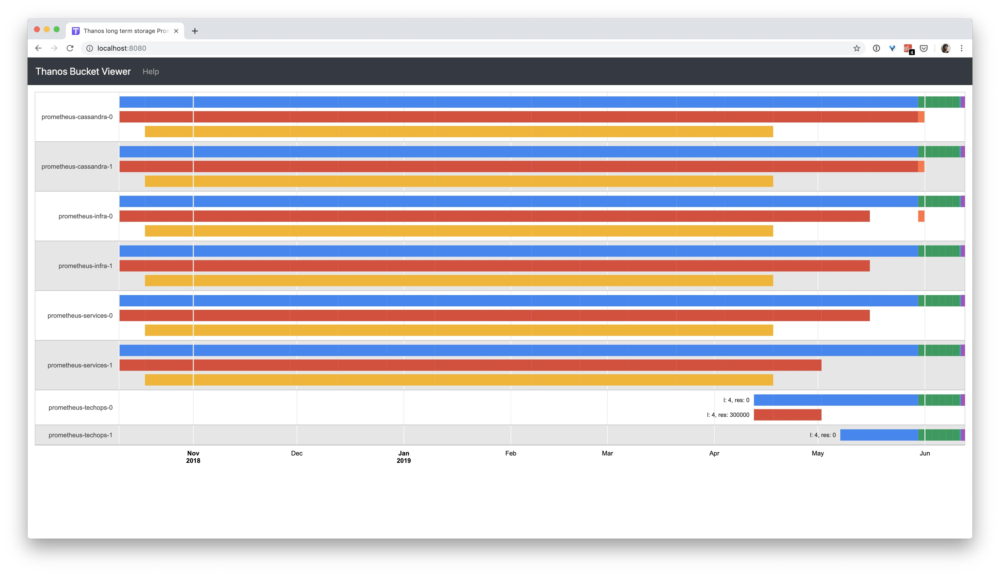

# Tools

The `thanos tools` subcommand of Thanos is a set of additional CLI, short-living tools that are meant to be ran for development or debugging purposes.

All commands added as tools should land in `tools.go` or file with `tools_` prefix.

## Flags

```$ mdox-exec="thanos tools --help"
usage: thanos tools <command> [<args> ...]

Tools utility commands

Flags:
  -h, --help               Show context-sensitive help (also try --help-long and
                           --help-man).
      --log.format=logfmt  Log format to use. Possible options: logfmt or json.
      --log.level=info     Log filtering level.
      --tracing.config=<content>
                           Alternative to 'tracing.config-file' flag
                           (mutually exclusive). Content of YAML file
                           with tracing configuration. See format details:
                           https://thanos.io/tip/thanos/tracing.md/#configuration
      --tracing.config-file=<file-path>
                           Path to YAML file with tracing
                           configuration. See format details:
                           https://thanos.io/tip/thanos/tracing.md/#configuration
      --version            Show application version.

Subcommands:
  tools bucket verify [<flags>]
    Verify all blocks in the bucket against specified issues. NOTE: Depending on
    issue this might take time and will need downloading all specified blocks to
    disk.

  tools bucket ls [<flags>]
    List all blocks in the bucket.

  tools bucket inspect [<flags>]
    Inspect all blocks in the bucket in detailed, table-like way.

  tools bucket web [<flags>]
    Web interface for remote storage bucket.

  tools bucket replicate [<flags>]
    Replicate data from one object storage to another. NOTE: Currently it works
    only with Thanos blocks (meta.json has to have Thanos metadata).

  tools bucket downsample [<flags>]
    Continuously downsamples blocks in an object store bucket.

  tools bucket cleanup [<flags>]
    Cleans up all blocks marked for deletion.

  tools bucket mark --id=ID --marker=MARKER [<flags>]
    Mark block for deletion or no-compact in a safe way. NOTE: If the compactor
    is currently running compacting same block, this operation would be
    potentially a noop.

  tools bucket rewrite --id=ID [<flags>]
    Rewrite chosen blocks in the bucket, while deleting or modifying
    series Resulted block has modified stats in meta.json. Additionally
    compaction.sources are altered to not confuse readers of meta.json.
    Instead thanos.rewrite section is added with useful info like old sources
    and deletion requests. NOTE: It's recommended to turn off compactor while
    doing this operation. If the compactor is running and touching exactly same
    block that is being rewritten, the resulted rewritten block might only cause
    overlap (mitigated by marking overlapping block manually for deletion) and
    the data you wanted to rewrite could already part of bigger block.

    Use FILESYSTEM type of bucket to rewrite block on disk (suitable for vanilla
    Prometheus) After rewrite, it's caller responsibility to delete or mark
    source block for deletion to avoid overlaps. WARNING: This procedure is
    *IRREVERSIBLE* after certain time (delete delay), so do backup your blocks
    first.

  tools bucket retention [<flags>]
    Retention applies retention policies on the given bucket. Please make sure
    no compactor is running on the same bucket at the same time.

  tools rules-check --rules=RULES
    Check if the rule files are valid or not.


```

## Bucket

The `thanos tools bucket` subcommand of Thanos is a set of commands to inspect data in object storage buckets. It is normally run as a standalone command to aid with troubleshooting.

Example:

```bash
thanos tools bucket verify --objstore.config-file=bucket.yml
```

The content of `bucket.yml`:

```yaml mdox-exec="go run scripts/cfggen/main.go --name=gcs.Config"
type: GCS
config:
  bucket: ""
  service_account: ""
prefix: ""
```

Bucket can be extended to add more subcommands that will be helpful when working with object storage buckets by adding a new command within [`/cmd/thanos/tools_bucket.go`](../../cmd/thanos/tools_bucket.go)  .

```$ mdox-exec="thanos tools bucket --help"
usage: thanos tools bucket [<flags>] <command> [<args> ...]

Bucket utility commands

Flags:
  -h, --help               Show context-sensitive help (also try --help-long and
                           --help-man).
      --log.format=logfmt  Log format to use. Possible options: logfmt or json.
      --log.level=info     Log filtering level.
      --objstore.config=<content>
                           Alternative to 'objstore.config-file' flag (mutually
                           exclusive). Content of YAML file that contains
                           object store configuration. See format details:
                           https://thanos.io/tip/thanos/storage.md/#configuration
      --objstore.config-file=<file-path>
                           Path to YAML file that contains object
                           store configuration. See format details:
                           https://thanos.io/tip/thanos/storage.md/#configuration
      --tracing.config=<content>
                           Alternative to 'tracing.config-file' flag
                           (mutually exclusive). Content of YAML file
                           with tracing configuration. See format details:
                           https://thanos.io/tip/thanos/tracing.md/#configuration
      --tracing.config-file=<file-path>
                           Path to YAML file with tracing
                           configuration. See format details:
                           https://thanos.io/tip/thanos/tracing.md/#configuration
      --version            Show application version.

Subcommands:
  tools bucket verify [<flags>]
    Verify all blocks in the bucket against specified issues. NOTE: Depending on
    issue this might take time and will need downloading all specified blocks to
    disk.

  tools bucket ls [<flags>]
    List all blocks in the bucket.

  tools bucket inspect [<flags>]
    Inspect all blocks in the bucket in detailed, table-like way.

  tools bucket web [<flags>]
    Web interface for remote storage bucket.

  tools bucket replicate [<flags>]
    Replicate data from one object storage to another. NOTE: Currently it works
    only with Thanos blocks (meta.json has to have Thanos metadata).

  tools bucket downsample [<flags>]
    Continuously downsamples blocks in an object store bucket.

  tools bucket cleanup [<flags>]
    Cleans up all blocks marked for deletion.

  tools bucket mark --id=ID --marker=MARKER [<flags>]
    Mark block for deletion or no-compact in a safe way. NOTE: If the compactor
    is currently running compacting same block, this operation would be
    potentially a noop.

  tools bucket rewrite --id=ID [<flags>]
    Rewrite chosen blocks in the bucket, while deleting or modifying
    series Resulted block has modified stats in meta.json. Additionally
    compaction.sources are altered to not confuse readers of meta.json.
    Instead thanos.rewrite section is added with useful info like old sources
    and deletion requests. NOTE: It's recommended to turn off compactor while
    doing this operation. If the compactor is running and touching exactly same
    block that is being rewritten, the resulted rewritten block might only cause
    overlap (mitigated by marking overlapping block manually for deletion) and
    the data you wanted to rewrite could already part of bigger block.

    Use FILESYSTEM type of bucket to rewrite block on disk (suitable for vanilla
    Prometheus) After rewrite, it's caller responsibility to delete or mark
    source block for deletion to avoid overlaps. WARNING: This procedure is
    *IRREVERSIBLE* after certain time (delete delay), so do backup your blocks
    first.

  tools bucket retention [<flags>]
    Retention applies retention policies on the given bucket. Please make sure
    no compactor is running on the same bucket at the same time.


```

### Bucket Web

`tools bucket web` is used to inspect bucket blocks in form of interactive web UI.

This will start local webserver that will periodically update the view with given refresh.



Example:

```
thanos tools bucket web --objstore.config-file="..."
```

```$ mdox-exec="thanos tools bucket web --help"
usage: thanos tools bucket web [<flags>]

Web interface for remote storage bucket.

Flags:
      --disable-admin-operations
                                Disable UI/API admin operations like marking
                                blocks for deletion and no compaction.
  -h, --help                    Show context-sensitive help (also try
                                --help-long and --help-man).
      --http-address="0.0.0.0:10902"
                                Listen host:port for HTTP endpoints.
      --http-grace-period=2m    Time to wait after an interrupt received for
                                HTTP Server.
      --http.config=""          [EXPERIMENTAL] Path to the configuration file
                                that can enable TLS or authentication for all
                                HTTP endpoints.
      --label=LABEL             External block label to use as group title
      --log.format=logfmt       Log format to use. Possible options: logfmt or
                                json.
      --log.level=info          Log filtering level.
      --max-time=9999-12-31T23:59:59Z
                                End of time range limit to serve. Thanos
                                tool bucket web will serve only blocks,
                                which happened earlier than this value. Option
                                can be a constant time in RFC3339 format or time
                                duration relative to current time, such as -1d
                                or 2h45m. Valid duration units are ms, s, m, h,
                                d, w, y.
      --min-time=0000-01-01T00:00:00Z
                                Start of time range limit to serve. Thanos
                                tool bucket web will serve only blocks, which
                                happened later than this value. Option can be a
                                constant time in RFC3339 format or time duration
                                relative to current time, such as -1d or 2h45m.
                                Valid duration units are ms, s, m, h, d, w, y.
      --objstore.config=<content>
                                Alternative to 'objstore.config-file'
                                flag (mutually exclusive). Content of
                                YAML file that contains object store
                                configuration. See format details:
                                https://thanos.io/tip/thanos/storage.md/#configuration
      --objstore.config-file=<file-path>
                                Path to YAML file that contains object
                                store configuration. See format details:
                                https://thanos.io/tip/thanos/storage.md/#configuration
      --refresh=30m             Refresh interval to download metadata from
                                remote storage
      --selector.relabel-config=<content>
                                Alternative to 'selector.relabel-config-file'
                                flag (mutually exclusive). Content of
                                YAML file that contains relabeling
                                configuration that allows selecting
                                blocks. It follows native Prometheus
                                relabel-config syntax. See format details:
                                https://prometheus.io/docs/prometheus/latest/configuration/configuration/#relabel_config
      --selector.relabel-config-file=<file-path>
                                Path to YAML file that contains relabeling
                                configuration that allows selecting
                                blocks. It follows native Prometheus
                                relabel-config syntax. See format details:
                                https://prometheus.io/docs/prometheus/latest/configuration/configuration/#relabel_config
      --timeout=5m              Timeout to download metadata from remote storage
      --tracing.config=<content>
                                Alternative to 'tracing.config-file' flag
                                (mutually exclusive). Content of YAML file
                                with tracing configuration. See format details:
                                https://thanos.io/tip/thanos/tracing.md/#configuration
      --tracing.config-file=<file-path>
                                Path to YAML file with tracing
                                configuration. See format details:
                                https://thanos.io/tip/thanos/tracing.md/#configuration
      --version                 Show application version.
      --web.disable-cors        Whether to disable CORS headers to be set by
                                Thanos. By default Thanos sets CORS headers to
                                be allowed by all.
      --web.external-prefix=""  Static prefix for all HTML links and redirect
                                URLs in the bucket web UI interface.
                                Actual endpoints are still served on / or the
                                web.route-prefix. This allows thanos bucket
                                web UI to be served behind a reverse proxy that
                                strips a URL sub-path.
      --web.prefix-header=""    Name of HTTP request header used for dynamic
                                prefixing of UI links and redirects.
                                This option is ignored if web.external-prefix
                                argument is set. Security risk: enable
                                this option only if a reverse proxy in
                                front of thanos is resetting the header.
                                The --web.prefix-header=X-Forwarded-Prefix
                                option can be useful, for example, if Thanos
                                UI is served via Traefik reverse proxy with
                                PathPrefixStrip option enabled, which sends the
                                stripped prefix value in X-Forwarded-Prefix
                                header. This allows thanos UI to be served on a
                                sub-path.
      --web.route-prefix=""     Prefix for API and UI endpoints. This allows
                                thanos UI to be served on a sub-path.
                                Defaults to the value of --web.external-prefix.
                                This option is analogous to --web.route-prefix
                                of Prometheus.

```

### Bucket Verify

`tools bucket verify` is used to verify and optionally repair blocks within the specified bucket.

Example:

```
thanos tools bucket verify --objstore.config-file="..."
```

When using the `--repair` option, make sure that the compactor job is disabled first.

```$ mdox-exec="thanos tools bucket verify --help"
usage: thanos tools bucket verify [<flags>]

Verify all blocks in the bucket against specified issues. NOTE: Depending on
issue this might take time and will need downloading all specified blocks to
disk.

Flags:
      --delete-delay=0s    Duration after which blocks marked for deletion
                           would be deleted permanently from source bucket by
                           compactor component. If delete-delay is non zero,
                           blocks will be marked for deletion and compactor
                           component is required to delete blocks from source
                           bucket. If delete-delay is 0, blocks will be deleted
                           straight away. Use this if you want to get rid of
                           or move the block immediately. Note that deleting
                           blocks immediately can cause query failures, if store
                           gateway still has the block loaded, or compactor is
                           ignoring the deletion because it's compacting the
                           block at the same time.
  -h, --help               Show context-sensitive help (also try --help-long and
                           --help-man).
      --id=ID ...          Block IDs to verify (and optionally repair) only.
                           If none is specified, all blocks will be verified.
                           Repeated field
  -i, --issues=index_known_issues... ...
                           Issues to verify (and optionally repair). Possible
                           issue to verify, without repair: [overlapped_blocks];
                           Possible issue to verify and repair:
                           [index_known_issues duplicated_compaction]
      --log.format=logfmt  Log format to use. Possible options: logfmt or json.
      --log.level=info     Log filtering level.
      --objstore-backup.config=<content>
                           Alternative to 'objstore-backup.config-file'
                           flag (mutually exclusive). Content of YAML
                           file that contains object store-backup
                           configuration. See format details:
                           https://thanos.io/tip/thanos/storage.md/#configuration
                           Used for repair logic to backup blocks before
                           removal.
      --objstore-backup.config-file=<file-path>
                           Path to YAML file that contains object
                           store-backup configuration. See format details:
                           https://thanos.io/tip/thanos/storage.md/#configuration
                           Used for repair logic to backup blocks before
                           removal.
      --objstore.config=<content>
                           Alternative to 'objstore.config-file' flag (mutually
                           exclusive). Content of YAML file that contains
                           object store configuration. See format details:
                           https://thanos.io/tip/thanos/storage.md/#configuration
      --objstore.config-file=<file-path>
                           Path to YAML file that contains object
                           store configuration. See format details:
                           https://thanos.io/tip/thanos/storage.md/#configuration
  -r, --repair             Attempt to repair blocks for which issues were
                           detected
      --tracing.config=<content>
                           Alternative to 'tracing.config-file' flag
                           (mutually exclusive). Content of YAML file
                           with tracing configuration. See format details:
                           https://thanos.io/tip/thanos/tracing.md/#configuration
      --tracing.config-file=<file-path>
                           Path to YAML file with tracing
                           configuration. See format details:
                           https://thanos.io/tip/thanos/tracing.md/#configuration
      --version            Show application version.

```

### Bucket ls

`tools bucket ls` is used to list all blocks in the specified bucket.

Example:

```
thanos tools bucket ls -o json --objstore.config-file="..."
```

```$ mdox-exec="thanos tools bucket ls --help"
usage: thanos tools bucket ls [<flags>]

List all blocks in the bucket.

Flags:
      --exclude-delete     Exclude blocks marked for deletion.
  -h, --help               Show context-sensitive help (also try --help-long and
                           --help-man).
      --log.format=logfmt  Log format to use. Possible options: logfmt or json.
      --log.level=info     Log filtering level.
      --objstore.config=<content>
                           Alternative to 'objstore.config-file' flag (mutually
                           exclusive). Content of YAML file that contains
                           object store configuration. See format details:
                           https://thanos.io/tip/thanos/storage.md/#configuration
      --objstore.config-file=<file-path>
                           Path to YAML file that contains object
                           store configuration. See format details:
                           https://thanos.io/tip/thanos/storage.md/#configuration
  -o, --output=""          Optional format in which to print each block's
                           information. Options are 'json', 'wide' or a custom
                           template.
      --tracing.config=<content>
                           Alternative to 'tracing.config-file' flag
                           (mutually exclusive). Content of YAML file
                           with tracing configuration. See format details:
                           https://thanos.io/tip/thanos/tracing.md/#configuration
      --tracing.config-file=<file-path>
                           Path to YAML file with tracing
                           configuration. See format details:
                           https://thanos.io/tip/thanos/tracing.md/#configuration
      --version            Show application version.

```

### Bucket inspect

`tools bucket inspect` is used to inspect buckets in a detailed way using stdout in ASCII table format.

Example:

```
thanos tools bucket inspect -l environment=\"prod\" --objstore.config-file="..."
```

```$ mdox-exec="thanos tools bucket inspect --help"
usage: thanos tools bucket inspect [<flags>]

Inspect all blocks in the bucket in detailed, table-like way.

Flags:
  -h, --help                 Show context-sensitive help (also try --help-long
                             and --help-man).
      --log.format=logfmt    Log format to use. Possible options: logfmt or
                             json.
      --log.level=info       Log filtering level.
      --objstore.config=<content>
                             Alternative to 'objstore.config-file'
                             flag (mutually exclusive). Content of
                             YAML file that contains object store
                             configuration. See format details:
                             https://thanos.io/tip/thanos/storage.md/#configuration
      --objstore.config-file=<file-path>
                             Path to YAML file that contains object
                             store configuration. See format details:
                             https://thanos.io/tip/thanos/storage.md/#configuration
      --output=table         Output format for result. Currently supports table,
                             cvs, tsv.
  -l, --selector=<name>=\"<value>\" ...
                             Selects blocks based on label, e.g. '-l
                             key1=\"value1\" -l key2=\"value2\"'. All key value
                             pairs must match.
      --sort-by=FROM... ...  Sort by columns. It's also possible to sort by
                             multiple columns, e.g. '--sort-by FROM --sort-by
                             UNTIL'. I.e., if the 'FROM' value is equal the rows
                             are then further sorted by the 'UNTIL' value.
      --timeout=5m           Timeout to download metadata from remote storage
      --tracing.config=<content>
                             Alternative to 'tracing.config-file' flag
                             (mutually exclusive). Content of YAML file
                             with tracing configuration. See format details:
                             https://thanos.io/tip/thanos/tracing.md/#configuration
      --tracing.config-file=<file-path>
                             Path to YAML file with tracing
                             configuration. See format details:
                             https://thanos.io/tip/thanos/tracing.md/#configuration
      --version              Show application version.

```

### Bucket replicate

`bucket tools replicate` is used to replicate buckets from one object storage to another.

NOTE: Currently it works only with Thanos blocks (meta.json has to have Thanos metadata).

Example:

```
thanos tools bucket replicate --objstore.config-file="..." --objstore-to.config="..."
```

```$ mdox-exec="thanos tools bucket replicate --help"
usage: thanos tools bucket replicate [<flags>]

Replicate data from one object storage to another. NOTE: Currently it works only
with Thanos blocks (meta.json has to have Thanos metadata).

Flags:
      --compaction=COMPACTION ...
                              Only blocks with these compaction levels
                              will be replicated. Repeated flag. Overrides
                              compaction-min and compaction-max if set.
      --compaction-max=4      Only blocks up to a maximum of this compaction
                              level will be replicated.
      --compaction-min=1      Only blocks with at least this compaction level
                              will be replicated.
  -h, --help                  Show context-sensitive help (also try --help-long
                              and --help-man).
      --http-address="0.0.0.0:10902"
                              Listen host:port for HTTP endpoints.
      --http-grace-period=2m  Time to wait after an interrupt received for HTTP
                              Server.
      --http.config=""        [EXPERIMENTAL] Path to the configuration file
                              that can enable TLS or authentication for all HTTP
                              endpoints.
      --id=ID ...             Block to be replicated to the destination bucket.
                              IDs will be used to match blocks and other
                              matchers will be ignored. When specified, this
                              command will be run only once after successful
                              replication. Repeated field
      --ignore-marked-for-deletion
                              Do not replicate blocks that have deletion mark.
      --log.format=logfmt     Log format to use. Possible options: logfmt or
                              json.
      --log.level=info        Log filtering level.
      --matcher=MATCHER       blocks whose external labels match this matcher
                              will be replicated. All Prometheus matchers are
                              supported, including =, !=, =~ and !~.
      --max-time=9999-12-31T23:59:59Z
                              End of time range limit to replicate. Thanos
                              Replicate will replicate only metrics, which
                              happened earlier than this value. Option can be a
                              constant time in RFC3339 format or time duration
                              relative to current time, such as -1d or 2h45m.
                              Valid duration units are ms, s, m, h, d, w, y.
      --min-time=0000-01-01T00:00:00Z
                              Start of time range limit to replicate. Thanos
                              Replicate will replicate only metrics, which
                              happened later than this value. Option can be a
                              constant time in RFC3339 format or time duration
                              relative to current time, such as -1d or 2h45m.
                              Valid duration units are ms, s, m, h, d, w, y.
      --objstore-to.config=<content>
                              Alternative to 'objstore-to.config-file'
                              flag (mutually exclusive). Content of
                              YAML file that contains object store-to
                              configuration. See format details:
                              https://thanos.io/tip/thanos/storage.md/#configuration
                              The object storage which replicate data to.
      --objstore-to.config-file=<file-path>
                              Path to YAML file that contains object
                              store-to configuration. See format details:
                              https://thanos.io/tip/thanos/storage.md/#configuration
                              The object storage which replicate data to.
      --objstore.config=<content>
                              Alternative to 'objstore.config-file'
                              flag (mutually exclusive). Content of
                              YAML file that contains object store
                              configuration. See format details:
                              https://thanos.io/tip/thanos/storage.md/#configuration
      --objstore.config-file=<file-path>
                              Path to YAML file that contains object
                              store configuration. See format details:
                              https://thanos.io/tip/thanos/storage.md/#configuration
      --resolution=0s... ...  Only blocks with these resolutions will be
                              replicated. Repeated flag.
      --single-run            Run replication only one time, then exit.
      --tracing.config=<content>
                              Alternative to 'tracing.config-file' flag
                              (mutually exclusive). Content of YAML file
                              with tracing configuration. See format details:
                              https://thanos.io/tip/thanos/tracing.md/#configuration
      --tracing.config-file=<file-path>
                              Path to YAML file with tracing
                              configuration. See format details:
                              https://thanos.io/tip/thanos/tracing.md/#configuration
      --version               Show application version.

```

### Bucket downsample

`tools bucket downsample` is used to downsample blocks in an object store bucket as a service. It implements the downsample API on top of historical data in an object storage bucket.

```bash
thanos tools bucket downsample \
    --data-dir        "/local/state/data/dir" \
    --objstore.config-file "bucket.yml"
```

The content of `bucket.yml`:

```yaml mdox-exec="go run scripts/cfggen/main.go --name=gcs.Config"
type: GCS
config:
  bucket: ""
  service_account: ""
prefix: ""
```

```$ mdox-exec="thanos tools bucket downsample --help"
usage: thanos tools bucket downsample [<flags>]

Continuously downsamples blocks in an object store bucket.

Flags:
      --block-files-concurrency=1
                              Number of goroutines to use when
                              fetching/uploading block files from object
                              storage.
      --data-dir="./data"     Data directory in which to cache blocks and
                              process downsamplings.
      --downsample.concurrency=1
                              Number of goroutines to use when downsampling
                              blocks.
      --hash-func=            Specify which hash function to use when
                              calculating the hashes of produced files. If no
                              function has been specified, it does not happen.
                              This permits avoiding downloading some files twice
                              albeit at some performance cost. Possible values
                              are: "", "SHA256".
  -h, --help                  Show context-sensitive help (also try --help-long
                              and --help-man).
      --http-address="0.0.0.0:10902"
                              Listen host:port for HTTP endpoints.
      --http-grace-period=2m  Time to wait after an interrupt received for HTTP
                              Server.
      --http.config=""        [EXPERIMENTAL] Path to the configuration file
                              that can enable TLS or authentication for all HTTP
                              endpoints.
      --log.format=logfmt     Log format to use. Possible options: logfmt or
                              json.
      --log.level=info        Log filtering level.
      --objstore.config=<content>
                              Alternative to 'objstore.config-file'
                              flag (mutually exclusive). Content of
                              YAML file that contains object store
                              configuration. See format details:
                              https://thanos.io/tip/thanos/storage.md/#configuration
      --objstore.config-file=<file-path>
                              Path to YAML file that contains object
                              store configuration. See format details:
                              https://thanos.io/tip/thanos/storage.md/#configuration
      --tracing.config=<content>
                              Alternative to 'tracing.config-file' flag
                              (mutually exclusive). Content of YAML file
                              with tracing configuration. See format details:
                              https://thanos.io/tip/thanos/tracing.md/#configuration
      --tracing.config-file=<file-path>
                              Path to YAML file with tracing
                              configuration. See format details:
                              https://thanos.io/tip/thanos/tracing.md/#configuration
      --version               Show application version.
      --wait-interval=5m      Wait interval between downsample runs.

```

### Bucket mark

`tools bucket mark` can be used to manually mark block for deletion.

NOTE: If the [Compactor](compact.md) is currently running and compacting exactly same block, this operation would be potentially a noop."

```bash
thanos tools bucket mark \
    --id "01C8320GCGEWBZF51Q46TTQEH9" --id "01C8J352831FXGZQMN2NTJ08DY"
    --objstore.config-file "bucket.yml"
```

The example content of `bucket.yml`:

```yaml mdox-exec="go run scripts/cfggen/main.go --name=gcs.Config"
type: GCS
config:
  bucket: ""
  service_account: ""
prefix: ""
```

```$ mdox-exec="thanos tools bucket mark --help"
usage: thanos tools bucket mark --id=ID --marker=MARKER [<flags>]

Mark block for deletion or no-compact in a safe way. NOTE: If the compactor is
currently running compacting same block, this operation would be potentially a
noop.

Flags:
      --details=DETAILS    Human readable details to be put into marker.
  -h, --help               Show context-sensitive help (also try --help-long and
                           --help-man).
      --id=ID ...          ID (ULID) of the blocks to be marked for deletion
                           (repeated flag)
      --log.format=logfmt  Log format to use. Possible options: logfmt or json.
      --log.level=info     Log filtering level.
      --marker=MARKER      Marker to be put.
      --objstore.config=<content>
                           Alternative to 'objstore.config-file' flag (mutually
                           exclusive). Content of YAML file that contains
                           object store configuration. See format details:
                           https://thanos.io/tip/thanos/storage.md/#configuration
      --objstore.config-file=<file-path>
                           Path to YAML file that contains object
                           store configuration. See format details:
                           https://thanos.io/tip/thanos/storage.md/#configuration
      --remove             Remove the marker.
      --tracing.config=<content>
                           Alternative to 'tracing.config-file' flag
                           (mutually exclusive). Content of YAML file
                           with tracing configuration. See format details:
                           https://thanos.io/tip/thanos/tracing.md/#configuration
      --tracing.config-file=<file-path>
                           Path to YAML file with tracing
                           configuration. See format details:
                           https://thanos.io/tip/thanos/tracing.md/#configuration
      --version            Show application version.

```

### Bucket Rewrite

`tools bucket rewrite` rewrites chosen blocks in the bucket, while deleting or modifying series.

For example we can remove all non counters from the block you have on your disk (e.g in Prometheus dir):

```bash
thanos tools bucket rewrite --no-dry-run \
  --id 01DN3SK96XDAEKRB1AN30AAW6E \
  --objstore.config "
type: FILESYSTEM
config:
  directory: <local dir>
" \
  --rewrite.to-delete-config "
- matchers: \"{__name__!~\\\".*total\\\"}\"
"
```

By default, rewrite also produces `change.log` in the tmp local dir. Look for log message like:

```
ts=2020-11-09T00:40:13.703322181Z caller=level.go:63 level=info msg="changelog will be available" file=/tmp/thanos-rewrite/01EPN74E401ZD2SQXS4SRY6DZX/change.log`
```

```$ mdox-exec="thanos tools bucket rewrite --help"
usage: thanos tools bucket rewrite --id=ID [<flags>]

Rewrite chosen blocks in the bucket, while deleting or modifying series Resulted
block has modified stats in meta.json. Additionally compaction.sources are
altered to not confuse readers of meta.json. Instead thanos.rewrite section
is added with useful info like old sources and deletion requests. NOTE: It's
recommended to turn off compactor while doing this operation. If the compactor
is running and touching exactly same block that is being rewritten, the resulted
rewritten block might only cause overlap (mitigated by marking overlapping block
manually for deletion) and the data you wanted to rewrite could already part of
bigger block.

Use FILESYSTEM type of bucket to rewrite block on disk (suitable for vanilla
Prometheus) After rewrite, it's caller responsibility to delete or mark source
block for deletion to avoid overlaps. WARNING: This procedure is *IRREVERSIBLE*
after certain time (delete delay), so do backup your blocks first.

Flags:
      --delete-blocks           Whether to delete the original blocks after
                                rewriting blocks successfully. Available in non
                                dry-run mode only.
      --dry-run                 Prints the series changes instead of doing them.
                                Defaults to true, for user to double check. (:
                                Pass --no-dry-run to skip this.
      --hash-func=              Specify which hash function to use when
                                calculating the hashes of produced files.
                                If no function has been specified, it does not
                                happen. This permits avoiding downloading some
                                files twice albeit at some performance cost.
                                Possible values are: "", "SHA256".
  -h, --help                    Show context-sensitive help (also try
                                --help-long and --help-man).
      --id=ID ...               ID (ULID) of the blocks for rewrite (repeated
                                flag).
      --log.format=logfmt       Log format to use. Possible options: logfmt or
                                json.
      --log.level=info          Log filtering level.
      --objstore.config=<content>
                                Alternative to 'objstore.config-file'
                                flag (mutually exclusive). Content of
                                YAML file that contains object store
                                configuration. See format details:
                                https://thanos.io/tip/thanos/storage.md/#configuration
      --objstore.config-file=<file-path>
                                Path to YAML file that contains object
                                store configuration. See format details:
                                https://thanos.io/tip/thanos/storage.md/#configuration
      --prom-blocks             If specified, we assume the blocks to be
                                uploaded are only used with Prometheus so we
                                don't check external labels in this case.
      --rewrite.add-change-log  If specified, all modifications are written to
                                new block directory. Disable if latency is to
                                high.
      --rewrite.to-delete-config=<content>
                                Alternative to 'rewrite.to-delete-config-file'
                                flag (mutually exclusive). Content of YAML file
                                that contains []metadata.DeletionRequest that
                                will be applied to blocks
      --rewrite.to-delete-config-file=<file-path>
                                Path to YAML file that contains
                                []metadata.DeletionRequest that will be applied
                                to blocks
      --rewrite.to-relabel-config=<content>
                                Alternative to 'rewrite.to-relabel-config-file'
                                flag (mutually exclusive). Content of YAML
                                file that contains relabel configs that will be
                                applied to blocks
      --rewrite.to-relabel-config-file=<file-path>
                                Path to YAML file that contains relabel configs
                                that will be applied to blocks
      --tmp.dir="/tmp/thanos-rewrite"
                                Working directory for temporary files
      --tracing.config=<content>
                                Alternative to 'tracing.config-file' flag
                                (mutually exclusive). Content of YAML file
                                with tracing configuration. See format details:
                                https://thanos.io/tip/thanos/tracing.md/#configuration
      --tracing.config-file=<file-path>
                                Path to YAML file with tracing
                                configuration. See format details:
                                https://thanos.io/tip/thanos/tracing.md/#configuration
      --version                 Show application version.

```

## Rules-check

The `tools rules-check` subcommand contains tools for validation of Prometheus rules.

This is allowing to check the rules with the same validation as is used by the Thanos Ruler node.

NOTE: The check is equivalent to the `promtool check rules` with addition of Thanos Ruler extended rules file syntax, which includes `partial_response_strategy` field which `promtool` does not allow.

If the check fails the command fails with exit code `1`, otherwise `0`.

Example:

```
./thanos tools rules-check --rules cmd/thanos/testdata/rules-files/*.yaml
```

```$ mdox-exec="thanos tools rules-check --help"
usage: thanos tools rules-check --rules=RULES

Check if the rule files are valid or not.

Flags:
  -h, --help               Show context-sensitive help (also try --help-long and
                           --help-man).
      --log.format=logfmt  Log format to use. Possible options: logfmt or json.
      --log.level=info     Log filtering level.
      --rules=RULES ...    The rule files glob to check (repeated).
      --tracing.config=<content>
                           Alternative to 'tracing.config-file' flag
                           (mutually exclusive). Content of YAML file
                           with tracing configuration. See format details:
                           https://thanos.io/tip/thanos/tracing.md/#configuration
      --tracing.config-file=<file-path>
                           Path to YAML file with tracing
                           configuration. See format details:
                           https://thanos.io/tip/thanos/tracing.md/#configuration
      --version            Show application version.

```

#### Probes

- The downsample service exposes two endpoints for probing:
  - `/-/healthy` starts as soon as the initial setup is completed.
  - `/-/ready` starts after all the bootstrapping completed (e.g object store bucket connection) and ready to serve traffic.

> NOTE: Metric endpoint starts immediately so, make sure you set up readiness probe on designated HTTP `/-/ready` path.
