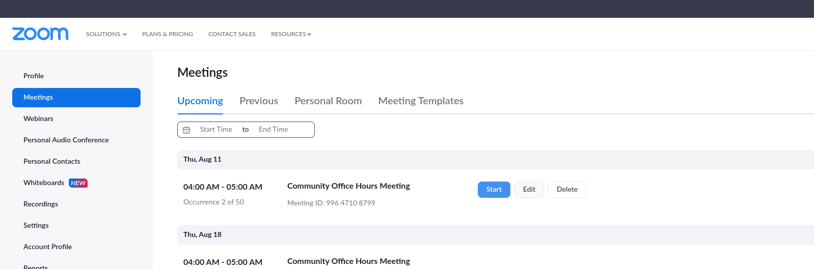
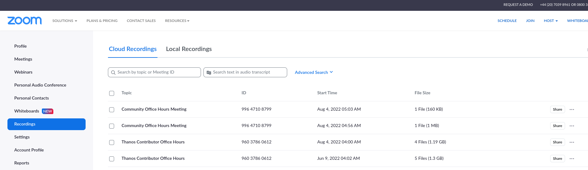

# Community

Thanos is an open source project from the very first commit. We always value and welcome new contributors and members of the community. Here are ways to get in touch with the community:

### Social Media and Announcements

Follow and interact with us on Twitter: [@ThanosMetrics](https://twitter.com/ThanosMetrics)

### Thanos Community Office Hours

Thanos Community Office Hour (previously Contributor Office Hour) is a public weekly meeting focused on Thanos community, development and contributions. It’s meant for users, developers and maintainers to meet and get unblocked, pair review, and discuss development aspects of Thanos and related projects.

**Everyone is welcome to join & add items to the agenda**.

> NOTE: If no agenda items will be added 1h before the meeting, the meeting will be cancelled.

**Meeting Time:** Every-second Thursday 15:00 CET

**Calendar Event:** https://www.cncf.io/calendar/

**Agenda:** [Google Doc](https://docs.google.com/document/d/137XnxfOT2p1NcNUq6NWZjwmtlSdA6Wyti86Pd6cyQhs)

**Link to join Zoom Meeting:** [https://zoom.us/j/99647108799](https://zoom.us/j/99647108799)

**Meeting Passcode (avoids robot scrapers):** thanos

> NOTE: Maintainers, see [community office hours shepherding](#community-office-hours-shepherding) section.

#### How to Bring the Topic you are/want to Contribute to?

1. Put your name (suggest Google Documents mode) on the Agenda with a related topic.
2. Notify the maintainer that you wish to speak with or that maintains the component that the change refers to (Slack #thanos-dev channel)
3. If the agenda topic is approved, we will make you a Panelist (you will be able to speak, show cam, present screen, etc), so we can collaborate and speak about the change (:

#### Rules

* The [CNCF Code of Conduct applies](../../CODE_OF_CONDUCT.md).
* The meeting will happen in a form of a public, recorded Zoom Webinar.
* Anyone can join as a viewer.
* People that we know and those who have a "registered" agenda item will be added as panelists when the meeting starts (if they are present).
* Try to timebox discussions to max 15-20min, unless there are no other agenda items. (:
* No announcements and marketing, just pure discussions over pending features/bugs/PRs especially contributed by other contributors than maintainers.
* Focus on inclusiveness and friendliness:
  * No grumpiness allowed. (:
  * Any opinion is welcome, no straight rejections without nice explanations, etc. (:
* We cancel the meeting if there aren’t any items on the agenda the day before the meeting.

### Slack

* General channel: [#thanos](https://slack.cncf.io/)
* Development related channel, PR discussions: [#thanos-dev](https://slack.cncf.io/)

### Prometheus Communication Channels

Since we are active Prometheus contributors and, some of us, maintainers we are also available on [Prometheus IRC and email-list channels](https://prometheus.io/community/)

### Prometheus Community & Ecosystem Meetings

The Prometheus & The Ecosystem community meeting is intended to provide a holistic overview of community activities, critical release information, and governance updates for Prometheus & the Ecosystem projects.

Thanos Maintainers regularly join and give announcements and updates.

Meeting details: [https://bit.ly/prometheus-community-agenda](https://bit.ly/prometheus-community-agenda)

### Mentorships

We participate in periodic mentorship programs. Read more [here](mentorship.md).

### Further Questions

Feel free to contact any of the [Maintainers](../../MAINTAINERS.md)

### For Thanos Team Members

#### Community Office Hours Shepherding

Schedule:

| Month   | Shepherd (GitHub handle) |
|---------|:-------------------------|
| 2022.13 | TBD                      |
| 2022.12 | TBD                      |
| 2022.11 | TBD                      |
| 2022.10 | TBD                      |
| 2022.09 | `@bwplotka`              |
| 2022.08 | `@bwplotka`              |

Each month we rotate the role of Community Office Shepherds among Team Members. This role is focused on leading the safe and friendly discussions during our [Community Office Hours](#thanos-community-office-hours).

> NOTE: Being shepherd does not mean other team members can chill out completely. (: It's a joint effort, so ideally there are multiple team members on those meetings to make decisions if needed.

> NOTE: If for some reason you as a shepherd can't make it, find replacement or cancel the meeting.

##### Responsibilities

The Same Day Morning Before Meeting:

* Add entry for today on the [agenda document](https://docs.google.com/document/d/137XnxfOT2p1NcNUq6NWZjwmtlSdA6Wyti86Pd6cyQhs.
* Announce meeting and call for agenda the same day morning on #thanos-dev and Twitter (`@ThanosMetrics` or your own account retweeted by ThanosMetrics).

30 minutes Before:

* Check agenda. If there are no topic, cancel the meeting. Announce cancellation on #thanos-dev and remove calendar item (anyone in `thanos-io@googlegroup.io` should have access).
* If there are topics, clean and add suggestions if they make sense.

2 minutes Before (if meeting was not cancelled):

* Log in to Zoom as `cncf-thanos-project@cncf.io` to be a meeting Host. This will allow you to have a control over meeting and Meeting options. Passwords can be found in our Keybase files.
  * If 2FA kicks-in, you will get message in https://lists.cncf.io/ for `cncf-thanos-maintianers@lists.cncf.io` (`cncf-thanos-project@cncf.io` is just an alias). Login there (you need to be in this list, talked to `amye@linuxfoundation.org` if you are not) and check `Admin > Pending` messages.
* We moved to `Meetings` so there is no need to start the meeting - it will start automatically. Join as `cncf-thanos-project@cncf.io` to host conversation.
* You don't need to answer all questions (or know how), just triage the potential questions and finish early if no other topics!
* In case of problems start another meeting or edit options of recurring meeting `Meeting` tab:

1 Day After Meeting (if meeting was not cancelled):

* Check `Recording` tab in Zoom and share recording on Twitter.

