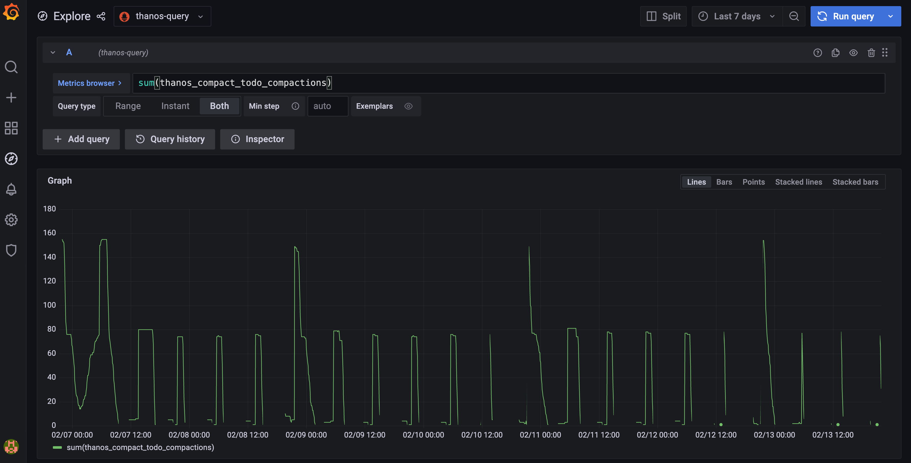

# Troubleshoot Compactor Backlog

The compactor is one of the most important components in Thanos. It is responsible for doing compaction, downsampling, and retention of the data in the object storage.

When your system contains a lot of block producers (Sidecar, Rule, Receiver, etc) or the scale is large, the compactor might not be able to keep up with the data producing rate and it falls behind, which causes a lot of backlogged work. This document will help you to troubleshoot the backlog compaction issue and how to scale the compactor.

## Detect the backlog

Self-monitoring for the monitoring system is important. We highly recommend you set up the Thanos Grafana dashboards and alerts to monitor the Thanos components. Without self-monitoring, it is hard to detect the issue and fix the problems.

If you find these issues in your own Thanos deployment, then your compactor might be backlogged and needs to scale more:
1. The long-term query in your Grafana dashboard is much slower than usual.
2. The compactor stops downsampling blocks and `thanos_compact_downsample_total` metric doesn't increase.
3. The compactor stops retention. If the retention period is set to 1 month but you can still see older blocks from the bucket UI then that's the case.
4. `thanos_compact_iterations_total` metric doesn't increase or the rate is very low.

In the current implementation, the compactor will perform compaction, downsampling, and retention phases in order, which means that if the compaction work is not finished, the downsampling and retention phase won't start. So that's why you will find symptom 2 and 3 mentioned above.

For symptom 4, `thanos_compact_iterations_total` metric doesn't increase means that the Thanos compactor is currently working on the current compaction iteration and cannot finish it in a long time. It is very similar to the case of a message queue. The producers are the components that upload blocks to your object storage. And the compactor is the consumer to deal with the jobs from producers. If the data production rate is higher than the processing rate of the consumer, then the compactor will fall behind.

### Compactor progress metrics

Since the Thanos v0.24 release, four new metrics `thanos_compact_todo_compactions`, `thanos_compact_todo_compaction_blocks`, `thanos_compact_todo_downsample_blocks` and `thanos_compact_todo_deletion_blocks` are added to show the compaction, downsampling and retention progress and backlog.

`thanos_compact_todo_compactions`: The number of planned compactions. `thanos_compact_todo_compaction_blocks`: The number of blocks that are planned to be compacted. `thanos_compact_todo_downsample_blocks`: The number of blocks that are queued to be downsampled. `thanos_compact_todo_deletion_blocks`: The number of blocks that are queued for retention.

To use these metrics, for example you can use `sum(thanos_compact_todo_compactions)` to get the overall compaction backlog or use `sum(thanos_compact_todo_compactions) by (group)` to get which compaction group is the slowest one.

This feature works by syncing block metadata from the object storage every 5 minutes by default and then simulating the compaction planning process to calculate how much work needs to be done. You can change the default 5m interval by setting `compact.progress-interval` flag or disable it by setting `compact.progress-interval=0`.

## Solutions

### Scale the compactor

To prevent the compactor from falling behind, you can scale the compactor.

To scale the compactor vertically, you can give it more CPU and memory resources. It also has two flags `compact.concurrency` and `downsample.concurrency` to control the number of workers to do compaction and downsampling.

To scale the compactor horizontally, you can run multiple compactor instances with different `min-time` and `max-time` flags so that each compactor will only work on the blocks that are within the time range.

Another way of horizontal scaling is to run multiple compactors by sharding. You can use the relabel config to shard the compactors by external labels like `cluster` so that blocks with the same external label will be processed by the same compactor.

### Bucket tools

There are some bucket tools that can help you to troubleshoot and solve this issue.

You can use `bucket ls`, `bucket inspect` and `bucket web` UI to view your current blocks.

If a lot of blocks are older than the retention period and the compactor is not performing retention, then to clean them up, you can do the following:
1. Stop the current running compactor instances to avoid data race
2. Run `thanos tools bucket retention` command to perform retention on your blocks directly. This step won't delete your blocks right away. It just adds deletion markers to the blocks for retention.
3. You can restart the compactor instances now and they will clean up the blocks with deletion markers after some period (by default 2d).
4. You can also choose to not restart the compactor instances and just run `thanos tools bucket cleanup --delete-delay=0s` to delete those marked blocks right away.
