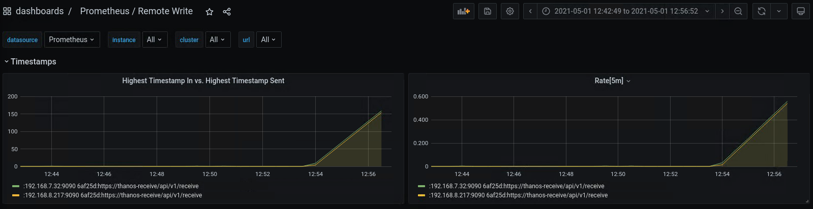
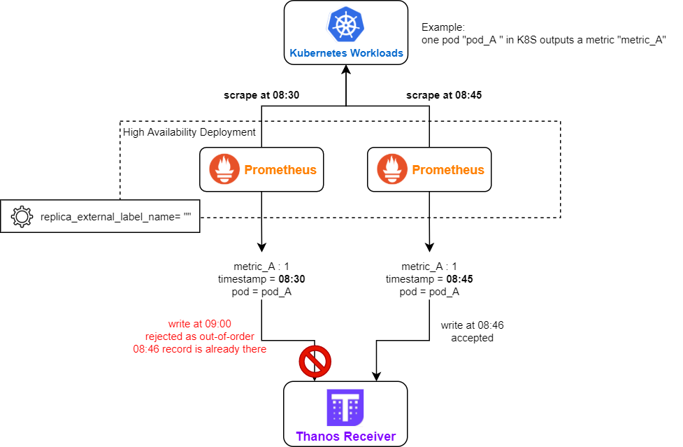
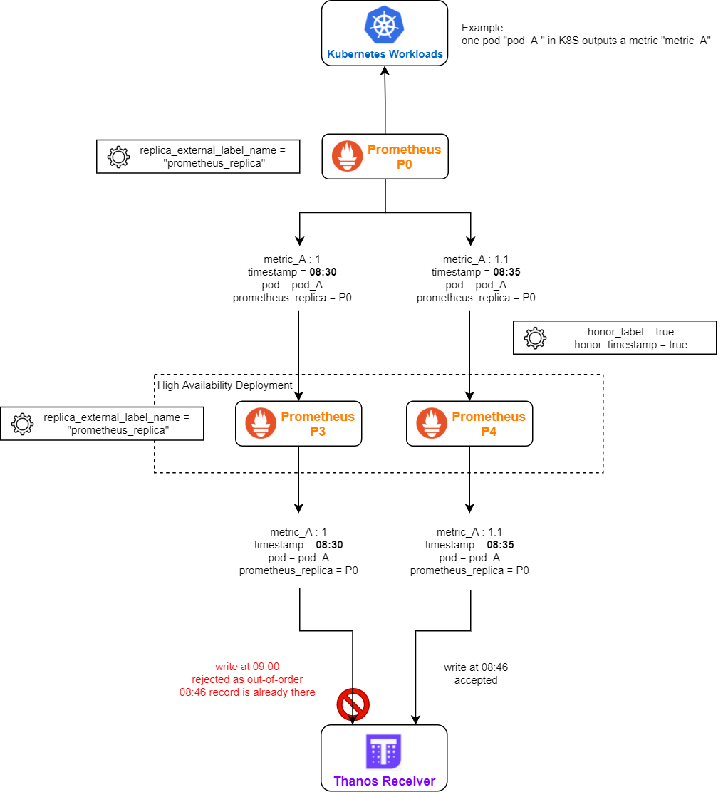
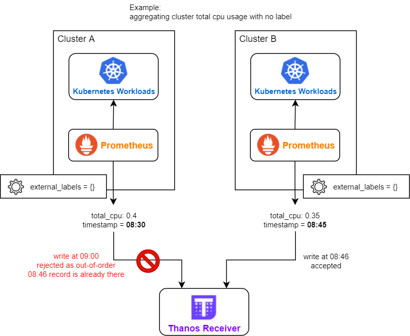

# Troubleshooting; Common cases

## Overlaps

**Block overlap**: Set of blocks with exactly the same external labels in meta.json and for the same time or overlapping time period.

Thanos is designed to never end up with overlapped blocks. This means that (uncontrolled) block overlap should never happen in a healthy and well configured Thanos system. That's why there is no automatic repair for this. Since it's an unexpected incident:
* All reader components like Store Gateway will handle this gracefully (overlapped samples will be deduplicated).
* Thanos compactor will stop all activities and HALT or crash (with metric and will error log). This is because it cannot perform compactions and downsampling. In the overlap situation, we know something unexpected happened (e.g manual block upload, some malformed data etc), so it's safer to stop or crash loop (it's configurable).

Let's take an example:

- `msg="critical error detected; halting" err="compaction failed: compaction: pre compaction overlap check: overlaps found while gathering blocks. [mint: 1555128000000, maxt: 1555135200000, range: 2h0m0s, blocks: 2]: <ulid: 01D94ZRM050JQK6NDYNVBNR6WQ, mint: 1555128000000, maxt: 1555135200000, range: 2h0m0s>, <ulid: 01D8AQXTF2X914S419TYTD4P5B, mint: 1555128000000, maxt: 1555135200000, range: 2h0m0s>`

In this halted example, we can read that compactor detected 2 overlapped blocks. What's interesting is that those two blocks look like they are "similar". They are exactly for the same period of time. This might mean that potential reasons are:

* Duplicated upload with different ULID (non-persistent storage for Prometheus can cause this)
* 2 Prometheus instances are misconfigured and they are uploading the data with exactly the same external labels. This is wrong, they should be unique.

Checking producers log for such ULID, and checking meta.json (e.g if sample stats are the same or not) helps. Checksum the index and [chunks files](../design.md#chunk-file) as well to reveal if data is exactly the same, thus ok to be removed manually. You may find `scripts/thanos-block.jq` script useful when inspecting `meta.json` files, as it translates timestamps to human-readable form.

### Reasons

- You are running Thanos (sidecar, ruler or receive) older than 0.13.0. During transient upload errors there is a possibility to have overlaps caused by the compactor not being aware of all blocks See: [this](https://github.com/thanos-io/thanos/issues/2753)
- Misconfiguraiton of sidecar/ruler: Same external labels or no external labels across many block producers.
- Running multiple compactors for single block "stream", even for short duration.
- Manually uploading blocks to the bucket.
- Eventually consistent block storage until we fully implement [RW for bucket](../proposals-done/201901-read-write-operations-bucket.md)

### Solutions

- Upgrade sidecar, ruler and receive to 0.13.0+
- Compactor can be blocked for some time, but if it is urgent. Mitigate by removing overlap or better: Backing up somewhere else (you can rename block ULID to non-ulid).
- Who uploaded the block? Search for logs with this ULID across all sidecars/rulers. Check access logs to object storage. Check debug/metas or meta.json of problematic block to see how blocks looks like and what is the `source`.
- Determine what you misconfigured.
- If all looks sane and you double-checked everything: Then post an issue on Github, Bugs can happen but we heavily test against such problems.

# Sidecar

## Connection Refused

### Description

```shell
level=warn ts=2020-04-18T03:07:00.512902927Z caller=intrumentation.go:54 msg="changing probe status" status=not-ready reason="request flags against http://localhost:9090/api/v1/status/config: Get \"http://localhost:9090/api/v1/status/config\": dial tcp 127.0.0.1:9090: connect: connection refused"
```

* This issue might happen when thanos is not configured properly.

### Possible Solution

* Make sure that prometheus is running while thanos is started. The `connection_refused` states that there is no server running in the `localhost:9090`, which is the address for prometheus in this case.

## Thanos not identifying Prometheus

### Description

```shell
level=info ts=2020-04-18T03:16:32.158536285Z caller=grpc.go:137 service=gRPC/server component=sidecar msg="internal server shutdown" err="no external labels configured on Prometheus server, uniquely identifying external labels must be configured"
```

* This issue happens when thanos doesn't recognise prometheus

### Possible Solution

* Thanos requires **unique** `external_labels` for further processing. So make sure that the `external_labels` are not empty and globally unique in the prometheus config file. A possible example -

```yml
global:
  external_labels:
    cluster: eu1
    replica: 0
```

# Receiver

## Out-of-bound Error

### Description

#### Thanos Receiver Log

```shell
level=warn ts=2021-05-01T04:57:12.249429787Z caller=writer.go:100 component=receive component=receive-writer msg="Error on ingesting samples that are too old or are too far into the future" num_droppped=47
```

### Root Cause

- "Out-of-bound" error occurs when the timestamp of the to-be-written sample is lower than the minimum acceptable timestamp of the TSDB head.

### Possible Cause

1. Thanos Receiver was stopped previously and is just resumed, remote Prometheus starts to write from the oldest sample, which is too old to be digested and hence rejected.
2. Thanos Receiver does not have enough compute resources to ingest the remote write data (is too slow). The latest ingested sample is gradually falling behind the latest scraped samples.

### Diagnostic and Possible Solution

- Check the pod history of Thanos Receiver to see if it is case #1.
- For case #2, if you installed Prometheus using the [kube-prometheus-stack](https://github.com/prometheus-community/helm-charts/tree/main/charts/kube-prometheus-stack) helm chart from the Prometheus Community, you can check the "Prometheus / Remote Write dashboard". If the Rate\[5m\] is above 0 for a long period, it is case #2 and you should consider adding replica count or resources to Thanos Receiver.



## Out-of-order Samples Error

### Description

#### Thanos Receiver Log

```shell
level=warn ts=2021-05-01T05:02:23.596022921Z caller=writer.go:92 component=receive component=receive-writer msg="Error on ingesting out-of-order samples" num_dropped=14
```

### Root Cause

- TSDB expects to write samples in chronological order for each series.
- A sample with timestamp t1 is sent to the Thanos Receiver and accepted, any sample with **timestamp t < t1** and **identical label set** being sent to the receiver after this will be determined as out-of-order sample.

### Possible Cause

- Remote Prometheus is running in high availability mode (more than 1 replica are running). But the replica_external_label_name is not correctly configured (e.g. empty).



- Remote Prometheus is running in a federation
  - the remote-writing Prometheus is running in HA
  - federation has both honor_label = true and honor_timestamp = true
  - all layers of Prometheus is using the same replica_external_label_name (e.g. the default "prometheus_replica")



- There are multiple deployments of remote Prometheus, their external_labels are identical (e.g. all being empty), and they have metrics with no unique label (e.g. aggregated cluster CPU usage).



### Diagnostic

- Enable debug log on Thanos Receiver (you may need to update cli parameter or helm chart values, depending on how you deployed Thanos Receiver). You can inspect the label set of the out-of-order sample in the debug log of Thanos Receiver, it may provide you some insight.
- Inspect the topology and configuration of your Prometheus deployment, see if they match the above possible causes.

### Possible Solution

- Configure distinct sets of external_labels for each remote Prometheus deployments.
- Use different replica_external_label_name for each layer of Prometheus federation (e.g. layer 1: lesser_prometheus_replica, layer 2: main_prometheus_replica).
- Use static endpoint based federation in Prometheus if the lesser Prometheus is in HA (service monitor based federation will pull metrics from all lesser Prometheus instances).
