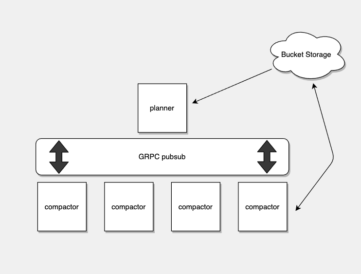

## Separate Planner into its own Component

* **Owners:**

    * [@andrejbranch](https://github.com/andrejbranch)

* **Related Tickets:**

    * [Compact all available plans for a single group concurrently](https://github.com/thanos-io/thanos/issues/3806)

## Summary

Separate compactor's planner into its own component and have compactor workers request available plans from the planner.

## Why

Currently, the Thanos compactor handles planning which blocks to compact as well as vertical/horizontal compaction of the groups. This causes issues with the scalability of compaction for a single tenant. The actual compaction process is relatively simple, as all the process needs to know is what blocks to compact. By contrast, the planning logic is relatively complex and currently can't coordinate with other compactors. To get around the coordination issue, currently the compactor can be sharded by tenant. This will not horizontally scale. When a single tenant becomes very large it will need to distribute the workload across many compaction processes across many instances, regardless of how the workload is divided.

## Goals

* To separate planner into its own component and have compactors communicate with the planner to get the next available plan.

## Non-Goals

* Horizontally scaling compaction for a single tenant will be addressed following the completion of this proposal

## Proposal


### Separate planner into its own component.
For the initial implementation a reasonable amount of the current planner code could be reused. One difference is the new planner will need to run plans for all tenants. The planner should maintain a priority queue of available plans with fair ordering between tenants. The planner should also be aware of which plans are currently running and be able to handle the failure of a compaction plan gracefully. After the completion of this proposal, planner can be updated to improve single tenant compaction performance, following the goals of the [compaction group concurrency pull request](https://github.com/thanos-io/thanos/pull/3807).

### GRPC pubsub (bidirectional streaming)
The new planner component should expose a bidirectional rpc streaming endpoint where each compactor can initialize a connection and send/receive messages to/from the planner. This connection should stay open indefinitely, only closing when either a compactor or planner is shutdown or on failure. Compared to a simple request/response pattern, this will allow for the planner to easily detect when a connection has been lost and handle failures gracefully. Below is an oversimplified and verbose example of what the protos could look like.

```
// Example protos
service Planner {
  rpc Connect(stream CompactorMessage) returns (stream PlannerMessage) {}
}

message CompactionPlan {
  string tenant = 1
  repeated string blocks = 2
}

// since this is 1 rpc connection we need to distinguish between different messages compactor can send
enum CompactorMessageType {
  UNKNOWN = 0
  INIT = 1 // initialize connection
  NEXT = 2 // request next plan
  COMPLETE = 3 // a plan was completed
  ....
}

message CompactorMessage {
  CompactorMessageType type = 1
  CompactionPlan = 2
}

message PlannerMessage {
  CompactionPlan = 1
}
```

## Action Plan
* Setup and agree on the planner's service and message protos
* Create the planner component and implement the protos
* Implement the planners priority queue
* Move planner code from compactor into the new planner service.
* Update compactor to connect to the new planner service and request plans


