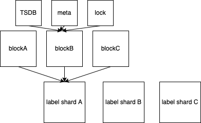
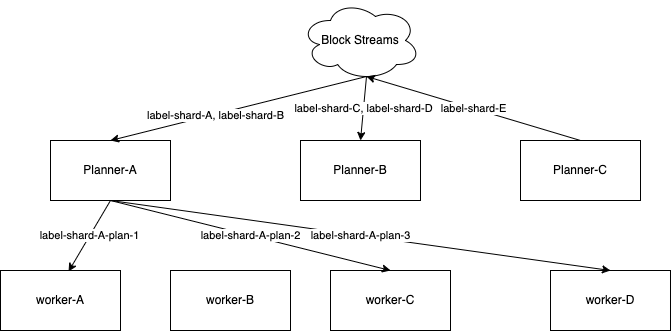
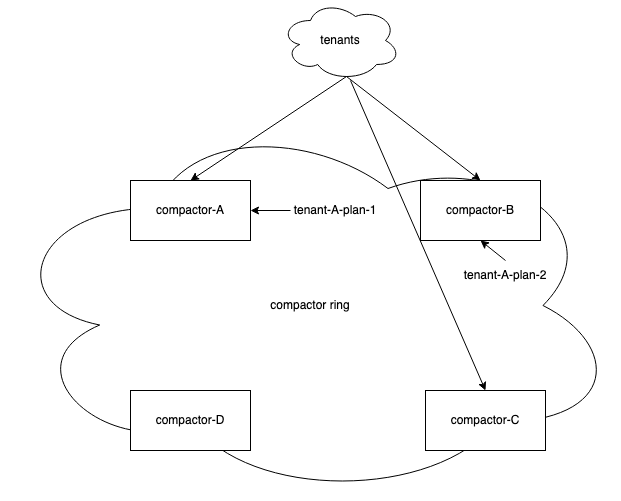

* **Owners:**
  * @roystchiang

* **Related Tickets:**
  * [Improvements on Thanos Compactor](https://github.com/thanos-io/thanos/issues/4233)

## Summary

This design document proposes the ability to produce parallelizable compaction plan and the ability to execute them in parallel.

## Motivation

The main motivation for considering parallel compaction in Thanos are the following use cases:

* **A single tenant wants to push more timeseries:** One of the bottlenecks for running a Thanos cluster is how many timeseries can be compacted within the minimal compaction range. Using a compaction range of [2h, 8h, 2d, 25d]  as example, if the compaction for the 2h block is longer than 2 hours, compaction will start to fall behind.
* **Faster recovery from failed compactor nodes:** In the event of compactor nodes experiencing failures, compaction has to be done for blocks that were uploaded during the outage. By compacting in non-overlapping plans in parallel, we can recover faster.

## Goals

* Ability to create parallelizable compaction plans
* Ability to execute multiple compaction plans in parallel

## Proposal

Currently a single tenant belongs to a single compactor, and compactions for a single tenant happens serially. In reality, this compaction can be done in parallel, if the blocks to be compacted do not overlap. We can increase the throughput of compaction, with the ability to produce plans with groups of blocks, and compact them in parallel.

## Proposed Approach

The compactor can be split into two components - a planner and a worker.  The planner simply reads a list of blocks in the persistent storage, and generates compaction plans. The worker accepts plans from a planner, and downloads the blocks, compacts them, and uploads the new block.

We’ll tackle the problem in two stages. First, enabling parallelism within a single compactor, then we’ll move the parallelism to a fleet of compaction workers. By introducing a grouper that’s capable of producing multiple plans, we can spin up a thread for each plan, and start compacting. Since each tenant still belongs to a single compactor, there is no coordination involved across compactors. This alone will allow compactor to scale vertically, and users can already benefit from it. However, to achieve horizontal scaling, we’ll need the ability to split work for a single tenant to multiple compactors.

We’ll introduce the ability for compactor to be running in planner, worker, and planner + worker mode. By running the compactor in a planner mode, the compactor will scan the object store for a list of blocks, and produce plans. The worker nodes will receive jobs from the planner nodes, and execute the compaction. Existing users do not have to spin up a new component, as they can still enjoy parallelism by vertically scaling their node.

### Architecture

#### Object Store Layout

Given that we [cannot compact two blocks with the same source](https://github.com/cortexproject/cortex/pull/4433#issuecomment-1021505763), meaning that if BlockX contains BlockA, B, and BlockZ contain BlockA, C, the compaction will fail as BlockA is present in both. Hence, I propose that we put a lock file for each block that is being compacted currently. The planner will put a lock file on each block that will be sent to a worker, and a worker will update the timestamp at an interval.

The planners will generate plans based on all the available blocks on object storage, but if any block in a plan has an active lock file, the plan will be dropped. If a lock file is stale, it will be considered as active.

#### Ownership Determination

A tenant will belong to only 1 single planner, while a tenant’s compaction jobs can run on multiple workers. The planners will determine the ownership of plan creation via a ring, similar to how Thanos receiver works. The planner will find out the workers via a ring, and determine which workers are available for a given tenant.

#### High-level Coordination

At a high level, the planner coordinates the workers, by having workers pull from the planner, and continuously generating plan while reading the lock file in blocks. Workers will participate in the ring, but they will not use the ring directly to find jobs. Planners will find the workers on the ring, to find the corresponding workers for a tenant.

There are two main parts to the implementation

**Planner**
Creates plans based on the current view of the object store

During startup, planner will:

* discover other planners, determine the plan creation ownership amongst planners
* check for the lock file, and create plans

When a worker comes, a planner will:

* determine which plan is suitable for the worker
    * put a lock file for every block with current timestamp
    * assign the job to a worker

**Worker**
During startup, a worker will:

* talk to planners to find a job
* continuously update the lock file at an interval
* compact the blocks
* upload the new blocks

## Rollout/scaling/failure of planner nodes

The plan generation should be idempotent, meaning that given the same view of blocks, a planner will return the same set of plans consistently.

During a rollout of planner nodes, the planners can see what blocks are being used for compaction by looking at the lock file.

During a scaling event of a planner, the ring will change, but the plans for a given tenant still stay consistent. If ownership of tenant A changes, the new planner will not recreate plans involving blocks that are being compacted; thus, avoiding duplicate work and compaction failure..

When a planner node fails, the ring of the planners will change, and other available planners will pick up the work.

## Rollout/scaling/failure of worker nodes

When rolling out the worker nodes, the jobs being executed will be dropped. Planners periodically reads the lock file from object store and will see that the lock file for a block is not being updated, and a new plan will be available for compaction.

Failure of a worker node will also cause the job to be dropped, and the planner component will handle them the same way as a rollout.

## Alternatives

### Use ring on compactor to determine ownership of compaction groups

This can be one of the modes that the Thanos compactor runs in. Without a dedicated planner component, compactors can still be scaled out horizontally to achieve greater parallelism. Each of the compactors will query the current state of object store, and produce a list of plans.The plans will be sharded amongst workers themselves via the ring.

This architecture allows us to run the planner with leader-election. All compactors are running in planner + worker mode, but only some planners are actively coordinating the jobs. With this, we can mitigate the potential where jobs are not distributed amongst compactors evenly, and still have the ability to have a smarter planner in teh future.

## Work Plan

* introduce the lock file
* introduce planner capable of producing plans that can be executed in parallel

* update compactor to be able to execute multiple compactions in parallel
* implement the alternative of using ring on compactor for ownership

* implement compactor running in planner mode
* implement compactor running in worker mode
* implement the coordination between planner and worker