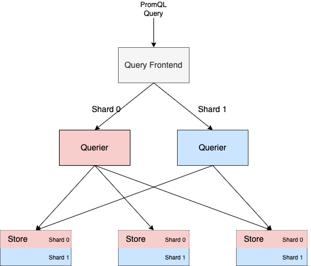
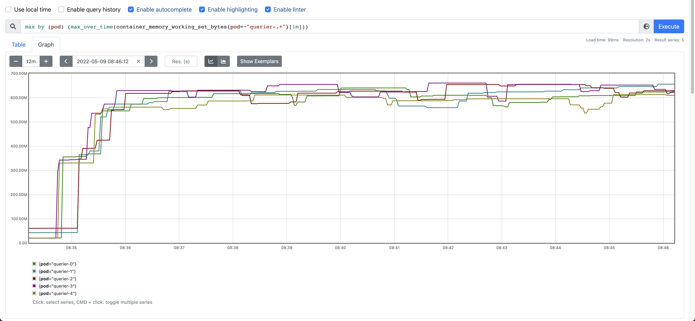
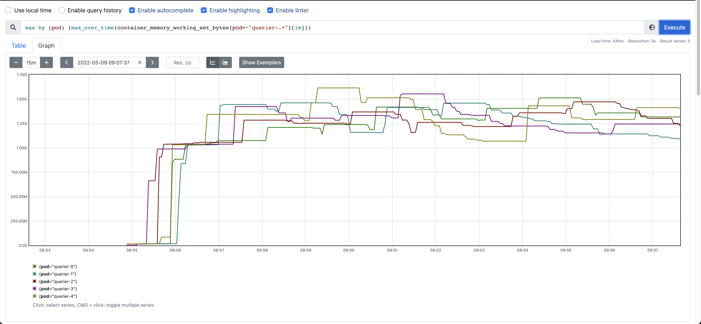
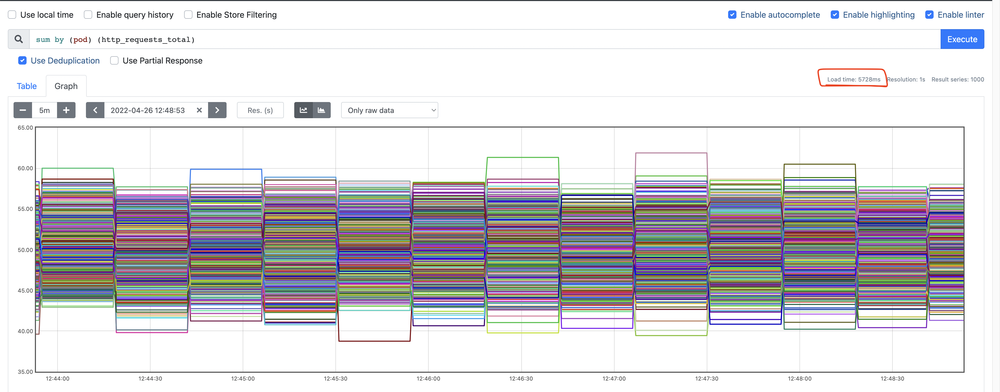
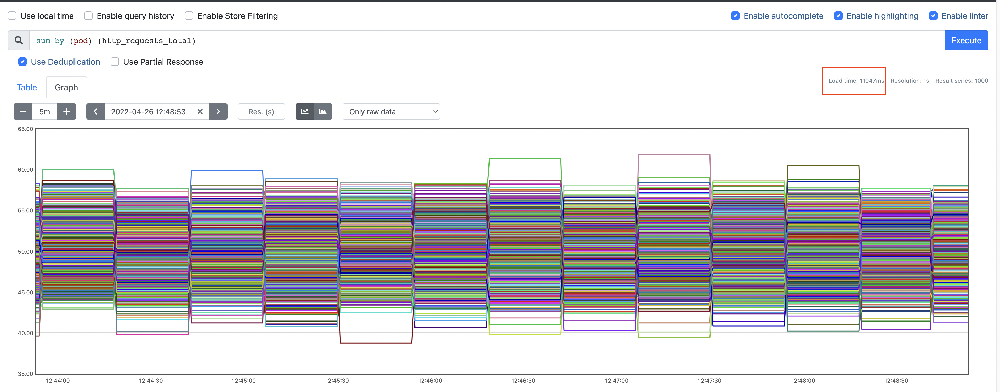

* **Owners:**
  * @fpetkovski
  * @moadz

## Why

The current query execution model in Thanos does not scale well with the size of query. We therefore propose a query sharding algorithm which distributes the query execution across multiple Thanos Queriers. The proposed algorithm shards queries by series (vertically) and is complementary to the (horizontal) range splitting operation implemented in Query Frontend. Even though horizontal sharding can be useful for distributing long-ranged queries (12h or longer), high cardinality metrics can still cause performance issues even for short ranged queries. Vertical query sharding breaks down large queries into disjoint datasets that can be retrieved and processed in parallel, minimising the need for large single-node Queriers and allowing us to pursue more effective scheduling of work on the read path.

### Pitfalls of the current solution

When executing a PromQL query, a Querier will pull series from all of its downstream Stores in memory and feed them to the Prometheus query engine. In cases where a query causes a large number of series to be fetched, executing the query can lead to high memory usage in Queriers. As a result, even when more than one Querier is available, work is concentrated in a single Querier and cannot be easily distributed.

## Goals
* **Must** allow the sharding of aggregation expressions across N queries, where N denotes a user-provided sharding factor
* **Must** fall back to single query when a non-shardable query or querier is encountered in the query path
* **Could** serve as a motivation for a general query-sharding framework that can be applied to any query
* **Should not** make any changes to the current query request path (i.e. how queries are scheduled in Queriers)

### Audience

* Users who run Thanos at a large scale and would like to benefit from improved stability of the Thanos read path.

## How

### The query sharding algorithm

The query sharding algorithm takes advantage of the grouping labels provided in PromQL expressions and can be applied to the large majority of PromQL queries which aggregate timeseries *by* or *without* one more grouping labels.

In order to illustrate how it works, we can take the example of executing the following PromQL query

```
sum by (pod) (memory_usage_bytes)
```

on the series set:

```
memory_usage_bytes{pod="prometheus-1", region="eu-1", role="apps"}
memory_usage_bytes{pod="prometheus-1", region="us-1", role="infra"}
memory_usage_bytes{pod="prometheus-2", region="eu-1", role="apps"}
memory_usage_bytes{pod="prometheus-2", region="us-1", role="infra"}
```

This query performs a sum over series for each individual pod, and is equivalent to the union of following two queries:

```
sum by (pod) (memory_usage_bytes{pod="prometheus-1"})
```

and

```
sum by (pod) (memory_usage_bytes{pod="prometheus-2"})
```

We can therefore execute each one of the two queries in a separate query shard and concatenate the result before returning it to the user.

### Dynamic series partitioning

Since Queriers have no information about which timeseries are available in Stores, they cannot easily rewrite a single aggregation into two disjoint ones. They can, however, propagate information to Stores that instruct them to only return one disjoint shard of the series that match particular selectors. To achieve this, each query shard would propagate the total number of shards, its own shard index, and the grouping labels discovered in the PromQL expression. Stores would then perform a `hashmod` on the grouping labels against each series and return only those series whose `hashmod` equals the requested shard index.

In our example, the total number of shards would be 2 and the only grouping label is `pod`. The `hashmod` on the `pod` label for each series would be as follows

```
# hash(pod=prometheus-1) mod 2 = 8848352764449055670 mod 2 = 0
memory_usage_bytes{pod="prometheus-1", region="eu-1", role="apps"}

# hash(pod=prometheus-1) mod 2 = 8848352764449055670 mod 2 = 0
memory_usage_bytes{pod="prometheus-1", region="us-1", role="apps"}

# hash(pod=prometheus-2) mod 2 = 14949237384223363101 mod 2 = 1
memory_usage_bytes{pod="prometheus-2", region="eu-1", role="apps"}

# hash(pod=prometheus-2) mod 2 = 14949237384223363101 mod 2 = 1
memory_usage_bytes{pod="prometheus-2", region="us-1", role="apps"}
```

The first two series would therefore end up in the first query shard, and the second two series on the second query shard. The Queriers will execute the query for their own subset only, and the sharding component will concatenate the results before returning them to the users.

The reason why partitioning the series set on the grouping labels works is because a grouping aggregation can be executed independently on each combination of values for the labels found in the grouping clause. In our example, as long as series with the same `pod` label end up in the same query shard, we can safely perform the shard and merge strategy.

### Initiating sharded queries

The Query Frontend component already has useful splitting and merging capabilities which are currently used for sharding queries horizontally. In order to provide the best possible user experience and not burden users with running additional component(s), we propose adding a new middleware to Query Frontend which will implement the vertical sharding algorithm proposed here after the step-alignment and horizontal time-slicing steps. This would allow users to restrict the maximum complexity of a given query based on vertical sharding of already time-sliced queries. The only new user-specified parameter would be the number of shards in which to split PromQL aggregations.

Integrating vertical-query sharding in QFE also has the added benefits of:
* Using sharding for instant queries, and by extension, for alerting and recording rules
* Utilizing the existing caching implementation
* Sharding a query vertically, after it has already been time-sliced, reduces the cardinality of each respective query shard

The following diagram illustrates how the sharding algorithm would work end to end:



### Drawbacks & Exceptions

*Not all queries are easily shardeable* There are certain aggregations for which sharding cannot be performed safely. For these cases the sharder can simply fall back to completely executing the expression as a single query. These cases include the use of functions such as `label_replace` and `label_join` which create new labels inside PromQL, when the query is being executed. Since such labels can be arbitrarily created while executing queries, Stores will be unaware of them and cannot take them into account when sharding the matching series set.

#TODO Mention promql parsing/transformation to increase queries that can be sharded

*Impact of sharded queries on block retrieval* Given that queries are sharded based on series, and not time, for a given leaf most metrics for each independent shard will likely reside in the same block(s). This can multiply the cost of retrieving series from a given block since the block has to be traversed N number of times, where N is the number of distinct shards.

In our sharded query benchmarks, we found that the increased volume of Series calls to Store Gateways and Receivers did not lead to a significant latency increase. However, we did notice a higher remote-read latency in Prometheus caused by multiple remote-read calls for the same Series call. This is due to the fact that the sharding has to be done in the sidecar, after retrieving all matching series for a query. A similar concern was raised in Prometheus already, with a proposal to support sharding series natively in the Prometheus TSDB (https://github.com/prometheus/prometheus/issues/10420).

Another concern we identified with Store GW is the impact of sharded queries on postings and chunk lookups. Whenever Store Gateway receives a Series call, it will first retrieve postings for the given label matchers (from cache), merge those postings and determine what blocks/chunks it needs to stream to facilitate this query. The potential issues sharding could introduce is an excess number of index lookups and subsequent downloading of the same chunk multiple times. This has not been measured for the spike, so we are unsure what the impact will be.

### Further improvements

In the future, additional improvements can be made to Thanos so that TSDB blocks are sharded in the background during the compaction process. Each block would could be sharded in several smaller blocks and get its own `shard_id` label attached to it. Store Gateways would then use this label to avoid doing `hashmod` over each series at query time.

# Alternatives

*Query Pushdown* Query pushdown involves pushing down the entire query to leaves for evaluation. This avoids the primary contributor to query latency (Store API Select over the network) but can only work on a limited set of queries, as there are no guarantees that duplicate series will not be double counted in disparate leaves. Vertical query sharding is a natural evolution of this idea that handles deduplication by guaranteeing that each unique series in a query will always end up on the same Querier. A version of this has already been implemented (https://github.com/thanos-io/thanos/pull/4917)

*Extended horizontal sharding* Thanos Query Frontend already does horizontal (based on time-range) sharding by splitting up queries into smaller time-ranges. As an alternative to vertical sharding, more granular horizontal sharding could be implemented to split a query up between Queriers at smaller increments. This does not have the same deduplication correctness problem as query pushdown, as overlapping time-ranges can be effectively deduplicated. This implementation, however, presents other challenges around aligning queries in such a way that guarantees a sample on the threshold is not double counted in distinct shards. Generally, time-ranges are also more complex to handle compared to a simple hashmod of label value pairs as the scrape interval can be different for each metric. Horizontal sharding also does not address cardinality, instead, sharding is based on number of samples over a time range, which are already highly compressible.

*Implement a streaming PromQL engine* Vertical query sharding allows to breakdown large queries into disjoint datasets that can be queried and processed in parallel, minimising the need for large single-node Queriers and allowing us to pursue more effective scheduling of work on the read path. This is needed as PromQL is mostly single-threaded and requires the entire set of expanded series pre-evaluation. A similar effect to vertical sharding can be achieved if PromQL itself supported streaming query evaluation, allowing us to limit and parallelise retrieval and execution in a single-node. This was discussed in upstream Prometheus (https://github.com/prometheus/prometheus/issues/7326).

### Reference implementation and benchmarks

A reference implementation is available as a draft PR: https://github.com/thanos-io/thanos/pull/5342.

The key component is the `QueryAnalyzer` which traverses the PromQL AST and extracts labels which the dataset can be sharded on. A good way to understand how it works is to look at the test cases for it: https://github.com/thanos-io/thanos/pull/5342/files#diff-025e491f39aac710d300ae708cfaa09d6bf5929ea4b4ce60f4b9e0f0a179e67fR10. Individual stores then use the labels to shard the series and return only one part of the resulting dataset: https://github.com/thanos-io/thanos/pull/5342/files#diff-3e2896fafa6ff73509c77df2c4389b68828e02575bb4fb78b6c34bcfb922a7ceR828-R835

Using the reference implementation, we benchmarked query execution and memory usage of Queriers. We synthesized a dataset of 100.000 series with two labels, a `cluster` label with 100 values and a pod label with 1000 values. The program used to generate the dataset, as well as the manifests to run deploy the reference implementation is available in a Github repository: https://github.com/fpetkovski/thanos-sharding-bench

We then ran the following query on the reference dataset for 10-15 minutes: `sum by (pod) (http_requests_total)`

The memory usage of Queriers with and without sharding was ~650MB and ~1.5GB respectively, as shown n the screenshots bellow.

Memory usage with sharding:



Memory usage without sharding:



We also found that the sharded implementation reduced query execution time from ~10s to ~5s.

Latency with sharding:



Latency without sharding:


