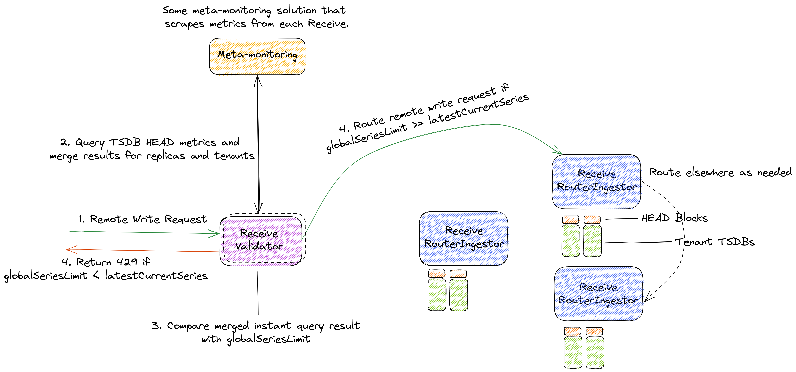
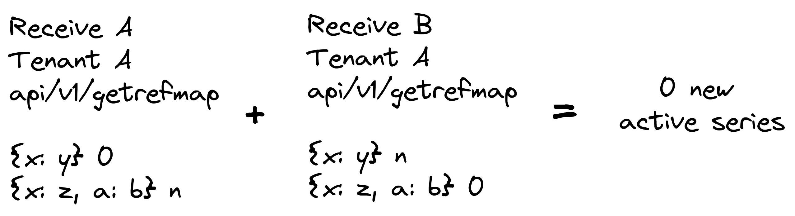
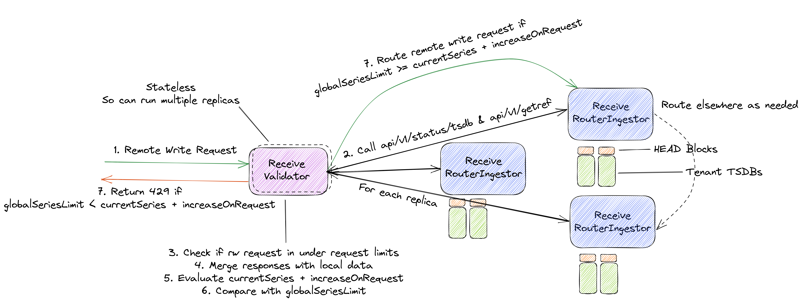
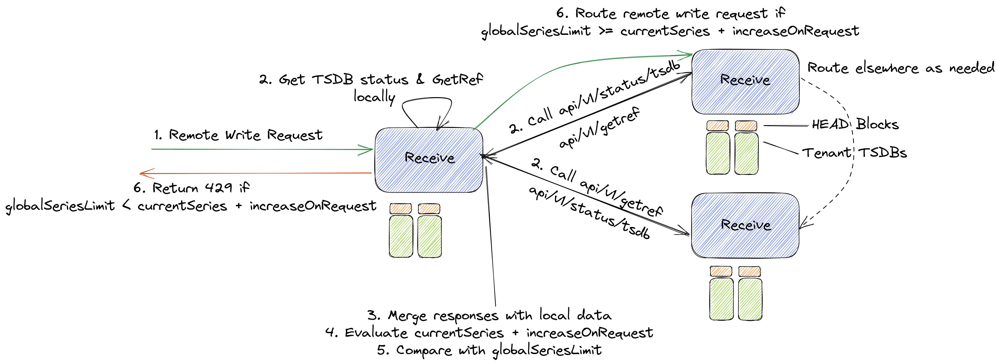

## Related links/tickets

* https://github.com/thanos-io/thanos/pull/5333
* https://github.com/thanos-io/thanos/pull/5402
* https://github.com/thanos-io/thanos/issues/5404
* https://github.com/thanos-io/thanos/issues/4972

## Why

Thanos is built to be a set of components that can be composed into a highly available metrics system with unlimited storage capacity. But for achieving true HA we need to ensure that tenants in our write path, cannot push too much data and cause issues. There need to be limits in place so that our ingestion systems maintain the level of QoS and only block the tenant that exceeds limits.

With limiting, we also need tracking and configuration of those limits to reliably use them.

## Pitfalls of the current solution

We run multiple Thanos Receive replicas in a hashring topology, to ingest metric data from multiple tenants via remote write requests and distribute the load evenly. This allows us to scalably process these requests and write tenant data into a local Receive TSDB for Thanos Querier to query. We also replicate write requests across multiple (usually three) Receive replicas, so that even during times where replicas are unavailable, we can still ingest the data.

While this composes a scalable and highly available system, sudden increased load, i.e increase in [active series](https://grafana.com/docs/grafana-cloud/fundamentals/active-series-and-dpm/) from any tenant can cause Receive to hit its limits and cause incidents.

We could scale horizontally automatically during such increased load (once we implement [this](https://github.com/thanos-io/thanos/issues/4972)), but it is yet safe to do so, plus a full solution cannot have unbounded cost scaling. Thus, some form of limits must be put in place, to prevent such issues from occurring and causing incidents.

## Audience

* Users who run Thanos at a large scale and would like to benefit from improved stability of the Thanos write path and get a grasp on the amount of data they ingest.

## Goals

* Add a mechanism to get the number of active series per tenant in Thanos and be able to generate meta-monitoring metrics from that (which could even provide us with some “pseudo-billing”).
* Use the same implementation to limit the number of active series per tenant within Thanos and fail remote write requests as they go above a configured limit for Hashring topologies with multiple Receive replicas.
* Explain how such a limit will work for partial errors.

## Non-Goals

* [Request-based limiting](https://github.com/thanos-io/thanos/issues/5404), i.e, number of samples in a remote wite request
* Per-replica-tenant limiting which is already being discussed in this [PR](https://github.com/thanos-io/thanos/pull/5333)
* Using [consistent hashing](https://github.com/thanos-io/thanos/issues/4972) implementation in Receive to make it easily scalable

## How

Thanos Receive uses Prometheus TSDB and creates a separate TSDB database instance internally for each of its tenants. When a Receive replica gets a remote write request, it loops through the timeseries, hashes labels with tenant name as prefix and forwards remote write request to other Receive nodes. Upon receiving samples in a remote write request from a tenant, the Receive node appends the samples to the in-memory HEAD block of a tenant.

We can leverage this fact, and generate statistics from the HEAD block, which can give us an accurate idea of the active or HEAD series of a tenant. This can also be exposed as a metric.

Thus, any remote write request can be failed completely, with a 429 status code and appropriate error message, if it increases the number of active series above the configured limit for a tenant. Partially accepting write requests might lead to confusing results and error semantics, so we propose to avoid this and focus on retries from client-side.

There are however a few challenges to this, as tenant metric data is distributed and replicated across multiple Thanos Receive replicas. Also, with a multi-replica setup, we have the concept of per-replica-tenant and per-tenant limits that can be defined as,

* **Per-replica-tenant limit**: The limit imposed for active series per tenant, per replica of Thanos Receive. An initial implementation of this is already WIP in this [PR](https://github.com/thanos-io/thanos/pull/5333). This can also be treated as the active series limit for non-hashring topology or single replica Receive setups.

* **Per-tenant limit**: The overall limit imposed for active series per tenant across all replicas of Thanos Receive. This is essentially what this proposal is for.

## Proposal

In general, we would need three measures to impose a limit,

* The current count of active series for a tenant (across all replicas if it is a *per-tenant* limit)
* The user configured limit (*per-tenant* and *per-replica-tenant* can be different). We can assume this would be available as a user flag and would be same for all tenants (initially)
* The increase in the number of active series, when a new tenant [remote write request](https://github.com/prometheus/prometheus/blob/v2.36.1/prompb/remote.proto#L22) would be ingested (this can be optional as seen in [meta-monitoring approach](#meta-monitoring-based-validator)).

There are a few ways in which we can achieve the outlined goals of this proposal and get the above measurements to impose a limit. The order of approaches is based on preference.

### Meta-monitoring-based Receive Validator

We could leverage a meta-monitoring solution which scrapes metrics from all Receivers as and then programmatically query for metrics like `prometheus_tsdb_head_series` and sum across tenants and instances periodically and limit based on that value (`latestCurrentSeries`).

This approach would add another mode to Receive apart from Router, Ingestor & RouterIngestor, called **“Validator”**.

Within Validator, we do not need to calculate an increase based on requests, as this will be handled by Receive instrumentation and meta-monitoring solution. We only need to query the latest HEAD series value for a tenant summed across all receives and limit remote write requests if the result of the instant query is greater than the configured limit.

This value can also be cached, and the query for latest value can be executed periodically.

So if a user configures a *per-tenant* limit, say `globalSeriesLimit`, the resultant limiting equation here would simply be `globalSeriesLimit >= latestCurrentSeries` which is checked on request.



#### Pros:
* Simpler as compared to other solutions and easier to implement
* Lesser endpoint calls, so improved latency
* Relies on "external to Thanos" system, and doesn’t increase load on Receive
* Does not add much tenancy-based complexity to Thanos
* No need to merge statistics across replicas, handled by meta-monitoring
* Additional request-based rate limiting can be done within same component
* In case, external meta-monitoring solution is down, can fall back to per-replica-tenant limits

#### Cons:
* Not very accurate
  * We do not know exact state of each TSDB, only know view of meta-monitoring solution, which gets updated on every scrape
  * We do not account for how much a remote write request will increase the number of active series, only infer that from query result after the fact
* Data replication (quorum-based) will likely cause inaccuracies in HEAD stat metrics
* Dependence on external system, so best effort availability

### Receive Validator

We can implement some new endpoints on Thanos Receive.

Firstly, we can take advantage of the `api/v1/status/tsdb` endpoint that is exposed by [Prometheus TSDB](https://prometheus.io/docs/prometheus/latest/querying/api/#tsdb-stats) but is yet to be implemented in Thanos Receive ([in-review PR](https://github.com/thanos-io/thanos/pull/5402) which utilizes tenant headers to get local tenant TSDB stats in Receive).

In its current WIP implementation, it can provide us stats for each local TSDB of a tenant which contains a measure of HEAD series (so active series). We can merge this to get the total number of HEAD or active series a tenant has.

Furthermore, we also have each tenant’s [Appendable](https://pkg.go.dev/github.com/thanos-io/thanos/pkg/receive#Appendable) in multitsdb, which returns a Prometheus [storage.Appender](https://pkg.go.dev/github.com/prometheus/prometheus/storage#Appender), which can in turn give us a [storage.GetRef](https://pkg.go.dev/github.com/prometheus/prometheus/storage#GetRef.GetRef) interface. This helps us know if a TSDB has a cached reference for a particular set of labels in its HEAD.

This GetRef interface returns a [SeriesRef](https://pkg.go.dev/github.com/prometheus/prometheus/storage#SeriesRef) when a set of labels is passed to it. If the SeriesRef is 0, it means that that set of labels is not cached, and any sample with that set of labels will generate a new active series. This data can also be fetched from a new endpoint like `api/v1/getrefmap` and merged across replicas.

This approach would also add another mode to Receive apart from Router, Ingestor & RouterIngestor, called **“Validator”** which could actually be a Receive instance in front of Receive hashring. This is where we can get data from hashring Receivers and merge them to limit remote write requests.

The implementation would be as follows,

* Implement configuration option for global series limit (which would be the same for each tenant initially) i.e `globalSeriesLimit`
* Implement **Validator** mode in Receive, which can recognize other Receive replicas and call the `api/v1/status/tsdb` endpoint for a tenant on each replica and merge the count of HEAD series i.e `currentSeries`
* Implement an endpoint in Receive, `api/v1/getrefmap`, which when provided with a tenant id and a remote write request returns a map of SeriesRef and labelsets
* We can then merge this with maps from other replicas, in Receive Validator, and get the number of series for which `SeriesRef == 0` for all replicas. This is the increase in the number of active series if the remote write request is ingested i.e `increaseOnRequest`. For example,



* The above merged results may be exposed as metrics by Validator
* Each remote write request is first intercepted by a Validator, which perform the above and calculates if the request is under the limit.
* [Request-based limits](https://github.com/thanos-io/thanos/issues/5404) can also be implemented within the Validator mode.

So, the limiting equation in this case becomes `globalSeriesLimit >= currentSeries + increaseOnRequest`.



We treat the two endpoints `api/v1/status/tsdb` & `api/v1/getrefmap` as two different endpoints throughout this proposal but maybe exposing some gRPC API that combines the two would be much more suitable here, for example,

```proto
/// Limit represents an API on Thanos Receive, which is used for limiting remote write requests based on active series.
service Limit {
 /// Status returns various cardinality statistics about any Receive tenant TSDB.
 rpc Status(Tenant) returns (TSDBStatus);

 /// GetRefMap returns a map of ZLabelSet and SeriesRef.
 rpc GetRefMap(WriteRequest) returns (SeriesRefMap);
}

message SeriesRefMap {
 map<ZLabelSet, uint64> series_ref_map = 1 [(gogoproto.nullable) = false];
}
```

#### Pros:
* Would result in more accurate measurements to limit on, however data replication would still make `api/v1/status/tsdb` [inaccurate](https://github.com/thanos-io/thanos/pull/5402#discussion_r893434246)
  * It considers the exact amount of current active series for a tenant as it calls status API each time
  * It considers how much the number of active series would increase after a remote write request
* No new TSDB-related changes, it utilizes interfaces that are already present
* Simple proxy-like solution, as an optional component
* Does not change existing way in which Receive nodes communicate with each other
* Additional request-based rate limiting can be done within same component

#### Cons:
* Adding a new component to manage (even if it is a new Receive mode, it behaves differently)
* Increased tenant complexity in Thanos due to new APIs in Receive which need to account for tenants
* Many endpoint calls on each remote write request received, only for limiting
* Non-trivial increase in latency
* Can scale due to new component being stateless, but this can lead to more endpoints calls on Receive nodes in hashring

### Per-Receive Validation

We can implement the same new endpoints as mentioned in the previous approach, on Thanos Receive, but do merging and checking operations on each Receive node in the hashring, i.e change the existing Router and Ingestor modes to handle the same limting logic.

The implementation would be as follows,

* Implement configuration option for global series limit (which would be the same for each tenant initially) i.e `globalSeriesLimit`
* Implement a method so that each replica of Receive can call `api/v1/status/tsdb` of other replicas for a particular tenant and merge the count of HEAD series i.e `currentSeries`
* Implement an endpoint in Receive, `api/v1/getrefmap`, which when provided with a tenant id and a remote write request returns a map of SeriesRef and labelsets
* We can then merge this with maps from other replicas and get the number of series for which `SeriesRef == 0` for all replicas. This is the increase in the number of active series if the remote write request is ingested i.e `increaseOnRequest`.
* The above merged results may be exposed as metrics
* When any Receive gets a remote write request, it performs the above and calculates if the request is under the limit.

So, the limiting equation in this case is also the same as before, `globalSeriesLimit >= currentSeries + increaseOnRequest`.



The option of using gRPC instead of two API calls each time is also valid here.

#### Pros:
* Would result in more accurate measurements to limit on however data replication would still make `api/v1/status/tsdb` [inaccurate](https://github.com/thanos-io/thanos/pull/5402#discussion_r893434246)
  * It considers the exact amount of active series for a tenant as it calls status API each time
  * It considers how much the number of active series would increase after a remote write request
* No new TSDB-related changes, it utilizes interfaces that are already present

#### Cons:
* Increased tenant complexity in Thanos due to new APIs which need to account for tenants
* Many endpoint calls on each remote write request received only for limiting
* Non-trivial increase in latency
* Difficult to scale up/down
* Adds more complexity to how Receivers in hashring communicate with each other

## Alternatives

There are a few alternative to what is proposed above,

* An alternative could be just not to limit active series globally and make do with local limits only.
* [Consistent hashing](https://github.com/thanos-io/thanos/issues/4972) might be implemented and problems with sharding can be sorted out, which would make adding Receive replicas to hashring a non-disruptive operation, so that solutions like HPA can be used and make scale up/down operations much easier to the point where limits are not needed.
* Not implementing this within Thanos, but rather using some other API gateway-like component, which can parse remote write requests and maintain running counts of active series for all tenants and limit based on that. A particular example of such a project where this can be implemented is [Observatorium](https://github.com/observatorium/observatorium).

## Open Questions

* Is there a particular way to get an accurate count of HEAD series across multiple replicas of Receive, when replication factor is greater than zero?
* Any alternatives to GetRef which would be easier to merge across replicas?
