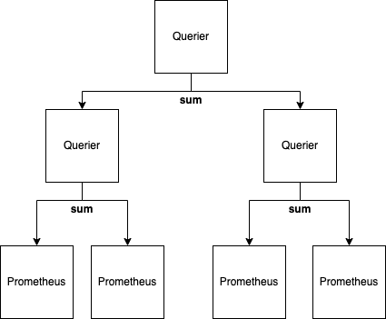
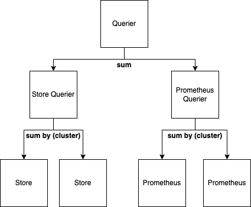
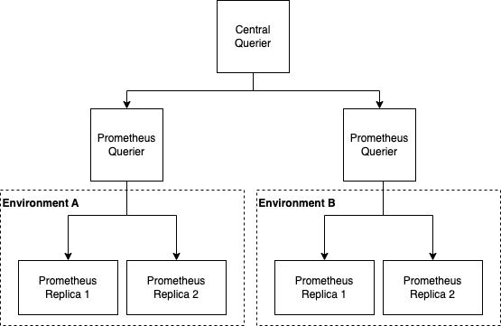
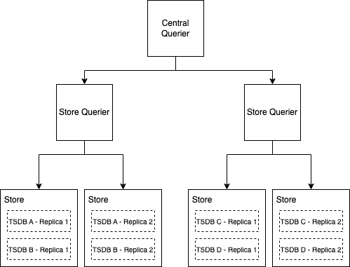
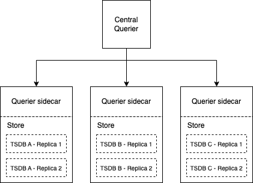

## 1 Related links/tickets

* https://github.com/thanos-io/thanos/pull/5250
* https://github.com/thanos-io/thanos/pull/4917
* https://github.com/thanos-io/thanos/pull/5350
* https://github.com/thanos-community/promql-engine/issues/25

## 2 Why

Thanos Queriers currently need to pull in all data from Stores in memory before they can start evaluating a query. This has a large impact on the used memory inside a single querier, and drastically increases query execution latency.

Even when a Querier is connected to other Queriers, it will still pull raw series instead of delegating parts of the execution to its downstreams. This document proposes a mode in the Thanos Querier where it will dispatch parts of the execution plan to different, independent Queriers.

## 3 Pitfalls of current solutions

We have two mechanisms in Thanos to distribute queries among different components.

Query pushdown is a mechanism enabled by query hints which allows a Thanos sidecar to execute certain queries against Prometheus as part of a `Series` call. Since data is usually replicated in at least two Prometheus instances, the subset of queries that can be pushed down is quite limited. In addition to that, this approach has introduced additional complexity in the deduplication iterator to allow the Querier to distinguish between storage series and PromQL series.

Query Sharding is a execution method initiated by Query Frontend and allows for an aggregation query with grouping labels to be distributed to different Queriers. Even though the number of queries that can be sharded is larger than the ones that can be pushed down, query sharding still has a limited applicability since a query has to contain grouping labels. We have also noticed in practice that the execution latency does not fall linearly with the number of vertical shards, and often plateaus off at around ~4 shards. This is especially pronounced when querying data from Store Gateways, likely due to amplifying `Series` calls against Store components.

## 4 Audience

* Thanos users who have challenges with evaluating PromQL queries due to high cardinality.

## 5 Goals

* Enable decentralized query execution by delegating query plan fragments to independent Queriers.

## 6 Proposal

The key advantage of distributed execution is the fact that the number of series is drastically reduced when a query contains an aggregation operator (`sum`, `group`, `max`, etc..). Most (if not all) high cardinality PromQL queries are in-fact aggregations since users will struggle to sensibly visualise more than a handful of series.

We therefore propose an execution model that allows running a Thanos Querier in a mode where it transforms a query to subqueries which are delegated to independent Queriers, and a central aggregation that is executed locally on the result of all subqueries. A simple example of this transformation is a `sum(rate(metric[2m]))` expression which can be transformed as

```
sum(
  coalesce(
    sum(rate(metric[2m])),
    sum(rate(metric[2m]))
  )
)
```

### How

The proposed method of transforming the query is extending the Thanos Engine with a logical optimizer that has references to other query engines. An example API could look as follows:

```
type DistributedExecutionOptimizer struct {
	Endpoints api.RemoteEndpoints
}

type RemoteEndpoints interface {
	Engines() []RemoteEngine
}

type RemoteEngine interface {
	NewInstantQuery(opts *promql.QueryOpts, qs string, ts time.Time) (promql.Query, error)
	NewRangeQuery(opts *promql.QueryOpts, qs string, start, end time.Time, interval time.Duration) (promql.Query, error)
}
```

The implementation of the `RemoteEngine` will be provided by Thanos itself and will use the gRPC Query API added in [https://github.com/thanos-io/thanos/pull/5250](https://github.com/thanos-io/thanos/pull/5250).

Keeping PromQL execution in Query components allows for deduplication between Prometheus pairs to happen before series are aggregated.



The initial version of the solution can be found here: https://github.com/thanos-community/promql-engine/pull/139

### Query rewrite algorithm

As described in the section above, the query will be rewritten using a logical optimizer into a form that is suitable for distributed execution.

The proposed algorithm is as follows:
* Start AST traversal from the bottom up.
* If both the current node and its parent can be distributed, move up to the parent.
* If the current node can be distributed and its parent cannot, rewrite the current node into its distributed form.
* If the current node cannot be distributed, stop traversal.

With this algorithm we try to distribute as much of the PromQL query as possible. Furthermore, even queries without aggregations, like `rate(http_requests_total[2m])`, will be rewritten into

```
coalesce(
  rate(http_requests_total[2m]),
  rate(http_requests_total[2m])
)
```

Since PromQL queries are limited in the number of steps they can evaluate, with this algorithm we achieve downsampling at query time since only a small number of samples will be sent from local Queriers to the central one.

### Time-based overlap resolution

Thanos stores usually have a small overlap with ingestion components (Prometheus/Receiver) due to eventually consistency from uploading and downloading TSDB blocks. As a result, the central aggregation needs a way to deduplicate samples between ingestion and storage components.

The proposed way to do time-based deduplication is by removing identical samples in the `coalesce` operator in the Thanos Engine itself. In order for data from independent Queriers to not get deduplicated, aggregations happening in remote engines must always preserve external labels from TSDB blocks that are being queried.

To illustrate this on an example, we can assume that we have two clusters `a` and `b`, each being monitored with a Prometheus pair and with each Prometheus instance having an external `cluster` label. The query `sum(rate(metric[2m]))` would then be rewritten by the optimizer into:

```
sum(
  coalesce(
    sum by (cluster) (rate(metric[2m])),
    sum by (cluster) (rate(metric[2m]))
  )
)
```

Each subquery would preserve the external `cluster` label which will allow the `coalesce` operator to deduplicate only those samples which are calculated from the same TSDB blocks. External labels can be propagated to the central engine by extending the `RemoteEngine` interface with a `Labels() []string` method. With this approach, local Queriers can be spread as widely as needed, with the extreme case of having one Querier per deduplicated TSDB block.



## Deployment models

With this approach, a Thanos admin can arrange remote Queriers in an arbitrary way, as long as TSDB replicas are always queried by only one remote Querier. The following deployment models can be used as examples:

#### Monitoring different environments with Prometheus pairs

In this deployment mode, remote queriers are attached to pairs of Prometheus instances. The central Querier delegates subqueries to them and performs a central aggregation of results.



#### Querying separate Store Gateways and Prometheus pairs

Remote Queriers can be attached to Prometheus pairs and Store Gateways at the same time. The central querier delegates subqueries and deduplicates overlapping results before performing a central aggregation.



#### Running remote Queriers as Store Gateway sidecars

Remote Queriers can be attached to disjoint groups of Store Gateways. They can even be attached to individual Store Gateways which have deduplicated TSDB blocks, or hold all replicas of a TSDB block. This will make sure penalty-based deduplication happens in the remote querier.

Store groups can be created by either partitioning TSDBs by time (time-based partitioning), or by external labels. Both of these techniques are documented in the [Store Gateway documentation](https://thanos.io/tip/components/store.md/#time-based-partitioning).



## 7 Alternatives

A viable alternative to the proposed method is to add support for Query Pushdown in the Thanos Querier. By extracting better as described in https://github.com/thanos-io/thanos/issues/5984, we can decide to execute a query in a local Querier, similar to how the sidecar does that against Prometheus.

Even though this approach might be faster to implement, it might not be the best long-term solution due to several reasons. To some extent, Query Pushdown misuses the `Series` API and the Querier requesting series is not aware that the query was actually executed. This can be problematic for distributing something like `count(metric)` since the distributed version should end up as:

```
sum(
  coalesce(
    count(metric),
    count(metric)
  )
)
```

The root querier would need to know that downstream queriers have already executed the `count` and should convert the aggregation into a `sum`

A similar problem can happen with a `sum(rate(metric[2m]))` expression where downstream queriers calculate the `sum` over the metric's `rate`. In order for the values to not get rated twice, either the downstream queriers need to invert the rate into a cumulative value, or the central querier needs to omit the rate and only calcualte the sum.

Managing this complexity in Thanos itself seems error prone and hard to maintain over time. As a result, this proposal suggests to localize the complexity into a single logical optimizer as suggested in the sections above.

Depending on the success of the distributed execution model, we can also fully deprecate query pushdown and query sharding and replace them with a single mechanism that can evolve and improve over time.
