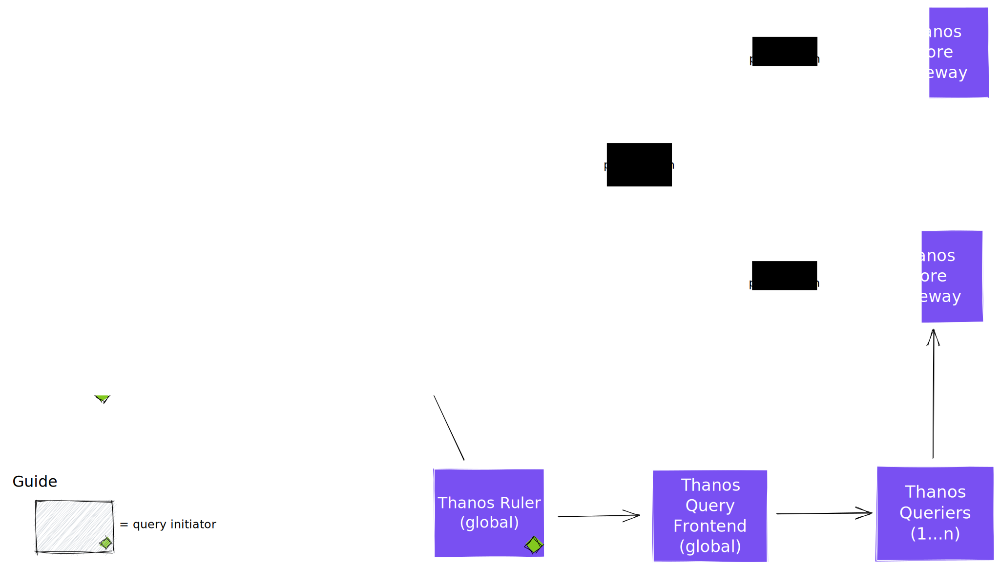

## Tenancy awareness in query path

* **Owners:**
  * [@douglascamata](https://github.com/douglascamata)

* **Related Tickets:**
  * [Querier: Added native multi-tenancy support](https://github.com/thanos-io/thanos/pull/4141).
  * [Proposal: Native Multi-tenancy Support](https://github.com/thanos-io/thanos/pull/4055)

* **Other docs:**
  * [Multi-tenancy in Thanos](https://thanos.io/tip/operating/multi-tenancy.md/)

This design doc proposes to add tenancy awareness in the query path.

## Why

In a multi-tenant environment, it is important to be able to identify which tenants are experiencing issues and configure (e.g. with different limits) each one of them individually and according to their usage of the platform so that the quality of service can be guaranteed to all the tenants.

### Pitfalls of the current solution

The current lack of tenancy awareness in Thanos' query path makes it impossible to investigate issues related to multi-tenancy without the use of external tools, proxies, or deploying a full dedicated query path for each tenant (including one Query Frontend if the setup needs it, one Querier, and one Storage Gateway, to be as complete as possible). For example, it's impossible to determine which tenants are experiencing high latency or high error rates

## Goals

* Allow the query path components to be configurable to identify tenants, opening the way to the implementation per-tenant features on the query path without needing to run multiple copies of the components, each dedicated to a single tenant. These features include, but aren't limited to, the following:
  * Per-tenant observability.
  * Per-tenant settings. For example, having different limits per tenant, which is a common request.
  * Enforce presence of one or more tenant labels in queries.

### Audience

Any team running Thanos in a multi-tenant environment. For example, a team running a monitoring-as-a-service platfor. For example, a team running a monitoring-as-a-service platform.

## Non-Goals

* Add multi-tenancy to Thanos Ruler. 
* Implement cross-tenant querying. It poses the question about how to track metrics of a multi-tenant query, probably requiring new logic for query splitting and/or separation of the concepts of query initiator tenant and query target tenants. To exemplify: if tenant A executes a query touching their own data and tenant B data (imagine a label matcher `tenant_id=~"A|B"`), how does Thanos export a request duration metric about this query? This is out of scope and an specific proposal can be created for it.

## How

* Implement a mechanism to allow incoming requests to specify the tenant being queried using an HTTP header. This applies to all components in the query path. We follow the example of Thanos Receive, which uses the `--receive.tenant-header="THANOS-TENANT"` flag to configure the tenant header, adapting its name to each component. So in the Querier, the flag name will be `--querier.tenant-header`, in the Store Gateway it'll be `--store.tenant-header`, and so on.
* The tenant header value from a given request should travel downstream to all the components being called, so that it can be added to their metrics, traces, and logs without requiring duplicated/extra work to re-parse the query. This also applies to gRPC calls.
* Implement a command line argument in the Querier component that will indicate with label name that should be used to enforce tenancy. Again, we follow the example of Thanos Receive, which uses the `--receive.tenant-label-name="tenant_id"` flag to achieve this, and adapt its name just as described on the first point (changing the `receive` part to `querier`). The default behavior, when the flag as an empty string as value, is to not identify tenants.
  * The label verification and enforcement should be done by reusing prom-label-proxy's [Enforce.EnforceMatchers](https://github.com/prometheus-community/prom-label-proxy/blob/main/injectproxy/enforce.go#L141). There's no reason to (re)implement something specific and special for Thanos.
  * This behavior should be implemented as part of the base logic of both the HTTP and gRPC query APIs, before the query is handed to the query engine. This allows users managing complex Querier trees can choose where they want this logic to be enabled.
* Update metrics exported by the components in the query path to include the tenant label when it's available.
* Implement a tenant selector in the Query Frontend UI, which should communicate the tenant to Query Frontend using the HTTP header.

<figure>

<figcaption>Diagram also available <a href="https://excalidraw.com/#json=ozCXvw8LBURpWkmiA4Loq,Nclh-Sw9g_mzO3gsM6yaRQ">online</a>.</figcaption>
</figure>

## Alternatives

### Alternative implementations

1. Apply verification and enforcement logic in the Query Frontend instead of Querier.

The Query Frontend is an optional component on any Thanos deployment, while the Querier is always present. Plus, there might be deployments with multiple Querier layers where one or more might need to apply tenant verification and enforcement. On top of this, doing it in the Querier supports future work on using the [new Thanos PromQL engine](https://github.com/thanos-community/promql-engine), which can potentially make the Query Frontend unnecessary.

### Alternative solutions

1. Use a proxy to enforce and identify tenants in queries.

While this could work for some of the features, like exporting per-tenant metrics, it would have to be inserted in front of many different components. Meanwhile, it doesn't solve the requirement for per-tenant configuration.

2. Use a separate query path for each tenant.

This incurs in a lot of wasted resources and demands manual work, unless a central tenant configuration is used and a controller is built around it to automatically manage the query paths.

## Action Plan

1. Query Frontend
   1. Implement the `--query-frontend.tenant-header` (default is `""`") and `--query-frontend.default-tenant` (default is `"default-tenant"`) flags. Forward the tenant header to all the configured downstream query endpoints, if it is present.
   2. **In the UI**, add a textbox where one can type a tenant name. If the textbox has any content, that will be sent using in the configured tenant header name.
   3. Update the metrics exported by the Query Frontend to include a tenant label with the tenant indicated by the header.
2. Querier
   1. Implement the `--querier.tenant-header` (default is `""`") and `--querier.default-tenant` (default is `"default-tenant"`) flags. Forward the tenant header to all the downstream API calls (gRPC or HTTP, also using headers), if it is present.
   2. Implement the `--querier.tenant-label-name` flag. If it is not empty, verify and enforce the tenant label in the query before it is handed to the query engine. As previously mentioned by the proposal, use prom-label-proxy's [Enforce.EnforceMatchers](https://github.com/prometheus-community/prom-label-proxy/blob/main/injectproxy/enforce.go#L141).
   3. Update the metrics exported by the Querier to include a tenant label with the tenant indicated by the header.
3. Store Gateway
   1. Implement the `--store.tenant-header` (default is `""`") and `--query-frontend.default-tenant` (default is `"default-tenant"`) flags. Use the tenant header to identify the tenant in the metrics exported by the Store Gateway.
