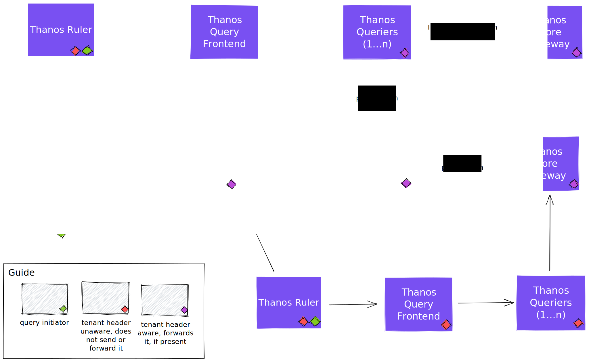

## Tenancy awareness in query path

* **Owners:**
  * [@douglascamata](https://github.com/douglascamata)

* **Related Tickets:**
  * [Querier: Added native multi-tenancy support](https://github.com/thanos-io/thanos/pull/4141).
  * [Proposal: Native Multi-tenancy Support](https://github.com/thanos-io/thanos/pull/4055)

* **Other docs:**
  * [Multi-tenancy in Thanos](https://thanos.io/tip/operating/multi-tenancy.md/)

This design doc proposes to add tenancy awareness in the query path.

## Why

In a multi-tenant environment, it is important to be able to identify which tenants are experiencing issues and configure (e.g. with different limits) each one of them individually and according to their usage of the platform so that the quality of service can be guaranteed to all the tenants.

### Pitfalls of the current solution

The current lack of tenancy awareness in Thanos' query path makes it impossible to investigate issues related to multi-tenancy without the use of external tools, proxies, or deploying a full dedicated query path for each tenant (including one Query Frontend if the setup needs it, one Querier, and one Storage Gateway, to be as complete as possible). For example, it's impossible to determine which tenants are experiencing high latency or high error rates

## Goals

* Allow the query path components to be configurable to identify tenants, opening the way to the implementation per-tenant features on the query path without needing to run multiple copies of the components, each dedicated to a single tenant. These features include, but aren't limited to, the following:
  * Per-tenant observability.
  * Per-tenant settings. For example, having different limits per tenant, which is a common request.
  * Per-tenant billing.
  * Ensure a tenant's query does not end up returning data from a different tenant, through enforcing presence of one or more tenant labels in queries.
* Strive for being compatible with other tools, such as Cortex, as much as possible. This make adoption, migration, and collaboration between projects to become easier.

### Tenancy model

The tenancy model for queries differ from the one used in Thanos Receive, where the tenant indicates who owns that data. From a query perspective, the tenant will indicate who is initiating such query. Although this proposal will use this tenant to automatically enforce a tenant label matcher into the query, whenever cross-tenant querying is implemented (not part of this proposal) this behavior could likely change.

### Audience

Any team running Thanos in a multi-tenant environment. For example, a team running a monitoring-as-a-service platform. For example, a team running a monitoring-as-a-service platform.

## Non-Goals

* Add multi-tenancy to Thanos Ruler.
* Implement cross-tenant querying. It poses the question about how to track metrics of a multi-tenant query, probably requiring new logic for query splitting and/or separation of the concepts of query initiator tenant and query target tenants. To exemplify: if tenant A executes a query touching their own data and tenant B data (imagine a label matcher `tenant_id=~"A|B"`), how does Thanos export a request duration metric about this query? This is out of scope and an specific proposal can be created for it.

## How

* Implement a mechanism to allow incoming requests to specify the tenant triggering the query using an HTTP header. This only needs to be configurable at the Query Frontend and Querier.
  * This is needed in the Query Frontend because it needs per-tenant observability and configuration.
* We follow the example of Thanos Receive, which uses the `--receive.tenant-header="THANOS-TENANT"` flag to configure the tenant header, adapting its name to each component. So in the Querier, the flag name will be `--querier.tenant-header="THANOS-TENANT` and in the Query Frontend it will be `--query-frontend.tenant-header="THANOS-TENANT"`. This ensures we have consistency across components and make adoption easier for those already using a custom header name in Receive or coming from other alternative tools, like Cortex.
* The tenant header value from a given request should travel downstream to all the components being called, so that it can be added to their metrics, traces, and logs without requiring duplicated/extra work to re-parse the query. This applies to gRPC calls in a different fashion, where gRPC metadata should be used.
  * In this case, the header name should be hardcoded and standardized between the components.
* Implement a command line flag in the Querier component that will turn on the enforcement of a tenant label selector in queries. Name suggestion for the flag: `--querier.tenancy="false"`.
  * The label verification and enforcement should be done by reusing prom-label-proxy's [Enforce.EnforceMatchers](https://github.com/prometheus-community/prom-label-proxy/blob/main/injectproxy/enforce.go#L141). There's no reason to (re)implement something specific and special for Thanos.
  * This behavior should be implemented as part of the base logic of both the HTTP and gRPC query APIs, before the query is handed to the query engine. This allows users managing complex Querier trees can choose where they want this logic to be enabled.
* Implement a command line flag in the Querier component that will indicate with label name that should be used to enforce tenancy.
  * Following the example of Thanos Receive for consistency, and use `--query.tenant-label-name="tenant_id"` flag to identify the tenancy label.
* Update metrics exported by the components in the query path to include the tenant label when it's available.
* Implement a tenant selector in the Query Frontend UI, which should communicate the tenant to Query Frontend using the HTTP header.

### TL;DR:

Identifying and transporting tenant information between requests:

* Happens in Query Frontend (optional component to help scale queries) and Querier.
* Customizable header name for picking up the tenant of incoming queries. Use `THANOS-TENANT` as default value. Consistent with the behavior of Thanos Receive.
* Hardcoded opinionated header to carry tenant information in internal communication between components, reducing configuration flags.
* In gRPC requests propagate tenant identification using gRPC metadata.

Enforcing tenancy label in queries:

* Happens in Querier only.
* Enabled by a single configuration flag if using default values for tenant label name and tenant header name.
* Uses tenant identified through the header.
* Enforces the presence of the configured tenant label name and matches with the identified tenant. Uses `tenant_id` as default label name. Consistent with the behavior of Thanos Receive.

<figure>

<figcaption>Diagram also available <a href="https://excalidraw.com/#json=ozCXvw8LBURpWkmiA4Loq,Nclh-Sw9g_mzO3gsM6yaRQ">online</a>.</figcaption>
</figure>

## Alternatives

### Alternative implementations

#### Apply verification and enforcement logic in the Query Frontend instead of Querier.

The Query Frontend is an optional component on any Thanos deployment, while the Querier is always present. Plus, there might be deployments with multiple Querier layers where one or more might need to apply tenant verification and enforcement. On top of this, doing it in the Querier supports future work on using the [new Thanos PromQL engine](https://github.com/thanos-community/promql-engine), which can potentially make the Query Frontend unnecessary.

#### Add the tenant identification as an optional field in the Store API protobuffer spec instead of an HTTP header.

Pros:

* There's no guessing where the tenant information is passed through. It would be passed always through the same field in the gRPC message.

Cons:

* It's still needed to identify the tenant from incoming requests sent to Query Frontend and Querier via HTTP headers.
* Creates inconsistency between components on how the tenant information is passed through. In Receive, for example, it's passed through a header. This hurts code reusability and understanding.
* Creates inconsistency between APIs. We have other APIs besides the Store API. We can set the standard of an internal and hardcoded header for the HTTP requests and gRPC metadata for the gRPC requests.
* Even though Thanos itself doesn't implementation authentication, the query tenancy can be seen as result of authentication. Semantically, headers are often used to convey results of authentication.
* Incompatible with other tools and projects. Using a header in the HTTP communication allows Thanos to be compatible with Cortex and other monitoring tools. This is a plus for adoption, migration, and collaboration between the projects.

### Alternative solutions

#### Use a proxy to enforce and identify tenants in queries.

While this could work for some of the features, like exporting per-tenant metrics, it would have to be inserted in front of many different components. Meanwhile, it doesn't solve the requirement for per-tenant configuration.

### Use a separate query path for each tenant.

This incurs in a lot of wasted resources and demands manual work, unless a central tenant configuration is used and a controller is built around it to automatically manage the query paths.

## Action Plan

1. Query Frontend
   1. Add `--query-frontend.tenant-header="THANOS-TENANT"` flag to forward the tenant ID from incoming requests to downstream query endpoints.
   2. Use `Thanos-Tenant` (hardcoded) as the internal header name for these downstream requests.
   3. In the Query Frontend UI, add a textbox for entering tenant names to be sent with the configured tenant header name.
   4. Update Query Frontend metrics to include a tenant label based on the header.
2. Querier
   1. Add flags `--querier.tenant-header="THANOS-TENANT"`, `--querier.default-tenant="default-tenant"` to identify and forward tenant ID in internal communications.
   2. Add flags `--querier.tenant-label="tenant-id"` and `--querier.tenancy="false"` to enable tenancy, identify the tenant, verify and enforce the tenant label in queries using [prom-label-proxy's Enforce.EnforceMatchers](https://github.com/prometheus-community/prom-label-proxy/blob/main/injectproxy/enforce.go#L141).
   3. Update Querier metrics to include a tenant label based on the header.
3. Store Gateway
   1. Use the internal tenant header to identify tenant in requests and include it in Store Gateway metrics.
