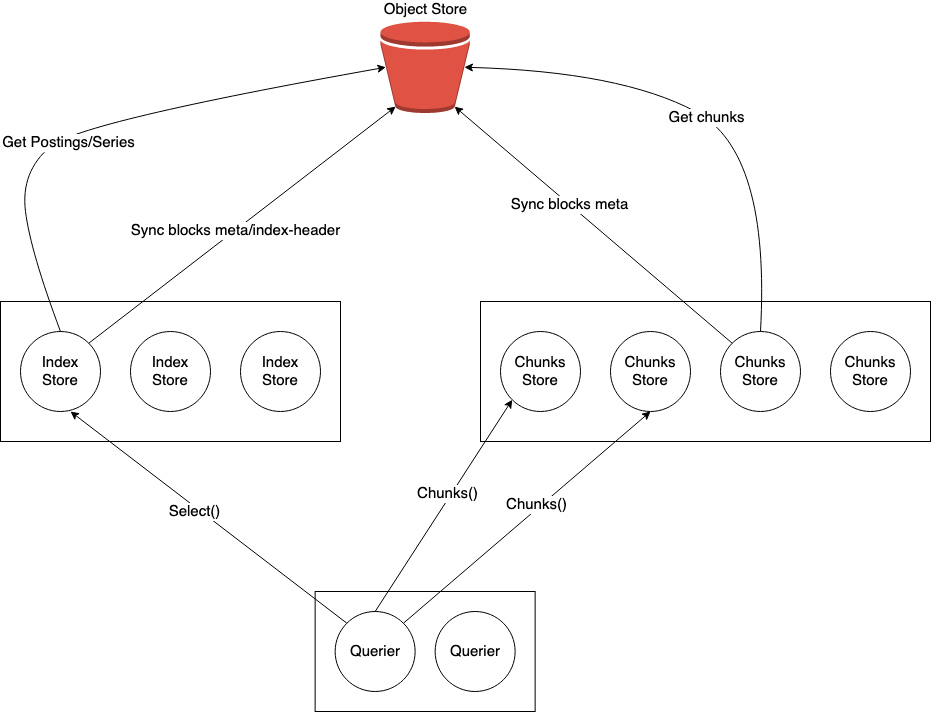

## Related Tickets
- https://github.com/thanos-io/thanos/issues/6894

## Summary

This document describes a proposal for splitting the `Store` service into two separate services - `IndexStore` and `ChunkStore`.

## Motivation

### Independent Scaling

Currently, store gateway performs two distinct operations on blocks in object store - index reads to fetch the series and the chunk references and chunk reads to fetch the encoded chunks. In practice these operations can have different scaling needs.

#### Queries heavy on postings

Queries that fetch a lot of postings but selects few series after postings intersection will have a higher load on index operations than chunks.

```
http_requests_total{pod="abc", method=~"GET", pod=~".+"}
```

The above query could be more heavy on postings than chunks because of the regex matcher on pod label.

#### Queries heavy on chunks

There are also long range queries that fetch lots of chunks but not fetch a lot of postings before intersection.

```
http_requests_total{method="GET"}
```

Having separate services for index and chunks fetches can help scale each operations independently. Each service could have different instance types, different memory, CPU, disks.

### Statelessness

Currently, store gateway in Thanos downloads the index-header for each block it is responsible for at startup. This slows down the start up time and reduces the scaling speed.
Chunk look ups are stateless and doesn’t require the index-header on disk. A separate stateless service for chunks will make it easier and faster to scale the chunk look ups.

### Streaming Chunks in the engine

The VectorOperator in Thanos PromQL engine exposes two distinct APIs `Series()` and `Next()`. The call to Series() on an operator is expected to return all the series the operator would ever return. The calls to `Next()` returns a StepVector containing the samples. The streaming nature of `Next()` means that all the chunks need not be buffered in memory and can be streamed from the storage layer. Separating the chunks fetch from the current Series API in Thanos provides a possibility of streaming in the new engine in the future.

### Increase concurrency for chunks fetch

Store gateway fetches series and chunks in batches. With a default batch size of 10000, Store Gateway tries to fetch the a batch of series first, then fetch the chunks for matched series of the current batch. It continues to next batch until all required series are processed. The code can be found here.

Although within the same batch, Store Gateway can usually use multiple goroutines to fetch series and chunks, it doesn’t parallelize data fetching for different batches. For example, it needs to finish fetching chunks of batch 1 before fetching chunks of batch 2.

By having a dedicated `ChunkStore` service, Querier can ask for chunks from different batches from multiple `ChunkStore` at the same time to improve query latency.

### Reduce chance of chunk pool exhaustion

Chunk pool exhaustion is a common issue when running long time range, chunks heavy queries.
Currently, horizontally scale up Store Gateway is one way to handle this. But it scales up both Index and Chunks read path at the same time, which is unnecessary because Chunks read path scale up should be sufficient.

By allowing Index and Chunks read path scale up separately, chunk pool exhaustion issue can be addressed more effectively.

Besides, different chunk fetch request batches can go to different `ChunkStore` , which helps split chunks heavy requests to multiple sub-requests and balance the load, lowering the chance of chunk pool exhaustion.

## Goals

1. Able to scale up index and chunks look up independently.
2. Existing monilith Store Gateway is still the default. Index Chunk Store splitting is just another mode to choose from and won’t impact behaviors of existing Store Gateway.

## Non-Goals

1. Streaming chunks in the engine - Although in theory it makes sense it may be complicated to implement and is out of scope of this proposal.
2. Removing/Replacing the Store API - `Sidecar`, `Receiver` and `Rules` also implements the `Store` API. This proposal will not modify, deprecate or remove the `Store` API.

## Proposal

### Architecture

The `Store` service will be split into two different services `IndexStore` and `ChunkStore` each responsible for reading from the index and the chunks respectively.



### `IndexStore`

The `IndexStore` will be responsible for querying the TSDB index for the series labels and the chunk metadata. At start up the Index Store will sync the blocks meta and download the index-header for each block it is responsible for.

#### API

The `IndexStore` will implement the `Select()` API. The `SelectRequest` will be same as the `SeriesRequest`. The `SelectResponse` will return the blockID, the series labels and the chunks metadata for each `SelectedSeries`.

#### Service

```
service IndexStore {
  rpc Select(SelectRequest) returns (stream SelectResponse);
  rpc LabelNames(LabelNamesRequest) returns (LabelNamesResponse);
  rpc LabelValues(LabelValuesRequest) returns (LabelValuesResponse);
}
```

#### Models

```
message SelectResponse {
    oneof result {
        typespb.SelectedSeries series = 1;
        string warning = 2;
        google.protobuf.Any hints = 3;
    }
}

message SelectedSeries {
  string blockId = 1;
  repeated Label labels = 2;
  repeated ChunkMeta chunks = 3;
}

message ChunkMeta {
  int64 mint = 1;
  int64 maxt = 2;
  uint64 ref = 3;
}
```

### `ChunkStore`

The `ChunkStore` will implement a bi-directional streaming API. The Chunks API accepts a stream of chunks request containing blockID and the chunkRefs. After receiving all the requests the chunk store will return the response for each request in the same order.

#### API

#### Service

```
service ChunkStore {
    rpc Chunks(stream ChunksRequest) returns (stream ChunksResponse);
}
```

#### Models
```
message ChunksRequest {
    string blockId = 1;
    repeated uint64 chunkref = 2;
}

message ChunksResponse {
    repeated typespb.AggrChunk chunks = 1;
}
```

### Querier

#### Fetching series and chunks

The querier will first make a `Select()` call to the `IndexStore` to retrieve the Series labels and the metadata about the chunks. The querier would make concurrent calls to multiple `ChunkStore`s to read the corresponding chunks.
A `SeriesSet` will be created by stitching together the chunks with the corresponding series.

#### Adapting the Select()/Chunks() into Series()

Querier fetches data from Stores using Store API, which uses Series API to fetch series labels and chunks at the same time. The new Select and Chunks API are not compatible with Series API and we don’t want to introduce breaking changes.

To allow querying `IndexStore` and `ChunkStore` using `Select()` and `Chunks()` requests, we can add an adapter in querier which exposes Store API, but uses `Select()` and `Chunks()` API to fetch data instead.

The adapter can be implemented as a `storepb.StoreClient`. https://github.com/thanos-io/thanos/blob/v0.32.5/pkg/store/proxy.go#L49

#### Merging series from multiple blocks

Currently the `Series()` API implemented by `Store` allows querying multiple blocks at the same time. The proxy heap is used to merge the series read from multiple blocks and remove duplicate series and identical chunks. This requires some rethought and a few possibilities are described below.

#### Merge both series and chunks on querier

The `IndexStore` only supports querying a single block per request. Each Thanos querier would make separate `Select()` request to the `IndexStore` for each block. The merging and the de-dupes will be done on the querier after getting the chunks.

#### Merge series on IndexStore and de-dupe chunks on querier [preferred]

The `IndexStore` will allow querying multiple blocks per request. Only the series dedupes would be performed on the `IndexStore`. Identical chunks would be removed on the querier after chunks are fetched from the `ChunkStore`

### Endpoint Discovery

`Info` API will be exposed in `IndexStore` so that Querier can discover index store the same way as discovering current stores.
`ChunkStore` is stateless and it only exposes `Chunks()` gRPC API. Querier can use DNS service discovery for it.

## Alternatives Considered

### Lazy Loading blocks

Instead of splitting the chunks part, store-gateways could be made stateless through lazy loading blocks. We still think that the scaling needs are different for index and chunks. Splitting would provide more flexibility allowing to choose the instance type, the resources etc.


### Querier fetches chunks directly

Querier can fetches chunks directly from either cache or object storage using block ID and chunk references. There is no need to have a dedicated chunks gateway service.

We didn’t pick up this because of some downsides:

* Querier needs to have a dedicated chunk pool, which might cause higher memory usage.
* In order to do chunks look up, Querier needs to sync blocks metadata to get chunk files information

### Index Gateway fetches chunks from chunks gateway

Instead of having Querier to call `Select()` and `Chunks()` to get index and chunks information separately, Querier can perform the work of fetching chunks from the IndexStore  as well. Basically, `IndexStore`  fetches chunks from `ChunkStore` and returns both series and chunks back to Querier. There are pros and cons for this approach.

Pros:

* Easier to implement. There is almost no change at Querier side and no need to add Store API adapter.

Cons:

* IndexStore will have higher memory usage. For chunks heavy queries, it might require to scale up `IndexStore`, which defeats the goal of scaling up Index and Chunks look up independently.

## Work Plan

* Add `Select()` and `Chunks()` method and refactor Store Gateway code.
* Add an adapter in querier to adapt `Select()` and `Chunks()` into `Series()`.

## Open questions
* Should the chunks request be made per block?
* Should the `Chunks()` API accept an array of `ChunksRequest` instead of bi-directional streaming.
* Should the `Chunks()` calls be bootstraped with the blockID first to avoid having to send blockID for every .

