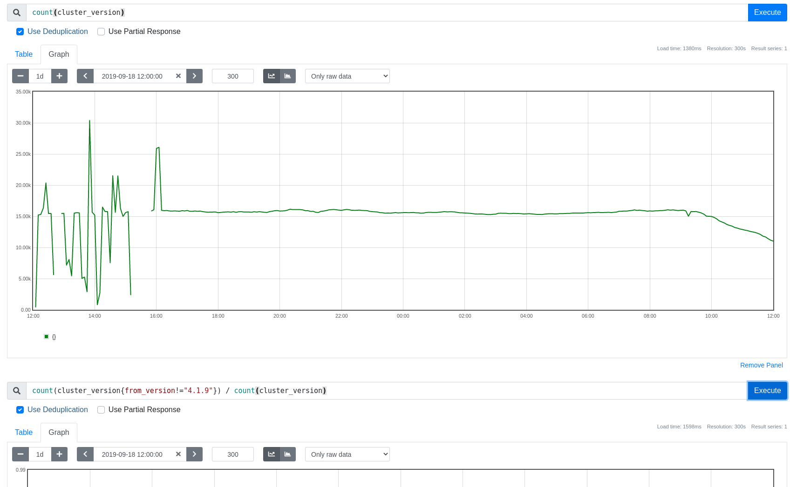

## Avoid Global Sort on Querier Select

* **Related Tickets:**
  * https://github.com/thanos-io/thanos/issues/5719
  * https://github.com/thanos-io/thanos/commit/043c5bfcc2464d3ae7af82a1428f6e0d6510f020
  * https://github.com/thanos-io/thanos/pull/5796 also alternatives (https://github.com/thanos-io/thanos/pull/5692)

> TL;DR: We propose solution that allows saving query and query_range latency on common setups when deduplication on and data replication. Initial benchmarks indicate ~20% latency improvement for data replicated 2 times.
>
> To make it work we propose adding field to Store API Series call "WithoutReplicaLabels []string", guarded by "SupportsWithoutReplicaLabels" field propagated via Info API. It allows telling store implementations to remove given labels (if they are replica labels) from result, preserving sorting by labels after the removal.
>
> NOTE: This change will break unlikely setups that deduplicate on non-replica label (misconfiguration or wrong setup).

## Glossary

**replica**: We use term "replica labels" as a subset of (or equal to) "external labels": Labels that indicate unique replication group for our data, usually taken from the metadata about origin/source.

## Why

Currently, we spent a lof of storage selection CPU time on resorting resulting time series needed for deduplication (exactly in [`sortDedupLabels`](https://github.com/thanos-io/thanos/blob/main/pkg/query/querier.go#L400)). However, given distributed effort and current sorting guarantees of StoreAPI there is potential to reduce sorting effort or/and distribute it to leafs or multiple threads.

### Pitfalls of the current solution

Current flow can be represented as follows:


1. Querier PromQL Engine selects data. At this point we know if users asked for deduplicated data or not and [what replica labels to use](https://thanos.io/tip/components/query.md/#deduplication-replica-labels).
2. Querier selection asks internal, in-process Store API which is represented by Proxy code component. It asks relevant store API for data, using StoreAPI.Series.
3. Responses are pulled and k-way merged by the time series. StoreAPI guarantees the responses are sorted by series and the external labels (including replica) are included in the time series.
* There was a [bug in receiver](https://github.com/thanos-io/thanos/commit/043c5bfcc2464d3ae7af82a1428f6e0d6510f020#diff-b3f73a54121d88de203946e84955da7027e3cfce7f0cd82580bf215ac57c02f4) that caused series to be not sorted when returned. Fixed in v0.29.0.
4. Querier selection waits until all responses are buffered and then it deduplicates the data, given the requested replica labels. Before it's done it globally sort data with moving replica label at the end of the time series in `sortDedupLabels`.
5. Data is deduplicated using `dedup` package.

The pittfall is in the fact that global sort can be in many cases completely avoided, even when deduplication is enabled. Many storeAPIs can drop certain replica labels without need to resort and others can k-way merge different data sets without certain replica labels without extra effort.

## Goals

Goals and use cases for the solution as proposed in [How](#how):

* Avoid expensive global sort of all series before passing them to PromQL engine in Querier.
* Allow StoreAPI implementation to announce if it supports sorting feature or not. The rationale is that we want to make it possible to create simpler StoreAPI servers, if operator wants to trade-off it with latency.
* Clear the behaviour in tricky cases when there is an overlap of replica labels between what's in TSDB vs what's attached as external labels.
* Ensure this change can be rolled out in compatible way.

## Non-Goals

* Allow consuming series in streamed way in PromQL engine.
  * While this pitfall (global sort) blocks the above idea, it's currently still more beneficial to pull all series upfront (eager approach) as soon as possible. This is due to current PromQL architecture which requires info upfront for query planners and execution. We don't plan to change it yet, thus no need to push explicitly for that.

## How

### Invariants

To understand proposal, let's go through important, yet perhaps not trivial, facts:

* For StoreAPI or generally data that belongs to one replica, if you exclude certain replica label during sort, it does not impact sorting order for returned series. This means, any feature that desired different sort for replicated series is generally noop for sidecars, rules, single tenant receiver or within single block (or one stream of blocks).
* You can't stream sorting of unsorted data. Furthermore, it's not possible to detect that data is unsorted, unless we fetch and buffer all series.
* In v0.29 and below, you can deduplicate on any labels, including non replicas. This is assumed semantically wrong, yet someone might depend on it.
* Thanos never handled overlap of chunks within one set of store API response.

### Solution

To avoid global sort, we propose removing required replica labels and sort on store API level.

For the first step (which is required for compatibility purposes anyway), we propose a logic in proxy Store API implementation that when deduplication is requested with given replica labels will:

* Fallback to eager retrieval.
* Remove given labels from series (this is can remove non-replica labels too, same as it is possible now).
* Resort all series (just on local level).

Thanks of that the k-way merge will sort based on series without replica labels that will allow querier dedup to be done in streaming way without global sort and replica label removal.

As the second step we propose adding `without_replica_labels` field to `SeriesResponse` proto message of Store API:

```protobuf
message SeriesRequest {
  // ...

  // without_replica_labels are replica labels which have to be excluded from series set results.
  // The sorting requirement has to be preserved, so series should be sorted without those labels.
  // If the requested label is NOT a replica label (labels that identify replication group) it should be not affected by
  // this setting (label should be included in sorting and response).
  // It is the server responsibility to detect and track what is replica label and what is not.
  // This allows faster deduplication by clients.
  // NOTE(bwplotka): thanos.info.store.supports_without_replica_labels field has to return true to let client knows
  // server supports it.
  repeated string without_replica_labels = 14;
```

Since it's a new field, for compatibility we also propose adding `supports_without_replica_labels` in InfoAPI to indicate a server supports it explicitly.

```protobuf
// StoreInfo holds the metadata related to Store API exposed by the component.
message StoreInfo {
    reserved 4; // Deprecated send_sorted, replaced by supports_without_replica_labels now.

    int64 min_time = 1;
    int64 max_time = 2;
    bool supports_sharding = 3;

    // supports_without_replica_labels means this store supports without_replica_labels of StoreAPI.Series.
    bool supports_without_replica_labels = 5;
}
```

Thanks of that implementations can optionally support this feature. We can make all Thanos StoreAPI support it, which will allow faster deduplication queries on all types of setups.

In the initial tests we see 60% improvements on my test data (8M series block, requests for ~200k series) with querier and store gateway.

Without this change:


After implementing this proposal:



## Alternatives

1. Version StoreAPI.

As a best practice gRPC services should be versioned. This should allow easier iterations for everybody implementing or using it. However, having multiple versions (vs extra feature enablement field) might make client side more complex, so we propose to postpone it.

2. Optimization: Add "replica group" as another message in `SeriesResponse`

Extra slice in all Series might feel redundant, given all series are always grouped within the same replica. Let's do this once we see it being a bottleneck (will require change in StoreAPI version).

3. Instead of removing some replica labels, just sort without them and leave at the end.

For debugging purposes we could keep the replica labels we want to dedup on at the end of label set.

This might however be less clean way of providing better debuggability, which is not yet required.

Cons:
* Feels hacky. Proper way for preserving this information would be like alternative 4.
* Debuggability might be not needed here - YAGNI

4. Replica label struct

We could make Store API response fully replica aware. This means that series response will now include an extra slice of replica labels that this series belongs to:

```protobuf
message Series {
  repeated Label labels          = 1 [(gogoproto.nullable) = false, (gogoproto.customtype) = "github.com/thanos-io/thanos/pkg/store/labelpb.ZLabel"];
  repeated Label replica_labels  = 3 [(gogoproto.nullable) = false, (gogoproto.customtype) = "github.com/thanos-io/thanos/pkg/store/labelpb.ZLabel"]; // Added.

  repeated AggrChunk chunks  = 2 [(gogoproto.nullable) = false];
}
```

Pros:
* Easy to tell what is replica what's not on client of Store API level

Cons:
* Extra code and protobuf complexity
* Semantics of replica labels are hard to maintain when partial deduplication is configured (we only dedup by part of replica labels, not by all of them). This dynamic policy makes it hard to have clean response with separation of replica labels (i.e. should included replica labels be in "labels" or "replica labels")?

This might be not needed for now. We can add more awareness of replication later on.

## Action Plan

The tasks to do in order to migrate to the new idea.

* [X] Merging the PR with the proposal (also includes implementation)
* [X] Add support for `without_replica_label` to other store API servers.
* [ ] Move to deduplicate over chunks from series See [TODO in querier.go:405](../../pkg/query/querier.go)

```go
// TODO(bwplotka): Move to deduplication on chunk level inside promSeriesSet, similar to what we have in dedup.NewDedupChunkMerger().
// This however require big refactor, caring about correct AggrChunk to iterator conversion, pushdown logic and counter reset apply.
// For now we apply simple logic that splits potential overlapping chunks into separate replica series, so we can split the work.
set := &promSeriesSet{
	mint:  q.mint,
	maxt:  q.maxt,
	set:   dedup.NewOverlapSplit(newStoreSeriesSet(resp.seriesSet)),
	aggrs: aggrs,
	warns: warns,
}
```

## Post-mortem of proposal

We implemented an early version of this but immediately ran into correctness issues. The root of the problem, which resulted in inaccurate query responses, was that removing (or adding) labels to a set of labelsets potentially scrambled the order. This affected deduplication since it depends on receiving the series in an organized sequence. In simpler terms, to accurately duplicate, we need to be aware at all times if we have received all replicas for a given labelset; thus, deduplication only functions properly on organized series sets.

Let's consider we have the following series labels:

```
a=1,b=1
a=1,b=2
a=2,b=1
a=2,b=2
```

If the replica label is `a`, then the response transforms into:

```
b=1
b=2
b=1
b=2
```

Theoretically, we could address this in the distant future by modifying the ordering rules within the TSDB, but I'm uncertain if that will ever materialize.

Nevertheless, despite the initial challenges faced in implementation and subsequent reverting, we have made significant improvements to the querying internals. For example, we now use a ProxyHeap in a multitude of components, rather than repeating the same logic across each individual component.
