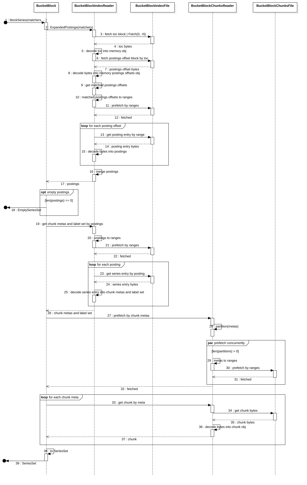
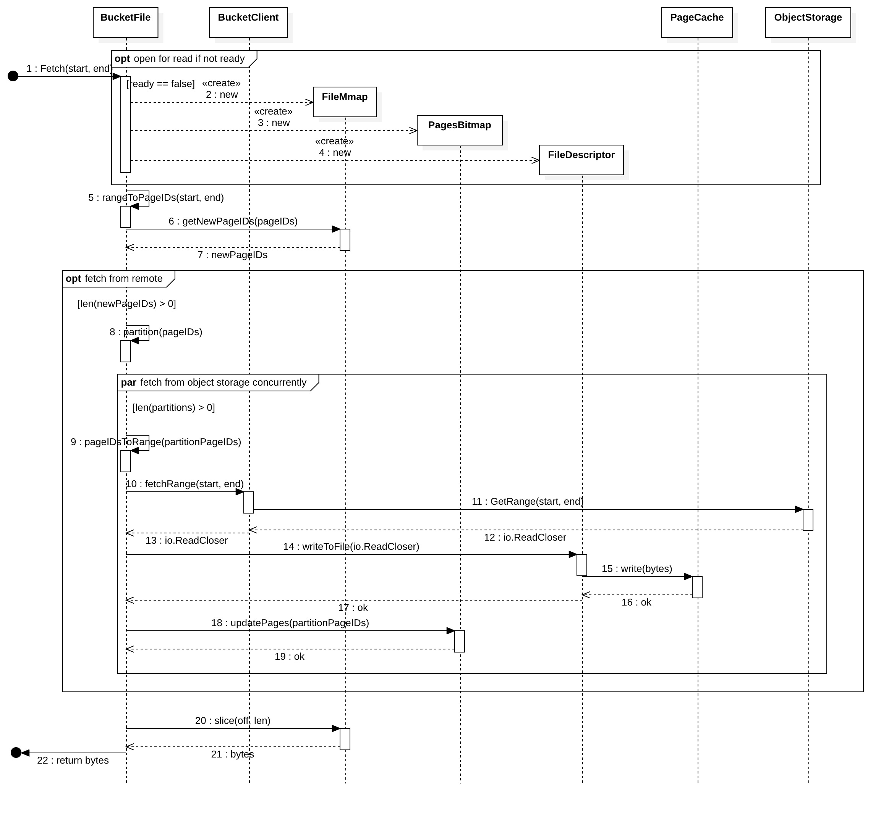

### Related Tickets

* https://github.com/thanos-io/thanos/issues/1471 (main)
* https://github.com/thanos-io/thanos/issues/448 (store gateway OOM)

## Summary

This document describes the motivation and design of the `BucketFile` of the store component. 

Our goals here are:

- A) Reduce memory usage
- B) Reuse chunks fetched from object storage

## Motivation

Currently, the store gateway loads all [index.cache.json](https://github.com/thanos-io/thanos/blob/865d5ec710b5651ead08a7dc73864a6f5dbeeaa9/pkg/block/index.go#L40)  files into memory on startup, which easily hits OOM situations. On the other hand, some indexes are rarely or never queried, so we don't have to keep these indexes in memory.

The store gateway fetches chunks from object storage for each query request. but fetched chunks are not reused for next requests.

## Proposal

Add a helper struct to wrapper remote object storage file. We can temporarily name it `BucketFile`.

`BucketFile`   looks like `ByteSlice` in  prometheus/tsdb, but with some download-with-cache functions. It fetches part or all of file content from object storage, writes content to local file, and records data have been fetched by a bitmap.

`BucketFile` always returns a slice of the mmaped file. This is to reduce coping file data from kernel space to user space. 

### BucketFile in a block




The above sequence diagram shows how the BucketFile works with IndexReader and ChunksReader in a block:

(BucketIndexFile and BucketChunksFile are represented by `BucketFile` )

1. BucketStore calls `blockSeries`  method to retrieve series from a block.
2. BucketBlock calls `ExpendedPostings`  method to retrieve expended postings from BucketIndexReader.
3. BucketIndexReader fetches [TOC](https://github.com/prometheus/prometheus/blob/master/tsdb/docs/format/index.md#toc) block (last 52 bytes) from BucketBlockIndexFile.  
4. BucketBlockIndexFile returns TOC block bytes.
5. BucketIndexReader decodes TOC bytes into memory `toc` obj.
6. BucketIndexReader gets the offset to postings offset block from `toc`, and fetches [postings offsets](https://github.com/prometheus/prometheus/blob/master/tsdb/docs/format/index.md#postings-offset-table) block.    
   // Fetch everything starting from the offset
7. BucketBlockIndexFile returns postings offsets block. 
8. BucketIndexReader decodes bytes into memory `postingsOffsets` obj.    
   // `postingsOffsets` `map[labels.Label]int64` , maps label to offset.
9. BucketIndexReader gets matched postings offsets from `postingsOffsets` obj.
10. BucketIndexReader converts  matched postings offsets to ranges. 
11. BucketIndexReader calls BucketIndexFile to prefetch ranges.
12. BucketIndexFile notifies BucketIndexReader prefetch done.
13. BucketIndexReader iterates matched postings offsets,  retrieves each postings entry bytes by offset.
14. BucketIndexFile returns [postings entry](https://github.com/prometheus/prometheus/blob/master/tsdb/docs/format/index.md#postings)  bytes.
15. BucketIndexReader decodes bytes into expended postings.
16. BucketIndexReader merges postings.
17. BucketIndexReader returns expended postings.
18. BucketBlock returns `emptySeriesSet` if no postings.
19. BucketBlock retrieves chunk metas and label set by postings from BucketIndexReader.
20. BucketIndexReader converts postings to ranges.
21. BucketIndexReader calls BucketBlockIndexFile to prefetch ranges.
22. BucketBlockIndexFile notifies BucketIndexReader prefetch done. 
23. BucketIndexReader iterates postings, retrieves each series entry bytes by posting.
24. BucketBlockIndexFile returns  [series entry](https://github.com/prometheus/prometheus/blob/master/tsdb/docs/format/index.md#series) bytes.
25. BucketIndexReader decodes bytes into label set and chunk metas.    
    //  [Decoder.Series(b, lset, chks)](https://github.com/prometheus/prometheus/blob/master/tsdb/index/index.go#L1070)
26. BucketIndexReader returns chunk metas.
27. BucketBlock calls BucketBlockChunksReader to prefetch by chunk metas.
28. BucketBlockChunksReader splits metas to multi partitions, metas in one partition belong to the same chunks file.  
29. For each partition, BucketBlockChunksReader converts chunk metas to ranges.

30. BucketBlockChunksReader calls BucketBlockChunksFile to prefetch ranges.
31. BucketBlockChunksFile notifies BucketBlockChunksReader prefetch done. 
32. BucketBlockChunksReader notifies BucketBlock prefetch done After all partitions prefetch done.
33. BucketBlock iterates chunk metas, retrieves chunk obj by meta from BucketBlockChunksReader.    
    // BucketBlockChunksReader.Chunk(ref)
34. BucketBlockChunksReader retrieves chunk bytes from BucketBlockChunksFile.
35. BucketBlockChunksFile returns [chunk](https://github.com/prometheus/prometheus/blob/master/tsdb/docs/format/chunks.md#chunk) bytes.
36. BucketBlockChunksReader decodes bytes into chunk obj.
    // Decode to [`rawChunk`](https://github.com/thanos-io/thanos/blob/master/pkg/store/bucket.go#L1861)
37. BucketBlockChunksReader returns chunk obj.
38. BucketBlock converts chunks and labels to [`bucketSeriesSet`](https://github.com/thanos-io/thanos/blob/master/pkg/store/bucket.go#L556)
39. BucketBlock returns `bucketSeriesSet`.

### BucketFile internals




The above sequence diagram shows BucketFile internals:

1. The  `Fetch`  method is called.
2. BucketFile mmaps local file if not exists.
3. BucketFile creates the pages bitmap if not exists.
4. BucketFile creates the file descriptor if not exists.
5. BucketFile converts range to page ids.
6. BucketFile retrieves new page ids those have not been fetched.
7. New page ids are retrieved.
8. If new page ids are not empty, then partition page ids multiple partitions, else, go to step 20.
9. For each partition, converts partition page ids to range.
10. Fetch range by BucketClient.
11. BucketClient retrieves bytes from ObjectStorage.
12. ObjectStorage returns a `io.ReadCloser`.
13. BucketClient returns the `io.ReadCloser` to BucketFile.
14. BucketFile reader bytes from  `io.ReadCloser` and write to FileDescriptor.
15. FileDescriptor writes bytes into PageCache.
16. Bytes are wrote successfully. 
17. Bytes are wrote successfully.
18. BucketFile adds partition page ids into PageBitmap.
19. PageBitmap is updated.
20. BucketFile retrieves a slice of FileMmap.
21. A slice is retrieved.
22. BucketFile returns the slice to the caller.

### BucketFile struct

```
// Range represents a byte range.
type Range struct {
    start int
    end   int
}

// BucketFile represents a block index file or
// chunks file in remote object storage.
type BucketFile struct {
    mtx   sync.RWMutex
    file  *os.File        // file descriptor
    data  []byte          // mmap bytes, shared & read only
    pages *roaring.Bitmap // record pages have been fetched
    size  int             // file size

    bkt  objstore.BucketReader
    name string // bucket object name
    path string // local file path

    pendingDuration time.Duration   // duration to fetch pending pages
    pendingPages    *roaring.Bitmap // pending pages to be fetched
    pendingReaders  int             // record pending callers
    pendingChan     chan error      // chan to notify callers the result of prefetch
}

func (f *BucketFile) Fetch(start, end int) ([]byte, error) {...}
func (f *BucketFile) Prefetch(ranges []*Range) (chan error, error) {...}
func (f *BucketFile) Range(start, end int) ([]byte, error) {...}

func (f *BucketFile) CloseMmap() error {...}
func (f *BucketFile) CloseFile() error {...}
func (f *BucketFile) Close() error {...}
```

exported methods:

* Fetch: 

  `Fetch` returns a slice of mmaped file (`f.data[start:end]`). If some pages in the range have not been fetched, It will fetch those pages from object storage, write those pages to local file and update the pages (f.pages) bitmap.

  `Fetch`  will not combine object storage requests.

  It will split big range request to multiple small requests if needed.

   `Fetch` internals:

  * ensure `end` is not greater than `f.size`

  * convert range to page ids
* get new page ids (not in f.pages)
  * if have not new page ids
  * return a slice of mmaped file
  * split new page ids to multiple partitions
  * convert partition page ids to range and fetch concurrently
  * return a slice of mmaped file
  
* Prefetch: 

  `Prefetch` will combine small object storage requests. it returns a channel to pending callers, the channel is used to notify the result of prefetch.

  Callers need to check value from the channel to know if the prefetch was successful. If prefetch done, then callers can call the `Range` method to retrieve bytes.

  `Prefetch` also returns an error if the error can be found quickly (e.g. `end` is greater than `f.size`).

  `Prefetch` internals:

  - ensure `end` is not great than `f.size`

  - convert ranges to page ids
- get new page ids (not in f.pages)
  - if have not new page ids (have been fetched)
  - return a slice of mmaped file (f.data[start:end])
  
- add new page into `f.pendingPages`
  - increase `f.pendingReaders`
  - return `f.pendingChan`
* Range: 

  `Range` returns a slice of mmaped file (`f.data[start:end]`). 

  It will not try to fetch data from obj store, and return an error if some pages in the range have not been fetched.

  `Range` internals:

  - convert range to page ids  
  - if all page ids have been fetched
    - return a slice of mmaped file

  * otherwise return an error

* CloseMmap: `CloseMmap` unmmaps `f.data` .

* CloseFile: `CloseFile` closes  `f.file`. 

* Close: `Close` closes `f.file`, unmmaps `f.data` and set `f.pages` to nil.

### Range to pages

Convert a range to pages:

```
const pageSize = 4 * 1024  // 4KiB

minPageID := math.Floor( float(start) / float(pageSize) )
maxPageID := math.Ceil( float(end) / float(pageSize) )

pages := roaring.NewBitmap()
pages.AddRange(minPageID, maxPageID)
```

### Combine queries

```
type BucketFile struct {
    // ...
    pendingDuration time.Duration   // duration to fetch pending pages
    pendingPages    *roaring.Bitmap // pending pages to be fetched
    pendingReaders  int             // record pending callers
    pendingChan     chan error      // chan to notify callers the result of prefetch	
}

func (f *BucketFile) Prefetch(ranges []*Range) (chan error, error) {...}
```

BucketFile appends new pages to `pendingPages`, waits for next  time to fetch. So that we can combine multiple queries to ones.

When fetching combined  pages,
if an error occurs, BucketFile will send the error to callers via the `pendingChan` channel,
if no error occurs, BucketFile will close the `pendingChan` channel.

If callers receive an error from the channel, then prefetch failed. 
If callers receive nil (zero value of error, after channel closed) from the channel, then prefetch done. 

Each time to fetch pending pages，BucketFile will reset  `pendingPages`, `pendingReaders` and `pendingChan`.

### In-memory object

Each IndexReader decodes [postings offset block](https://github.com/prometheus/prometheus/blob/master/tsdb/docs/format/index.md#postings-offset-table) and [label offset block](https://github.com/prometheus/prometheus/blob/master/tsdb/docs/format/index.md#label-offset-table) into memory object for sequential and  random accesses.  

Each BucketFile has a `pages` bitmap, but the bitmap uses very small memory. 

For inactive IndexReaders, if the inactive duration (`now.Sub(lastQueryTime)`) greats than a configured duration (e.g. 15 mins), then IndexReader will remove in-memory objects and close file descriptor and mmap in IndexFile.  This will reduce memory usage.

**NOTE**: The `pages` bitmap in BucketFile should always be kept in memory until the server is closed.

### Preload blocks on startup

The latest blocks will be queried mostly. 

Preload `the last N hours` (configurable) blocks on startup.
This will fetch index files from object storage and decode bytes into in-memory objects.

### Local Files

Because the max size of a index file is 64 GiB, and  the max size of a chunks file is 128 MiB.

So we can set the size of a local index file to 64 GiB, set  the size of a local chunks file to 128 MiB

The size is used to create a sparse file and mmap a file.

### Object storage byte ranges

Currently, different provider clients implement byte ranges  differently. We need to wrap their implementations and export the same api.

 I think byte ranges in [minio-go](https://github.com/minio/minio-go/blob/master/api-get-options.go#L99-L128) is a good example:

1. Fetch last N bytes:     
     `Range{start:0, end: -N}` ->  Request header`Range: bytes=-N`     
     **NOTE**: will not write to local file because we do not know the offset.
2. Fetch everything starting from `start`:    
    `Range{start:N, end: 0}	`  ->  Request heade `Range: bytes=N-` 

3. Fetch everything starting at `start` till  `end`:    
   `Range{start:N, end: M}` -> Request header `Range: bytes=M-N` 

if providers support multiple ranges, likes `Range: bytes=500-700,60000-61000`, we need to implement a `BucketReader.GetRanges` API, then we can query multiple ranges in one request.

See https://tools.ietf.org/html/rfc7233#section-2.1 for reference.

## Risks

Ensure all providers support `fetch last N bytes` and `fetch everything starting from offset`. Otherwise, we need to know the size of remote index file before fetching TOC block. We may get the size by fetching metadata from object storage.

### Work plan

- A) Investigate and Implement `BucketReader.GetRange`  and  `BucketReader.GetRanges`
  - we have implemented  `BucketReader.GetRange` , check if it has the ability to fetch last N bytes
  - implement `BucketReader.GetRanges` if providers support
- B) Implement `BucketFile`
  
- C) Use `BucketFile` for `BucketIndexReader` and `BucketchunkReader`

- D) Add Flags to enable `BucketFile` 

### Future work

Design a new index file for [postings offset entries](https://github.com/prometheus/prometheus/blob/master/tsdb/docs/format/index.md#postings-offset-table) and [label offset entries](https://github.com/prometheus/prometheus/blob/master/tsdb/docs/format/index.md#label-offset-table) for sequential and  random accesses.

With the new index file, we can access entries using a mmaped file, instead of loading  [postings offset block](https://github.com/prometheus/prometheus/blob/master/tsdb/docs/format/index.md#postings-offset-table) and [label offset block](https://github.com/prometheus/prometheus/blob/master/tsdb/docs/format/index.md#label-offset-table) into memory. This will reduce memory usage.

**NOTE**: the new index file and the `block/index`   file are not the same file.  the new index file should be generated by sidecar and compactor before uploading a block.


