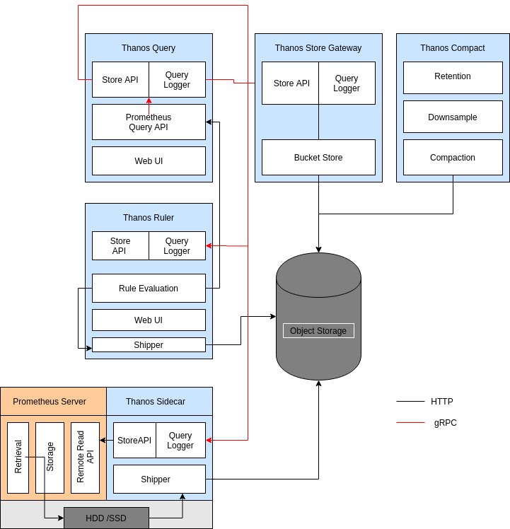

### Related Tickets

* Add Query Logging: https://github.com/thanos-io/thanos/issues/1706

## Summary

This proposal describes configuring a new internal feature: *Query logging* for various types of queries in **Thanos**.

We will go through the problem statement, use-cases and potential solution for the same.

## Problem Statement / Motivation

Conceptually and at a very high level, **Thanos** is a durable and cheap database, storing a very large amount of metric data in external object storage. This has the possible implication of having expensive data queries if the amount of data required to be queried is large. Even after local optimisations and efficient indexing, still querying a large amount of data is very resource-intensive, and unless the user knows what he/she is doing, it can be very expensive.

Different types of Query Logging are useful as a feature in Thanos, which would help in improving the developer experience.

One of such feature is **Active Query Logging** which helps in tracking all the active queries made in a database, and helps the users in knowing/debugging what queries made were resource-intensive, and how they can use the details to further optimise the database, or from the user’s perspective, to draw out the line from making such a request.

A similar feature exists in **Prometheus**, here is a description of an active Query Log [[1]](https://www.robustperception.io/what-queries-were-running-when-prometheus-died) -

```powershell
level=info ts=2019-08-28T14:30:09.142Z caller=main.go:329 msg="Starting Prometheus" version="(version=2.12.0, branch=HEAD, revision=43acd0e2e93f9f70c49b2267efa0124f1e759e86)"
level=info ts=2019-08-28T14:30:09.142Z caller=main.go:330 build_context="(go=go1.12.8, user=root@7a9dbdbe0cc7, date=20190818-13:53:16)"
level=info ts=2019-08-28T14:30:09.142Z caller=main.go:331 host_details="(Linux 4.15.0-55-generic #60-Ubuntu SMP Tue Jul 2 18:22:20 UTC 2019 x86_64 mari (none))"
level=info ts=2019-08-28T14:30:09.142Z caller=main.go:332 fd_limits="(soft=1000000, hard=1000000)"
level=info ts=2019-08-28T14:30:09.142Z caller=main.go:333 vm_limits="(soft=unlimited, hard=unlimited)"
level=info ts=2019-08-28T14:30:09.143Z caller=query_logger.go:74 component=activeQueryTracker msg="These queries didn't finish in prometheus' last run:" queries="[{\"query\":\"changes(changes(prometheus_http_request_duration_seconds_bucket[1h:1s])[1h:1s])\",\"timestamp_sec\":1567002604}]"
level=info ts=2019-08-28T14:30:09.144Z caller=main.go:654 msg="Starting TSDB ..."level=info
```

Here, we can see that this log was taken before the Prometheus instance died unnaturally, and the query logged under the component **ActiveQueryTracker**, logs the respective query that did the damage. Even though it does not pin-points the exact issue that created the problem, still it is quite helpful in considering this issue as one of the potential queries that led to the unnatural death of the Prometheus instance.

Another requirement is using **Audit and Adaptive Logging** in Thanos. This is a useful feature, as the former helps in aggregating all the queries made until now, and that can be utilised to track down and provide a comprehensive overview of what is happening. Audit logs can help in capturing the flow of requests made, thus we can track line to line flow of queries which can be helpful in describing the observed behaviour of a request. More info - https://rollout.io/blog/audit-logs/

```json
    {
      protoPayload: {
        @type: "type.googleapis.com/google.cloud.audit.AuditLog",
        status: {},
        authenticationInfo: {
          principalEmail: "user@example.com"
        },
        serviceName: "appengine.googleapis.com",
        methodName: "SetIamPolicy",
        authorizationInfo: [...],
        serviceData: {
          @type: "type.googleapis.com/google.appengine.legacy.AuditData",
          policyDelta: { bindingDeltas: [
              action: "ADD",
              role: "roles/logging.privateLogViewer",
              member: "user:user@example.com"
          ], }
        },
        request: {
          resource: "my-gcp-project-id",
          policy: { bindings: [...], }
        },
        response: {
          bindings: [
            {
              role: "roles/logging.privateLogViewer",
              members: [ "user:user@example.com" ]
            }
          ],
        }
      },
      insertId: "53179D9A9B559.AD6ACC7.B40604EF",
      resource: {
        type: "gcp_app",
        labels: { project_id: "my-gcp-project-id" }
      },
      timestamp: "2019-05-27T16:24:56.135Z",
      severity: "NOTICE",
      logName: "projects/my-gcp-project-id/logs/cloudaudit.googleapis.com%2Factivity",
    }
Taken from - https://cloud.google.com/logging/docs/audit/understanding-audit-logs
```
_Example of an audit logging_

**Adaptive Logging** is quite useful, as we can log all queries based upon fulfilling a certain criteria/filters, and later those can be used for inspecting abnormal queries and improving the user experience overall.

## Proposal

### Query Logging in Thanos

The proposal for Query Logging has been divided into three major parts - Audit Logging, Adaptive Logging and Active Query Logging. Audit and Adaptive Logging would be implemented across the Store API level, while the Active Query Logging would be local to each component of Thanos, providing logs of queries currently running.



Each of the use case of the sub-part would be described and a possible implementation would be discussed -

#### Use case 1: Audit Logging

**Audit logging** is a kind of logging, where we log in every internal API requests. Typically, rather than logging in specific queries, we ought to log in every query that has been made until now.

From a developer’s perspective, audit logs can keep you sane by giving you some insight into how a complex system arrived at its current state. Developers are typically fond of state diagrams and deterministic outcomes. An audit log that shows that a person or process applied a change can give developers valuable insight.

#### Implementation:

```go
type AuditLogging struct {

     // logger object derived from the base logger class
     logger         log.Logger
     // component using the audit logger
     component      component.StoreAPI
     // Request - ID (Same as tracer-id)
     requestId      string

}
```

* Currently, we are looking to implement Audit Logging at the **StoreAPI** level.
* We will use a **middleware** to intercept all the queries made to the StoreAPI.
* As StoreAPI is interconnected with each of the other components, we can leverage this to provide a Global overview of different queries which would be useful for auditing purposes.
* We will have a *different logger* derived from the base logger, and would log the queries separately.

#### Use case 2: Adaptive Logging

**Adaptive logging** is totally different from the Audit Logging. Out here in adaptive logging, we would log only certain queries which *satisfies a certain policy/satisfies a certain condition*. Possible filters could be, queries making an invalid request, latency time crossing a certain barrier, and so on.

#### Implementation:

```go
type AdaptiveLogging struct {

     // logger object derived from the base logger class
     logger         log.Logger
     // component using the adaptive logger
     component      component.StoreAPI
     reg            prometheus.Registerer
     // Map of different policy of queries that would be logged when a certain criteria is reached
     mapQueries     map[string]prometheus.Counter
     // Request - ID (Same as tracer-id)
     requestId      string

}
```

* Along with audit logging, we are looking to implement the Adaptive Logging at the **StoreAPI** level.
* We can leverage **middlewares** to intercept and filter the queries for logging, which satisfies the given policy.
* We can achieve **Global overview** of the logs, due to the StoreAPI being interconnected with the other components.
* We can maintain map of **Prometheus metrics** corresponding to each of the queries, so we can get the total number of latency queries and 404 queries as a Prometheus metric, that are logged in adaptive logging

#### Use case 3: Active Query Logging

As the name suggests, this logger logs all the current active logs that are running in a component. This type of logging is aimed at providing logs of the active queries that are running currently in an component. This logger would be **local** **to each component**, and would run as a **standalone for each component** in contrast to the other two loggers. This logger would help in debugging queries which led to the component instanced *OOM* killed, or helping in tracking queries which are taking too long. The purpose of this logger can clash with the above two, but this logger is solely focused on providing active queries that are running, much like Prometheus does.

#### Implementation

```go

// This would be local to each component, so each component would log all the active queries
type ActiveQueryLogging struct {

	// mmapped file to store the queries.
     mmappedFile    []byte
     // channel to generate the next available index, much like Python’s generator indexing
	getNextIndex   chan int
     // logger, different from the usual one
     logger         log.Logger

}
```

This interface is designed with some ideas from a similar interface designed for *Prometheus Query Logger*[[2]](https://prometheus.io/docs/guides/query-log/).
Here is a rough algorithm that would implement the Query Logging in Thanos -

```txt
1) Thanos receives a query.
2) It calls the index_generator, which is a Python-style generator that will generate natural numbers from 0(or 1) indicating the byte index at which to put the information about the query in the log file. This would ensure that the key remains unique for each of the queries logged.
3) The log file would be a memory-mapped file, which would help in accessing a random position for logging the query in constant time.
```

This algorithm has been heavily derived from this pull request[[3]](https://github.com/prometheus/prometheus/pull/5794) and would suggest referring this for the implementation of the same.

#### Common Use case to all
* **Tracking queries across different components**
The current implementation provides addition for tracking requests across different components of **Thanos**. Since we are logging the queries at the **StoreAPI** level, and those queries are flowing from one component to another, the only way to track them would be to have a request-id, which would help in tracking the logs of an individual query between different component. Another use-case would be to have a correlation of logs based on queries, so the request-id also serves the same purpose.

* **Implementation**
Since **Thanos** has a solid tracing infrastructure in place, we can **re-use the tracing-id** for a given request, and thus we can track the request across the different components.

### Alternatives

#### Use Active Queries in StoreAPI

This is not possible due to the **distributed nature** of Thanos. It has a lot of moving parts, and with the current implementation of *ActiveQueryLogging*, it is best used as a local logger for each component.

#### Integrating the Query Logging with the current logging

The current logger is a bit different from the other loggers described above. These three loggers are aimed at providing debugging/insights about the queries made, and it makes sense to separate the logic of the usual logger with the above ones.

#### Don't add anything

This proposal adds in a new feature for Thanos, so there isn't any alternative until now that would solve our problem.

### Non Goals

* Query logging part would help in debugging the internal requests made.
* This provides ample of insights about possible bottle-neck of individual components of Thanos.

## Work Plan

1. Roll out grpc-middlewareV2.
2. Implement a grpc-interceptor for Store API currently(this might be extended for other APIs as well).
3. Write up the Audit Logger derived from the base logger.
4. Configure the Audit Logger along with the grpc-interceptor.
5. Write up the Adaptive Logger derived from the base logger.
6. Configure the Adaptive Logger along with the grpc-interceptor.
7. Write up the Active Logger derived from the base logger.
8. Set it up as a standalone logger for each component.