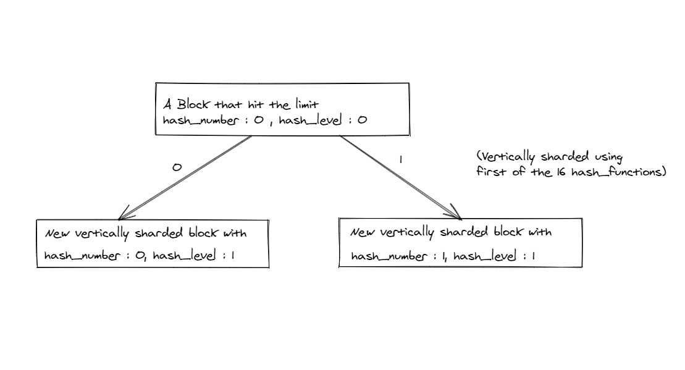
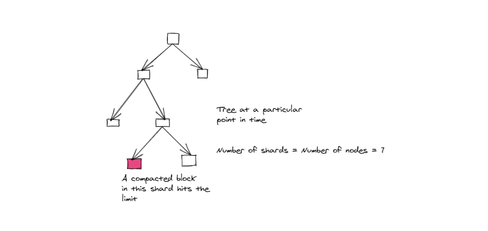
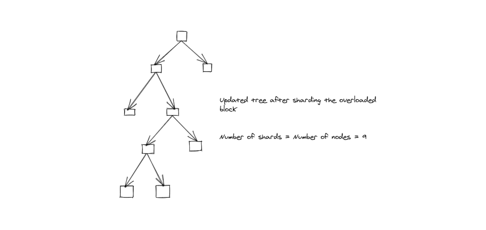
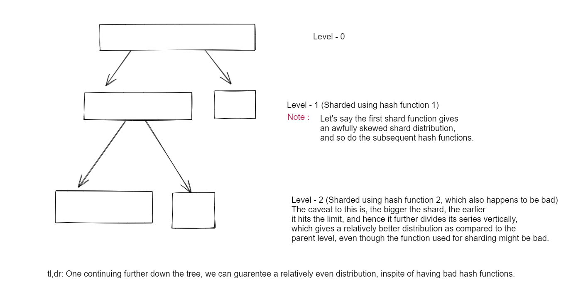

## Prior Reading

Before you start, please read carefully [compactor docs](../components/compact.md), especially `Compaction`, `Resource` and `Scalability` parts.

## Problem Statement

Thanos uses TSDB format to store data in object storage. Block is just a directory with different files. Mainly index file for
metadata, string interning (symbols) and label-pair index and a few (max 512MB) chunk files to store the actual data.
Blocks have globally unique ID and are create for certain time ranges and for certain external labels (so also tenants).

This being said, the block size depends on multiple factors:

* Index size
  * Number of series
  * Number of labels per series
  * The cardinality of labels (how many labels are shared between different series)
  * The length and cardinality of strings inside labels
* Total Chunk File size
  * Number of samples per series
  * Variance of scrape intervals and sample values

Realistically in Thanos system blocks usually are created either by Prometheus or [Thanos Receive](../components/receive.md). In both case the same TSDB database is 
used. Initial block have always 2 hours range. In terms of "vertical" size it generally does not have more than 10 millions series, as 
ingesting this many by single Prometheus takes lots of resources, so it's usually sharded functionally at ingestion time if anything.
  
However, there are few things that can cause arbitrary large blocks in modern Thanos systems:

* Horizontal Compactions, compacts multiple blocks into bigger time ranges. Especially to get advantage of downsampling you 
want blocks to be compacted to longer time ranges. But this gives benefits only from long living series. On normal heavily used
Kubernetes we seen average life duration of ~13h, not mentioning few hundred thousands of single sample series. Even with limit
of 2w time range compaction for Thanos this can result compaction to be not that effecting, casing block to grow to enormous sizes (1TB with index
sizes over 60 GBs)
* Recently Thanos and Prometheus enabled [vertical compaction](../components/compact.md#vertical-compactions) (under hidden flag). This introduced
abilities to do backfilling (importing blocks) and offline deduplications.
* Both Prometheus and Thanos Receive write paths are getting more & more optimized allowing the initial 2h blocks to be much larger in practice. 

On top of that, there is currently **no programmatic limitation** for the size of the block in write block in Prometheus and Thanos, so in theory
user can build as large blocks as they want.

### Effects of "Too Large" TSDB blocks.

There are various, sometimes not obvious, limits and drawbacks of too large blocks for both Prometheus and Thanos:

* There is known limitation for Prometheus index file size. It can't exceed 64GB due to [uint32 used for postings](https://grafana.com/blog/2019/10/31/lifting-the-index-size-limit-of-prometheus-with-postings-compression/),
see [issue](https://github.com/thanos-io/thanos/issues/1424) and [code](https://github.com/prometheus/prometheus/blob/3d8826a3d42566684283a9b7f7e812e412c24407/tsdb/index/index.go#L279).
While there is work to lift this limitation and allow bigger indexes, there will be **some** other limit anyway.
* Compaction is not streaming bytes directly from & to object storage (yet). This is due to its current index format, which is [being worked on](https://github.com/thanos-io/thanos/issues/3389).
This means that Compactor has to download all source blocks & upload all output block files to and from disk, impacting the disk storage you need to prepare for Compactor.
This is a **potential scalability limit for Compactor**
* Compactor can be currently horizontally scaled to compact among streams of blocks. With some locking mechanisms we can get up to single compaction.
However, with single block having arbitrary size, this can be **another potential scalability issue**, where you cannot split this operation to two separate machines and do concurrently.
* Similarly, with reading the data from block, Store Gateway can shard up to single block, so with arbitrary large block, you cannot split lookup and reading to multiple
instances with the current implementation. This poses **potential scalability issue for Store Gateway**.
* The object storages are designed for big files, but with some limitation. The current limit e.g for [GCS is 5TB per upload/stored file](https://cloud.google.com/storage/quotas#:~:text=There%20is%20a%20maximum%20size,request%20is%20also%205%20TB).
* Last, but not the least operating with such big blocks is not easy. We are still creating new ways of deleting, cleaning up or analysing your data for
easier operation of Thanos. Operating (downloading, rewriting) TBs of bytes per blocks hits limitation of different tooling (e.g SRE can't just use
own laptop anymore). 

To sum up: Current logic of not caring about the block size got us far, however as expected, it's time to think about limiting the block size (primarily
index size).

### Related Tickets:

* [Limit size of blocks](https://github.com/thanos-io/thanos/issues/3068)
* [index exceeding max size of postings](https://github.com/thanos-io/thanos/issues/1424)

## Goals

* Automatically cap the size of index per block to X GB without impacting read performance. 
* Alternatively, allow grouping series within blocks that spans over larger time windows defined in compaction level (e.g up to 2w), to leverage downsampling for querying.

## Non Goals

* Redesign Block index format 
* Introduce breaking changes
* Lift current limitation of index size
* Automatically shard old blocks

## Proposal

**We propose to vertically shard blocks when it reaches the cap limit in terms of number of series or size of index file, and then adaptively decide the number of shards depending on the users requirement**

* We'll be using a special metadata in meta.json indicating a shard.

### Adaptive Binary Sharding

The idea behind this approach is to leverage on the structural benefits of a binary tree to adaptively shard blocks which hit the maximum limit, either in terms of index size or number of series (set by user). 

For this approach, we'd need to add two extra external label `hash_number`, initialized to 0, `shard_level` initialized to 0, denoting the number of times it has been sharded during the compaction process, and a set of 16 `hash_function`s. The reason for chosing 16 is because 2 raised to the power 16 is 65536, which is a logical upper bound for the number of shards a user might want to have.

We'll be using `hash_level` and `hash_number` to group and plan blocks to compact together. The way it'd work is, we'll allow grouper to group only those blocks together whose `hash_level`s are same. Also, we'd allow planner to compact only those blocks together that share the same `hash_number`. So, with this, the compactor would run as it is unless a compacted block has hit the limit for the first time.

We're allowing a compacted block to hit the limit for a maximum of 16 times (if not specified otherwise by the user), and at the 16th level, if/when it further compacts and hits the limit, we're marking it for no more further compactions. The algorithm for sharding would come into play once a compacted block is declared invalid, or its size hits the limit. If the compacted block is still valid, but its index size is too large (or the number of series it holds exceeds the limit decided by the user), we'll look at the current `hash_level`(say `hl`) of the compacted block (if valid), or the blocks participating in the compaction process (if the compacted block is invalid), then we'll either shard the compacted block or the participating blocks (depending on the situation), `using hash_function[hl+1]`, and hence set the `hash_level` of the newly created blocks to `hl+1`, and then upload them for further compaction processes, if `hl` is not equal to `max_shard_level_limit`, which is 16 by default. In case `hl` is equal to `max_shard_level_limit`, we will take one of the 2 decisions depending on whether the compacted block is valid or invalid. 
* If the compacted block is valid, then continue the usual compaction process until it results into an invalid block.
* If the compacted block is invalid, then add the no compact filter to all the participating blocks.

We can keep growing the binary tree by recursively using the same logic. The reason for calling this adaptive is because at any point of time, the total number of shards is equal to the number of nodes on the tree (say x). If any of the leaves overloads (a block in that particular shards hits the limit), that particular leaf would split into 2, effectively increasing the number of shards to x+2, hence providing just the right amount of shards to get the job done. 

To give the user control over selecting number of shards (if needed), we can add a flag `max_shard_level_limit`, and the user can change the value from the default value of 16 to anything between 0 and 16 (inclusive). Let the current value for `max_shard_level_limit` be `max_l`. Then, instead of compactors grouper grouping blocks with the same `shard_level` together, it'd group blocks on the basis of same `max(shard_level,max_l)`, hence reverting the sharding process in a controlled manner. A similar logic would work if we decide to increase the value of `max_shard_level_limit`.   

### Pros and cons 

#### Pros 

* This layered sharding approach would statistically give more evenly distributed shards as compared to using only one hash function and hence sharding the blocks into some x    shards. For layered binary sharding, let's assume that all the 16 hash functions are bad hash functions, and each one of them gives a skewed distribution, even then we'll get a fairly even distribution after sharding through all the layers. This is pictorially explained below 
* The process is adaptive, hence any user can opt to go for default configuration and not worry about setting the number of shards.
* If for some reasons, the user decides to decrease the number of shards, it can be done by setting a `max_shard_level_limit` to any value between 0 and 16.

#### Cons

* We didn't solve the problem completely, but we delayed it as much as we could to get some benefits out of the delaying process.
* Cases where large number of blocks participate in a compaction process and result in an invalid block would cause the sharding algorithm to be triggered, even though sharding at that point might not be necessary. 

### Design Decisions

#### Decision 1: Using size of index file vs number of metrics in a block as an indicator for sharding

The pros and cons for selecting one design choice over the other is yet to be discovered, and would be more clear after implementation and testing.

## Future Work

* Add [`Cuckoofilter`](https://github.com/seiflotfy/cuckoofilter) to improve query performance on store GW as well with vertically sharded blocks.

See paper: https://www.cs.cmu.edu/~dga/papers/cuckoo-conext2014.pdf
