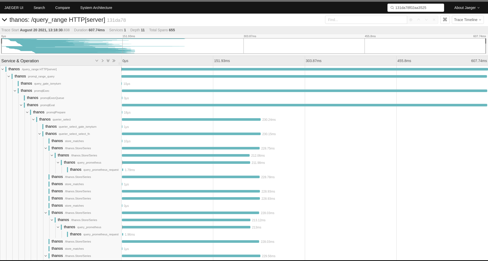
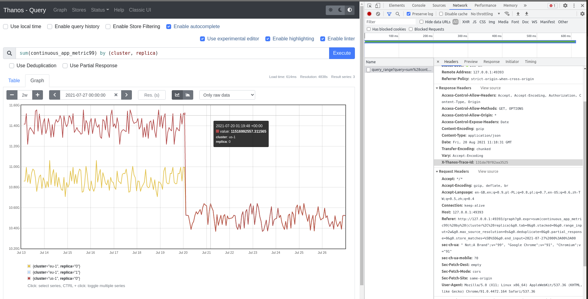

# Tracing

Thanos supports different tracing backends that implements `opentracing.Tracer` interface.

All clients are configured using `--tracing.config-file` to reference to the configuration file or `--tracing.config` to put yaml config directly.

## How to use `config` flags?

You can either pass YAML file defined below in `--tracing.config-file` or pass the YAML content directly using `--tracing.config`. We recommend the latter as it gives an explicit static view of configuration for each component. It also saves you the fuss of creating and managing additional file.

Don't be afraid of multiline flags!

In Kubernetes it is as easy as (using Thanos sidecar example):

```yaml
      - args:
        - sidecar
        - |
          --objstore.config=type: GCS
          config:
            bucket: <bucket>
        - --prometheus.url=http://localhost:9090
        - |
          --tracing.config=type: STACKDRIVER
          config:
            service_name: ""
            project_id: <project>
            sample_factor: 16
        - --tsdb.path=/prometheus-data
```

## How to add a new client?

1. Create new directory under `pkg/tracing/<provider>`
2. Implement `opentracing.Tracer` interface
3. Add client implementation to the factory in [factory](../pkg/tracing/client/factory.go) code. (Using as small amount of flags as possible in every command)
4. Add client struct config to [cfggen](../scripts/cfggen/main.go) to allow config auto generation.

At that point, anyone can use your provider by spec.

See [this issue](https://github.com/thanos-io/thanos/issues/1972) to check our progress on moving to OpenTelemetry Go client library.

## Usage

Once tracing is enabled and sampling per backend is configured, Thanos will generate traces for all gRPC and HTTP APIs thanks to generic "middlewares". Some more interesting to observe APIs like `query` or `query_range` have more low-level spans with focused metadata showing latency for important functionalities. For example, Jaeger view of HTTP query_range API call might look as follows:



As you can see it contains both HTTP request and spans around gRPC request, since [Querier](components/query.md) calls gRPC services to get fetch series data.

Each Thanos component generates spans related to its work and sends them to central place e.g Jaeger or OpenTelemetry collector. Such place is then responsible to tie all spans to a single trace, showing a request execution path.

### Obtaining Trace ID

Single trace is tied to a single, unique request to the system and is composed of many spans from different components. Trace is identifiable using `Trace ID`, which is a unique hash e.g `131da78f02aa3525`. This information can be also referred as `request id` and `operation id` in other systems. In order to use trace data you want to find trace IDs that explains the requests you are interested in e.g request with interesting error, or longer latency, or just debug call you just made.

When using tracing with Thanos, you can obtain trace ID in multiple ways:

* Search by labels/attributes/tags/time/component/latency e.g. using Jaeger indexing.
* [Exemplars](https://www.bwplotka.dev/2021/correlations-exemplars/)
* If request was sampled, response will have `X-Thanos-Trace-Id` response header with trace ID of this request as value.



### Forcing Sampling

Every request against any Thanos component's API with header `X-Thanos-Force-Tracing` will be sampled if tracing backend was configured.

## Configuration

Currently supported tracing backends:

### OpenTelemetry (OTLP)

Thanos supports exporting traces in the OpenTelemetry Protocol (OTLP). Both gRPC and HTTP clients are supported. Options can be provided also via environment variables. For more details see the [exporter specification](https://github.com/open-telemetry/opentelemetry-specification/blob/main/specification/protocol/exporter.md#configuration-options).

```yaml mdox-exec="go run scripts/cfggen/main.go --name=otlp.Config"
type: OTLP
config:
  client_type: ""
  service_name: ""
  reconnection_period: 0s
  compression: ""
  insecure: false
  endpoint: ""
  url_path: ""
  timeout: 0s
  retry_config:
    retry_enabled: false
    retry_initial_interval: 0s
    retry_max_interval: 0s
    retry_max_elapsed_time: 0s
  headers: {}
  tls_config:
    ca_file: ""
    cert_file: ""
    key_file: ""
    server_name: ""
    insecure_skip_verify: false
  sampler_type: ""
  sampler_param: ""
```

### Jaeger

Client for https://github.com/jaegertracing/jaeger tracing. Options can be provided also via environment variables. For more details see the Jaeger [exporter specification](https://github.com/open-telemetry/opentelemetry-specification/blob/main/specification/configuration/sdk-environment-variables.md#jaeger-exporter).

*WARNING: Options `RPC Metrics`, `Gen128Bit` and `Disabled` are now deprecated and won't have any effect when set*

```yaml mdox-exec="go run scripts/cfggen/main.go --name=jaeger.Config"
type: JAEGER
config:
  service_name: ""
  disabled: false
  rpc_metrics: false
  tags: ""
  sampler_type: ""
  sampler_param: 0
  sampler_manager_host_port: ""
  sampler_max_operations: 0
  sampler_refresh_interval: 0s
  sampler_parent_config:
    local_parent_sampled: false
    remote_parent_sampled: false
  sampling_server_url: ""
  operation_name_late_binding: false
  initial_sampler_rate: 0
  reporter_max_queue_size: 0
  reporter_flush_interval: 0s
  reporter_log_spans: false
  reporter_disable_attempt_reconnecting: false
  reporter_attempt_reconnect_interval: 0s
  endpoint: ""
  user: ""
  password: ""
  agent_host: ""
  agent_port: 0
  traceid_128bit: false
```

### Google Cloud (formerly Stackdriver)

Client for https://cloud.google.com/trace/ tracing.

You will also need to ensure that the authentication with the API is working, follow [this guide](https://cloud.google.com/trace/docs/setup/go-ot#configure_your_platform) to set it up.

*Note:* The `type` in the configuration below can have either value `GOOGLE_CLOUD` or `STACKDRIVER` - this is to ensure backwards compatibility.

```yaml mdox-exec="go run scripts/cfggen/main.go --name=google_cloud.Config"
type: GOOGLE_CLOUD
config:
  service_name: ""
  project_id: ""
  sample_factor: 0
```

### Elastic APM

Client for https://www.elastic.co/products/apm tracing.

```yaml mdox-exec="go run scripts/cfggen/main.go --name=elasticapm.Config"
type: ELASTIC_APM
config:
  service_name: ""
  service_version: ""
  service_environment: ""
  sample_rate: 0
```

### Lightstep

Client for [Lightstep](https://www.servicenow.com/products/observability.html).

In order to configure Thanos to interact with Lightstep you need to provide at least an [access token](https://docs.lightstep.com/docs/create-and-use-access-tokens) in the configuration file. The `collector` key is optional and used when you have on-premise satellites.

```yaml mdox-exec="go run scripts/cfggen/main.go --name=lightstep.Config"
type: LIGHTSTEP
config:
  access_token: ""
  collector:
    scheme: ""
    host: ""
    port: 0
    plaintext: false
    custom_ca_cert_file: ""
  tags: ""
```
