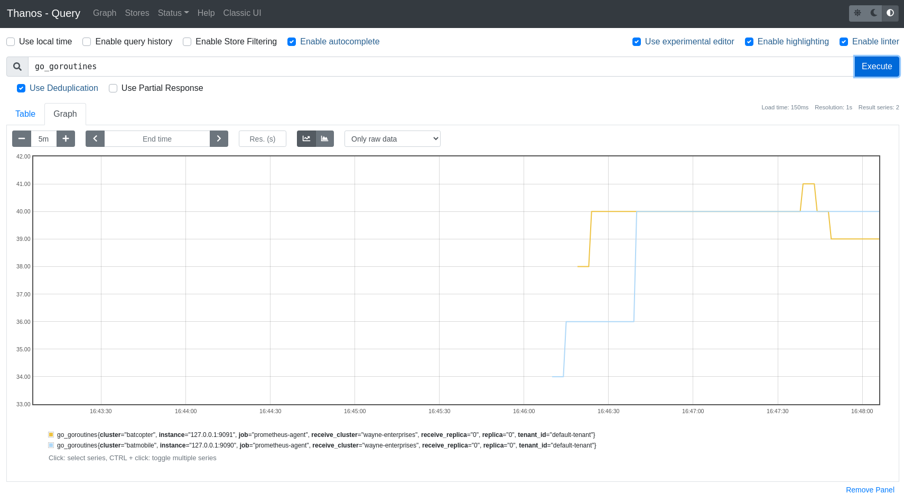

# Verify Setup

At this point, we have:

* Two Prometheus instances configured to `remote_write` and running in `agent` mode.
* `Thanos Receive` component ingesting data from Prometheus
* `Thanos Query` component configured to query `Thanos Receive`'s Store API.

The final task on our list is to verify that data is flowing correctly.

Stop and think how you could do this before opening the answer below 👇

 
How are we going to check that the components are wired up correctly?

Let's make sure that we can query data from each of our Prometheus instances from our `Thanos Query` instance.

Navigate to the [Thanos Query UI](https://[[HOST_SUBDOMAIN]]-39090-[[KATACODA_HOST]].environments.katacoda.com), and query for a metric like `up` or `go_goroutines` - inspect the output and you should see `batmobile` and `batcopter` in the `cluster` label.

`go_goroutines` should look something like on image below:

