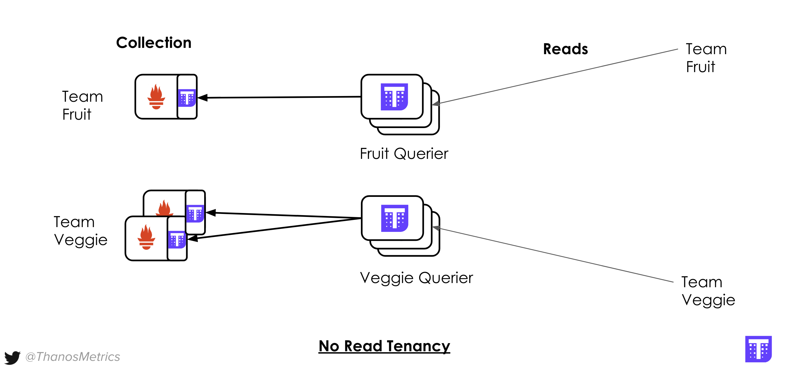
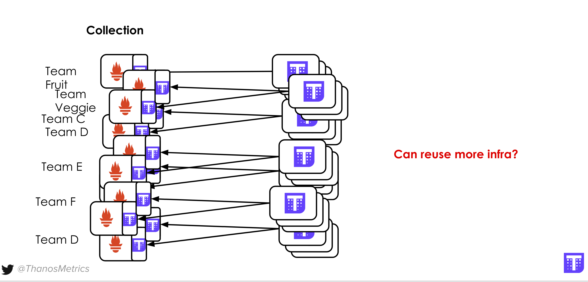

## Scenario

> NOTE: Click `Copy To Editor` for each config to propagate the configs to each file.

Let's imagine we have to deliver centralized metrics platform to two teams **Team Fruit** and **Team Veggie**.
We don't want each team to see each other data or even know about their existence. Let's see how we achieve that with Thanos.

## Starting Fruit and Veggie Prometheus and Thanos Global View

Fruits and Veggies want to allow more Prometheus and replicas at some point so they want to have Thanos upfront. Let's quickly
deploy Prometheuses with sidecars and Querier.

### Configure Prometheus-es

First, Prometheus server for **Team Fruit** that scrapes itself:

<pre class="file" data-filename="prometheus0_fruit.yml" data-target="replace">
global:
  scrape_interval: 5s
  external_labels:
    cluster: eu1
    replica: 0
    tenant: team-fruit

scrape_configs:
  - job_name: 'prometheus'
    static_configs:
      - targets: ['127.0.0.1:9090']
</pre>

For the **Team Veggie** we set second instance with two replicas (Veggies care for high availability - everyone should eat vegetables every day after all!):

<pre class="file" data-filename="prometheus0_veggie.yml" data-target="replace">
global:
  scrape_interval: 5s
  external_labels:
    cluster: eu1
    replica: 0
    tenant: team-veggie

scrape_configs:
  - job_name: 'prometheus'
    static_configs:
     - targets: ['127.0.0.1:9091','127.0.0.1:9092']
</pre>

<pre class="file" data-filename="prometheus1_veggie.yml" data-target="replace">
global:
  scrape_interval: 5s
  external_labels:
    cluster: eu1
    replica: 1
    tenant: team-veggie

scrape_configs:
  - job_name: 'prometheus'
    static_configs:
      - targets: ['127.0.0.1:9091','127.0.0.1:9092']
</pre>

### Prepare "persistent volumes"

Execute following commands:

```
mkdir -p prometheus0_fruit_data prometheus0_veggie_data prometheus1_veggie_data
```{{execute}}

### Deploying Team Fruit Prometheus with sidecar

```
docker run -d --net=host --rm \
    -v $(pwd)/editor/prometheus0_fruit.yml:/etc/prometheus/prometheus.yml \
    -v $(pwd)/prometheus0_fruit_data:/prometheus \
    -u root \
    --name prometheus-0-fruit \
    quay.io/prometheus/prometheus:v2.20.0 \
    --config.file=/etc/prometheus/prometheus.yml \
    --storage.tsdb.path=/prometheus \
    --web.listen-address=:9090 \
    --web.external-url=https://[[HOST_SUBDOMAIN]]-9090-[[KATACODA_HOST]].environments.katacoda.com \
    --web.enable-lifecycle \
    --web.enable-admin-api && echo "Prometheus for Fruit Team started!"
```{{execute}}

```
docker run -d --net=host --rm \
    -v $(pwd)/editor/prometheus0_fruit.yml:/etc/prometheus/prometheus.yml \
    --name prometheus-0-sidecar-fruit \
    -u root \
    quay.io/thanos/thanos:v0.19.0 \
    sidecar \
    --http-address 0.0.0.0:19090 \
    --grpc-address 0.0.0.0:19190 \
    --reloader.config-file /etc/prometheus/prometheus.yml \
    --prometheus.url http://127.0.0.1:9090 && echo "Started sidecar for Fruit Prometheus"
```{{execute}}

### Same for Team Veggie, but with 2-replica Prometheus:

First:

```
docker run -d --net=host --rm \
    -v $(pwd)/editor/prometheus0_veggie.yml:/etc/prometheus/prometheus.yml \
    -v $(pwd)/prometheus0_veggie_data:/prometheus \
    -u root \
    --name prometheus-0-veggie \
    quay.io/prometheus/prometheus:v2.20.0 \
    --config.file=/etc/prometheus/prometheus.yml \
    --storage.tsdb.path=/prometheus \
    --web.listen-address=:9091 \
    --web.external-url=https://[[HOST_SUBDOMAIN]]-9091-[[KATACODA_HOST]].environments.katacoda.com \
    --web.enable-lifecycle \
    --web.enable-admin-api && echo "Prometheus for Veggie Team started!"
```{{execute}}

```
docker run -d --net=host --rm \
    -v $(pwd)/editor/prometheus0_veggie.yml:/etc/prometheus/prometheus.yml \
    --name prometheus-0-sidecar-veggie \
    -u root \
    quay.io/thanos/thanos:v0.19.0 \
    sidecar \
    --http-address 0.0.0.0:19091 \
    --grpc-address 0.0.0.0:19191 \
    --reloader.config-file /etc/prometheus/prometheus.yml \
    --prometheus.url http://127.0.0.1:9091 && echo "Started sidecar for Veggie Prometheus"
```{{execute}}

Second:

```
docker run -d --net=host --rm \
    -v $(pwd)/editor/prometheus1_veggie.yml:/etc/prometheus/prometheus.yml \
    -v $(pwd)/prometheus1_veggie_data:/prometheus \
    -u root \
    --name prometheus-1-veggie \
    quay.io/prometheus/prometheus:v2.20.0 \
    --config.file=/etc/prometheus/prometheus.yml \
    --storage.tsdb.path=/prometheus \
    --web.listen-address=:9092 \
    --web.external-url=https://[[HOST_SUBDOMAIN]]-9092-[[KATACODA_HOST]].environments.katacoda.com \
    --web.enable-lifecycle \
    --web.enable-admin-api && echo "Prometheus for Veggie Team started!"
```{{execute}}

Second:

```
docker run -d --net=host --rm \
    -v $(pwd)/editor/prometheus1_veggie.yml:/etc/prometheus/prometheus.yml \
    --name prometheus-01-sidecar-veggie \
    -u root \
    quay.io/thanos/thanos:v0.19.0 \
    sidecar \
    --http-address 0.0.0.0:19092 \
    --grpc-address 0.0.0.0:19192 \
    --reloader.config-file /etc/prometheus/prometheus.yml \
    --prometheus.url http://127.0.0.1:9092 && echo "Started sidecar for Veggie Prometheus"
```{{execute}}

### Querier

Now the naive approach to ensure querying isolation (we can't affort veggies to look on fruits data!) would be to setup separate
isolated Queriers for each team, so let's start with that.

Fruit:

```
docker run -d --net=host --rm \
    --name querier-fruit \
    quay.io/thanos/thanos:v0.19.0 \
    query \
    --http-address 0.0.0.0:29091 \
    --grpc-address 0.0.0.0:29191 \
    --query.replica-label replica \
    --store 127.0.0.1:19190 && echo "Started Thanos Fruit Querier"
```{{execute}}

Veggie:

```
docker run -d --net=host --rm \
    --name querier-veggie \
    quay.io/thanos/thanos:v0.19.0 \
    query \
    --http-address 0.0.0.0:29092 \
    --grpc-address 0.0.0.0:29192 \
    --query.replica-label replica \
    --store 127.0.0.1:19191 \
    --store 127.0.0.1:19192 && echo "Started Thanos Veggie Querier"
```{{execute}}

### Setup Verification

At the end we should see this case:



This setup can be called "No or Hard Tenancy" where we are setting up separate components (technically disonnected two systems) for
each of tenants.

Once started you should be able to reach both Queriers - each exposing either Fruit's or Veggies's data:

* [Fruit Query](https://[[HOST_SUBDOMAIN]]-29091-[[KATACODA_HOST]].environments.katacoda.com/)
* [Veggies Query](https://[[HOST_SUBDOMAIN]]-29092-[[KATACODA_HOST]].environments.katacoda.com/)

## Problem statement 1: Tomato problem.

Let's try to play with this setup a bit. You are free to query any metrics. Data isolation is there, each team has its own
endpoint.

However, let's try to imagine a common case in such setups: **What if you are.. a Tomato?** Surprisingly Tomato [is both
fruit and vegetable](https://www.sciencealert.com/here-s-why-a-tomato-is-actually-both-a-fruit-and-vegetable), so we it
should be able not only to access metrics from both Veggie and Fruit teams, but also run PromQL across them.


We call this "Tomato" problem a **Cross-tenant or Admin View** and it's a common case when teams/tenants are changing, users have access to multiple
tenants data etc. This can be solved with another layer of global view: we know how to solve this problem from previous courses, we could
start another Querier on top of our Team's Queries and open another endpoint just for Tomatoes. But here comes another problem...

## Problem statement 2: Exclusive Infra for Each Tenant is very Expensive and does not scale.



## Don't worry: Thanos was built with multi-tenancy in mind!

See next step to learn more.
