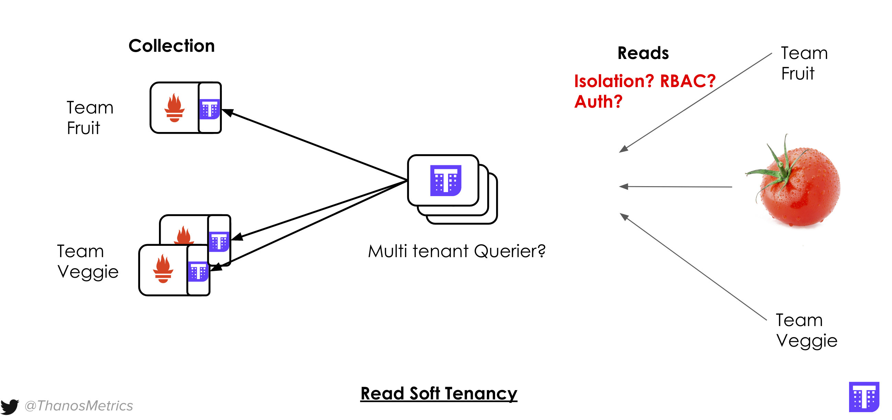
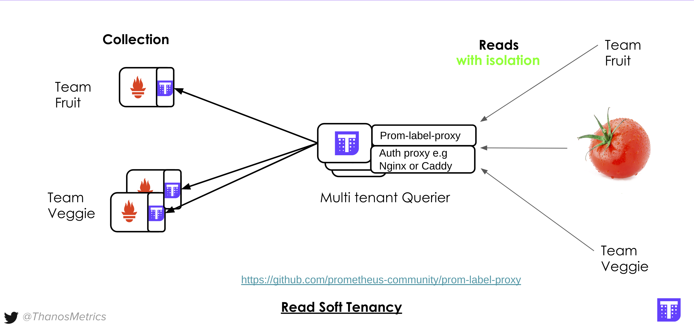

## Reuse More!

What if we can have one set of Queries instead of separate set for each tenant? Why not reusing exactly same component?

Let's stop fruit and veggies queriers and run single one spanning all the tenant's Prometheus data:

```
docker stop querier-fruit && docker stop querier-veggie
```{{execute}}

```
docker run -d --net=host --rm \
    --name querier-multi \
    quay.io/thanos/thanos:v0.19.0 \
    query \
    --http-address 0.0.0.0:29090 \
    --grpc-address 0.0.0.0:29190 \
    --query.replica-label replica \
    --store 127.0.0.1:19190 \
    --store 127.0.0.1:19191 \
    --store 127.0.0.1:19192 && echo "Started Thanos Querier with access to both Veggie's and Fruit's data"
```{{execute}}

Within short time we should be able to see "Tomato" view [when we open Querier UI](https://[[HOST_SUBDOMAIN]]-29090-[[KATACODA_HOST]].environments.katacoda.com/)

## Tenant Query Isolation

Undoubtedly, the main problem with this setup is that by default **every tenant will see each other data**, similar to what you have in Prometheus,
if single Prometheus scrapes data from multiple teams.



Both Prometeus and Thanos [follow UNIX philosopy](https://github.com/thanos-io/thanos#thanos-philosophy). **One of the principles is to ensure
each component is doing one thing and do it well**. Thanos Querier does not perform any authentication or authorization.
This is because you probably already have consistent auth mechanism in your organization. So why not composing that with flexible
flat label pairs identifing the data blocks and each individual series for data isolation?

### Meet [prom-label-proxy](https://github.com/prometheus-community/prom-label-proxy)

[prom-label-proxy](https://github.com/prometheus-community/prom-label-proxy) allows read tenancy for all the
resources that Prometheus and Thanos currently exposes, by enforcing certain `tenant` label to be used in all APIs retrieving the data.
This proxy works natively for Prometheus, but since Thanos uses same HTTP APIs on top, it will work for us as well.

So why not we start something like this in front of our "Tomato" Querier?

```
docker run -d --net=host --rm \
    --name prom-label-proxy \
    quay.io/thanos/prom-label-proxy:v0.3.0-rc.0-ext1 \
    -label tenant \
    -upstream http://127.0.0.1:29090 \
    -insecure-listen-address 0.0.0.0:39090 \
    -non-api-path-passthrough \
    -enable-label-apis && echo "Started prom-label-proxy"
```{{execute}}

### Laveraging prom-label-proxy

All requests now have to have extra URL paramter `tenant=` with the value being tenant to limit scope with.

Our running proxy does not do any authN or authZ for us - so let's setup some basic flow. To make it simple,
let's deploy [Caddy](https://caddyserver.com/) server (kind of fancy nginx but written in Go) that will expose two ports:
`39091` that will redirect to prom-label-proxy with `tenant=team-fruit` and `39092` for `tenant=team-veggie` injection.

Let's create Caddy config file:

<pre class="file" data-filename="Caddyfile" data-target="replace">
{
    admin off
}

:39091  {
    rewrite * ?{query}&tenant=team-fruit
    reverse_proxy 127.0.0.1:39090
}

:39092 {
    rewrite * ?{query}&tenant=team-veggie
    reverse_proxy 127.0.0.1:39090
}
</pre>

And start our caddy server using that config:

```
docker run -d --net=host --rm \
    --name caddy \
    -v $PWD/editor/Caddyfile:/etc/caddy/Caddyfile \
    caddy:2.2.1 && echo "Started Caddy Server"
```{{execute}}

### Verification

At the end we shoud have setup as on following diagram:



Let's check if our read isolation works:

* [Query for Fruit Team through Caddy 39091 port](https://[[HOST_SUBDOMAIN]]-39091-[[KATACODA_HOST]].environments.katacoda.com/)
* [Query for Veggie Team through Caddy 39092 port](https://[[HOST_SUBDOMAIN]]-39092-[[KATACODA_HOST]].environments.katacoda.com/)

Feel free to play around, you will see that we can only see Fruit or Veggie data depends where we go!

## Next steps

Similarly for Write and Storage you can deploy Thanos Hard or Soft tenant components as you wish. Follow up our docs and KubeCon
talks to learn more! 🤗

When you ready "click" next to finish this course.
