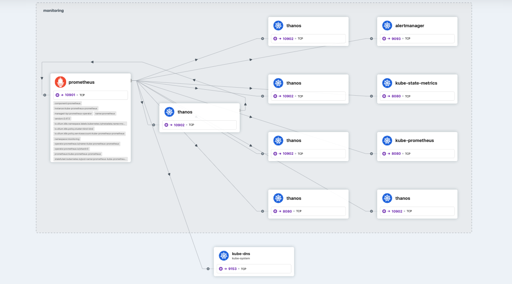
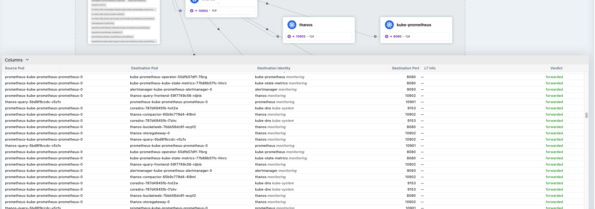

# Thanos-Prometheus-Cilium Integration

This tutorial demonstrates the deployment of Thanos with Prometheus on Kubernetes, using the Bitnami Thanos Helm chart. It also showcases the integration with Cilium for networking and Hubble for network observability.
Cilium and Hubble provide a service map for the connected components in your setup. This stands as a good starting point for new users to get familiar with Thanos and Prometheus and understand how different components interact with each other.


## Prerequisites

- Kubernetes cluster(kind, minikube, etc.)
- Helm 3.0+
- [Cilium CLI] (https://docs.cilium.io/en/stable/gettingstarted/k8s-install-default/#install-the-cilium-cli)

## Installation

This installation is specific to the [Bitnami](https://github.com/bitnami/charts) repo. You can use any other stable chart to deploy Thanos with Prometheus.

1. **Add Bitnami repo (Or any other stable helm repo)**
   ```helm repo add bitnami https://charts.bitnami.com/bitnami```
2. **Install Cilium in your cluster:**
   https://docs.cilium.io/en/stable/gettingstarted/k8s-install-default/#install-cilium
3. **Enable Hubble and observe network flows:**
   https://docs.cilium.io/en/stable/gettingstarted/hubble_setup/
4. **Deploy Thanos with Prometheus:**
   Ensure you have Cilium and hubble enabled before you deploy Thanos with Prometheus.
   You can use the steps in the link below to Integrate Thanos with Prometheus and Alertmanager:
   https://github.com/bitnami/charts/tree/main/bitnami/thanos#integrate-thanos-with-prometheus-and-alertmanager
```
kubectl create namespace monitoring
```
```
helm install kube-prometheus \
--set prometheus.thanos.create=true \
--namespace monitoring \
bitnami/kube-prometheus
helm install thanos \
--values values.yaml \
--namespace monitoring \
bitnami/thanos
```

5. **Enable Hubble UI to access service map for your topology:**
   If hubble is already enabled, you need to disable hubble and enable it with the UI option to access the service map.
   ```cilium hubble disable```
   ```cilium hubble enable --ui```
   https://docs.cilium.io/en/stable/gettingstarted/hubble/#enable-the-hubble-ui

On enabling you get a view of the component setup and traffic flow on the Hubble UI as below. You can click on each of the different components to understand the components it is connected to and observe the traffic flow when you issue queries  -

## Example Thanos deployment with Cilium and Hubble Overview


